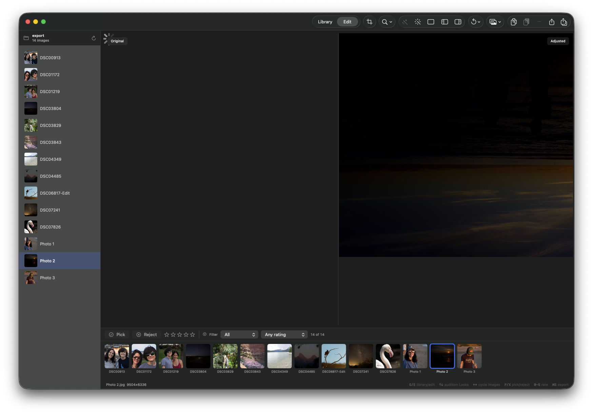

## Objective

When a user double-clicks an image in Library view to enter Edit, open the editor's right sidebar/inspector. Do not open the left Library/source sidebar as part of that transition.

## Steps to reproduce

1. Open an image collection in Library view.
2. Double-click an image.
3. Observe the sidebar state after the app transitions to Edit.

## Actual behavior

The left sidebar opens/remains visible, while the expected right editor sidebar does not open.

## Expected behavior

The transition to Edit opens the right sidebar/inspector and leaves the left sidebar closed.

## Acceptance criteria

- [ ] Double-clicking an image from Library transitions to Edit with the right sidebar/inspector open.
- [ ] The left sidebar does not open as a side effect of this transition.
- [ ] Existing explicit sidebar toggle controls continue to work.
- [ ] Add regression coverage for the double-click transition and resulting sidebar presentation state.

## Evidence

The attached screenshot shows the Edit view with the left image-list sidebar visible and no right editor sidebar.

### Comment — codex @ 2026-09-10T14:20:57.531Z

Implemented in commit 20e2343: Library double-clicks now enter Edit with the right inspector presented and the left source browser closed. Added regression coverage; focused navigation tests pass, isolated PreviewDiskCache retry passes, and dg validate/git diff --check are clean. Full swift test had one transient unrelated PreviewDiskCache timeout; the isolated rerun passed.

## Agent log

- 2026-09-10T14:24:59.064Z: Verification report
Verdict: PASS
Acceptance criteria:
- [x] Double-clicking an image from Library transitions to Edit with the right inspector presented (pass)
- [x] The left sidebar does not open as a side effect of this transition (pass)
- [x] Existing explicit sidebar toggle controls continue to work (pass)
- [x] Regression coverage exists for the double-click transition and resulting sidebar presentation state (pass)
Checks run:
- swift build: clean (only pre-existing Core Image kernel deprecation warnings)
- swift test --filter WorkspaceNavigationTests: 7/7 passed, incl. testLibraryDoubleClickOpensInspectorAndClosesSourceBrowser
- swift test --filter KeyMonitorTests: 5/5 passed
- scripts/ci-tests.sh fast: exit 0, 689/689 tests passed
Findings:
- Fixed: the Return-key shortcut for opening the active grid item in Edit (KeyMonitor.handle, case 36) called openActiveCollectionImage() directly instead of the new openLibraryImageForEditing(), so entering Edit via Return still left the left source browser open and the inspector closed — the same defect the ticket was filed against, reachable through a second entry point. Localized one-line fix, committed as b824aeb.
Fixes:
- Sources/KromoraKit/Views/KeyboardShortcuts.swift: route the Return-key grid-to-edit shortcut through openLibraryImageForEditing() so it shares the double-click path's sidebar presentation state.
Verification commits:
- b824aeb
Actor: claude
Resolved model: sonnet
Pickup session: 01MTVM7V3PSKTERA08
Summary: Verification PASS: double-click-to-Edit sidebar fix confirmed (right inspector opens, left source browser stays closed); found and fixed a second entry point (Return-key shortcut) with the same defect, now routed through openLibraryImageForEditing(); swift build clean, WorkspaceNavigationTests and KeyMonitorTests green, ci-tests.sh fast 689/689 passed. Committed as b824aeb.
