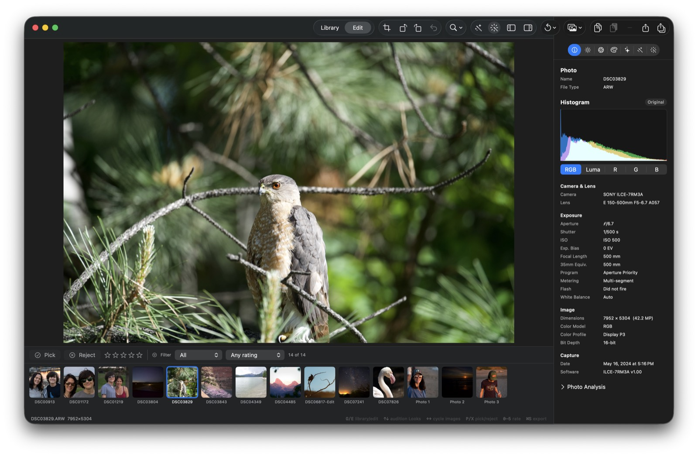

## Objective

Remove the dedicated “Open persistent masking workspace” button from the editor top bar to reduce duplicate navigation chrome.

## Context

`Sources/KromoraKit/Views/ContentView.swift` currently renders a top-bar control that calls `openMaskingWorkspace()` and exposes the help text “Open the persistent masking workspace.” The persistent masking workspace is already available through the canonical Masking inspector tab introduced by KRMA-220 and routed by the existing inspector state.

This is toolbar cleanup only: keep the persistent workspace, its document-owned mask editing behavior, and its supported inspector navigation intact.

## Acceptance criteria

- [ ] The editor top bar no longer renders the dedicated control labeled or identified as the persistent masking workspace entry point.
- [ ] The canonical Masking inspector tab still opens and closes the persistent masking workspace for an active photo.
- [ ] Mask layers, local adjustments, overlay state, persistence, and source-switching behavior are unchanged.
- [ ] Accessibility/navigation coverage confirms Masking remains discoverable through the inspector tab while the removed top-bar control has no dangling action, label, or help reference.
- [ ] Focused tests and `dg validate` pass.

## Implementation notes

Likely integration point: `Sources/KromoraKit/Views/ContentView.swift` around the current top-bar Masking button. Review `AppViewModel` inspector routing and `Tests/KromoraKitTests/MaskingWorkspaceTests.swift` / `AdjustInspectorTests.swift` before changing behavior. Do not remove `openMaskingWorkspace()` or the `.masking` inspector tab unless it is only a toolbar-only coupling.

## Reference

Related completed work: KRMA-220 (persistent Masking workspace) and KRMA-241 (Masking inspector routing).,

### Comment — codex @ 2026-09-11T02:53:13.046Z

Reassessed on 2026-09-11: this is not a product defect. The apparent issue was caused by the rotation/comparison controls changing position, which made the wrong button appear to be clicked. Retracted from the ready queue; no implementation is needed.

### Comment — codex @ 2026-09-11T04:15:44.693Z

Implemented in bc2fd8a: removed the dedicated Masking workspace button and its accessibility/help metadata from the editor toolbar. Kept the canonical Masking inspector tab and routing unchanged. Verification: focused AdjustInspectorTests + MaskingWorkspaceTests passed (55 tests), git diff --check passed, and dg validate passed.

## Agent log

- 2026-09-11T04:16:54.838Z: Verification report
Verdict: PASS
Acceptance criteria:
- [x] The editor top bar no longer renders the dedicated control labeled or identified as the persistent masking workspace entry point. (pass) — Button removed in bc2fd8a (ContentView.swift:254-263 in prior version); confirmed absent from current toolbar.
- [x] The canonical Masking inspector tab still opens and closes the persistent masking workspace for an active photo. (pass) — AppViewModel.openMaskingWorkspace() and the .masking inspector tab (AppViewModel.swift) are untouched and independent of the removed toolbar control.
- [x] Mask layers, local adjustments, overlay state, persistence, and source-switching behavior are unchanged. (pass) — No changes outside the 10-line toolbar removal; MaskingWorkspaceTests (36 tests) cover layers, overlay scoping, persistence, and source-switch reset — all pass.
- [x] Accessibility/navigation coverage confirms Masking remains discoverable through the inspector tab while the removed top-bar control has no dangling action, label, or help reference. (pass) — grep confirms no remaining reference to the removed help text ("Open the persistent masking workspace") or its accessibility label; remaining wand.and.rays usages belong to the inspector tab, panel, and debug tooling, not the removed control.
- [x] Focused tests and dg validate pass. (pass) — swift test --filter MaskingWorkspaceTests|AdjustInspectorTests: 55 tests, 0 failures. dg validate: OK (pre-existing unrelated model-name warnings only).
Checks run:
- git show bc2fd8a (diff review)
- grep for openMaskingWorkspace / .masking / maskingAssetID call sites
- grep for dangling help/accessibility text from removed control
- swift test --filter 'MaskingWorkspaceTests|AdjustInspectorTests' (55 passed)
- dg validate
- git status --porcelain (no unexpected tracked-source changes)
Findings:
- None
Fixes:
- None
Verification commits:
- None
Actor: claude
Resolved model: sonnet
Pickup session: 01MTWG1BMK0SCV1GYC
