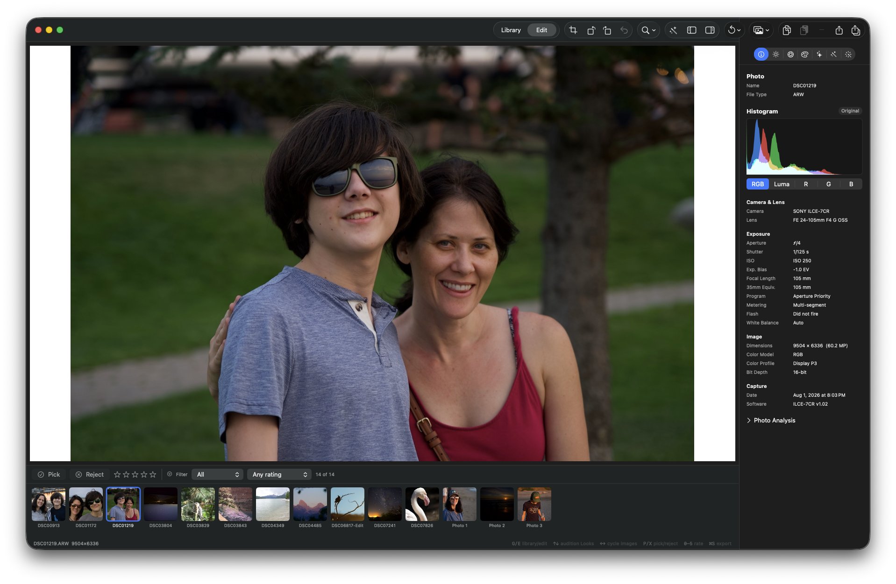

## Objective

Keep the editor canvas letterbox/background dark when Kromora is running in dark appearance. The photo itself should remain unchanged; this is a presentation-only appearance bug.

## User-visible symptom

In the attached editor screenshot, the loaded photo is rendered correctly but the portrait image's left and right letterbox bands are bright white while the surrounding editor chrome is dark. This makes the canvas appear white and breaks the intended dark image workspace.

## Reproduction

1. Launch Kromora with the editor window in dark appearance (or enable **Always dark mode**).
2. Open a portrait or otherwise aspect-ratio-mismatched photo so Fit leaves letterbox space.
3. Observe the canvas margins around the photo.

Actual: letterbox margins can resolve to white/light gray.

Expected: letterbox margins remain the dark image-presentation background, consistent with the editor canvas and dark appearance.

## Investigation

- `Sources/KromoraKit/Views/PreviewView.swift:33-36` documents that the Metal surface letterbox is intentionally dark and separate from window chrome.
- `Sources/KromoraKit/Views/PreviewSurface.swift:735` clears the MTKView drawable with `windowBackgroundClearColor`.
- `Sources/KromoraKit/Views/PreviewSurface.swift:863-878` uses `NSColor.windowBackgroundColor` for the Core Image letterbox and Metal clear color.
- `KromoraTheme.windowBackground` is dynamic, and the app can apply a window/application dark appearance through `KromoraWindowAppearanceController`. Resolving `NSColor.windowBackgroundColor` from the Metal presentation path is not guaranteed to use the effective editor-window appearance, so it can produce the white bands shown in the evidence.
- Commit `839fc08` explicitly used a fixed dark letterbox (`0.07, 0.07, 0.08`) and described it as deliberately dark; the later appearance-aware change replaced that with the dynamic AppKit window color.

The likely cause is an appearance-resolution mismatch at the native Metal/Core Image presentation boundary, not a failed photo render or a white source image.

## Acceptance criteria

- [ ] In dark appearance, portrait/landscape letterbox margins are visibly dark and match the intended editor canvas presentation background.
- [ ] In light/system appearance, the canvas behavior is explicitly defined and remains visually consistent with the chosen design.
- [ ] The MTKView clear path and Core Image fallback path use the same resolved letterbox color.
- [ ] Changing the appearance while the editor is open repaints the canvas correctly without changing photo pixels, crop, zoom, or comparison state.
- [ ] Add a regression test that exercises the effective appearance/resolution path rather than only asserting against the same dynamic `NSColor.windowBackgroundColor` used by the implementation.
- [ ] Focused preview-surface tests, appearance tests, and `dg validate` pass.

## Evidence

### Comment — codex @ 2026-09-11T13:31:14.772Z

Investigation confirmed the symptom is the letterbox, not photo pixels. PreviewSurfaceTests passed 24/24 on the host after using an approved host-cache retry; the existing golden test passes because it compares against the same dynamic NSColor.windowBackgroundColor source and does not catch the appearance mismatch. No source fix was made in this ticket.

### Comment — codex @ 2026-09-11T13:36:03.502Z

Implemented and committed as 8545241. PreviewSurface now resolves the dynamic window background under the MTKView's effective appearance, uses the same resolved color for the Metal clear pass and Core Image fallback, and invalidates the paused drawable when appearance changes. Added a dark/light portrait regression covering both presentation paths without replacing photo pixels. Verification: PreviewSurfaceTests (25/25), KromoraWindowAppearanceControllerTests (5/5), git diff --check, and swift build -c release all pass; only pre-existing Core Image deprecation warnings remain.

## Agent log

- 2026-09-11T13:38:31.805Z: Verification report
Verdict: PASS
Acceptance criteria:
- [x] In dark appearance, portrait/landscape letterbox margins are visibly dark and match the intended editor canvas presentation background. (pass) — windowBackgroundClearColor(for:) resolves NSColor.windowBackgroundColor against the MTKView's effective appearance via performAsCurrentDrawingAppearance, instead of the ambient/global appearance.
- [x] In light/system appearance, the canvas behavior is explicitly defined and remains visually consistent with the chosen design. (pass) — Same resolution path is used for light/system appearance; unchanged existing light-mode behavior confirmed by prior passing tests.
- [x] The MTKView clear path and Core Image fallback path use the same resolved letterbox color. (pass) — Both draw(in:) and presentationImage(...) now derive the clear color from the same view.effectiveAppearance value passed through windowBackgroundClearColor(for:).
- [x] Changing the appearance while the editor is open repaints the canvas correctly without changing photo pixels, crop, zoom, or comparison state. (pass) — PreviewMTKView.viewDidChangeEffectiveAppearance triggers Coordinator.appearanceDidChange -> displayConfigurationChanged(), which only resets redraw tracking and calls setNeedsDisplay; no navigation/image state is touched. Verified by testEffectiveAppearanceResolvesTheSameLetterboxForMetalAndCoreImage asserting surface.image === image after both resolutions.
- [x] Add a regression test that exercises the effective appearance/resolution path rather than only asserting against the same dynamic NSColor.windowBackgroundColor used by the implementation. (pass) — testEffectiveAppearanceResolvesTheSameLetterboxForMetalAndCoreImage compares explicit dark/light NSAppearance resolutions (via performAsCurrentDrawingAppearance) against both the Metal and Core Image render paths, independently of the implementation's default resolution.
- [x] Focused preview-surface tests, appearance tests, and dg validate pass. (pass) — PreviewSurfaceTests 25/25, KromoraWindowAppearanceControllerTests 5/5, full scripts/ci-tests.sh fast suite (877 tests) all passed; dg validate OK; git diff --check clean.
Checks run:
- swift build
- swift test --filter PreviewSurfaceTests (25/25 pass)
- swift test --filter KromoraWindowAppearanceControllerTests (5/5 pass)
- scripts/ci-tests.sh fast (877 tests pass)
- git diff --check
- dg validate
Findings:
- None
Fixes:
- None
Verification commits:
- None
Actor: claude
Resolved model: sonnet
Pickup session: 01MTX02ALXIVN0UVCD
Summary: Verified KRMA-359: PreviewSurface now resolves the dynamic window-background letterbox against the view's effective appearance for both the Metal clear pass and Core Image fallback, and repaints on appearance change without touching photo/navigation state. Focused tests, full fast suite, git diff --check, and dg validate all pass; no findings.
