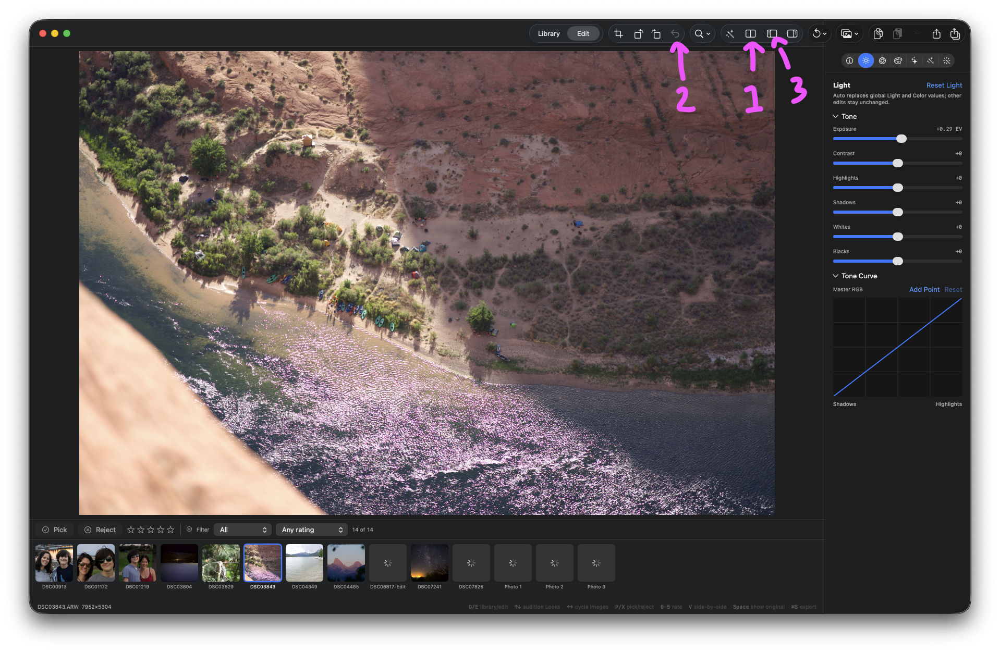

## Objective

Update the editor toolbar to match the attached pink-marked design while preserving the underlying actions through the View menu.

The three annotated controls are:

1. **Comparison view** — keep this toolbar item visible consistently.
2. **Reset Rotation** — remove this toolbar item; keep the action in the View menu only.
3. **Info inspector** — remove this toolbar item for now; keep the action available in the View menu.

## Current implementation

- Sources/KromoraKit/Views/ContentView.swift:250-270 conditionally renders the Comparison view button through isComparisonPresentationAvailable, so it appears only when a meaningful comparison exists or side-by-side mode was retained.
- Sources/KromoraKit/Views/ContentView.swift:431-435 renders Reset Rotation in CanvasToolbarControls.
- Sources/KromoraKit/Views/ContentView.swift:370-374 renders the Info inspector toolbar button.
- Sources/KromoraKit/Views/MenuCommands.swift:31-34 currently defines the View menu with only Show Photo Names. The menu command receiver already provides the notification bridge needed for View-menu actions.

## Requested behavior

### 1. Comparison view toolbar item

Show the comparison-view icon consistently in the editor toolbar instead of making its presence depend on whether the current document has edits. The toolbar layout should not shift when the first edit is made.

When no source or meaningful before/after comparison is available, preserve a safe disabled/no-op state rather than attempting an invalid comparison. Once a source and comparison are available, the existing single-view/side-by-side behavior and V shortcut must remain unchanged.

### 2. Reset Rotation

Remove the Reset Rotation icon from the editor toolbar. Add a View-menu command that invokes the existing AppViewModel.resetRotation() behavior, including its current edit/history/persistence semantics. Do not remove the rotate-left or rotate-right toolbar controls.

### 3. Info inspector

Hide the Info inspector icon from the editor toolbar for now. Add a View-menu command that invokes the existing AppViewModel.toggleInspector() behavior. Preserve the existing inspector presentation and the Command-I shortcut.

## Acceptance criteria

- [ ] The Comparison view toolbar item is rendered consistently in the editor, including before the first edit; the toolbar does not gain or lose this item when edits begin.
- [ ] Comparison view remains safely unavailable when there is no loaded source or meaningful comparison, and existing side-by-side/single-view behavior is unchanged when available.
- [ ] The Reset Rotation icon is absent from the editor toolbar.
- [ ] View menu contains a Reset Rotation command routed through the existing reset action, with appropriate unavailable-state behavior when no rotation can be reset.
- [ ] Rotate Left and Rotate Right toolbar actions remain present and unchanged.
- [ ] The Info inspector icon is absent from the editor toolbar.
- [ ] View menu contains an Info/Inspector command routed through the existing inspector toggle.
- [ ] Info inspector remains available through Command-I and the View menu.
- [ ] Toolbar accessibility labels/help and View-menu labels clearly identify the remaining comparison control and the relocated actions.
- [ ] Add or update focused UI/menu tests or source-level coverage for toolbar visibility and View-menu command routing; existing comparison and image-rotation tests remain passing.
- [ ] dg validate passes.

## Evidence

The attached screenshot marks the requested controls in pink: #1 comparison view, #2 Reset Rotation, and #3 Info inspector.

### Comment — codex @ 2026-09-11T13:48:31.574Z

Mapped the pink annotations to the current implementation: #1 is the conditional Comparison view toolbar item, #2 is Reset Rotation, and #3 is the Info inspector. The ticket includes the existing source locations, View-menu routing requirements, and the annotated screenshot. No source changes were made.

### Comment — codex @ 2026-09-11T13:53:50.247Z

Implementation handoff: committed bc6d079 (KRMA-360: refine editor toolbar and View menu). The comparison control is always rendered with a safe disabled state when unavailable; Reset Rotation and Info Inspector are removed from the toolbar and routed through View-menu notifications, with Command-I preserved and no-image inspector invocation guarded. Added focused source-level menu/toolbar coverage. Checks: swift test — 1,260 tests passed, 48 expected skips; focused MenuCommandTests, ComparisonModeTests, and ImageRotationTests passed; dg validate OK (pre-existing unknown-model warnings); git diff --check passed. Unrelated pre-existing DispatchGraph issue records, assets, and event-log changes remain in the working tree and were intentionally not staged or modified.

## Agent log

- 2026-09-11T13:56:52.038Z: Verification report
Verdict: PASS
Acceptance criteria:
- [x] Comparison view toolbar item rendered consistently, including before first edit (pass) — ContentView.swift:254-267 always renders the button; only .disabled(!isComparisonPresentationAvailable) varies.
- [x] Comparison view safely unavailable with no source/meaningful comparison; existing side-by-side/single-view behavior unchanged when available (pass) — isComparisonPresentationAvailable and toggleSideBySide() guards unchanged; ComparisonModeTests (15 tests) pass.
- [x] Reset Rotation icon absent from toolbar (pass) — Removed from CanvasToolbarControls in ContentView.swift.
- [x] View menu contains Reset Rotation command routed through existing reset action, with appropriate unavailable-state behavior (pass) — MenuCommands posts .resetRotation; AppViewModel.resetRotation() guards on sourceImage == nil and updateDocument no-ops when rotation is already zero (no spurious history/render), matching the existing Undo/Redo/Reset Photo View/File-menu convention of unguarded menu items backed by model-level no-op safety.
- [x] Rotate Left/Right toolbar actions remain present and unchanged (pass)
- [x] Info inspector icon absent from toolbar (pass)
- [x] View menu contains Info/Inspector command routed through existing toggle (pass) — AppViewModel.toggleInspector() now guards sourceImage == nil with a status message before toggling.
- [x] Info inspector remains available via Command-I and View menu (pass) — No other cmd-I binding conflicts (grep confirmed).
- [x] Toolbar accessibility labels/help and View-menu labels clearly identify remaining/relocated controls (pass)
- [x] Focused UI/menu tests added/updated; existing comparison and rotation tests pass (pass) — MenuCommandTests (5), ComparisonModeTests (15), ImageRotationTests (8) all pass; full fast suite (877 tests) passes.
- [x] dg validate passes (pass) — OK, with pre-existing unrelated unknown-model warnings for gpt-5.6-luna.
Checks run:
- swift build
- swift test --filter 'MenuCommandTests|ComparisonModeTests|ImageRotationTests' (28 tests, 0 failures)
- scripts/ci-tests.sh fast (877 tests, 0 failures)
- dg validate (OK, pre-existing unrelated warnings)
- git status --porcelain (clean aside from unrelated pre-existing DispatchGraph bookkeeping)
Findings:
- None
Fixes:
- None
Verification commits:
- None
Actor: claude
Resolved model: sonnet
Pickup session: 01MTX0OTTTZSSZF788
Summary: Verified: comparison toolbar item now stable, Reset Rotation/Info Inspector relocated to View menu with safe guards; full test suite and dg validate pass.
