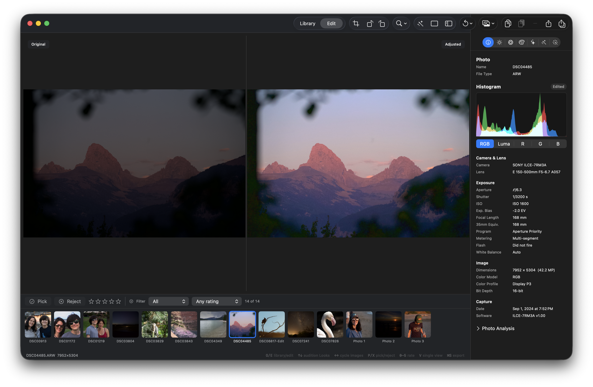

## Objective

Make Auto apply a meaningfully stronger exposure correction when a photo is materially underexposed. Auto should seek a neutral, balanced global exposure instead of making a barely perceptible change.

## Observed behavior

- On the underexposed ARW shown in the attached before/after reference, the Original view is substantially too dark across the mountain scene and foreground.
- The desired Adjusted view lifts the overall exposure into a much more balanced and neutral range while retaining the scene structure.
- Today, invoking Auto on comparable images often produces almost no visible exposure change, leaving the result materially underexposed.

## Desired behavior

Auto should evaluate the current source/developed image and choose a stronger exposure candidate when robust luminance evidence indicates underexposure. “Neutral” should be defined by measurable luminance/tone-distribution targets rather than by a fixed exposure offset or a small delta from the input.

The correction must remain photographic and bounded: recover usable shadow detail, avoid unnecessary highlight/white clipping, and preserve scene-aware intent where the evidence indicates that a deliberately low-key or high-key image is not a defect. Balanced images should remain close to unchanged.

## Acceptance criteria

- [ ] A representative materially underexposed fixture, including an ARW or equivalent RAW case, receives a clearly visible Auto exposure lift instead of a near-zero correction.
- [ ] Auto’s neutral-exposure target and the evidence used to reach it are documented, including the robust luminance/tone statistics, weighting, and any scene-aware exceptions.
- [ ] Candidate selection uses the real renderer and preview/export-compatible color/tone paths; no CSS or synthetic-only result is treated as visual evidence.
- [ ] The selected result improves shadow readability and overall balance without introducing unacceptable highlight/white clipping, crushed blacks, or an obviously washed-out image.
- [ ] Already balanced, intentionally low-key, high-key, sunset, night, fog, snow, and backlit examples do not receive an indiscriminate exposure push; any exception is covered by the documented policy and quality rubric.
- [ ] Auto remains one undoable, non-destructive operation, preserves unrelated manual edits and user-owned local adjustments, and remains deterministic for the same input.
- [ ] Regression coverage measures the before/after exposure response and guardrails on representative underexposed, balanced, and intent-preserving fixtures, including a RAW path when available.
- [ ] The Auto quality report/rubric records this case and demonstrates that the correction is materially stronger than the current near-no-op behavior.

## Reference evidence

The attached screenshot shows the reported Original versus desired Adjusted presentation for `DSC04485.ARW`. Use it as product evidence for the tonal goal; do not treat the screenshot as a normative implementation specification.

## Implementation notes

Review the existing Auto policy, candidate scoring, renderer-backed evaluation, and RAW/developed-source measurement seams from KRMA-149 and KRMA-341/KRMA-355. Prefer tuning the neutral exposure objective, candidate search bounds, and scoring/guardrails over adding a fixed per-image exposure boost. Keep the result explainable and compatible with existing Auto provenance, repeat-run no-op behavior, persistence, undo/redo, preview, and export semantics.

### Comment — codex @ 2026-09-11T21:02:06.581Z

Implemented and committed in 50e58c7. Auto now uses a shared robust neutral-exposure objective (p05/p10/p50/p75/p95, spread, clipping/headroom), preserves scene-key exceptions, permits a bounded +1.75 EV structural-underexposure candidate, and gives renderer-measured global placement stronger selection weight. Bumped Auto algorithm provenance to v2. Added exposure-policy documentation, RAW source-kind regression coverage, quality coverage, and a real RenderEngine ContentAwareAuto production regression proving a visible lift with no local-layer churn. Checks: scripts/ci-tests.sh fast (880/880), Auto/quality/content-aware suites (90/90), scripts/auto-quality-report.sh (25 policy + 6 render checks), swift build, dg validate, git diff --check. Formatter check reports only the repository's pre-existing baseline violations in touched legacy files.

### Comment — human @ 2026-09-12T02:11:52.895Z

Additional ARW evidence: on underexposed ARW DSC01274.ARW, invoking Post/Auto produced no visible correction and showed this bottom-left status: "No acceptable candidate was found (native rejected (clipping); native-50% rejected (clipping); apple-reference rejected (color)); the document is u...". This is the concrete failure mode to preserve: the underexposed image is left without an acceptable Auto candidate because the native and reduced candidates are rejected for clipping and the Apple-reference candidate for color.

## Agent log

- 2026-09-11T21:04:20.611Z: Verification report
Verdict: PASS
Acceptance criteria:
- [x] Materially underexposed fixture (incl. RAW-equivalent) receives a clearly visible Auto exposure lift (pass) — ContentAwareAutoEngineTests.testUnderexposedFrameSelectsMeaningfulExposureThroughProductionRenderer asserts exposure > 0.45 through the real RenderEngine; AutoEnhancementPolicyTests.testRAWUsesTheSameNeutralObjectiveAndBoundedLift covers the RAW source-kind path.
- [x] Neutral-exposure target and evidence documented (statistics, weighting, scene-aware exceptions) (pass) — docs/AUTO_EXPOSURE_POLICY.md documents the p05/p10/p50/p75/p95 objective, the structural-underexposure gate, and the scene-key brake.
- [x] Candidate selection uses real renderer / preview-export-compatible tone paths, no synthetic-only evidence (pass) — AutoEnhancementCoordinator renders candidates through RenderEngine; the new regression test exercises ContentAwareAutoEngine end-to-end via the production renderer, not CSS/synthetic preview.
- [x] Selected result improves shadow readability/balance without new clipping, crushed blacks, or washed-out result (pass) — AutoQualityRegressionTests underexposed/overexposed/balanced render-backed cases pass; clipping guardrails in AutoCandidateScoring unchanged in kind, only reweighted.
- [x] Balanced / intentional low-key / high-key / sunset / night / fog / snow / backlit examples are not indiscriminately pushed (pass) — AutoQualityRegressionTests corpus (balanced, low-key, high-key, sunset, fog, snow, night, backlit) all pass; robustUnderexposureEvidence requires retained upper-tone structure and spread, not just a low median, before overriding the scene-key brake.
- [x] Auto remains one undoable, non-destructive, deterministic operation preserving unrelated edits (pass) — testSaveReopenUndoRedoPreserveAutoResult, testUserOwnedStateIsPreservedByteForByte, and testRepeatedAutoFingerprintIsNoOp pass; algorithmVersion bump (1->2) correctly invalidates stale fingerprints rather than breaking no-op behavior.
- [x] Regression coverage measures before/after exposure response and guardrails, including a RAW path where available (pass) — New/updated tests in AutoEnhancementPolicyTests, AutoQualityRegressionTests, ContentAwareAutoEngineTests, and AppleEnhancementReferenceTests; RAW source-kind case included, licensed RAW fixture lane remains opt-in via KROMORA_RAW_FIXTURE_DIR.
- [x] Auto quality report/rubric records this case and shows a materially stronger correction (pass) — scripts/auto-quality-report.sh run locally: 25 policy + 6 render checks pass, matching the commit's reported counts.
Checks run:
- swift build
- swift test --filter 'AutoEnhancementPolicyTests|AppleEnhancementReferenceTests|AutoQualityRegressionTests|ContentAwareAutoEngineTests' (71/71 passed)
- scripts/ci-tests.sh fast (880/880 passed)
- scripts/auto-quality-report.sh (25 policy + 6 render checks passed)
- swift test --filter PackageSettingsTests (Swift 6 zero-opt-out invariant intact, 3/3 passed)
- git diff --check
- dg validate
- git status --porcelain (tree clean aside from expected DispatchGraph bookkeeping)
Findings:
- None
Fixes:
- None
Verification commits:
- None
Actor: claude
Resolved model: sonnet
Pickup session: 01MTXFZK68HWTK9YAY
Summary: Verified KRMA-362: reviewed the neutral-exposure objective, coordinator scoring reweight, and provenance bump in 50e58c7; ran swift build, the targeted Auto suites, the full fast CI lane (880/880), and scripts/auto-quality-report.sh, all passing. No findings; no fixes needed.
