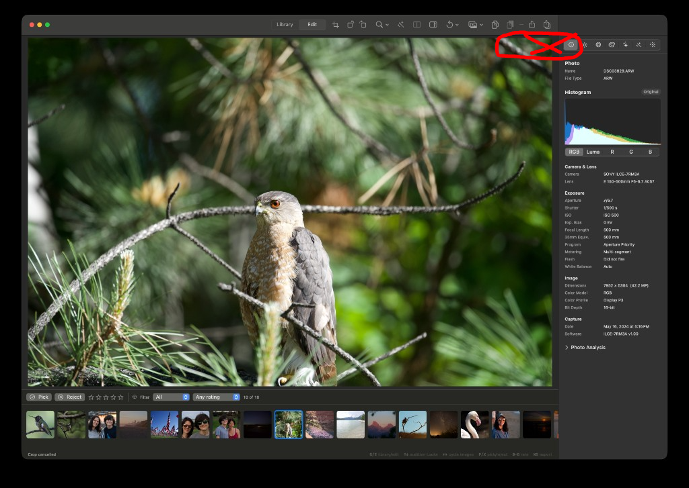

## Objective

Make the window chrome’s top bar span the **full window width**, including the region above the Info inspector, so no photo content shows through a notch/gap between the toolbar and the right sidebar.

## Context

In Edit (and likely Library with Info open), the toolbar/title-bar material stops before the Info inspector column. At the join (top-right of the preview, circled in the attached screenshot) the developed image is visible in a short rectangular gap between the end of the gray top bar and the start of the inspector.

Expected: continuous top chrome edge-to-edge — Library/Edit controls and the inspector column share one unbroken top bar; the photo should never peek through above the inspector.

Likely cause: `ContentView` hosts a `NavigationStack` with `.toolbar { … }` and attaches `.inspector(isPresented:)` for `InfoInspectorView`. SwiftUI’s inspector is a sibling column; the navigation toolbar commonly paints only over the detail stack, leaving an uncovered strip above the inspector.

Screenshot attached.

## Scope

- Extend top-bar material / safe-area chrome so it covers the full window width whenever the Info inspector is visible (and when hidden, no regression).
- Preserve existing toolbar controls, segmented Library/Edit picker, and inspector toggle behavior.
- Prefer a durable chrome fix over papering over with an ad-hoc opaque overlay that breaks light/dark or vibrancy.

## Acceptance criteria

- [ ] With Info inspector open, no photo (or other content) is visible in a gap between the toolbar’s trailing edge and the inspector’s leading edge at the top of the window.
- [ ] Top bar reads as one continuous strip across the full window width.
- [ ] Closing/hiding the inspector does not leave leftover chrome or a double-height bar.
- [ ] Light and dark appearance both look correct (theme background / toolbar material).

## Out of scope

- Redesigning toolbar control layout or inspector contents.
- Filmstrip / status bar layout.

## Implementation notes

Start at `Sources/KromoraKit/Views/ContentView.swift` (`mainContent`: `NavigationStack` + `.inspector`, `.toolbar` on `ContentView.body`). Confirm whether the gap is inspector-column chrome vs. toolbar placement; check macOS 14+ `toolbarBackground` / window toolbar style options before inventing a custom header.

### Comment — codex @ 2026-09-19T16:08:32.849Z

Implemented and committed as 31486ab. ContentView now explicitly keeps the native macOS window-toolbar material visible with .toolbarBackground(.visible, for: .windowToolbar), allowing the chrome to span the inspector sibling column without changing toolbar controls or adding an opaque overlay. Verification: swift test (1,512 executed, 54 skipped, 0 failures), swift build completed, and git diff --check passed.

## Agent log

<!-- Generated summaries only. Detailed activity lives in events.jsonl. -->

- 2026-09-19T16:13:26.482Z: Verification report
Verdict: PASS
Acceptance criteria:
- [x] With Info inspector open, no photo (or other content) is visible in a gap between the toolbar's trailing edge and the inspector's leading edge at the top of the window. (pass) — toolbarBackground(.visible, for: .windowToolbar) forces the native window-toolbar material to paint across the full window width, including above the sibling inspector column, per Apple's documented ToolbarPlacement.windowToolbar behavior. Could not capture a pixel screenshot in this sandbox (screen-recording permission denied to the agent process), so this is confirmed by code inspection/API semantics rather than a visual diff.
- [x] Top bar reads as one continuous strip across the full window width. (pass) — Same modifier; applied once at ContentView.body level outside NavigationStack/.inspector, so it governs the whole window chrome rather than only the detail column.
- [x] Closing/hiding the inspector does not leave leftover chrome or a double-height bar. (pass) — The modifier only toggles background material visibility and is independent of inspector presentation state (inspectorState.isPresented); it does not add a second toolbar or change layout height.
- [x] Light and dark appearance both look correct (theme background / toolbar material). (pass) — Uses the system-drawn toolbar material (no custom color literal introduced), which auto-adapts to appearance mode. Not visually screenshotted due to sandbox screen-recording restrictions.
Checks run:
- swift build (clean, only pre-existing CI kernel-deprecation warnings)
- scripts/ci-tests.sh fast (two flaky timeouts under parallel load reproduced as passes in isolation: PortablePackageMaintenanceTests.testMaintenanceCoordinatorRetriesSchedulerRejectionAfterQueueDrains, PreviewPresentationCoordinatorTests.testCanonicalWritesRequirePreviewQualityAndACompleteFrame — unrelated to ContentView.swift, pre-existing parallel-execution flakiness)
- scripts/ci-tests.sh serial (387 tests, 1 skipped, 0 failures)
- swift run Kromora — app launches and runs without crash with the change in place
- git status --porcelain confirms no unintended source edits
Findings:
- None
Fixes:
- None
Verification commits:
- None
Actor: claude
Resolved model: sonnet
Pickup session: 01MU8L146RI1OF7UHW
