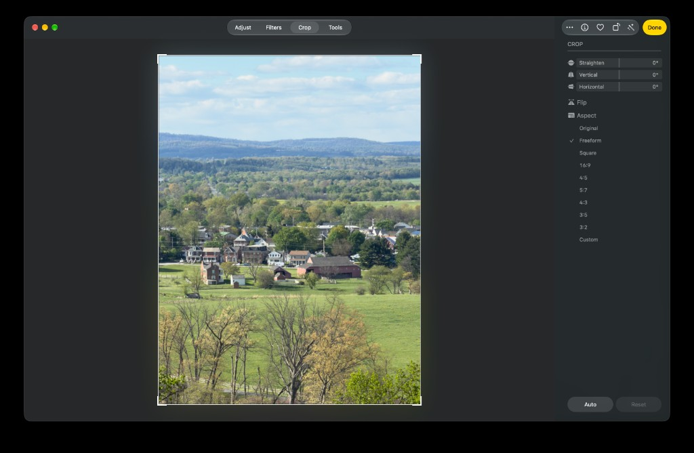

Parent for a dedicated **crop workspace**. Keep this ticket in `backlog`. Do not claim it as one implementation sweep. KRMA-471, KRMA-472, and KRMA-473 are the work.

## Objective

Make Crop a **whole editor mode**, not a canvas overlay. Entering Crop should feel like Apple Photos Adjust → Crop: the rest of Edit recedes, the photo and crop frame own the canvas, and a crop inspector exposes framing tools (straighten, perspective, flip, aspect, Auto, Reset) with a single **Done** to commit.

KRMA-463 only moved 90° rotate into `CropToolbarView` and hid always-on rotate buttons. That is not this product. Overlay chrome on top of filmstrip + Light/Color inspector is a fail for this epic.

## Reference

Apple Photos (macOS) crop workspace:

- Top: mode chrome + **Done** (not Apply/Cancel sitting on the photo).
- Canvas: photo centered, dimmed outside the crop, corner handles, no filmstrip.
- Right inspector **CROP**: Straighten (°), Vertical, Horizontal, Flip, Aspect list (Original / Freeform / Square / 16:9 / 4:5 / 5:7 / 4:3 / 3:5 / 3:2 / Custom), Auto + Reset at the bottom.

Do not copy Photos’ Adjust/Filters/Crop/Tools segmented bar. Kromora already has Library/Edit and inspector tabs. Match the **workspace contract**: enter a focused crop mode, tools live in a crop inspector, Done exits.

## Why KRMA-463 was not enough

Today crop is still `isCropToolActive` plus:

- `CropToolbarView` floating above the preview (aspect menu, rotate, Reset / Cancel / Apply).
- Filmstrip, culling bar, and source browser still visible.
- Info/Light/Color/Effects inspector still the Edit inspector.
- Durable geometry is still a normalized rect + quarter-turn `ImageRotation`. No straighten angle, flip, or perspective.

## Children

1. **KRMA-471** — Crop workspace chrome: hide Edit clutter, crop inspector, Done/Escape, relocate existing tools. No new geometry pipeline.
2. **KRMA-472** — Straighten (continuous °), flip, expanded aspect catalog. New durable values + render.
3. **KRMA-473** — Vertical/horizontal perspective + Auto framing.

## Out of scope for the epic

- Library mosaic crop-aspect (KRMA-461, done).
- Window-toolbar gap (KRMA-462, done).
- Replacing masking’s inspector-tab workspace with this same chrome.
- Inventing a second renderer or baking crop into preview pixels.

## Implementation notes

- `Sources/KromoraKit/Views/ContentView.swift` — filmstrip / culling / source browser / toolbar while cropping.
- `Sources/KromoraKit/Views/PreviewView.swift` — `CropToolbarView` placement.
- `Sources/KromoraKit/Views/CropOverlayView.swift` — overlay + overlay toolbar.
- `Sources/KromoraKit/Views/InfoInspectorView.swift` — replace tab content while cropping.
- `Sources/KromoraKit/Models/CropAdjustments.swift` — durable crop value (extend in 472/473, not here).
- `Sources/KromoraKit/Models/ImageRotation.swift` — quarter-turns only by design; straighten must **not** overload this enum.
- `Sources/KromoraKit/Models/RenderPipeline.swift` — crop/rotation stages; new geometry in 472/473.
- Related: KRMA-101 (crop landed), KRMA-444 (Escape/Enter), KRMA-463 (crop-mode 90° rotate).

### Comment — codex @ 2026-09-20T04:17:39.954Z

Parent epic verified: KRMA-471, KRMA-472, and KRMA-473 are complete, and the aggregate crop build/tests pass. Per the issue instructions, no separate parent implementation sweep is needed; returning KRMA-470 to backlog.
