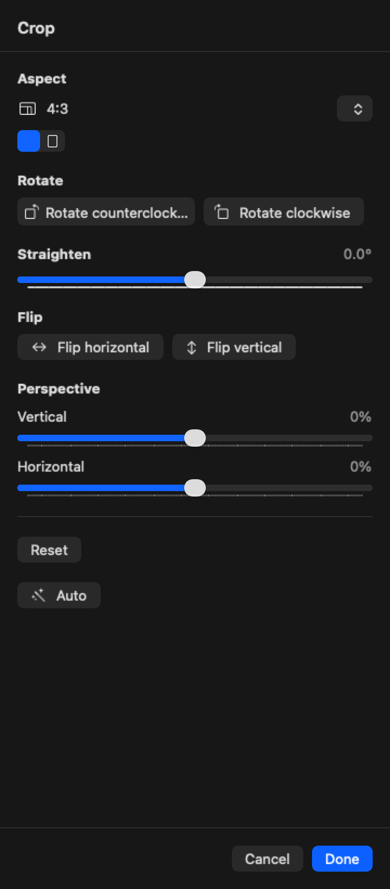

## Objective

Replace the crop inspector's aspect-ratio button list with a compact dropdown.

## Context

User feedback (2026-09-20): the aspect ratio buttons "look absolutely terrible"; it should probably be a dropdown. This refines the "Aspect list" in KRMA-470 and follows the crop workspace from KRMA-471.

Current implementation: `aspectSection` in `Sources/KromoraKit/Views/CropInspectorView.swift` renders a `VStack` of plain `Button`s, one row per `CropAspectRatio.allCases`, and for every ratio that `supportsOrientationSelection` it adds two side-by-side buttons ("4:3 Landscape", "3:4 Portrait"). The selected item is marked with a checkmark label. That is roughly 15 text buttons in the inspector.

## Suspected labelling bug (verify while doing this)

Reading `Sources/KromoraKit/Models/CropAdjustments.swift`, `CropAspectRatio.landscapePixelRatio` is 4/5, 5/7 and 3/5 for `.fourToFive`, `.fiveToSeven` and `.threeToFive`. Those are taller-than-wide shapes, yet `selectionLabel(for: .landscape)` labels them "4:5 Landscape" and the portrait label reads "5:4 Portrait" (a wider-than-tall shape). If that is right, the Landscape/Portrait labels are inverted for those three presets. I have not confirmed this in the running app. Whatever the dropdown shows must match the shape of the frame that results.

## Requirements

- One control (SwiftUI `Picker` with `.menu` style, or a `Menu`) showing the current selection, e.g. "Original", "Freeform", "16:9".
- Menu contents, in this order: Original, Freeform, Square (1:1), then each ratio once (16:9, 4:3, 3:2, 5:7, 4:5, 3:5 or a similarly sensible photographer order), then Custom if it keeps existing behaviour.
- Orientation is not part of the menu. Show a small two-icon control (landscape rectangle / portrait rectangle) next to or under the dropdown, only when the selected ratio `supportsOrientationSelection`. Selecting it applies through the existing `onAspectRatioChange(ratio, orientation)`.
- The dropdown label and the orientation icons must reflect the actual frame shape (fix the inversion above if confirmed, without changing persisted meaning: see below).
- Keep `CropAspectRatio` raw values and `CropAdjustments` Codable behaviour unchanged. Edits already saved on disk must load exactly as before.
- Keyboard and VoiceOver: control labelled "Crop aspect ratio", value announced, menu items reachable by keyboard.

## Out of scope

- Behaviour of the crop frame when a ratio is applied (`CropOverlayInteraction.applying`).
- Numeric/custom ratio entry.

## Acceptance criteria

- [ ] Aspect section is a single dropdown plus an orientation control shown only when applicable.
- [ ] No list of ratio buttons remains in `CropInspectorView`.
- [ ] Displayed labels match the shape of the resulting frame for every preset and both orientations, including 4:5, 5:7, 3:5; a unit test in `Tests/KromoraKitTests/CropTests.swift` pins label vs `normalizedRatio` for each.
- [ ] Documents saved before this change decode and reopen with the same crop and ratio.
- [ ] Accessibility label/value present; verified with VoiceOver or the accessibility inspector.
- [ ] Screenshot of the new inspector attached to the ticket.
- [ ] `scripts/ci-tests.sh fast` and `serial` pass.

