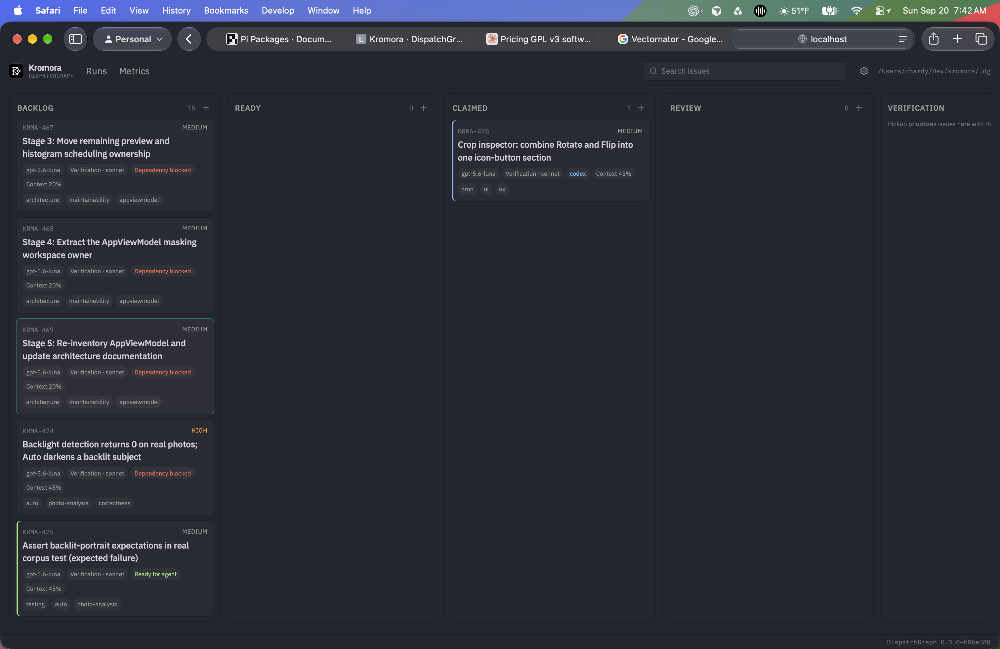
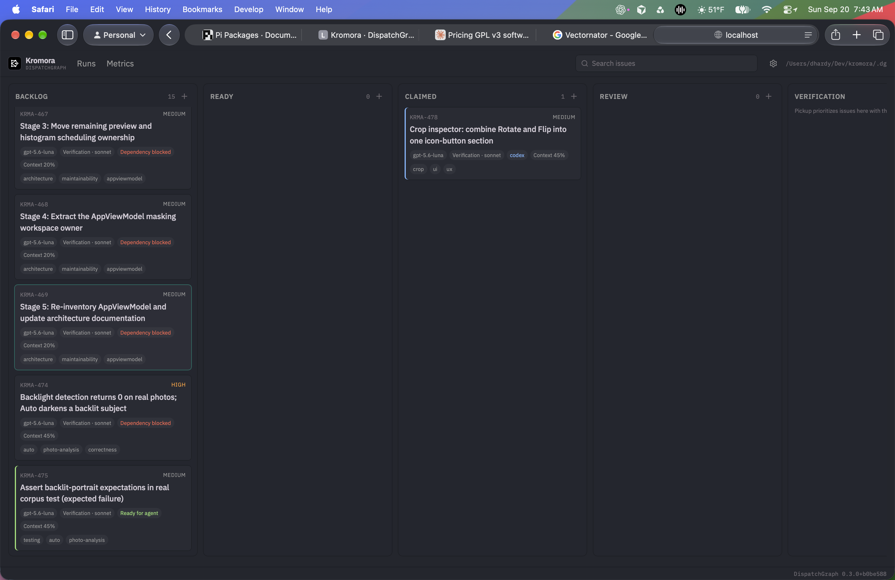

## Objective

Combine Rotate and Flip into one "Rotate and Flip" section of icon buttons.

## Context

User feedback (2026-09-20): Rotate and Mirror/Flip should be icons in a "Rotate and Flip" section.

Current implementation in `Sources/KromoraKit/Views/CropInspectorView.swift`: two separate sections. `rotationSection` ("Rotate") has two buttons using `Label(..., systemImage: "rotate.left")` with `.labelStyle(.titleAndIcon)`; `flipSection` ("Flip") has two `.bordered` buttons with `.titleAndIcon` labels and the SF symbols `arrow.left.and.right` / `arrow.up.and.down`, tinted when on.

## Requirements

- One section titled "Rotate and Flip" with a single row of four icon-only buttons: rotate counterclockwise, rotate clockwise, flip horizontal, flip vertical.
- Flip buttons show an obvious on/off state (tint or filled background) and expose it to accessibility as "On"/"Off", as today.
- Use clear symbols. Prefer dedicated flip glyphs (e.g. `flip.horizontal`, `flip.horizontal.fill`, or the rotated equivalent for vertical) if they are available on the macOS 14 deployment target; otherwise keep the current arrow symbols. Check availability rather than assuming it.
- Each button keeps its existing `.accessibilityLabel`, and gains a `.help` tooltip ("Rotate 90 degrees counterclockwise", "Flip horizontally", etc.). Icon-only must not remove accessible names.
- Buttons are equal size and at least a comfortable click target (~28-32 pt); layout holds at the inspector's minimum width.
- No behaviour change: callbacks (`onRotateCounterClockwise`, `onRotateClockwise`, `onFlipHorizontal`, `onFlipVertical`) and their crop/mask handling stay as they are.

## Acceptance criteria

- [ ] "Rotate" and "Flip" sections are replaced by one "Rotate and Flip" section of four icon-only buttons.
- [ ] Each button has an accessibility label and a tooltip; flip state is announced.
- [ ] Symbol names confirmed present on the macOS 14 target; no availability warnings.
- [ ] Rotate/flip behaviour unchanged (existing tests in `CropTests.swift` pass).
- [ ] Screenshot of the section in light and dark appearance attached.
- [ ] `scripts/ci-tests.sh fast` and `serial` pass.

