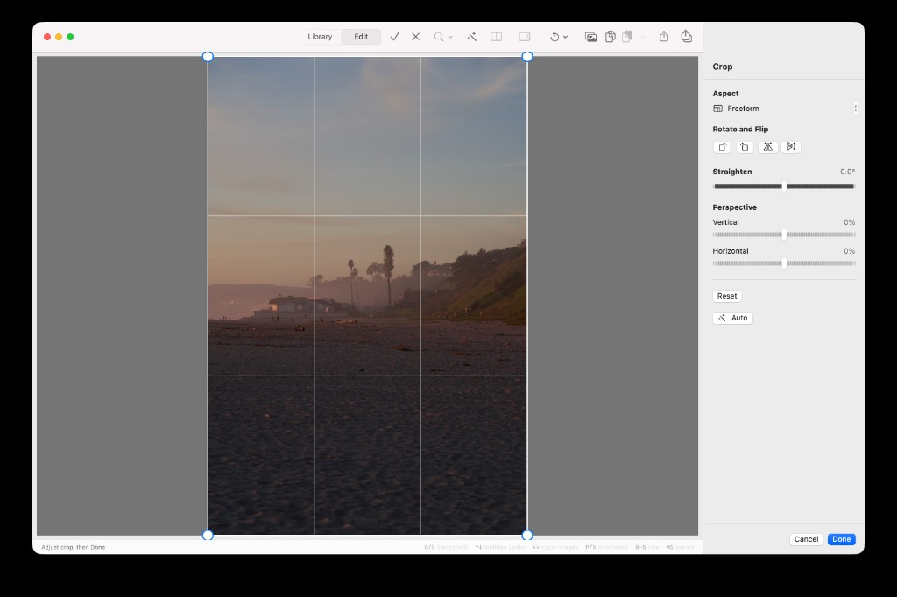
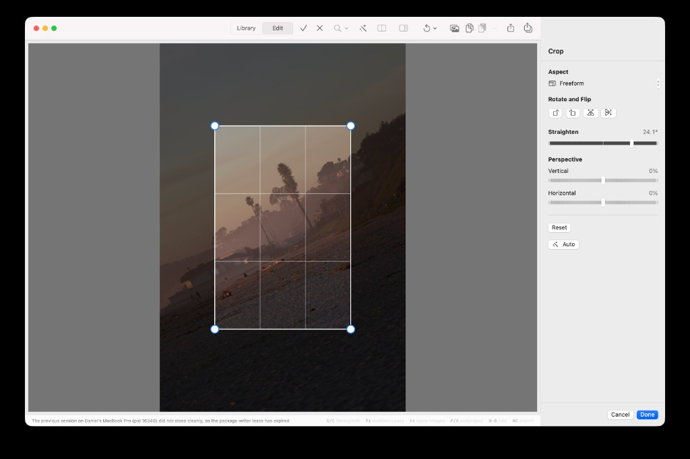

## Objective

In crop mode, dragging Straighten must **rotate the photo** under an **axis-aligned crop frame**. The frame itself does not rotate. It may shrink so every edge stays inside the rotated photo (no empty pixels). It must not zoom the photo inside a fixed-size box and then shrink the crop as a side effect.

## Context

Reproduced 2026-09-20 in the running app, Freeform crop, beach scene.

**Expected (Photos / Lightroom straighten):**
- The crop rectangle stays screen-axis-aligned (handles stay upright).
- The **photo** rotates as the slider moves, like a print turning on the table.
- The frame may shrink to the largest rectangle of the current aspect that still fits inside the rotated photo. No part of the frame sits over empty canvas.
- You can see the photo’s corners swing. The image container is not a fixed WxH box with pixels spinning inside it.

**Actual:**
- Screenshot 1 (0.0°): crop hugs the full image.
- Screenshot 2 (24.1°): the outer image box is still the same axis-aligned portrait rectangle. Content inside that box is rotated **and zoomed**, and the crop inset has shrunk well inside that box.
- The photo does not appear to rotate; it looks like a bake-in of `CIStraightenFilter` (rotate + fill original extent) plus KRMA-477’s inscribed-rect shrink.

KRMA-477 (done) correctly required “frame stays inside the rotated image and keeps aspect.” That constraint is still required. This ticket is the **visual model** that KRMA-477 did not change: rotate the **image**, keep the **frame** upright, shrink the frame only as far as geometry requires.

Likely cause: crop-mode preview applies straighten in `RenderPipeline.applyingGeometry` via `CIStraightenFilter`, which produces an axis-aligned bitmap. `CropOverlayView` then lays an axis-aligned frame on that bitmap. Combined with `reframedForStraightenChange`, the user sees zoom + a shrinking crop instead of a rotating photo.

## Requirements

1. **Crop-mode presentation:** while the crop tool is active, Straighten rotates the displayed photo in view space. The crop overlay (dim, rule-of-thirds, handles) stays axis-aligned. Do not present straighten as “pixels spinning inside the original image rectangle.”
2. **Shrink only as needed:** on each angle change, recompute the largest inscribed rectangle of the current aspect (preset, or Freeform’s ratio captured when straighten began) that still lies entirely on photo pixels. Shrink and/or re-centre; do not stretch. Do not shrink past that inscribed size.
3. **No unnecessary zoom:** the photo must not scale up to refill the pre-rotation WxH. Transparent/empty corners of the rotated AABB may be shown (dimmed or clipped by the frame) but must not be filled by zooming the image.
4. **Reversal:** moving the slider back toward 0° must restore the photo’s orientation. Frame growth on reversal should match the KRMA-477 choice already documented (Photos-like: follow the image; do not invent a larger crop than the user had).
5. **Commit/export unchanged in meaning:** Done still persists straighten + the constrained normalized crop. Preview outside crop mode, comparison, and export must match that committed result (no empty corners). The bug is the crop-workspace visualization and the extra shrink/zoom, not a new persistence schema.
6. **Keep KRMA-477 invariants:** drag/resize at a non-zero angle still cannot push a corner off the photo; aspect is preserved; `-45…45°`.

## Out of scope

- Perspective sliders (file a follow-up if they share the same “bake into AABB” presentation).
- Changing the Straighten control chrome (KRMA-478).
- Realtime slider throughput (KRMA-479, done).

## Acceptance criteria

- [ ] Dragging Straighten from 0° through a large angle (e.g. ~24° and ±45°) visually rotates the photo; the crop frame stays axis-aligned and does not rotate with the pixels.
- [ ] The image container is not a fixed pre-rotation WxH with content zoomed inside it. Compared with the attached 24.1° screenshot, the photo must tilt and the crop must not collapse into a small inset unless that inset is the true largest-fit rectangle.
- [ ] At every angle in `-45…45°`, the frame lies entirely on opaque photo pixels (no empty corners inside the crop). Export of the committed crop has the same property.
- [ ] Freeform, Original, and at least one locked aspect (e.g. 3:2) keep their ratio while shrinking to fit.
- [ ] Returning the slider to 0° restores the unrotated photo; the frame is valid and not left unnecessarily small if the documented reversal policy grows it.
- [ ] Done / Cancel / undo still match the existing crop draft contract.
- [ ] Tests cover the presentation contract (view-space rotation vs baked AABB) and the inscribed-rect size so a regression like the attached 24.1° screenshot fails. `scripts/ci-tests.sh fast` and `serial` pass.

## Implementation notes

- `Sources/KromoraKit/Models/RenderPipeline.swift` — `applyingGeometry` / `CIStraightenFilter` / `geometryExtent`. Crop-mode preview may need the un-straightened (or uncropped-unstraightened) bitmap plus a view transform, with straighten still applied for committed preview/export.
- `Sources/KromoraKit/Views/PreviewView.swift` — crop overlay is stacked on `canvasSurface`; today both share the baked geometry image.
- `Sources/KromoraKit/Views/CropOverlayView.swift` — overlay is axis-aligned in the fitted image rect; it never rotates, which is correct **if** the photo underneath rotates.
- `Sources/KromoraKit/Models/CanvasNavigation.swift` — `setCropStraightenAngle` → `reframedForStraightenChange`.
- `Sources/KromoraKit/Models/CropAdjustments.swift` — `CropOverlayInteraction` inscribed-rect / rotated extent math.
- Related: KRMA-477 (containment, done), KRMA-472 (straighten feature, done), KRMA-470 (crop workspace).

### Comment — codex @ 2026-09-20T15:43:03.862Z

Implemented view-space Straighten presentation. Crop-mode render requests now keep straighten neutral while retaining the transient angle; PreviewSurfaceView rotates the unbaked photo around the fitted rotated AABB, keeps the crop overlay axis-aligned, and redraws on angle changes. Committed render/export geometry remains unchanged. Added inscribed-frame, crop workflow, and retained-texture presentation regressions. Verification: swift build; focused crop/presentation tests; scripts/ci-tests.sh fast (1093 tests); scripts/ci-tests.sh serial (392 tests, 1 expected local-RAW skip, 0 failures); git diff --check; dg validate.

## Agent log

- 2026-09-20T15:48:13.556Z: Verification report
Verdict: PASS
Acceptance criteria:
- [x] Dragging Straighten visually rotates the photo while the crop frame stays axis-aligned (pass) — PreviewSurfaceView now rotates the unbaked texture in view space (Metal vertex shader and CI fallback path) while the crop overlay stays upright; render requests keep straightenAngle=0 during crop-mode interaction (verified by testCropStraightenUsesViewSpaceRotationWhileThePreviewRequestStaysUnstraightened).
- [x] Image container is not a fixed pre-rotation WxH with zoomed content (pass) — viewSpaceExtent fits the rotated AABB rather than reusing the pre-rotation extent; testCropStraightenFitsTheRotatedPhotoAABBWithoutChangingTheRenderedSourceExtent and testRetainedTextureCropStraightenRotatesThePhotoInsteadOfZoomingItsTexture cover this.
- [x] Frame lies entirely on opaque photo pixels at every angle in -45...45, matching export (pass) — testStraightenFrameIsContainedAndKeepsItsPixelRatioAcrossTheAllowedAngles sweeps -45..45 for 7 aspect targets; testStraightenCropPreviewAndExportHaveOpaqueCornerPixels checks decoded preview/export corner pixels at -45/-30/15/45deg.
- [x] Freeform, Original, and a locked aspect (3:2) keep ratio while shrinking to fit (pass) — Same sweep test includes freeform, original, and 3:2/2:3/16:9/4:5 pixel ratios.
- [x] Returning to 0 degrees restores the unrotated photo with a valid, non-shrunk-further frame (pass) — testStraightenReversalOnlyKeepsOrShrinksTheFrame confirms restored area <= initial area and containment/ratio hold, consistent with the documented KRMA-477 reversal policy.
- [x] Done/Cancel/undo still match the existing crop draft contract (pass) — testStraightenAdjustsTheTransientDraftAndCommitKeepsTheSafeFrame and existing CropWorkflowTests continue to pass unmodified in behavior for non-straighten paths.
- [x] Tests cover the presentation contract (view-space rotation vs baked AABB) and inscribed-rect sizing; ci-tests.sh fast and serial pass (pass) — Ran scripts/ci-tests.sh fast (1093 tests, 0 failures after re-run; one PortablePackageMaintenanceTests timeout was confirmed flaky/unrelated via isolated re-run) and scripts/ci-tests.sh serial (392 tests, 1 expected local-RAW skip, 0 failures).
Checks run:
- swift build
- scripts/ci-tests.sh fast
- scripts/ci-tests.sh serial
- swift test --filter 'CropTests|CropModelTests|CropPipelineTests|CropWorkflowTests|PreviewSurfaceTests'
- swift test --filter PortablePackageMaintenanceTests/testMaintenanceCoordinatorRetriesSchedulerRejectionAfterQueueDrains (isolated re-run to confirm flake)
- manual review of RenderPipeline.applyingGeometry, PreviewSurface.swift view-space rotation (CPU + Metal), CanvasNavigation straighten/reframe state, CropAdjustments inscribed-rect and containment geometry, CropOverlayView/PreviewView wiring
Findings:
- None
Fixes:
- None
Verification commits:
- None
Actor: claude
Resolved model: sonnet
Pickup session: 01MU9ZK2YVICRI6XGW
Summary: Verified: crop-mode Straighten now rotates the photo in view space while the crop overlay stays axis-aligned; RenderPipeline keeps the geometry stage identical for preview/export. swift build, ci-tests.sh fast (1093 tests) and serial (392 tests) pass; no findings, no fixes needed.
