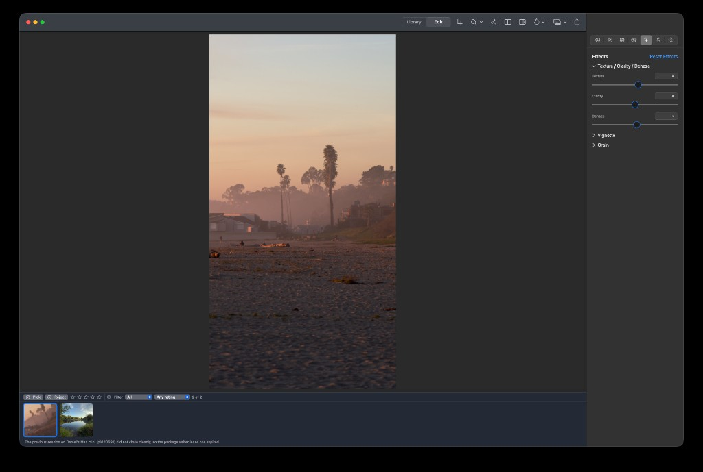
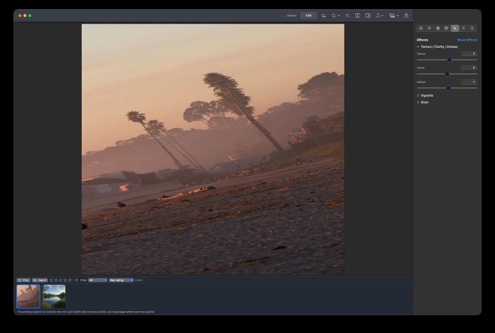

## Objective

After applying Straighten (Done in crop), the **primary Edit preview** shows the same framing, tilt, and aspect as the edited thumbnail / export — not a narrow pillar, upright slice, or stretched zoomed frame.

## Context

User report (2026-09-21) with two screenshots attached:

1. **Fit / normal Edit view:** Filmstrip thumbnail shows the full beach scene with a large counter-clockwise tilt (straighten clearly applied). The main canvas shows only a **tall narrow vertical strip** of the same photo; content in that strip looks oddly framed vs the thumb.
2. **After double-click zoom:** Main view still wrong — user describes a **stretched but “straightened”** output (tilt/aspect presentation broken under zoom).

Not in crop tool (Effects tab active). This is the **committed** straighten path after leaving crop, not the in-crop view-space preview.

### Related history

- **KRMA-481** (done): In crop mode, straighten is **view-space** rotation on `PreviewSurface` while render requests keep `straightenAngle: 0` to avoid `CIStraightenFilter` AABB “zoom in a box.” After Done, straighten is supposed to bake through `RenderPipeline.applyingGeometry` / `geometryExtent` for preview + export + thumbnails.
- **KRMA-477**: Keep crop frame inside rotated image / aspect under straighten.
- Suspicion: committed preview **presentation extent / fit / zoom** still uses a pre-straighten or wrong-axis size while the raster (or thumbnail path) reflects the tilted AABB — producing a narrow pillar and zoom stretch. Thumbnail may be taking a different extent path that looks closer to correct.

## Suspected causes (review — none confirmed)

1. **`presentationImageExtent` / `ResolutionPlanner` vs post-straighten `geometryExtent`** — fit and zoom map the texture into a viewport box that doesn’t match the straightened raster’s aspect, squeezing a landscape AABB into a portrait pillar (or sampling a thin ROI).
2. **Committed crop rect + straighten composition** — normalized crop after large straighten may be correct for export/thumb but applied with the wrong oriented size on the main preview surface.
3. **Retained / view-space rotation left on after crop exit** — `viewSpaceRotationAngle` should be 0 outside crop; if a stale view-space rotation combines with a baked-straighten raster, double transforms or aspect lies.
4. **Zoom (`toggleCanvasZoom`) uses the wrong image extent** after straighten, so double-click “fit ↔ zoom” stretches.
5. **Thumbnail vs main preview pipeline divergence** — edited thumb may render geometry more correctly; use that as the reference for “correct” while fixing main `PreviewSurface` presentation.

## Requirements

- After Crop ▸ Straighten ▸ Done, main preview at fit shows the full committed framed photo with correct tilt and aspect (parity with filmstrip edited thumbnail and with export).
- Double-click zoom / unzoom preserves aspect (no stretch); pan/zoom still respect KRMA-495 navigation quality once that lands.
- Cancel / undo / zero straighten still restore identity framing.
- In-crop view-space straighten (KRMA-481) must not regress.
- Add a regression that would have failed on this bug: committed non-zero straighten → main preview request/presentation extent aspect matches geometry AABB (and/or pixel landmark parity with thumbnail/export), not only `document.crop.straightenAngle` persistence.

## Acceptance criteria

- [ ] Root cause identified and written into this ticket (which suspect, or a new one), with the introducing commit if found.
- [ ] Manual: large straighten (~±30–45°) on a landscape photo → Done → main canvas matches thumbnail framing/tilt (no narrow pillar).
- [ ] Manual: double-click zoom does not stretch; returns to correct fit.
- [ ] Automated regression covering committed-straighten presentation/extent (or export↔preview parity for a straightened crop).
- [ ] `scripts/ci-tests.sh fast` and `serial` pass.

## Implementation notes

- `RenderPipeline.applyingGeometry` / `geometryExtent`, `ResolutionPlanner.presentationImageExtent`, `AppViewModel` display request after crop exit, `PreviewSurface` fit/zoom with `presentationImageExtent` / `presentationNavigation`.
- `PreviewView` only passes `viewSpaceRotationAngle` while `isCropToolActive` — verify that stays true after Done.
- Screenshots of the failure are attached to this ticket.

### Comment — codex @ 2026-09-21T15:14:44.298Z

## Implementation / verification\n\nRoot cause confirmed as suspect 1:  and fit/zoom planning used the pre-straighten source AABB (), while  /  produced the committed raster in the straighten geometry AABB before applying crop. The main  therefore received a virtual extent with the wrong aspect and, for geometry requests, could be paired with a pre-transform ROI contract; the thumbnail/export path used the post-geometry raster and appeared correct. The original virtual-extent calculation dates to ; durable straighten geometry was introduced later in , leaving the two contracts out of sync.\n\nFix:\n- plan fit/zoom against the geometry AABB;\n- publish  from the scaled geometry AABB;\n- suppress native-space ROIs for committed geometry transforms and treat those requests as complete-frame presentations;\n- preserve the existing in-crop view-space straighten path.\n\nRegression coverage:\n- \n- \n\nVerification:\n- CI lane coverage: total=1574 required_fast=1116 required_serial=407 optional=51
Required lanes are disjoint; optional tests are intentionally excluded from the required gate.
CI_TEST_LANE=deterministic-parallel
Focused rerun: swift test --parallel --skip '((AnalysisDebugPanelTests|BundledLookTests|ColorGradingTests|ColorMixerTests|ColorPipelineTests|CollectionProjectionPerformanceTests|CropPipelineTests|EffectsPipelineTests|HistogramTests|IdentityRegressionGateTests|ImageLoadingTests|InfoSemanticMaskRenderingTests|KeyMonitorTests|LocalMaskRenderingTests|LookInspectorViewTests|LookLUTExportTests|LookPreviewTests|KromoraWindowAppearanceControllerTests|MenuCommandTests|NeutralOriginSliderTests|PersonSignalWarmingTests|PhotoIntelligenceRealCorpusTests|PhotosDeliveryTests|PhotosImportTests|PreviewCutoverTests|PreviewSurfaceTests|RenderCacheTests|RenderEngineInteractivePrecisionTests|RenderEngineTests|RenderPipelineTests|RenderStackTests|ThumbnailTests|VisionSemanticMaskProviderTests|WorkingSpaceTests)|(ConcurrentExportEditingBenchmark|DeriveInvarianceTests|LibraryScanPerformanceTests|LibraryFolderBaselinePerformanceTests|LibraryScaleRegressionPerformanceTests|SyntheticLibraryGeneratorPerformanceTests|PackedThumbnailPerformanceTests|MaskOverlayPerformanceBenchmark|MaskResamplingPerformanceTests|MetalPresentationBenchmark|PhotoAnalysisPerformanceTests|PhotosImportPerformanceTests|PreviewCostBenchmark|TracingOverheadBenchmark|AutoPerformanceDiagnosticsTests/testAutoEndToEndBenchmark|LocalMaskRenderingTests/testSemanticPreviewMaskWorkingResolutionBenchmark|PreviewCoordinatorTests/testLargePreviewInteractiveLatencyBenchmark|RAWCapabilitiesTests/(testProbingARealRAWReportsItsDecodersFlags|testProbingARealRAWReportsItsDecodersSeeds|testEveryPerImageSeedLandsStrictlyInsideItsSliderRange|testWritingTheAsShotValuesMatchesLeavingThemUnset|testAValueWrittenToAnUnsupportedAdjustmentChangesNothing|testRaisingNeutralTemperatureWarmsTheImage)|RAWDevelopSettingsTests/(testApplyPushesEverySupportedKnobOntoARealFilter|testApplyingNeutralChangesNothingOnARealFilter)|ImageLoadingTests/testLoadingARAWGoesThroughCIRAWFilter|ImageSourceTests/testRAWBytesAreDetectedWithoutAFilename|DevelopInspectorTests/(testARAWStaysOnProbingUntilTheProbeAnswers|testAsShotRestoresTheActualRAWDecoderSeed)|RenderCacheTests/testAboveBudgetRAWSessionDoesNotMaterializeOnEveryEdit|RenderPipelineTests/(testRAWDevelopAndScaleReachTheDecoder|testNeutralRAWMatchesTheExistingNeutralBaseline)|RenderEngineTests/(testCompletedRAWPreviewReflectsDevelopSettings|testInteractiveSessionDoesNotLeakSettingsAcrossTicks|testInteractiveRAWDownstreamEditsReuseTheCompletedOutput)|PreviewCutoverTests/testRAWDevelopReachesThePreview))'
[1/1116] Testing KromoraKitTests.AdjustInspectorTests/testComparisonWithdrawsWhenTheAdjustmentReturnsToNeutral
[2/1116] Testing KromoraKitTests.AdjustInspectorTests/testInspectorTabsExposeCompactSymbolsAndAccessiblePurposes
[3/1116] Testing KromoraKitTests.AdjustInspectorTests/testResetAllEmptiesTheArray
[4/1116] Testing KromoraKitTests.AdjustInspectorTests/testComparisonIsNotAvailableWithALUTAtZeroIntensity
[5/1116] Testing KromoraKitTests.AdjustInspectorTests/testComparisonIsStillAvailableWithALUTAndNoAdjustments
[6/1116] Testing KromoraKitTests.AdjustInspectorTests/testComparisonBecomesAvailableWithAnAdjustmentAndNoLUT
[7/1116] Testing KromoraKitTests.AdjustInspectorTests/testADevelopOnlyEditDoesNotOfferComparison
[8/1116] Testing KromoraKitTests.AdjustInspectorTests/testAnUntouchedPanelLeavesTheDocumentEmpty
[9/1116] Testing KromoraKitTests.AdjustInspectorTests/testComparisonAvailabilityCoversEveryVisibleLookStage
[10/1116] Testing KromoraKitTests.AdjustInspectorTests/testResetAllLeavesDevelopAndTheLUTAlone
[11/1116] Testing KromoraKitTests.AdjustInspectorTests/testSpaceCannotEnterOriginalModeWithoutAVisibleLookEdit
[12/1116] Testing KromoraKitTests.AdjustInspectorTests/testResettingOneControlPreservesTheOthers
[13/1116] Testing KromoraKitTests.AdjustmentControlTests/testEveryControlsNeutralMatchesTheNodesIdentity
[14/1116] Testing KromoraKitTests.AdjustmentControlTests/testEveryNeutralSitsInsideItsRangeExceptHighlights
[15/1116] Testing KromoraKitTests.AdjustmentControlTests/testEverySlotsControlsCoverItExactlyOnce
[16/1116] Testing KromoraKitTests.AdjustmentControlTests/testEverySlotsNeutralNodeIsAnIdentityNode
[17/1116] Testing KromoraKitTests.AdjustmentControlTests/testNeutralIsTheFixedPointOfTheMap
[18/1116] Testing KromoraKitTests.AdjustmentControlTests/testNodesLandInCanonicalOrderWhateverOrderTheyAreWrittenIn
[19/1116] Testing KromoraKitTests.AdjustmentControlTests/testNoSlotEverAppearsTwice
[20/1116] Testing KromoraKitTests.AdjustmentControlTests/testOnlyTemperatureIsMapped
[21/1116] Testing KromoraKitTests.AdjustmentControlTests/testReadingAnAbsentNodeReturnsNeutral
[22/1116] Testing KromoraKitTests.AdjustmentControlTests/testReturningOneParameterToNeutralKeepsANodeItsSiblingsStillNeed
[23/1116] Testing KromoraKitTests.AdjustmentControlTests/testReturningToNeutralRemovesTheNode
[24/1116] Testing KromoraKitTests.AdjustmentControlTests/testSlotOrderMatchesTheNodeDeclarationOrder
[25/1116] Testing KromoraKitTests.AdjustmentControlTests/testTemperatureAndTintAreTheWhiteBalancePair
[26/1116] Testing KromoraKitTests.AdjustmentControlTests/testTheSliderMapIsItsOwnInverse
[27/1116] Testing KromoraKitTests.AdjustmentControlTests/testTheTemperatureRangeIsClosedUnderTheReflection
[28/1116] Testing KromoraKitTests.AdjustmentControlTests/testEveryControlRoundTrips
[29/1116] Testing KromoraKitTests.AdjustInspectorTests/testTemperatureReadsBackInSliderSpace
[30/1116] Testing KromoraKitTests.AdjustInspectorTests/testTheInspectorHasSevenTabsInPipelineOrder
[31/1116] Testing KromoraKitTests.AdjustInspectorTests/testTheAdjustTabDoesNotTallyAHistogram
[32/1116] Testing KromoraKitTests.AdjustmentControlTests/testDraggingRightWarmsByStoringALowerNodeTemperature
[33/1116] Testing KromoraKitTests.AdjustInspectorTests/testWritingAnAdjustmentSliderThroughTheBindingStillDebounces
[34/1116] Testing KromoraKitTests.AdjustmentControlTests/testTitlesAreSetAndNotFilterNames
[35/1116] Testing KromoraKitTests.AdjustmentControlTests/testWritingOneParameterPreservesItsSiblings
[36/1116] Testing KromoraKitTests.AdjustmentControlTests/testWritingCreatesExactlyOneNode
[37/1116] Testing KromoraKitTests.AnalysisValueTypesTests/testQualityAndTimingsRoundTrip
[38/1116] Testing KromoraKitTests.AppViewModelTests/testAFailedScanStillInvalidatesTheLUTCache
[39/1116] Testing KromoraKitTests.AppViewModelTests/testALibraryScanInvalidatesTheEngineLUTCache
[40/1116] Testing KromoraKitTests.AppViewModelTests/testAFreshlyDerivedLUTResolvesAndGradesThePreview
[41/1116] Testing KromoraKitTests.AnalysisValueTypesTests/testVersionClampsToTheSupportedRange
[42/1116] Testing KromoraKitTests.AnalysisValueTypesTests/testToneAndColorStatisticsRoundTrip
[43/1116] Testing KromoraKitTests.AnalysisImageTests/testVisionCoordinatesConvertToUpperLeftExactlyOnce
[44/1116] Testing KromoraKitTests.AnalysisImageTests/testFactoryUsesOneCanonicalLongestEdge
[45/1116] Testing KromoraKitTests.AppViewModelTests/testACompletedScanReResolvesTheOpenDocumentAndReportsMissingLUTsOnce
[46/1116] Testing KromoraKitTests.AppViewModelTests/testARescanReplacesARegisteredSavedCubeAtTheSamePath
[47/1116] Testing KromoraKitTests.AppViewModelTests/testBatchExportWithNoImagesTellsTheUserInsteadOfOpeningAPanel
[48/1116] Testing KromoraKitTests.AppViewModelTests/testDerivedLUTIsSelectedWhenAnImageIsOpen
[49/1116] Testing KromoraKitTests.AdjustInspectorTests/testAnAdjustmentEditDoesNotReRenderTheComparisonBaseline
[50/1116] Testing KromoraKitTests.AdjustInspectorTests/testAnAdjustmentEditRendersThroughTheEngine
[51/1116] Testing KromoraKitTests.AdjustInspectorTests/testADevelopEditStillReRendersTheComparisonBaseline
[52/1116] Testing KromoraKitTests.AppViewModelTests/testExportDialogNameUsesSourceAndLUT
[53/1116] Testing KromoraKitTests.AppViewModelTests/testExportStatusReachesTheStatusBar
[54/1116] Testing KromoraKitTests.AppViewModelTests/testExportErrorReachesBothTheAlertAndTheStatusBar
[55/1116] Testing KromoraKitTests.AppViewModelTests/testIsExportingReflectsTheCoordinator
[56/1116] Testing KromoraKitTests.AppViewModelTests/testExportDialogWithNoImageTellsTheUserInsteadOfOpeningAPanel
[57/1116] Testing KromoraKitTests.AppViewModelTests/testLookResetIsScopedAndUndoable
[58/1116] Testing KromoraKitTests.AppViewModelTests/testAppActivationTriggersConfiguredPortableMaintenance
[59/1116] Testing KromoraKitTests.AppViewModelTests/testOpeningSourceFolderSurfacesBookmarkPersistenceFailure
[60/1116] Testing KromoraKitTests.AppViewModelTests/testLookSelectionAndIntensityStayWithTheirPhoto
[61/1116] Testing KromoraKitTests.AppViewModelTests/testPreviewPresentationFailureLeavesAnActionableStatus
[62/1116] Testing KromoraKitTests.AppViewModelTests/testPresentAndDismissRecipeExtractorForwardToTheCoordinator
[63/1116] Testing KromoraKitTests.AppViewModelTests/testEditDatabaseURLIsExposedWithoutExposingTheStore
[64/1116] Testing KromoraKitTests.AppViewModelTests/testRenderingDoesNotInvalidateTheLUTCache
[65/1116] Testing KromoraKitTests.AppViewModelTests/testDeriveSavePanelDefaultsToTheLUTFolder
[66/1116] Testing KromoraKitTests.AppViewModelTests/testExpiredWriterLeaseFromDeadProcessOpensWithoutPrompt
[67/1116] Testing KromoraKitTests.AppViewModelTests/testExpiredWriterLeaseOpensLibraryAfterTakeoverConfirmation
[68/1116] Testing KromoraKitTests.AppViewModelTests/testDeriveStatusAndErrorAreWired
[69/1116] Testing KromoraKitTests.AppViewModelTests/testRepointingAfterASaveRendersAgain
[70/1116] Testing KromoraKitTests.AppViewModelTests/testShareUsesSinglePhotoFlowUntilThereIsARealMultiSelection
[71/1116] Testing KromoraKitTests.AppViewModelTests/testSavingOutsideTheLibraryFolderStillResolves
[72/1116] Testing KromoraKitTests.AppViewModelTests/testSavingADerivedLUTRepointsTheDocumentAtTheSavedFile
[73/1116] Testing KromoraKitTests.AppViewModelTests/testSavingDoesNotRepointADocumentShowingADifferentLUT
[74/1116] Testing KromoraKitTests.AppViewModelTests/testSavingADerivedLUTRescansTheLibrary
[75/1116] Testing KromoraKitTests.AppViewModelTests/testExpiredWriterLeaseStaysClosedWhenTakeoverIsDeclined
[76/1116] Testing KromoraKitTests.AppleEnhancementReferenceTests/testEmptyIntentReturnsNoEnhancementSuggested
[77/1116] Testing KromoraKitTests.AppleEnhancementReferenceTests/testIntentOnlyToneCurveWithoutPixelsIsOmitted
[78/1116] Testing KromoraKitTests.AppleEnhancementReferenceTests/testMalformedSourceReturnsMalformedImage
[79/1116] Testing KromoraKitTests.AppleEnhancementReferenceTests/testKnownFiltersMapToSupportedEffects
[80/1116] Testing KromoraKitTests.AppleEnhancementReferenceTests/testIntentOnlyVibranceMapsWithLowConfidence
[81/1116] Testing KromoraKitTests.AppViewModelTests/testShutdownQuiescesCancelledSourceLoadBeforeFixtureCleanup
[82/1116] Testing KromoraKitTests.AppleEnhancementReferenceTests/testFitIsDeterministic
[83/1116] Testing KromoraKitTests.AppleEnhancementReferenceTests/testMatchingReferenceReturnsNoActionableDelta
[84/1116] Testing KromoraKitTests.AppleEnhancementReferenceTests/testMixedFrameOmitsWhiteBalanceAndReports
[85/1116] Testing KromoraKitTests.AppleEnhancementReferenceTests/testProductionDescriptorRejectsEmptySamples
[86/1116] Testing KromoraKitTests.AppleEnhancementReferenceTests/testSupportedRuntimeGateIsOpen
[87/1116] Testing KromoraKitTests.AppleEnhancementReferenceTests/testUnknownFiltersMapToUnsupported
[88/1116] Testing KromoraKitTests.AppleEnhancementReferenceTests/testUnsupportedRuntimeReturnsUnavailable
[89/1116] Testing KromoraKitTests.AppleEnhancementReferenceTests/testUnsupportedEffectsAreOmittedAndReported
[90/1116] Testing KromoraKitTests.AppleEnhancementReferenceTests/testRawWithoutBaseTemperatureOmitsTemperatureAndReports
[91/1116] Testing KromoraKitTests.AppleEnhancementReferenceTests/testDarkBaselineBrightReferenceProposesPositiveExposure
[92/1116] Testing KromoraKitTests.AppViewModelTests/testUnreadableSourceBookmarkDoesNotFallBackToManagedLibrary
[93/1116] Testing KromoraKitTests.AppleEnhancementReferenceTests/testAdapterWithProductionDescriptorStaysGraceful
[94/1116] Testing KromoraKitTests.AppleEnhancementReferenceTests/testCompleteEditFinishIsPreservedAndAnalysisViewIsFitted
[95/1116] Testing KromoraKitTests.AppleEnhancementReferenceTests/testWarmReferenceRaisesRawTemperatureAndLowersStandardTemperature
[96/1116] Testing KromoraKitTests.AutoAdjustmentTests/testActionRemainsAvailableWhileOptionalHistogramWorkIsLoading
[97/1116] Testing KromoraKitTests.AutoAdjustmentTests/testAnalysisShowsProgressWithoutBorrowingHistogramLoadingState
[98/1116] Testing KromoraKitTests.AutoAdjustmentTests/testAutoAvailabilityRefreshesWhenNavigatingBetweenPhotos
[99/1116] Testing KromoraKitTests.AutoAdjustmentTests/testActionIsUnavailableBeforeASettledSupportedPhoto
[100/1116] Testing KromoraKitTests.AutoAdjustmentTests/testAutoAvailableForPhotosLibraryImport
[101/1116] Testing KromoraKitTests.AutoAdjustmentTests/testMalformedOrEmptyHistogramDoesNotProduceAnEdit
[102/1116] Testing KromoraKitTests.ApplicationShellCoordinatorTests/testActivationRefreshesAndAdmitsPortableMaintenance
[103/1116] Testing KromoraKitTests.AppleEnhancementReferenceTests/testNilDescriptorRenderReturnsCoreImageFailure
[104/1116] Testing KromoraKitTests.AppleEnhancementReferenceTests/testNilBaselineSamplesReturnRenderUnavailable
[105/1116] Testing KromoraKitTests.AppleEnhancementReferenceTests/testProductionDescriptorReturnsValueOnlyReference
[106/1116] Testing KromoraKitTests.ApplicationShellCoordinatorTests/testShutdownCancelsPendingTasksAndRemovesObservers
[107/1116] Testing KromoraKitTests.AutoAdjustmentTests/testRepresentativeFixturesProduceFiniteBoundedAndStableResults
[108/1116] Testing KromoraKitTests.AutoCandidateEvaluationTests/testChangedControlsIsEmptyForIdenticalDocuments
[109/1116] Testing KromoraKitTests.AutoCandidateEvaluationTests/testAnalysisViewExcludesDecorativeStagesButRetainsGeometry
[110/1116] Testing KromoraKitTests.AutoCandidateEvaluationTests/testArtifactWriteRoundTripsOutsideSourceTree
[111/1116] Testing KromoraKitTests.AutoCandidateEvaluationTests/testEvaluateRecordsFailuresInsteadOfPresentingMissingRenderAsSuccess
[112/1116] Testing KromoraKitTests.AutoCandidateEvaluationTests/testIdenticalRendersProduceZeroDiff
[113/1116] Testing KromoraKitTests.AutoCandidateEvaluationTests/testEvaluateRotationSwapsDimensions
[114/1116] Testing KromoraKitTests.AutoCandidateEvaluationTests/testEvaluateRendersMatchingGeometryAndMeasuresKnownEdit
[115/1116] Testing KromoraKitTests.AutoCandidateEvaluationTests/testEvaluateRecordsGeometryMismatchInsteadOfSpuriousZeroDiff
[116/1116] Testing KromoraKitTests.AutoCandidateEvaluationTests/testKnownEditChangesDiffImage
[117/1116] Testing KromoraKitTests.AutoEnhancementCoordinatorTests/testCandidateOrderingIsUnchangedNativeAppleReduced
[118/1116] Testing KromoraKitTests.AutoEnhancementCoordinatorTests/testCancellationDuringEvaluationReturnsWithoutApplying
[119/1116] Testing KromoraKitTests.ApplicationShellCoordinatorTests/testMaintenanceAdmissionGuardsMissingPackagesAndExistingJobs
[120/1116] Testing KromoraKitTests.ApplicationShellCoordinatorTests/testMountAndUnmountNotificationsAreDebouncedIntoOneRefresh
[121/1116] Testing KromoraKitTests.AutoEnhancementCoordinatorTests/testFrozenTargetsDefaultToMiddleGrayPlacement
[122/1116] Testing KromoraKitTests.AutoCandidateEvaluationTests/testRealEngineDiffAndParityOnGradientFixture
[123/1116] Testing KromoraKitTests.AutoEnhancementCoordinatorTests/testFrozenTargetsPreserveLowKeyIntent
[124/1116] Testing KromoraKitTests.AutoEnhancementCoordinatorTests/testGuardrailThresholdsRejectClippingAndExtremeSaturation
[125/1116] Testing KromoraKitTests.AutoEnhancementCoordinatorTests/testGuardrailRejectionAcrossAllChangedCandidatesYieldsNoCandidate
[126/1116] Testing KromoraKitTests.AutoEnhancementCoordinatorTests/testImprovedCandidateSelectedOverUnchanged
[127/1116] Testing KromoraKitTests.AutoEnhancementCoordinatorTests/testMaskEdgeGuardrailRejectsSpikyContrastWhenMasksWereAdded
[128/1116] Testing KromoraKitTests.AutoEnhancementCoordinatorTests/testMissingRegionalEvidenceDegradesRatherThanFabricating
[129/1116] Testing KromoraKitTests.AutoEnhancementCoordinatorTests/testNoOpProposalsContributeNoCandidates
[130/1116] Testing KromoraKitTests.AutoEnhancementCoordinatorTests/testScaledDocumentClampsToControlRanges
[131/1116] Testing KromoraKitTests.AutoEnhancementCoordinatorTests/testRAWRecoveryBudgetCapsRedevelopments
[132/1116] Testing KromoraKitTests.AutoAdjustmentTests/testRepeatingAutoIsDeterministicAndDoesNotAddAnotherHistoryEntry
[133/1116] Testing KromoraKitTests.AutoAdjustmentTests/testFailureLeavesAutoAndHistogramOutOfLoadingState
[134/1116] Testing KromoraKitTests.AutoAdjustmentTests/testHeuristicRespondsConservativelyToLowKeyClippingAndColorBias
[135/1116] Testing KromoraKitTests.AutoAdjustmentTests/testCancellingAutoLeavesDocumentUntouchedAndClearsLoadingState
[136/1116] Testing KromoraKitTests.AutoAdjustmentTests/testAutoReplacesOnlyGlobalLightAndColorAsOneUndoableOperation
[137/1116] Testing KromoraKitTests.AutoEnhancementCoordinatorTests/testStaleRevisionRendersNothing
[138/1116] Testing KromoraKitTests.AutoEnhancementCoordinatorTests/testSmallRenderBudgetIsHardBounded
[139/1116] Testing KromoraKitTests.AutoEnhancementCoordinatorTests/testUnchangedWinsWhenImprovementIsNegligible
[140/1116] Testing KromoraKitTests.AutoEnhancementCoordinatorTests/testTieBreakPrefersSimplerCandidateWithinEpsilon
[141/1116] Testing KromoraKitTests.AutoEnhancementCoordinatorTests/testTimeBudgetStopsAfterBaseline
[142/1116] Testing KromoraKitTests.AutoEnhancementCoordinatorTests/testUnmeasurableRenderScoresPenalizedAndRejectsChangedCandidates
[143/1116] Testing KromoraKitTests.AutoEnhancementPolicyTests/testChangesRecordPreviousProposedConfidenceAndBounds
[144/1116] Testing KromoraKitTests.AutoEnhancementPolicyTests/testBacklitSubjectAdvisesSubjectMaskWithoutLiftingBackgroundAlone
[145/1116] Testing KromoraKitTests.AutoEnhancementPolicyTests/testBalancedImageStaysCloseToUnchanged
[146/1116] Testing KromoraKitTests.AutoEnhancementPolicyTests/testClippedHighlightsRecoverWithoutExposureLift
[147/1116] Testing KromoraKitTests.AutoEnhancementPolicyTests/testDisagreeingEstimatorsWithoutNeutralEvidenceSkipWB
[148/1116] Testing KromoraKitTests.AutoEnhancementPolicyTests/testEstimatorAgreementWithoutNeutralCandidateStillCorrects
[149/1116] Testing KromoraKitTests.AutoEnhancementCoordinatorTests/testRealEngineCoordinatorRunOnGradientFixture
[150/1116] Testing KromoraKitTests.AutoEnhancementPolicyTests/testFogEvidenceAllowsRestrainedDehaze
[151/1116] Testing KromoraKitTests.AutoEnhancementPolicyTests/testMonochromeSkipsColorMoves
[152/1116] Testing KromoraKitTests.AutoEnhancementPolicyTests/testMixedLightSkipsWhiteBalance
[153/1116] Testing KromoraKitTests.AutoEnhancementPolicyTests/testRAWUsesTheSameNeutralObjectiveAndBoundedLift
[154/1116] Testing KromoraKitTests.AutoEnhancementPolicyTests/testIdentityCurveIsNeverSynthesized
[155/1116] Testing KromoraKitTests.AutoEnhancementPolicyTests/testProposalIsDeterministicAndPure
[156/1116] Testing KromoraKitTests.AutoEnhancementPolicyTests/testStructuredUnderexposureOverridesLowKeyBrake
[157/1116] Testing KromoraKitTests.AutoEnhancementPolicyTests/testUserEditedControlsAreRestrainedNotOverwritten
[158/1116] Testing KromoraKitTests.AutoEnhancementPolicyTests/testUserOwnedStateIsPreservedByteForByte
[159/1116] Testing KromoraKitTests.AutoEnhancementPolicyTests/testRAWWithoutBaseTemperatureSkipsWB
[160/1116] Testing KromoraKitTests.AutoEnhancementPolicyTests/testUnsupportedDetailLeavesDetailKnobsUntouched
[161/1116] Testing KromoraKitTests.AutoEnhancementPolicyTests/testTonalAndSceneIntentIsPreserved
[162/1116] Testing KromoraKitTests.AutoEnhancementPolicyTests/testUnderexposedFrameLiftsExposureWithRestrainedTails
[163/1116] Testing KromoraKitTests.AutoEnhancementPolicyTests/testWeakNeutralPreservesSunsetWarmth
[164/1116] Testing KromoraKitTests.AutoEnhancementResultTests/testAutoResultReusesExistingAutoLayerButProtectsUserLayer
[165/1116] Testing KromoraKitTests.AutoEnhancementPolicyTests/testWarmCastMovesStandardAndRAWTemperaturesInOppositeDirections
[166/1116] Testing KromoraKitTests.AutoEnhancementPolicyTests/testZeroConfidenceFactsYieldNoOp
[167/1116] Testing KromoraKitTests.AutoEnhancementResultTests/testAutoAndUserOwnedLayersSurviveRecordSaveAndReopen
[168/1116] Testing KromoraKitTests.AutoEnhancementResultTests/testFingerprintChangesForSourceDocumentAlgorithmAndRenderer
[169/1116] Testing KromoraKitTests.AutoEnhancementResultTests/testLegacyDocumentsUseNeutralAutoMetadata
[170/1116] Testing KromoraKitTests.AutoEnhancementResultTests/testManualEditReleasesAutoLayerAndClearsFingerprint
[171/1116] Testing KromoraKitTests.AutoEnhancementResultTests/testProtectedUserLayerIsNotDuplicatedByLaterAutoResult
[172/1116] Testing KromoraKitTests.AutoEnhancementResultTests/testFingerprintMatchesDocumentAfterExistingAutoLayerIsReused
[173/1116] Testing KromoraKitTests.AutoLightEngineTests/testAllEvaluatorsProduceBoundedProposals
[174/1116] Testing KromoraKitTests.AutoEnhancementResultTests/testResultAndOwnershipMetadataRoundTrip
[175/1116] Testing KromoraKitTests.AutoLightEngineTests/testAlreadyGoodImageProducesNearZeroExposureAndContrast
[176/1116] Testing KromoraKitTests.AutoLightEngineTests/testBacklitAnalysisLiftsShadowsAndProtectsHighlights
[177/1116] Testing KromoraKitTests.AutoLightEngineTests/testCorpusTuningKeepsCategoryAdjustmentsWithinGoldenRanges
[178/1116] Testing KromoraKitTests.AutoLightEngineTests/testExposureRationaleIncludesFormattedMedian
[179/1116] Testing KromoraKitTests.AutoLightEngineTests/testCorpusTuningRetainsClippingProtection
[180/1116] Testing KromoraKitTests.AutoLightEngineTests/testTonalIntentKeepsHighAndLowKeyNearTheirOriginalKey
[181/1116] Testing KromoraKitTests.AutoPerformanceDiagnosticsTests/testRawRedevelopmentsStayCapped
[182/1116] Testing KromoraKitTests.AutoPerformanceDiagnosticsTests/testTelemetryDoesNotChangeCandidateSelection
[183/1116] Testing KromoraKitTests.AutoPerformanceDiagnosticsTests/testCoordinatorBudgetsAndStageClocksStayBounded
[184/1116] Testing KromoraKitTests.AutoPerformanceDiagnosticsTests/testTimingsAreBoundedValueOnlyDiagnostics
[185/1116] Testing KromoraKitTests.AutoQualityRegressionTests/testBacklitRegionalPlanLiftsSubjectWithFeatheredMatte
[186/1116] Testing KromoraKitTests.AutoQualityRegressionTests/testBacklitSubjectAdvisesSubjectMaskWithoutLocalLayers
[187/1116] Testing KromoraKitTests.AutoQualityRegressionTests/testActualRenderArtifactIsReproducibleAndDiagnosable
[188/1116] Testing KromoraKitTests.AutoQualityRegressionTests/testBalancedFixtureStaysWithinClosenessEnvelope
[189/1116] Testing KromoraKitTests.AutoQualityRegressionTests/testCoolCastCorrectsInOppositeDirection
[190/1116] Testing KromoraKitTests.AutoPerformanceDiagnosticsTests/testPersistenceRoundTripIsTimedSeparately
[191/1116] Testing KromoraKitTests.AutoQualityRegressionTests/testCorpusInventoryIsComplete
[192/1116] Testing KromoraKitTests.AutoQualityRegressionTests/testActualRenderWarmCastProposalCoolsStandardPath
[193/1116] Testing KromoraKitTests.AutoQualityRegressionTests/testActualRenderBalancedStaysClose
[194/1116] Testing KromoraKitTests.AutoQualityRegressionTests/testActualRenderBacklitSplitToneAndPreviewExportParity
[195/1116] Testing KromoraKitTests.AutoQualityRegressionTests/testActualRenderFogDehazeRespondsWithoutNewClipping
[196/1116] Testing KromoraKitTests.AutoQualityRegressionTests/testActualRenderUnderexposedImprovesMeanWithoutNewClipping
[197/1116] Testing KromoraKitTests.AutoPerformanceDiagnosticsTests/testAestheticsScoresAreDiagnosticOnly
[198/1116] Testing KromoraKitTests.AutoPerformanceDiagnosticsTests/testColdAndWarmRunsSeparateDecodeAndSelectIdentically
[199/1116] Testing KromoraKitTests.AutoQualityRegressionTests/testFogEvidenceAllowsRestrainedDehaze
[200/1116] Testing KromoraKitTests.AutoQualityRegressionTests/testHardEdgedMatteIsRejectedForEdgeSafety
[201/1116] Testing KromoraKitTests.AutoQualityRegressionTests/testGeneratedLayersDoNotDuplicateOnReapply
[202/1116] Testing KromoraKitTests.AutoQualityRegressionTests/testManualLooksCurvesGradingMasksCropOrientationPreserved
[203/1116] Testing KromoraKitTests.AutoQualityRegressionTests/testMonochromeSkipsColorMoves
[204/1116] Testing KromoraKitTests.AutoQualityRegressionTests/testOverexposedClippedFixtureRecoversHighlightsWithoutLift
[205/1116] Testing KromoraKitTests.AutoQualityRegressionTests/testNoiseDetailAndUnsupportedCapabilitiesLeaveKnobsUntouched
[206/1116] Testing KromoraKitTests.AutoQualityRegressionTests/testPhotographicIntentExpectations
[207/1116] Testing KromoraKitTests.AutoQualityRegressionTests/testOverlappingPeopleSkipWithReason
[208/1116] Testing KromoraKitTests.AutoQualityRegressionTests/testRepeatedAutoFingerprintIsNoOp
[209/1116] Testing KromoraKitTests.AutoQualityRegressionTests/testUnderexposedFixtureLiftsExposureWithinBounds
[210/1116] Testing KromoraKitTests.AutoQualityRegressionTests/testStandardAndRAWTemperatureDirectionsOppose
[211/1116] Testing KromoraKitTests.AutoQualityRegressionTests/testSaveReopenUndoRedoPreserveAutoResult
[212/1116] Testing KromoraKitTests.AutoRegionalCorrectionsTests/testCropAlignedBoundsCheck
[213/1116] Testing KromoraKitTests.AutoQualityRegressionTests/testWarmCastImprovesWithoutClippingColorGuardrails
[214/1116] Testing KromoraKitTests.AutoRegionalCorrectionsTests/testDefaultSubjectTargetWithoutPersonEvidence
[215/1116] Testing KromoraKitTests.AutoRegionalCorrectionsTests/testEmptyEvidencePlansNoLayersWithExplanations
[216/1116] Testing KromoraKitTests.AutoRegionalCorrectionsTests/testCropThatDiscardsTheMaskSkipsWithReason
[217/1116] Testing KromoraKitTests.AutoRegionalCorrectionsTests/testFeatheredMattePassesTransitionCheck
[218/1116] Testing KromoraKitTests.AutoRegionalCorrectionsTests/testGlobalSuccessNeedsNoLayers
[219/1116] Testing KromoraKitTests.AutoRegionalCorrectionsTests/testExistingAutoLayersSuppressPlanning
[220/1116] Testing KromoraKitTests.AutoRegionalCorrectionsTests/testHardEdgedMatteIsRejected
[221/1116] Testing KromoraKitTests.AutoRegionalCorrectionsTests/testLandmarkMatteRejectsDegenerateInput
[222/1116] Testing KromoraKitTests.AutoRegionalCorrectionsTests/testIntersectionOverUnionReturnsNilForMismatchedSizes
[223/1116] Testing KromoraKitTests.AutoRegionalCorrectionsTests/testLandmarkMatteIsFeatheredAndCentered
[224/1116] Testing KromoraKitTests.AutoRegionalCorrectionsTests/testMaterialCastPlansColorCorrectionTowardNeutral
[225/1116] Testing KromoraKitTests.AutoRegionalCorrectionsTests/testMaterialConflictPlansSubjectLiftAndBackgroundProtection
[226/1116] Testing KromoraKitTests.AutoRegionalCorrectionsTests/testPersonEvidenceSelectsPersonTarget
[227/1116] Testing KromoraKitTests.AutoRegionalCorrectionsTests/testOverlappingSubjectAndBackgroundSkipsWithReason
[228/1116] Testing KromoraKitTests.AutoRegionalCorrectionsTests/testNegligibleCastSkipsColor
[229/1116] Testing KromoraKitTests.AutoRegionalCorrectionsTests/testTinyAndGlobalMattesAreRejected
[230/1116] Testing KromoraKitTests.AutoRegionalCorrectionsTests/testSupportIntersectionKeepsResolutionMismatchesOut
[231/1116] Testing KromoraKitTests.AutoRegionalCorrectionsTests/testPlannedLayersAppendAsEditableRecipesAndRoundTrip
[232/1116] Testing KromoraKitTests.AutoRegionalCorrectionsTests/testUnverifiableSeparationPlansNoLayers
[233/1116] Testing KromoraKitTests.CanvasNavigationTests/testFillCoversTheViewport
[234/1116] Testing KromoraKitTests.CanvasNavigationTests/testFitAndFillRetainTheLastChosenZoom
[235/1116] Testing KromoraKitTests.CanvasNavigationTests/testFillCoversALandscapeViewportWithAPortraitImage
[236/1116] Testing KromoraKitTests.AutoRegionalCorrectionsTests/testUserLayersDoNotSuppressPlanning
[237/1116] Testing KromoraKitTests.CanvasNavigationTests/testDoubleClickUsesDeterministicFallbackAndTogglesBackToFit
[238/1116] Testing KromoraKitTests.CanvasNavigationTests/testFocalPointSurvivesViewportResize
[239/1116] Testing KromoraKitTests.CanvasNavigationTests/testFitCentersAPortraitImageInALandscapeViewport
[240/1116] Testing KromoraKitTests.CanvasNavigationTests/testFitShowsTheWholeImageAndCentersIt
[241/1116] Testing KromoraKitTests.CanvasNavigationTests/testMaskTransformIsRetinaScaleInvariant
[242/1116] Testing KromoraKitTests.CanvasNavigationTests/testMaskTransformConvertsViewportDeltaWithoutCropOrBackingAmplification
[243/1116] Testing KromoraKitTests.CanvasNavigationTests/testMaskTransformFollowsFitFillZoomPanAndWindowResize
[244/1116] Testing KromoraKitTests.CanvasNavigationTests/testInvalidZoomValuesAreSafeAndClamped
[245/1116] Testing KromoraKitTests.CanvasNavigationTests/testMaskTransformRoundTripsOrientedPortraitAndBottomLeftCrop
[246/1116] Testing KromoraKitTests.CanvasNavigationTests/testPanMovesTheImageInTheDirectionOfTheViewportDelta
[247/1116] Testing KromoraKitTests.CanvasNavigationTests/testPanIsClampedToKeepTheImageCoveringTheViewport
[248/1116] Testing KromoraKitTests.CanvasNavigationTests/testRememberedZoomIsUpdatedByGestureAndClampedSafely
[249/1116] Testing KromoraKitTests.CanvasNavigationTests/testRenderResolutionGrowsWithZoomButNeverRequestsMoreThanNativeExtent
[250/1116] Testing KromoraKitTests.ColorAdjustmentsTests/testDocumentColorIsIdentityAwareAndPersisted
[251/1116] Testing KromoraKitTests.ColorAdjustmentsTests/testColorCodableRoundTripAndMissingValues
[252/1116] Testing KromoraKitTests.ColorAdjustmentsTests/testNeutralValuesAndNormalizedMapping
[253/1116] Testing KromoraKitTests.CanvasObservationTests/testHighFrequencyCanvasAndCropUpdatesBypassBroadModelPublisher
[254/1116] Testing KromoraKitTests.CanvasObservationTests/testSourceResetClearsNavigationAndCropTransientState
[255/1116] Testing KromoraKitTests.CanvasObservationTests/testZoomFollowedByPersistentEditCreatesOneUndoEntry
[256/1116] Testing KromoraKitTests.ColorAdjustmentsTests/testOlderDocumentWithoutColorDefaultsToNeutral
[257/1116] Testing KromoraKitTests.ColorAdjustmentsTests/testValuesAreFiniteAndClampedAtConstructionAndMutation
[258/1116] Testing KromoraKitTests.ColorInspectorTests/testColorControlsRoundTripThroughBindingsWithoutDrift
[259/1116] Testing KromoraKitTests.CanvasObservationTests/testCanvasNavigationLeavesEmptyHistoryAndRedoStateUnchanged
[260/1116] Testing KromoraKitTests.CanvasObservationTests/testEditTriggeredPreviewKeepsThePannedFocalPoint
[261/1116] Testing KromoraKitTests.CanvasObservationTests/testCanvasDoubleClickToggleIsPresentationOnly
[262/1116] Testing KromoraKitTests.ColorInspectorTests/testColorResetsPreserveLegacyAdjustmentNodes
[263/1116] Testing KromoraKitTests.ColorInspectorTests/testColorSliderUsesInteractiveRenderAndSettlesLatestValue
[264/1116] Testing KromoraKitTests.ColorSettingFormattingTests/testWholeNumberFormatRemovesFractionalTails
[265/1116] Testing KromoraKitTests.ColorInspectorTests/testMixerAndGradingBindingsEditOnlyTheirNestedValues
[266/1116] Testing KromoraKitTests.ColorInspectorTests/testRowResetsPreserveSiblingMixerAndGradingValues
[267/1116] Testing KromoraKitTests.ColorSettingFormattingTests/testPhotographerReadoutsRoundToWholeNumbers
[268/1116] Testing KromoraKitTests.ColorInspectorTests/testSectionResetsPreserveOtherColorSections
[269/1116] Testing KromoraKitTests.ColorInspectorTests/testWhiteBalanceResetRestoresBothRowsAsOneNeutralOperation
[270/1116] Testing KromoraKitTests.ColorInspectorTests/testVisualWheelBindingMapsGestureValuesAndUsesInteractivePreview
[271/1116] Testing KromoraKitTests.ComparisonModeTests/testCanToggleBeforeEditsAfterEditsAndAfterRemovingEdits
[272/1116] Testing KromoraKitTests.ComparisonModeTests/testEnteringSideBySideAfterSettledPreviewRequestsAndPublishesBaseline
[273/1116] Testing KromoraKitTests.CanvasObservationTests/testMaskOverlayStateBypassesBroadModelPublisher
[274/1116] Testing KromoraKitTests.CanvasObservationTests/testPanCanvasPreservesPointerDirectionOnBothAxes
[275/1116] Testing KromoraKitTests.CanvasObservationTests/testPanAtDeepZoomRequestsROIsThatCoverEveryViewportEdge
[276/1116] Testing KromoraKitTests.ComparisonModeTests/testEntryDoesNotWaitForDrawableConfirmationBeforeRequestingBaseline
[277/1116] Testing KromoraKitTests.ComparisonModeTests/testFirstLaunchDefaultsToSinglePhoto
[278/1116] Testing KromoraKitTests.ComparisonModeTests/testLateBaselineFromPreviousPhotoCannotPublish
[279/1116] Testing KromoraKitTests.ComparisonModeTests/testSelectedModeIsRememberedAcrossRelaunch
[280/1116] Testing KromoraKitTests.ComparisonModeTests/testUndoToIdentityClearsTransientOriginal
[281/1116] Testing KromoraKitTests.ComparisonModeTests/testSelectedModeSurvivesPhotoSwitch
[282/1116] Testing KromoraKitTests.ComparisonModeTests/testUneditedPhotoPopulatesBothSurfacesWithNoEditRecord
[283/1116] Testing KromoraKitTests.ComparisonModeTests/testResetPhotoKeepsRetainedSideBySideSurfacesValid
[284/1116] Testing KromoraKitTests.ComparisonModeTests/testReturningToSinglePhotoModeIsAlsoRemembered
[285/1116] Testing KromoraKitTests.ComparisonModeTests/testRAWTemperatureEditLeavesOriginalRequestAtItsBaseline
[286/1116] Testing KromoraKitTests.ComparisonModeTests/testRAWTintEditLeavesOriginalRequestAtItsBaseline
[287/1116] Testing KromoraKitTests.ComparisonModeTests/testUneditedPhotoPopulatesBothSurfacesWithAnEmptyPersistedDocument
[288/1116] Testing KromoraKitTests.ComparisonModeTests/testSpaceIsSingleViewOnly
[289/1116] Testing KromoraKitTests.ComparisonModeTests/testStandardTemperatureEditLeavesOriginalRequestAtItsBaseline
[290/1116] Testing KromoraKitTests.CoordinatorBoundaryTests/testComparisonFramePolicyKeepsWhiteBalanceOnTheCurrentBaseline
[291/1116] Testing KromoraKitTests.CoordinatorBoundaryTests/testEditorDocumentCoordinatorOwnsHistoryAndClipboardWithoutAppViewModel
[292/1116] Testing KromoraKitTests.CoordinatorBoundaryTests/testCollectionProjectionSeparatesSelectionAndFilteringFromMutation
[293/1116] Testing KromoraKitTests.CoordinatorBoundaryTests/testPersistenceCoordinatorCoalescesSnapshotsAndPreservesFlushCompatibility
[294/1116] Testing KromoraKitTests.ContentAwareAutoEngineTests/testAutoReplacesExistingGlobalValuesWhilePreservingUnrelatedEdits
[295/1116] Testing KromoraKitTests.ContentAwareAutoEngineTests/testBalancedFrameWithExistingAutoOwnedEditsReplacesThemWithNeutralResult
[296/1116] Testing KromoraKitTests.ContentAwareAutoEngineTests/testNoMasksKeepBalancedDocumentUnchangedWithRegionalReasons
[297/1116] Testing KromoraKitTests.CropModelTests/testCommonCropAspectRatiosHaveClearCentralizedLabels
[298/1116] Testing KromoraKitTests.ContentAwareAutoEngineTests/testRegionalConflictAddsEditableAutoLayersThroughProductionPath
[299/1116] Testing KromoraKitTests.CropModelTests/testCropClampingRejectsDegenerateInput
[300/1116] Testing KromoraKitTests.CropModelTests/testCropIsCopiedSelectivelyAndComparisonKeepsItsFrame
[301/1116] Testing KromoraKitTests.CopyPasteTests/testSelectiveCopyDialogSeedsAndPersistsRememberedCategories
[302/1116] Testing KromoraKitTests.CopyPasteTests/testSelectiveCopyMaskLeavesUncheckedDestinationStagesIntact
[303/1116] Testing KromoraKitTests.CropModelTests/testCropIsNormalizedBoundedAndCodable
[304/1116] Testing KromoraKitTests.CopyPasteTests/testSinglePasteIsUndoableAndDoesNotChangeTheSource
[305/1116] Testing KromoraKitTests.CropModelTests/testDraggingCropAreaKeepsNormalizedMovementStableAcrossCanvasScales
[306/1116] Testing KromoraKitTests.CropModelTests/testDraggingCropAreaClampsTheWholeFrameToImageBounds
[307/1116] Testing KromoraKitTests.ContentAwareAutoEngineTests/testUnderexposedFrameSelectsMeaningfulExposureThroughProductionRenderer
[308/1116] Testing KromoraKitTests.CoordinatorBoundaryTests/testEditorDocumentCoordinatorKeepsPerPhotoSessionAndRevisionBoundaries
[309/1116] Testing KromoraKitTests.CropModelTests/testDraggingCropAreaPreservesFixedFrameSize
[310/1116] Testing KromoraKitTests.CropModelTests/testDraggingCropAreaTranslatesInNormalizedBottomLeftSpace
[311/1116] Testing KromoraKitTests.CropModelTests/testExplicitPortraitAndLandscapeRatiosIgnoreSourceOrientationAndPersist
[312/1116] Testing KromoraKitTests.CoordinatorBoundaryTests/testSourceImportPlanKeepsURLAndDataIdentityRulesTogether
[313/1116] Testing KromoraKitTests.CopyPasteTests/testFilmstripShiftSelectionBuildsRangeThatPasteCovers
[314/1116] Testing KromoraKitTests.CopyPasteTests/testMultiPasteUpdatesOnlySelectedPhotosAndEachDestinationCanUndo
[315/1116] Testing KromoraKitTests.CropModelTests/testFixedRatioOneAxisResizesSymmetricallyFromEveryCorner
[316/1116] Testing KromoraKitTests.CropModelTests/testGeometryDefaultsAndCodableMigrationAreNeutral
[317/1116] Testing KromoraKitTests.CropModelTests/testOrientationLabelsMatchTheNormalizedFrameRatio
[318/1116] Testing KromoraKitTests.CropModelTests/testPresetResizePreservesPixelRatioAndClampsToBounds
[319/1116] Testing KromoraKitTests.CropModelTests/testMissingCropFieldKeepsLegacyDocumentsNeutral
[320/1116] Testing KromoraKitTests.CropModelTests/testOriginalAspectIsSourcePixelIdentityWithoutResettingCrop
[321/1116] Testing KromoraKitTests.CropModelTests/testPerspectiveDefaultsAreBoundedAndCodable
[322/1116] Testing KromoraKitTests.CropModelTests/testTopLeftFixedRatioHorizontalInwardDragMovesLeftEdgeRight
[323/1116] Testing KromoraKitTests.CropModelTests/testStraightenMoveAndResizeStayInsideTheRotatedImageAndKeepRatio
[324/1116] Testing KromoraKitTests.CropModelTests/testPresetSelectionPreservesCenterAndAdaptsToImageOrientation
[325/1116] Testing KromoraKitTests.CropModelTests/testPresetSelectionIsPersistedAsPartOfTheCropEdit
[326/1116] Testing KromoraKitTests.CropModelTests/testStraightenReversalOnlyKeepsOrShrinksTheFrame
[327/1116] Testing KromoraKitTests.CropOverlayViewTests/testHandleHitPositionClampsInsetForTinyCropRects
[328/1116] Testing KromoraKitTests.CropOverlayViewTests/testPressInCropInteriorMoves
[329/1116] Testing KromoraKitTests.CropOverlayViewTests/testHandleHitPositionsAreInsetFromEveryCorner
[330/1116] Testing KromoraKitTests.CropOverlayViewTests/testPressOutsideCropAndHandlesIsIgnored
[331/1116] Testing KromoraKitTests.CropOverlayViewTests/testTopLeftHandleHitRectStaysInsideOverlayAndCoversTheVisibleCorner
[332/1116] Testing KromoraKitTests.CropOverlayViewTests/testPressOnTopLeftCornerOfFullImageCropResizesRatherThanMoves
[333/1116] Testing KromoraKitTests.CropROITests/testFitCropCoversThePresentedPhotoAndZoomedCropDoesNot
[334/1116] Testing KromoraKitTests.CropROITests/testCroppedFitRequestCoversPresentationExtentWhileAZoomFragmentDoesNot
[335/1116] Testing KromoraKitTests.CropModelTests/testStraightenFrameIsContainedAndKeepsItsPixelRatioAcrossTheAllowedAngles
[336/1116] Testing KromoraKitTests.CropROITests/testPresentationLayoutPutsATopSourceStripAtTheTopOfTheCanvas
[337/1116] Testing KromoraKitTests.CropROITests/testInteractiveZoomFragmentLayoutStaysInPlannerSpace
[338/1116] Testing KromoraKitTests.CropROITests/testResolutionPlannerFullImageFitIsANoOpROI
[339/1116] Testing KromoraKitTests.CropROITests/testResolutionPlannerDeepZoomRequestsNativeDetailOnlyForVisibleROI
[340/1116] Testing KromoraKitTests.CropROITests/testPanCacheHitTestRepeatedROIRenderDoesNotRedevelopTheSource
[341/1116] Testing KromoraKitTests.CropWorkflowTests/testCropAutoNoOpDoesNotTouchGeometryOrGlobalTone
[342/1116] Testing KromoraKitTests.CropWorkflowTests/testCommittedStraightenPreviewRequestUsesGeometryPresentationExtent
[343/1116] Testing KromoraKitTests.CropWorkflowTests/testCropChromeActivatesWithoutWaitingForTheEntryRender
[344/1116] Testing KromoraKitTests.CropROITests/testROIExtentTestSmallCommittedCropAtFitUsesOnlyTheCropPixels
[345/1116] Testing KromoraKitTests.CropWorkflowTests/testCommittedCropSurvivesRelaunch
[346/1116] Testing KromoraKitTests.CropWorkflowTests/testCropGeometrySliderChangesStayInOneDisplayGenerationAndSettleAfterRelease
[347/1116] Testing KromoraKitTests.CropWorkflowTests/testCropModeOwnsAndRestoresEditChromeState
[348/1116] Testing KromoraKitTests.CropWorkflowTests/testCropStraightenUsesViewSpaceRotationWhileThePreviewRequestStaysUnstraightened
[349/1116] Testing KromoraKitTests.CropWorkflowTests/testDraftIsTransientCancelIsFreeAndCommitIsUndoable
[350/1116] Testing KromoraKitTests.CropWorkflowTests/testStraightenAdjustsTheTransientDraftAndCommitKeepsTheSafeFrame
[351/1116] Testing KromoraKitTests.CropWorkflowTests/testReenteringCropRequestsTheFullUncroppedStageAndRestoresOnExit
[352/1116] Testing KromoraKitTests.CropWorkflowTests/testSelectingAspectPresetsImmediatelyReshapesTheDraftForBothOrientations
[353/1116] Testing KromoraKitTests.CropWorkflowTests/testCropToolOpenUnchangedTestRequestsTheFullUncroppedSource
[354/1116] Testing KromoraKitTests.CubeLUTTests/testCommentsAndBlankLinesAreIgnored
[355/1116] Testing KromoraKitTests.CubeLUTTests/testEqualityAndHashingUseIdentityNotContents
[356/1116] Testing KromoraKitTests.CropWorkflowTests/testSelectingPresetStaysDraftUntilApplyAndUndoRedoRestoresTheRatio
[357/1116] Testing KromoraKitTests.CropWorkflowTests/testUndoRedoWhileCropIsOpenReseedsDraftBeforeSaveOrCancel
[358/1116] Testing KromoraKitTests.CropWorkflowTests/testStraightenAndFlipAreDraftedUntilDoneAndCancelRestoresCommittedGeometry
[359/1116] Testing KromoraKitTests.CubeLUTTests/testInMemoryLUTGetsAContentDerivedIDWhenNotFileBacked
[360/1116] Testing KromoraKitTests.CubeLUTTests/testDomainIsNormalizedToUnitRange
[361/1116] Testing KromoraKitTests.CubeLUTTests/testDegenerateDomainDoesNotProduceNaN
[362/1116] Testing KromoraKitTests.CubeLUTTests/testParsesBOMTabsInlineCommentsAndVendorMetadata
[363/1116] Testing KromoraKitTests.CubeLUTTests/testIndexOrderingIsRedFastest
[364/1116] Testing KromoraKitTests.CubeLUTTests/testMissingSizeThrows
[365/1116] Testing KromoraKitTests.CubeLUTTests/testParsesIdentityCube
[366/1116] Testing KromoraKitTests.CubeLUTTests/testParsesCRLFLineEndings
[367/1116] Testing KromoraKitTests.CubeLUTTests/testIntensityIsClampedToUnitRange
[368/1116] Testing KromoraKitTests.CubeLUTTests/testIntensityBlendsBetweenOriginalAndGraded
[369/1116] Testing KromoraKitTests.CubeLUTTests/testIntensityPathStillEqualsGradeThenDissolve
[370/1116] Testing KromoraKitTests.CubeLUTTests/testRejectsAnOversizedLineWhileStreaming
[371/1116] Testing KromoraKitTests.CubeLUTTests/testRejectsOversizedFileBeforeParsingItsContents
[372/1116] Testing KromoraKitTests.CubeLUTTests/testRejectsOversizedCubeBeforeAllocatingTable
[373/1116] Testing KromoraKitTests.CubeLUTTests/testRejectsReversedDomain
[374/1116] Testing KromoraKitTests.CubeLUTTests/testRejectsTrailingTableRowsAfterTheDeclaredCube
[375/1116] Testing KromoraKitTests.CropROITests/testCropExportParityTestVisibleROIMatchesFullExportCrop
[376/1116] Testing KromoraKitTests.CubeLUTTests/testRejectsUnsupportedOneDimensionalCubeClearly
[377/1116] Testing KromoraKitTests.CubeLUTTests/testPassingACachedFilterMatchesBuildingOneInline
[378/1116] Testing KromoraKitTests.CubeLUTTests/testStripsVendorSuffixesFromDisplayName
[379/1116] Testing KromoraKitTests.CubeLUTTests/testWrongEntryCountThrows
[380/1116] Testing KromoraKitTests.CubeLUTTests/testWriteClampsOutOfRangeValues
[381/1116] Testing KromoraKitTests.CurrentEditMeasurementTests/testAnalysisViewStripsFinishButRetainsGeometryAndLight
[382/1116] Testing KromoraKitTests.CurrentEditMeasurementTests/testClippedWhiteKeepsDisplayClippingDistinctFromHeadroom
[383/1116] Testing KromoraKitTests.CurrentEditMeasurementTests/testCacheRoundTripAndStaleStoreRejected
[384/1116] Testing KromoraKitTests.CurrentEditMeasurementTests/testCacheKeysDistinguishSourceDocumentConfigurationAndRevision
[385/1116] Testing KromoraKitTests.CubeLUTTests/testRejectsExcessiveMetadataBeforeAllocatingTable
[386/1116] Testing KromoraKitTests.CurrentEditMeasurementTests/testCompleteViewRetainsTheFinish
[387/1116] Testing KromoraKitTests.CurrentEditMeasurementTests/testColorSpaceAndRawPathsMeasure
[388/1116] Testing KromoraKitTests.CubeLUTTests/testWriteThenParseRoundTrips
[389/1116] Testing KromoraKitTests.CurrentEditMeasurementTests/testInvalidSourceExtentThrows
[390/1116] Testing KromoraKitTests.CurrentEditMeasurementTests/testIdentityDocumentMeasuresExplicitlyAsBaseline
[391/1116] Testing KromoraKitTests.CurrentEditMeasurementTests/testFailedMaskLeavesGlobalFactsUsable
[392/1116] Testing KromoraKitTests.CurrentEditMeasurementTests/testNativePlannerIsBoundedAndDeterministic
[393/1116] Testing KromoraKitTests.CurrentEditMeasurementTests/testLinearLuminanceDiffersFromDisplayAndHeadroomStaysSeparate
[394/1116] Testing KromoraKitTests.CurrentEditMeasurementTests/testLocalContrastSeparatesFlatFromStructured
[395/1116] Testing KromoraKitTests.CurrentEditMeasurementTests/testRawHeadroomComesFromTheDecoderNeverTheDisplayBins
[396/1116] Testing KromoraKitTests.CurrentEditMeasurementTests/testNeutralCandidatesRecommendOnlyWithConfidentUnmixedEvidence
[397/1116] Testing KromoraKitTests.CurrentEditMeasurementTests/testNativeDetailReportsUnavailableRatherThanGuessing
[398/1116] Testing KromoraKitTests.CurrentEditMeasurementTests/testNativeDetailAvailableWhenSamplerProvidesPatches
[399/1116] Testing KromoraKitTests.CurrentEditMeasurementTests/testRawWithoutCapabilitiesReportsUnavailable
[400/1116] Testing KromoraKitTests.CurrentEditMeasurementTests/testRenderUnavailableThrowsAndLeavesDocumentUnchanged
[401/1116] Testing KromoraKitTests.CurrentEditMeasurementTests/testRotatedDocumentMeasuresWithOrientedGeometry
[402/1116] Testing KromoraKitTests.CurrentEditMeasurementTests/testSaturationAndHueComeFromTheSameSamples
[403/1116] Testing KromoraKitTests.DeriveCoordinatorTests/testDerivedNameEncodesSourceAndSize
[404/1116] Testing KromoraKitTests.CurrentEditMeasurementTests/testStaleDocumentHashThrowsBeforeRendering
[405/1116] Testing KromoraKitTests.CurrentEditMeasurementTests/testSuccessfulRegionIsMeasuredThroughTheEffectiveDocument
[406/1116] Testing KromoraKitTests.DeriveCoordinatorTests/testDerivedNameSurvivesTheParsersSuffixStripping
[407/1116] Testing KromoraKitTests.DeriveCoordinatorTests/testDismissWithoutAnActiveDeriveDoesNotEmitCancelledStatus
[408/1116] Testing KromoraKitTests.DeriveCoordinatorTests/testPerformSaveCopiesTheScratchCube
[409/1116] Testing KromoraKitTests.DeriveCoordinatorTests/testDeriveReportsAFailureThroughOnError
[410/1116] Testing KromoraKitTests.DeriveCoordinatorTests/testPerformSaveThrowsWhenThereIsNothingToSave
[411/1116] Testing KromoraKitTests.DeriveCoordinatorTests/testDismissKeepsAFinishedResult
[412/1116] Testing KromoraKitTests.DeriveCoordinatorTests/testDeriveIgnoresASecondRequestWhileRunning
[413/1116] Testing KromoraKitTests.DeriveCoordinatorTests/testPresentAndDismissTogglesTheSheet
[414/1116] Testing KromoraKitTests.DeriveCoordinatorTests/testPerformSaveReplacesAnExistingFile
[415/1116] Testing KromoraKitTests.DeriveCoordinatorTests/testTheDerivedLUTIsNotNamedAfterItsScratchFile
[416/1116] Testing KromoraKitTests.DeriveCoordinatorTests/testSavedCubeIsIndependentOfTheScratchFile
[417/1116] Testing KromoraKitTests.DevelopInspectorTests/testAProbedRAWStateEndsOnReadyCarryingTheProbedCapabilities
[418/1116] Testing KromoraKitTests.DevelopInspectorTests/testAsShotClearsRAWOverridesAndLegacyPostRenderWhiteBalance
[419/1116] Testing KromoraKitTests.DevelopInspectorTests/testADevelopEditRendersTheChangedDocument
[420/1116] Testing KromoraKitTests.DevelopInspectorTests/testADragIssuesFarFewerRendersThanTicks
[421/1116] Testing KromoraKitTests.DevelopInspectorTests/testAMixedBurstStillRendersTheComparisonBaseline
[422/1116] Testing KromoraKitTests.DevelopInspectorTests/testAnUndebouncedEditRendersWithoutWaiting
[423/1116] Testing KromoraKitTests.DevelopInspectorTests/testAnUnsetControlReadsBackTheSeedRatherThanZero
[424/1116] Testing KromoraKitTests.DevelopInspectorTests/testAStandardImageEndsOnNoDevelopStage
[425/1116] Testing KromoraKitTests.DevelopInspectorTests/testInspectorTabAvailabilityCoversNoImageStandardProbingSupportedAndEmptyRAW
[426/1116] Testing KromoraKitTests.DevelopInspectorTests/testCapabilitiesArePublishedAfterOpeningAnImage
[427/1116] Testing KromoraKitTests.DevelopInspectorTests/testEveryControlResetsToUnsetOnItsOwn
[428/1116] Testing KromoraKitTests.DevelopInspectorTests/testEverySeededControlReadsItsOwnSeed
[429/1116] Testing KromoraKitTests.DevelopInspectorTests/testHistogramFollowsTheDisplayedComparisonRequest
[430/1116] Testing KromoraKitTests.DevelopInspectorTests/testCapabilitiesAreClearedForAnImageWithNoDevelopStage
[431/1116] Testing KromoraKitTests.DevelopInspectorTests/testLensCorrectionValueFollowsTheSeedInBothDirections
[432/1116] Testing KromoraKitTests.DevelopInspectorTests/testCapabilitiesAreProbedOncePerOpenAndNotPerRender
[433/1116] Testing KromoraKitTests.DevelopInspectorTests/testOpeningAStandardImageFallsBackFromUnavailableDevelopTab
[434/1116] Testing KromoraKitTests.DevelopInspectorTests/testReadingEveryControlWritesNothing
[435/1116] Testing KromoraKitTests.DevelopInspectorTests/testLateHistogramResultCannotReplaceANewerEdit
[436/1116] Testing KromoraKitTests.DevelopInspectorTests/testLeavingInfoStopsTalliesAndReturningResumesThem
[437/1116] Testing KromoraKitTests.DevelopInspectorTests/testThePanelStateMappingCoversAllThreeStates
[438/1116] Testing KromoraKitTests.DevelopInspectorTests/testResettingAControlReturnsItToUnset
[439/1116] Testing KromoraKitTests.DevelopInspectorTests/testResettingWhiteBalanceClearsBothTemperatureAndTint
[440/1116] Testing KromoraKitTests.DevelopInspectorTests/testRapidEditsCoalesceHistogramWorkAfterTheSettledPreview
[441/1116] Testing KromoraKitTests.EditClipboardTests/testClipboardKeepsFutureCopyCategoriesSeparate
[442/1116] Testing KromoraKitTests.EditClipboardTests/testClipboardSchemaDefaultsMissingFieldsAndRejectsNewerVersions
[443/1116] Testing KromoraKitTests.DevelopInspectorTests/testAPendingDevelopFlagDoesNotSurviveOpeningAnotherImage
[444/1116] Testing KromoraKitTests.DevelopInspectorTests/testTheTintBindingRoundTripsAndNeverWritesOnRead
[445/1116] Testing KromoraKitTests.DevelopInspectorTests/testTheFinalValueOfADragIsTheOneRendered
[446/1116] Testing KromoraKitTests.DevelopInspectorTests/testWritingAToggleThroughTheBindingSkipsTheDebounce
[447/1116] Testing KromoraKitTests.DevelopInspectorTests/testNoHistogramIsTalliedWhileTheDevelopTabIsShowing
[448/1116] Testing KromoraKitTests.EditClipboardTests/testRAWDevelopCopiesExplicitEditsButPreservesThemForJPEGDestinations
[449/1116] Testing KromoraKitTests.EditClipboardTests/testSelectiveApplicationReplacesOnlyTheChosenCategories
[450/1116] Testing KromoraKitTests.EditDocumentStoreTests/testConcurrentSavesSerializeModelContextAccess
[451/1116] Testing KromoraKitTests.DevelopInspectorTests/testWhiteBalanceOverridesDoNotTravelBetweenPhotoAssets
[452/1116] Testing KromoraKitTests.DevelopInspectorTests/testWritingASliderThroughTheBindingStillDebounces
[453/1116] Testing KromoraKitTests.EditClipboardTests/testLegacyCropClipboardDefaultsToFreeform
[454/1116] Testing KromoraKitTests.EditDocumentStoreTests/testEditRecordStoresThePortableUUIDAndNotAPathKey
[455/1116] Testing KromoraKitTests.EditDocumentStoreTests/testDefaultStoreUsesEditStoreStore
[456/1116] Testing KromoraKitTests.EditDocumentStoreTests/testCorruptRecordSurfacesActionableStatusWithoutInventingEdits
[457/1116] Testing KromoraKitTests.EditDocumentStoreTests/testCorruptLoadBannerIsPhotoScopedWhileWorstDiagnosticStaysSticky
[458/1116] Testing KromoraKitTests.EditDocumentStoreTests/testEachPhotoIsAnIndependentSwiftDataRecord
[459/1116] Testing KromoraKitTests.EditDocumentStoreTests/testEncodingFailureIsReportedWithoutPersistingAnEmptyRecord
[460/1116] Testing KromoraKitTests.DevelopInspectorTests/testSwitchingBackToInfoRecomputesTheHistogram
[461/1116] Testing KromoraKitTests.EditDocumentStoreTests/testFailingStoreCanRetryTheCompleteSnapshot
[462/1116] Testing KromoraKitTests.EditDocumentStoreTests/testPathRelinkUsesPredicateBeforeBookmarkFallbackScan
[463/1116] Testing KromoraKitTests.EditDocumentStoreTests/testPersistenceIORunsOffTheMainActor
[464/1116] Testing KromoraKitTests.EditDocumentStoreTests/testPortableStoreUsesExplicitCleanSlateFileBoundary
[465/1116] Testing KromoraKitTests.EditDocumentStoreTests/testPersistentStoreExposesItsOnDiskFileURL
[466/1116] Testing KromoraKitTests.EditDocumentStoreTests/testMovedFileRelinksByBookmarkAndRekeysTheRecord
[467/1116] Testing KromoraKitTests.EditDocumentStoreTests/testPersistenceUsesOpaqueUUIDAcrossDifferentLegacySourceKeys
[468/1116] Testing KromoraKitTests.EditDocumentStoreTests/testPlainRelinkRetryReportsItsSuccessfulOutcomeAfterPersistFailure
[469/1116] Testing KromoraKitTests.EditDocumentStoreTests/testRelinkCollisionRollsBackOnPersistFailureSoRetrySucceeds
[470/1116] Testing KromoraKitTests.EditDocumentStoreTests/testRelinkOntoOccupiedAssetIDKeepsNewestRecordAndSubsequentLoadsSucceed
[471/1116] Testing KromoraKitTests.EditDocumentStoreTests/testStoreThatFallsBackToMemoryDoesNotExposeAnOnDiskFileURL
[472/1116] Testing KromoraKitTests.EditDocumentStoreTests/testRoundTripUsesInMemorySwiftDataStoreAndLeavesSourceUntouched
[473/1116] Testing KromoraKitTests.EditDocumentTests/testAdjustmentIdentityValuesMatchTheFilterDefaults
[474/1116] Testing KromoraKitTests.EditDocumentTests/testAbsentFieldsFallBackToDefaults
[475/1116] Testing KromoraKitTests.EditDocumentTests/testDocumentIdentityTracksEveryComponent
[476/1116] Testing KromoraKitTests.EditDocumentTests/testDefaultDocumentIsIdentityAndRoundTrips
[477/1116] Testing KromoraKitTests.EditDocumentTests/testComparisonBaselineKeepsDevelopAndStripsEveryVisibleLookStage
[478/1116] Testing KromoraKitTests.EditDocumentTests/testAdjustmentOrderIsSignificantAndSurvivesEncoding
[479/1116] Testing KromoraKitTests.EditDocumentTests/testEachAdjustmentCaseRoundTripsIndependently
[480/1116] Testing KromoraKitTests.EditDocumentTests/testFullyPopulatedDocumentRoundTrips
[481/1116] Testing KromoraKitTests.EditDocumentTests/testLegacyDocumentKeepsAdjustmentNodesWhenNewColorFieldsAreAbsent
[482/1116] Testing KromoraKitTests.EditDocumentTests/testNewerSchemaVersionIsRejected
[483/1116] Testing KromoraKitTests.EditDocumentTests/testLUTSettingsIdentityRules
[484/1116] Testing KromoraKitTests.EditDocumentTests/testLUTIDEncodesAsABareString
[485/1116] Testing KromoraKitTests.EditDocumentTests/testLUTSettingsMissingIDAndInvalidIntensityAreSafe
[486/1116] Testing KromoraKitTests.EditPersistenceIntegrationTests/testFailedPersistenceRemainsDirtyUntilAForcedRetrySucceeds
[487/1116] Testing KromoraKitTests.EditPersistenceIntegrationTests/testFailedTerminationFlushCannotApproveQuitSilently
[488/1116] Testing KromoraKitTests.EditPersistenceIntegrationTests/testImmediateEditCanBeFlushedBeforeRelaunch
[489/1116] Testing KromoraKitTests.EditPersistenceIntegrationTests/testMissingSourceStillReportsAnActionableLoadError
[490/1116] Testing KromoraKitTests.EffectsInspectorTests/testEffectsDocumentRoundTripsAsCopyableValue
[491/1116] Testing KromoraKitTests.EditPersistenceIntegrationTests/testRapidEditsCoalesceToOneLatestSnapshotPerAsset
[492/1116] Testing KromoraKitTests.EffectsInspectorTests/testBindingsRoundTripAndIndividualResetsPreserveOtherEffects
[493/1116] Testing KromoraKitTests.EffectsInspectorTests/testEffectsValuesRoundToWholeNumbersAtTheValueBoundary
[494/1116] Testing KromoraKitTests.EffectsInspectorTests/testEveryControlMapsItsOwnValueAndKeepsSiblingValues
[495/1116] Testing KromoraKitTests.EditPersistenceIntegrationTests/testRacedFlushReportsSuccessAfterReplacementDrainsQueue
[496/1116] Testing KromoraKitTests.EffectsInspectorTests/testResetAllEffectsIsIsolatedFromOtherPanels
[497/1116] Testing KromoraKitTests.EmbeddedFirstFrameTests/testOptInRealEngineEmbeddedFirstFrameTiming
[498/1116] Testing KromoraKitTests.EffectsInspectorTests/testRetainedSubordinateValuesKeepEffectsResettableAtZeroAmount
[499/1116] Testing KromoraKitTests.EditPersistenceIntegrationTests/testEditedPhotoSurvivesAViewModelRelaunch
[500/1116] Testing KromoraKitTests.EditPersistenceIntegrationTests/testCancelledFlushIsReportedDistinctly
[501/1116] Testing KromoraKitTests.EffectsInspectorTests/testSliderGestureUsesInteractiveRenderingAndOneUndoEntry
[502/1116] Testing KromoraKitTests.CubeLUTTests/testParsesTheMaximumSupported65CubeIncrementally
[503/1116] Testing KromoraKitTests.EmbeddedFirstFrameTests/testEmbeddedFirstFrameStaleDropOnNavigation
[504/1116] Testing KromoraKitTests.EmbeddedFirstFrameTests/testEmbeddedFirstFrameProvisionalThenSettled
[505/1116] Testing KromoraKitTests.ExportCoordinatorTests/testBatchExportCanBeCancelledBetweenItemsAndKeepsCompletedFiles
[506/1116] Testing KromoraKitTests.EmbeddedFirstFrameTests/testStandardOpenDoesNotPresentAnEmbeddedFirstFrame
[507/1116] Testing KromoraKitTests.ExportCoordinatorTests/testBatchExportKeepsFullResolutionWorkBoundedToOneItem
[508/1116] Testing KromoraKitTests.ExportCoordinatorTests/testBatchExportAppliesTheLUTToTheFilenames
[509/1116] Testing KromoraKitTests.ExportCoordinatorTests/testBatchExportUsesEachAssetsPersistedDocument
[510/1116] Testing KromoraKitTests.ExportCoordinatorTests/testBatchExportDoesNotOverwriteSameNamedSources
[511/1116] Testing KromoraKitTests.ExportCoordinatorTests/testBatchExportHonorsTheDocumentsIntensity
[512/1116] Testing KromoraKitTests.ExportCoordinatorTests/testDefaultFileNameUsesTheFormatExtension
[513/1116] Testing KromoraKitTests.ExportCoordinatorTests/testBatchExportReportsProgressAsItGoes
[514/1116] Testing KromoraKitTests.ExportCoordinatorTests/testBatchHEIFEncoderFailureIsIsolatedToTheItem
[515/1116] Testing KromoraKitTests.ExportCoordinatorTests/testBatchExportSkipsAndCountsFailuresWithoutAborting
[516/1116] Testing KromoraKitTests.ExportCoordinatorTests/testExportBaseNameAppendsLUTWithUnderscores
[517/1116] Testing KromoraKitTests.ExportCoordinatorTests/testBatchExportWritesEveryImage
[518/1116] Testing KromoraKitTests.ExportCoordinatorTests/testSummaryWordingCoversSingularPluralAndFailures
[519/1116] Testing KromoraKitTests.ExportCoordinatorTests/testSelectedExportContainsExactlyTheLibrarySelectionAndUsesOriginals
[520/1116] Testing KromoraKitTests.ExportCoordinatorTests/testLastUsedFormatPersistsAcrossSingleAndBatchExports
[521/1116] Testing KromoraKitTests.ExportCutoverTests/testBatchExportEncodesEveryItemFromTheSameDocument
[522/1116] Testing KromoraKitTests.ExportCoordinatorTests/testSelectedExportSnapshotsMembershipBeforeSelectionChangesInFlight
[523/1116] Testing KromoraKitTests.ExportCoordinatorTests/testPerformExportReportsAFailedEncodeThroughOnError
[524/1116] Testing KromoraKitTests.ExportCoordinatorTests/testPerformExportReportsAFailedWriteThroughOnError
[525/1116] Testing KromoraKitTests.ExportCutoverTests/testBatchExportRequestCarriesTheDocumentAndEveryItem
[526/1116] Testing KromoraKitTests.ExportCoordinatorTests/testPerformExportWritesTheFile
[527/1116] Testing KromoraKitTests.EditPersistenceIntegrationTests/testForcedFlushWaitsForAnInFlightSlowWrite
[528/1116] Testing KromoraKitTests.ExportCutoverTests/testBatchExportWritesTheSameBytesAsTheSingleExport
[529/1116] Testing KromoraKitTests.ExportCutoverTests/testHoldingSpaceDoesNotChangeWhatIsExported
[530/1116] Testing KromoraKitTests.ExportNamingTests/testAppendsCounterOnCollision
[531/1116] Testing KromoraKitTests.ExportCutoverTests/testNoHistogramIsRenderedWhileTheInspectorIsClosed
[532/1116] Testing KromoraKitTests.ExportCutoverTests/testExportedFileIsTheDocumentAtFullResolution
[533/1116] Testing KromoraKitTests.ExportNamingTests/testCollisionsAreScopedToTheExtension
[534/1116] Testing KromoraKitTests.ExportNamingTests/testExportFormatExtensionsAndTypesAgree
[535/1116] Testing KromoraKitTests.ExportCutoverTests/testTheHistogramDescribesTheRenderedDocument
[536/1116] Testing KromoraKitTests.ExportCutoverTests/testTheDocumentReachesTheEncoderAtFullResolution
[537/1116] Testing KromoraKitTests.ExportNamingTests/testHandlesNamesWithSpacesAndDots
[538/1116] Testing KromoraKitTests.ExportCutoverTests/testTheViewModelExportsTheEditedDocument
[539/1116] Testing KromoraKitTests.ExportNamingTests/testMatchesTheBatchExportNamingScheme
[540/1116] Testing KromoraKitTests.ExportCutoverTests/testEachKnobVisiblyChangesTheExportedFile
[541/1116] Testing KromoraKitTests.ExportNamingTests/testReturnsPlainNameWhenNothingCollides
[542/1116] Testing KromoraKitTests.ExportCutoverTests/testThePublishedHistogramTracksTheDocument
[543/1116] Testing KromoraKitTests.ExportNamingTests/testTheExportFormatPickerContractSurvivedThePromotion
[544/1116] Testing KromoraKitTests.ExportOptionsTests/testCapabilityMatrixStatesPrecisionColorAndAlphaConstraints
[545/1116] Testing KromoraKitTests.ExportOptionsTests/testDefaultsAreFullSizeHighQualityAndSessionCompatible
[546/1116] Testing KromoraKitTests.ExportOptionsTests/testExportOptionsRoundTripAndRenderRequestStayValueOnly
[547/1116] Testing KromoraKitTests.ExportOptionsTests/testFilenamePolicyIsIndependentOfTheExportPanel
[548/1116] Testing KromoraKitTests.ExportOptionsTests/testLongEdgeSizingPreservesAspectRatioAndDoesNotUpscaleOrientation
[549/1116] Testing KromoraKitTests.ExportOptionsTests/testInvalidCombinationsFailBeforeRenderingWithActionableErrors
[550/1116] Testing KromoraKitTests.ExportOptionsTests/testOlderExportOptionsDecodeWithPrivacySafeLocationDefault
[551/1116] Testing KromoraKitTests.EditPersistenceIntegrationTests/testLateEditStoreResultCannotOverwriteAnInMemoryEdit
[552/1116] Testing KromoraKitTests.EditPersistenceIntegrationTests/testLongGestureCheckpointsIntermediateSnapshotsBeforeMouseUp
[553/1116] Testing KromoraKitTests.FileIntegrationBoundaryTests/testDropPolicyClassifiesFileFolderAndInvalidURL
[554/1116] Testing KromoraKitTests.ExportOptionsTests/testRasterOutputWithExportOptionsReportsTheActualOutputKind
[555/1116] Testing KromoraKitTests.FileIntegrationBoundaryTests/testWorkspaceRevealIsInjectedForUserLooksFolder
[556/1116] Testing KromoraKitTests.ExportOptionsTests/testRenderEngineAppliesLongEdgePolicyAtExportTime
[557/1116] Testing KromoraKitTests.FilmstripNavigationTests/testAdjacentIndexFollowsFilteredDisplayOrder
[558/1116] Testing KromoraKitTests.ExportOptionsTests/testRenderEngineMatchesPlannedDimensionsAtExtremeAspectRatio
[559/1116] Testing KromoraKitTests.ExportOptionsTests/testRenderEngineDoesNotUpscaleSmallLongEdgeExports
[560/1116] Testing KromoraKitTests.FileIntegrationBoundaryTests/testInvalidDropLeavesCurrentEditUntouched
[561/1116] Testing KromoraKitTests.FilmstripNavigationTests/testFilmstripLayoutUsesLargerCellsWithoutAStatusRow
[562/1116] Testing KromoraKitTests.FileIntegrationBoundaryTests/testCancelledImageDialogLeavesCurrentEditUntouched
[563/1116] Testing KromoraKitTests.GlobalToneAnalyzerTests/testFractionalWeightedChannelsAllowFloatingPointAccumulationNoise
[564/1116] Testing KromoraKitTests.FilmstripNavigationTests/testFocusedArrowPressConsumesDownRepeatAndUp
[565/1116] Testing KromoraKitTests.GlobalToneAnalyzerTests/testMalformedAndEmptyHistogramsAreTypedFailures
[566/1116] Testing KromoraKitTests.GlobalToneAnalyzerTests/testStatisticsUsePercentilesAndClippingFromOneHistogram
[567/1116] Testing KromoraKitTests.ImageDropTests/testAcceptedTypesIncludeFilesImagesAndPromiseIdentifiers
[568/1116] Testing KromoraKitTests.FilmstripNavigationTests/testEachFilmstripOpenAdmitsItsSettledPreview
[569/1116] Testing KromoraKitTests.ImageDropTests/testDropDirectoriesArePurgedAfterAdoption
[570/1116] Testing KromoraKitTests.ImageDropTests/testBitmapPayloadHasStableFilenameAndData
[571/1116] Testing KromoraKitTests.ImageDropTests/testBitmapDropUsesTheExistingDataImportPath
[572/1116] Testing KromoraKitTests.FilmstripNavigationTests/testRapidNavigationKeepsOnlyTheNewestPendingSource
[573/1116] Testing KromoraKitTests.ImageDropTests/testFileURLsRemainURLPayloads
[574/1116] Testing KromoraKitTests.ImageDropTests/testPromisesWinOverURLAndBitmapPayloads
[575/1116] Testing KromoraKitTests.ImageRotationTests/testCropRotatesWithImageSoItStaysAnchoredToTheSameContent
[576/1116] Testing KromoraKitTests.ImageDropTests/testWebURLsAreNotAcceptedAsFileDrops
[577/1116] Testing KromoraKitTests.ImageRotationTests/testQuarterTurnsSwapGeometryAndFourTurnsRestoreIt
[578/1116] Testing KromoraKitTests.ImageRotationTests/testRenderPipelineRotationSwapsPreviewAndExportGeometryWithCrop
[579/1116] Testing KromoraKitTests.ImageDropTests/testEmptyPromiseReceiveIsSafe
[580/1116] Testing KromoraKitTests.ImageRotationTests/testRotationHistoryUndoRedoDoesNotLoseOtherEdits
[581/1116] Testing KromoraKitTests.ImageRotationTests/testRotationStateIsCodableVisibleAndIdentityAware
[582/1116] Testing KromoraKitTests.ImageRotationTests/testRenderEnginePreviewAndExportAgreeForRotatedCrop
[583/1116] Testing KromoraKitTests.ImageSourceTests/testDataSourcesAreClassifiedByContent
[584/1116] Testing KromoraKitTests.ImageSourceTests/testDataSourceCanReuseAnImportFingerprint
[585/1116] Testing KromoraKitTests.ImageRotationTests/testRotatingAnImageWithACommittedCropKeepsTheSameFramedContent
[586/1116] Testing KromoraKitTests.ImageSourceTests/testFullScaleIsAlwaysOne
[587/1116] Testing KromoraKitTests.ImageSourceTests/testDegenerateExtentsFallBackToOne
[588/1116] Testing KromoraKitTests.ImageRotationTests/testRotatingWhileCroppingKeepsDraftTransientUntilApplyOrCancel
[589/1116] Testing KromoraKitTests.ImageSourceTests/testFileSourcesAreClassifiedByExtensionLikeTheLoader
[590/1116] Testing KromoraKitTests.ImageRotationTests/testRotationControlsUseDocumentHistoryAndResetOnlyRotation
[591/1116] Testing KromoraKitTests.ImageSourceTests/testInteractiveFactorUsesItsPixelBudgetForA60MPSource
[592/1116] Testing KromoraKitTests.ImageSourceTests/testInteractiveScaleUsesDrawableSizeAndPixelBudget
[593/1116] Testing KromoraKitTests.FilmstripNavigationTests/testAdjacentPrefetchUsesStoredEditsForNeverOpenedNeighbor
[594/1116] Testing KromoraKitTests.ImageSourceTests/testPreviewBoxIsPartOfTheScaleIdentity
[595/1116] Testing KromoraKitTests.ImageSourceTests/testPreviewNeverUpscales
[596/1116] Testing KromoraKitTests.ImageSourceTests/testPreviewFitsInsideTheBoxOnTheLimitingAxis
[597/1116] Testing KromoraKitTests.ImageSourceTests/testSourcesAreEqualOnlyWhenTheirBytesAndKindMatch
[598/1116] Testing KromoraKitTests.ImageWorkSchedulerTests/testActiveEditorStartsAheadOfQueuedBackgroundThumbnails
[599/1116] Testing KromoraKitTests.ImageWorkSchedulerTests/testImportPriorityIsAheadOfIdlePackageMaintenance
[600/1116] Testing KromoraKitTests.ImageWorkSchedulerTests/testQueuedMaintenanceYieldsToEditorArrivingWhilePackageIOIsBusy
[601/1116] Testing KromoraKitTests.ImageWorkSchedulerTests/testCancelAllCompletesQueuedAndRunningJobsExactlyOnce
[602/1116] Testing KromoraKitTests.ImageWorkSchedulerTests/testRejectedJobReportsItsTerminalOutcome
[603/1116] Testing KromoraKitTests.ImageWorkSchedulerTests/testActiveThumbnailAlsoPreventsBackgroundPackageIOFromStarting
[604/1116] Testing KromoraKitTests.ImageWorkSchedulerTests/testQueueEvictionCompletesTheEvictedJobExactlyOnce
[605/1116] Testing KromoraKitTests.ImageWorkSchedulerTests/testPackageIOUsesSharedLaneAndYieldsWhileEditorIsActive
[606/1116] Testing KromoraKitTests.ImageWorkSchedulerTests/testQueuedThumbnailCanBeCancelledBeforeItStarts
[607/1116] Testing KromoraKitTests.ImageWorkSchedulerTests/testSuccessfulJobReportsCompletion
[608/1116] Testing KromoraKitTests.ImageWorkSchedulerTests/testThumbnailRunsImmediatelyWhenTheQueueIsDisabled
[609/1116] Testing KromoraKitTests.ImageWorkSchedulerTests/testThumbnailQueueIsBoundedAndRetainsHigherPriorityWork
[610/1116] Testing KromoraKitTests.ImageWorkSchedulerTests/testVisibleEditorDropsQueuedSupportBeforeItIsAdmitted
[611/1116] Testing KromoraKitTests.ExportOptionsTests/testRenderEngineMatchesPlannedDimensionsAtFractionalLongEdgeScale
[612/1116] Testing KromoraKitTests.ImportedPhotoDurabilityTests/testImportedCopyIsFoundAfterCollectionRebuild
[613/1116] Testing KromoraKitTests.ImportedPhotoDurabilityTests/testDataImportsRemainSelectableAfterAnIncrementalAppend
[614/1116] Testing KromoraKitTests.KromoraSettingsTests/testAppearancePersistsAndUnrelatedSettingsSurvive
[615/1116] Testing KromoraKitTests.ImportedPhotoDurabilityTests/testURLImportsAppendCopyAndDeduplicate
[616/1116] Testing KromoraKitTests.KromoraSettingsTests/testCanonicalUserLookFolderIsAppOwnedAndCreated
[617/1116] Testing KromoraKitTests.KromoraSettingsTests/testCleanProfileUsesVisiblePicturesDestinations
[618/1116] Testing KromoraKitTests.KromoraSettingsTests/testEditDatabaseURLIsRevealableOnlyAfterStoreFileExists
[619/1116] Testing KromoraKitTests.KromoraSettingsTests/testLastCopyCategoriesPersistAcrossRelaunch
[620/1116] Testing KromoraKitTests.ImportedPhotoDurabilityTests/testEditsFollowImportedCopyAcrossRelaunch
[621/1116] Testing KromoraKitTests.KromoraSettingsTests/testPhotoNameVisibilityPersistsAcrossRelaunch
[622/1116] Testing KromoraKitTests.KromoraSettingsTests/testLegacySettingsAreCopiedIntoKromoraNamespace
[623/1116] Testing KromoraKitTests.KromoraSettingsTests/testMigrationSeedsSourceDefaultWithoutReplacingWorkflowOrLookSettings
[624/1116] Testing KromoraKitTests.KromoraSettingsTests/testStorageAdoptsLegacyApplicationSupportDirectory
[625/1116] Testing KromoraKitTests.KromoraSettingsTests/testSourceAndExportFoldersPersistIndependentlyAndReset
[626/1116] Testing KromoraKitTests.LUTFilterCacheTests/testCapacityIsAtLeastOne
[627/1116] Testing KromoraKitTests.KromoraSettingsTests/testUnavailableFolderKeepsConfiguredPreferenceAndReportsRecovery
[628/1116] Testing KromoraKitTests.LUTFilterCacheTests/testDifferentLUTsGetDifferentFilters
[629/1116] Testing KromoraKitTests.LUTFilterCacheTests/testOutputImageSnapshotsItsInputsRatherThanReadingThemLater
[630/1116] Testing KromoraKitTests.LUTFilterCacheTests/testTheColourSpaceIsPartOfTheKey
[631/1116] Testing KromoraKitTests.LUTFilterCacheTests/testRemoveAllDropsEverything
[632/1116] Testing KromoraKitTests.LUTFilterCacheTests/testTheCacheIsBoundedAndEvictsTheLeastRecentlyUsed
[633/1116] Testing KromoraKitTests.LUTFilterCacheTests/testTheSameLUTAndSpaceReturnsTheSameFilter
[634/1116] Testing KromoraKitTests.LUTIDTests/testIDIsTheFilePathAndIsStableAcrossReparsing
[635/1116] Testing KromoraKitTests.LUTIDTests/testAnInMemoryDerivedLUTGetsAContentDerivedID
[636/1116] Testing KromoraKitTests.LUTIDTests/testAScannedLibraryNeverProducesADerivedID
[637/1116] Testing KromoraKitTests.LUTIDTests/testFileIDUsesTheCanonicalPath
[638/1116] Testing KromoraKitTests.LUTIDTests/testResolutionMissesForALUTThatIsGone
[639/1116] Testing KromoraKitTests.LUTIDTests/testTheDerivedIDIsStableAcrossProcesses
[640/1116] Testing KromoraKitTests.LUTWorkflowTests/testLookIsDiscoverableThroughOneAccessibleInspectorTab
[641/1116] Testing KromoraKitTests.LUTIDTests/testResolutionSurvivesARescan
[642/1116] Testing KromoraKitTests.LibraryCullingTests/testCullingShortcutRoutingCoversPickRejectClearAndRatings
[643/1116] Testing KromoraKitTests.LUTWorkflowTests/testCanonicalLookAuditionFollowsTheLibraryOrder
[644/1116] Testing KromoraKitTests.LibraryCullingTests/testCullingStateSurvivesACollectionRecreation
[645/1116] Testing KromoraKitTests.LibraryCullingTests/testFilteredNavigationOnlyVisitsVisibleItems
[646/1116] Testing KromoraKitTests.LibraryCullingTests/testFlagAndRatingFiltersComposeWithoutChangingAssetState
[647/1116] Testing KromoraKitTests.LibraryCullingTests/testPickRejectAdvanceAndUndoRestoreFocusAndState
[648/1116] Testing KromoraKitTests.LUTWorkflowTests/testExternalImportCanBeSelectedByIDAndSendsItThroughPreviewRequest
[649/1116] Testing KromoraKitTests.LibraryDeletionCoordinatorTests/testAnalysisCacheFailureSkipsDeletionForThatItem
[650/1116] Testing KromoraKitTests.LibraryCullingTests/testRapidCullAdvanceInEditLoadsTheNewFocusedPhoto
[651/1116] Testing KromoraKitTests.LibraryDeletionCoordinatorTests/testFlushFailureLeavesTheCandidateUntouched
[652/1116] Testing KromoraKitTests.LibraryDeletionCoordinatorTests/testManagedAndReferencedSourcesFollowOwnershipPolicy
[653/1116] Testing KromoraKitTests.LUTWorkflowTests/testLUTSurvivesNavigationAndRelaunchForItsPhoto
[654/1116] Testing KromoraKitTests.LUTWorkflowTests/testLUTDoesNotCrossReferenceIdenticalReferencedPhotos
[655/1116] Testing KromoraKitTests.LibraryDeletionCoordinatorTests/testTrashIsRestoredWhenEditDeletionFails
[656/1116] Testing KromoraKitTests.LibraryDeletionTests/testCancellationLeavesSelectionAndSourceUntouched
[657/1116] Testing KromoraKitTests.LibraryDeletionTests/testMultiSelectionDeletesOnlyTheSelectedPhotos
[658/1116] Testing KromoraKitTests.LibraryDeletionTests/testManagedCopyIsMovedOutOfLibraryWhileExternalSourceSurvives
[659/1116] Testing KromoraKitTests.LibraryGridTests/testInvalidAspectRatiosUseStablePhotographicFallback
[660/1116] Testing KromoraKitTests.LibraryGridTests/testMosaicCacheFreezesPlacedRowsWhenDeferredAspectRatioArrives
[661/1116] Testing KromoraKitTests.LibraryGridTests/testMosaicCacheRebuildsWhenCropGenerationChanges
[662/1116] Testing KromoraKitTests.LibraryDeletionTests/testPersistenceFailureLeavesTheReferencedItemAndOriginalIntact
[663/1116] Testing KromoraKitTests.LibraryGridTests/testMosaicCacheRecomputesWhenOrderedItemIdentitiesChange
[664/1116] Testing KromoraKitTests.LibraryDeletionTests/testReferencedDeletionRemovesEditsAndDoesNotReturnAfterRescan
[665/1116] Testing KromoraKitTests.LibraryGridTests/testMosaicRowsKeepCellIdentityAndAspectRatioAttachedToSourceOrder
[666/1116] Testing KromoraKitTests.LibraryGridTests/testMosaicRowsPreserveMixedOrientationWithoutOverlapAtRepresentativeWidths
[667/1116] Testing KromoraKitTests.LibraryGridTests/testPresentedAspectRatioUsesCropPixelsAndKeepsIdentitySourceAspect
[668/1116] Testing KromoraKitTests.LUTWorkflowTests/testCopyPasteTransfersLUTToExactlySelectedPhotosAndUndoRestoresEach
[669/1116] Testing KromoraKitTests.LUTWorkflowTests/testCanonicalLookStateDistinguishesMissingReferenceFromExplicitNone
[670/1116] Testing KromoraKitTests.LibraryIsolationTests/testTestCollectionUsesAnIsolatedManagedLibrary
[671/1116] Testing KromoraKitTests.LibraryMediaWorkflowCoordinatorTests/testDialogAndDropRouteOutsideTheDestinationPolicy
[672/1116] Testing KromoraKitTests.LibraryGridTests/testProjectedEntryResolvesByStableIDWhenItsIndexIsStale
[673/1116] Testing KromoraKitTests.LibraryGridTests/testDemandDrivenGridWaitsForMaterializedCellsBeforeDecoding
[674/1116] Testing KromoraKitTests.LibraryQueryControllerTests/testProjectionRoundTripsAsARebuildableLocalIndex
[675/1116] Testing KromoraKitTests.LibraryDeletionCoordinatorTests/testPortableLibraryRemovalUsesThePortableSession
[676/1116] Testing KromoraKitTests.FilmstripNavigationTests/testAdjacentIndexStopsAtFilmstripEnds
[677/1116] Testing KromoraKitTests.FilmstripNavigationTests/testAdjacentPrefetchScaleKeyMatchesSubsequentSelectionPreview
[678/1116] Testing KromoraKitTests.LibraryScanTests/testClearDropsBrowsingStateButKeepsNothingStale
[679/1116] Testing KromoraKitTests.LibraryScanTests/testCollectionIgnoresUnsupportedFiles
[680/1116] Testing KromoraKitTests.LibraryQueryControllerTests/testIndexProjectionExcludesTombstonesAndKeepsSelectionUUIDBased
[681/1116] Testing KromoraKitTests.LibraryScanTests/testEmptyFolderIsNotActive
[682/1116] Testing KromoraKitTests.LibraryScanTests/testCollectionScansFolderAndRecordsSubfolders
[683/1116] Testing KromoraKitTests.LibraryScanTests/testEmptyFolderIsReportedAsEmpty
[684/1116] Testing KromoraKitTests.LibraryScanTests/testExternalImportAppearsInCanonicalBrowserAndReportsMalformedFiles
[685/1116] Testing KromoraKitTests.LibraryMediaWorkflowCoordinatorTests/testValidatedRemovableSelectionIsPublishedAsAValueRequest
[686/1116] Testing KromoraKitTests.LibraryQueryControllerTests/testCorruptIndexAutomaticallyFallsBackToShardRebuild
[687/1116] Testing KromoraKitTests.LibraryScanTests/testMetadataLoadsAfterDiscoveryWithoutBlockingTheFirstRows
[688/1116] Testing KromoraKitTests.LibraryScanTests/testMissingFolderIsReportedAsMissingNotEmpty
[689/1116] Testing KromoraKitTests.LibraryQueryControllerTests/testFailedRebuildClearsIsRebuilding
[690/1116] Testing KromoraKitTests.LibraryScanTests/testRefreshingAnImportedFileReplacesItsTableAtTheSameStablePath
[691/1116] Testing KromoraKitTests.LibraryScanTests/testNavigationStaysInBounds
[692/1116] Testing KromoraKitTests.LibraryScanTests/testRemovingActiveItemFallsBackToRemainingSelection
[693/1116] Testing KromoraKitTests.LibraryScanTests/testLargeScanPublishesAFirstBatchBeforeTheScanFinishes
[694/1116] Testing KromoraKitTests.LibraryScanTests/testRescanReplacesAFileBackedTableAtTheSameStablePath
[695/1116] Testing KromoraKitTests.LibraryScanTests/testScanIgnoresNonCubeFiles
[696/1116] Testing KromoraKitTests.LibraryScanTests/testScanGroupsTopLevelAndSubfolders
[697/1116] Testing KromoraKitTests.LibraryScanTests/testScanDiscoversCubeAndTextBasedLookFiles
[698/1116] Testing KromoraKitTests.LibraryQueryControllerTests/testWarmSessionReadsOnlyTheIndexAndDoesNotRequireAssetRecords
[699/1116] Testing KromoraKitTests.LibraryQueryControllerTests/testRebuildProgressPublishesACompletePageBeforeCompletion
[700/1116] Testing KromoraKitTests.LibraryScanTests/testRescanReplacesPreviousResults
[701/1116] Testing KromoraKitTests.LibraryQueryControllerTests/testProjectionReadsMembershipSummariesWithoutAssetRecordsAndPagesAt500
[702/1116] Testing KromoraKitTests.LibraryScanTests/testScanReturnsBeforeWorkCompletes
[703/1116] Testing KromoraKitTests.LibraryScanTests/testScanSkipsUnparseableFilesButKeepsTheRest
[704/1116] Testing KromoraKitTests.LibraryScanTests/testUnreadableImageIsReportedWithoutDiscardingReadableFiles
[705/1116] Testing KromoraKitTests.LibrarySelectionTests/testCommandClickTogglesAndKeepsAValidActivePhoto
[706/1116] Testing KromoraKitTests.LibrarySelectionTests/testOrdinaryCommandAndShiftClicksMatchNativeBatchSelection
[707/1116] Testing KromoraKitTests.LibrarySelectionTests/testSelectAllAndRescanReconcileRemovedIDs
[708/1116] Testing KromoraKitTests.LibraryScanTests/testSingleImageFolderIsActive
[709/1116] Testing KromoraKitTests.LibraryScanTests/testSwitchingFoldersCannotPublishResultsFromTheCancelledScan
[710/1116] Testing KromoraKitTests.LightAdjustmentsTests/testEditHashIsStableAndIncludesLightState
[711/1116] Testing KromoraKitTests.LightAdjustmentsTests/testLegacyDocumentWithoutLightRetainsOldNodes
[712/1116] Testing KromoraKitTests.LightAdjustmentsTests/testNeutralLightIsIdentityAndHasPhotographerFacingRanges
[713/1116] Testing KromoraKitTests.LightAdjustmentsTests/testScalarsAreFiniteAndClampedAtConstructionAndMutation
[714/1116] Testing KromoraKitTests.LightAdjustmentsTests/testLightCodableRoundTripIncludesCurve
[715/1116] Testing KromoraKitTests.LibraryQueryControllerTests/testMissingIndexRebuildsFromShardsPublishesFirstPageAndPreservesContent
[716/1116] Testing KromoraKitTests.LightAdjustmentsTests/testToneCurveClickSamplesTheCurrentCurve
[717/1116] Testing KromoraKitTests.LightAdjustmentsTests/testToneCurveNeverOvershootsMonotonicControlPoints
[718/1116] Testing KromoraKitTests.LightAdjustmentsTests/testToneCurveInterpolatesDeterministicallyAndClampsInput
[719/1116] Testing KromoraKitTests.LightAdjustmentsTests/testToneCurveNormalizesPointsAndKeepsItsVersion
[720/1116] Testing KromoraKitTests.LightAdjustmentsTests/testToneCurveRejectsANewerSchemaVersion
[721/1116] Testing KromoraKitTests.LightAdjustmentsTests/testToneCurveReportsNonMonotonicControlPointsWithoutRewritingThem
[722/1116] Testing KromoraKitTests.LightAdjustmentsTests/testToneCurveUsesSmoothShapePreservingInterpolation
[723/1116] Testing KromoraKitTests.LightAdjustmentsTests/testToneCurveRemovalOnlyChangesInteriorPoints
[724/1116] Testing KromoraKitTests.LightInspectorTests/testComparisonBaselineRemovesLightButKeepsDevelop
[725/1116] Testing KromoraKitTests.LightInspectorTests/testAccessibilityAdjustableActionAddsTheFirstCurvePoint
[726/1116] Testing KromoraKitTests.LightInspectorTests/testCurveHitTestingUsesTheSameNormalizedToleranceForSelectionAndRemoval
[727/1116] Testing KromoraKitTests.LightInspectorTests/testCurveDragCoalescesEveryTickIntoOneUndoStep
[728/1116] Testing KromoraKitTests.LightInspectorTests/testCurveAddAndRemoveEachUseOneUndoStep
[729/1116] Testing KromoraKitTests.LightInspectorTests/testCurveDragKeepsMonotonicControlPointsOrderedAndBounded
[730/1116] Testing KromoraKitTests.LightInspectorTests/testLightControlsExposePhotographerRangesInPanelOrder
[731/1116] Testing KromoraKitTests.LightInspectorTests/testEmptyCurveDragCreatesOnePointAndUndoRedoKeepTheWholeGestureTogether
[732/1116] Testing KromoraKitTests.LightInspectorTests/testIndividualAndPanelResetsAreScopedAndUndoable
[733/1116] Testing KromoraKitTests.LightInspectorTests/testLightBindingRoundTripsAndDoesNotTouchOtherDocumentSections
[734/1116] Testing KromoraKitTests.LightInspectorTests/testCurveDragPublishesAnIntermediatePreviewBeforeRelease
[735/1116] Testing KromoraKitTests.LocalAdjustmentControlTests/testAllSupportedLocalControlsUseTheirGlobalStageContract
[736/1116] Testing KromoraKitTests.LightInspectorTests/testLightSliderGestureIsOneUndoOperation
[737/1116] Testing KromoraKitTests.LightInspectorTests/testNearExistingPointMovesThatPointWithoutAddingADuplicate
[738/1116] Testing KromoraKitTests.LocalAdjustmentControlTests/testCopyPasteAndPersistenceKeepLocalAdjustmentsQuantized
[739/1116] Testing KromoraKitTests.LibrarySelectionTests/testSyntheticThousandItemGridKeepsViewportWorkBounded
[740/1116] Testing KromoraKitTests.LocalAdjustmentControlTests/testEveryLocalControlQuantizesToHundredthsAndPreservesSiblings
[741/1116] Testing KromoraKitTests.LocalAdjustmentControlTests/testLocalReadoutsKeepUnitsAndHundredthPrecision
[742/1116] Testing KromoraKitTests.LocalAdjustmentBindingTests/testBindingIsLayerScopedUndoableAndDoesNotTouchGlobalAdjustments
[743/1116] Testing KromoraKitTests.LocalMaskTests/testBrushMathUsesMousePressureAndSmoothRepeatedStampAccumulation
[744/1116] Testing KromoraKitTests.LocalMaskTests/testBrushResamplingFillsSparseNativeEventSegmentsWithoutChangingEndpoints
[745/1116] Testing KromoraKitTests.LightInspectorTests/testPhotoHandoffRestoresTheLightDocumentAndHistory
[746/1116] Testing KromoraKitTests.LocalMaskTests/testCompleteRecipeRoundTripsAndUsesNormalizedGeometry
[747/1116] Testing KromoraKitTests.LocalMaskTests/testBrushResamplingIsDistanceBasedAndBoundedForLongGestures
[748/1116] Testing KromoraKitTests.LocalMaskTests/testComponentOperationAndNameParticipateInDocumentHash
[749/1116] Testing KromoraKitTests.LocalMaskTests/testCompositionIsBoundedAndDeterministic
[750/1116] Testing KromoraKitTests.LocalMaskTests/testLinearGradientMathUsesEndpointsForAngleFalloffAndSmoothAlpha
[751/1116] Testing KromoraKitTests.LocalMaskTests/testMaskComponentNameAndOperationRoundTripWithLegacyPayload
[752/1116] Testing KromoraKitTests.LocalMaskTests/testMaskCompositionIsOrderedAndStableForDisabledAndEmptyComponents
[753/1116] Testing KromoraKitTests.LocalMaskTests/testNewLinearGradientsDefaultToVerticalWithoutChangingEndpointSemantics
[754/1116] Testing KromoraKitTests.LocalMaskTests/testNeutralAndDisabledLayersAreIdentity
[755/1116] Testing KromoraKitTests.LookNavigationTests/testCycleWalksLibraryOrderAndStopsAtTheLastLook
[756/1116] Testing KromoraKitTests.LocalMaskTests/testRadialGradientMathUsesSourcePixelsForRotationAndFalloff
[757/1116] Testing KromoraKitTests.LocalMaskTests/testV1DocumentMigratesToV2WithEmptyLocalState
[758/1116] Testing KromoraKitTests.LookNavigationTests/testCycleIncludesNoneBeforeTheFirstLook
[759/1116] Testing KromoraKitTests.MaskPresentationPolicyTests/testOverlayOpacityOnlyControlsCoverageAndToolingStaysOpaque
[760/1116] Testing KromoraKitTests.MaskInteractionStateTests/testDraftCommitAndCancelDoNotRequireDocumentState
[761/1116] Testing KromoraKitTests.LookNavigationTests/testEmptyLibraryStaysOnNone
[762/1116] Testing KromoraKitTests.MaskPresentationPolicyTests/testStrongSubjectIsActionable
[763/1116] Testing KromoraKitTests.MaskPresentationPolicyTests/testWeakAndEmptySubjectsAreFilteredWithDifferentReasons
[764/1116] Testing KromoraKitTests.MaskPresentationPolicyTests/testUsefulBackgroundRemainsActionableWhenSubjectIsAbsent
[765/1116] Testing KromoraKitTests.MaskRefinementTests/testCancellationDoesNotPersistAnIncompleteRenderMask
[766/1116] Testing KromoraKitTests.MaskRefinementTests/testRefinementUpsamplesSeedIntoRenderQualityAndPersistsIt
[767/1116] Testing KromoraKitTests.MaskedToneAnalyzerTests/testMaskFromAnotherSourceIsRejectedBeforeRendering
[768/1116] Testing KromoraKitTests.MaskedToneAnalyzerTests/testRegionalStatisticsUseOnlyTheSelectedPixels
[769/1116] Testing KromoraKitTests.MaskingPanelTests/testPanelModelUsesCoordinatorMasksAndSharedMaskOperationsForInvert
[770/1116] Testing KromoraKitTests.MaskingPanelTests/testSelectInvertApplyHandsDerivedMaskAndCurrentAssetToLocalWorkflow
[771/1116] Testing KromoraKitTests.MaskingPanelTests/testUnavailableMasksExplainFailureAndRemainRetryable
[772/1116] Testing KromoraKitTests.MaskingPanelTests/testApplyIsTruthfullyDisabledWhenNoLocalAdjustmentHookExists
[773/1116] Testing KromoraKitTests.MaskingPanelTests/testMaskingPanelConstructsWithoutAnImage
[774/1116] Testing KromoraKitTests.MaskedToneAnalyzerTests/testSoftMaskRetainsFractionalEdgeWeights
[775/1116] Testing KromoraKitTests.MaskingWorkspaceTests/testActiveBrushSettingsAreCapturedOnceEvenIfControlsChangeMidStroke
[776/1116] Testing KromoraKitTests.MaskingWorkspaceTests/testAddingEraseBrushToSelectedMaskTargetsThatLayer
[777/1116] Testing KromoraKitTests.MaskingWorkspaceTests/testCancellingRadialCreationDoesNotPersistAnEmptyLayer
[778/1116] Testing KromoraKitTests.MaskingWorkspaceTests/testClickWithoutAValidLinearDragLeavesDocumentAndHistoryUnchanged
[779/1116] Testing KromoraKitTests.MaskingWorkspaceTests/testCancellingLinearCreationDoesNotPersistAnEmptyLayer
[780/1116] Testing KromoraKitTests.MaskingWorkspaceTests/testBrushGestureCommitsOneCompactStrokeWithSettings
[781/1116] Testing KromoraKitTests.MaskingWorkspaceTests/testComponentActionsPreserveOrderNamesAndSoloInspection
[782/1116] Testing KromoraKitTests.MaskingWorkspaceTests/testEraseBrushIsASeparateSubtractingComponent
[783/1116] Testing KromoraKitTests.MaskingWorkspaceTests/testComponentCreationSupportsEverySourceAndOperationWithExplicitFirstReplace
[784/1116] Testing KromoraKitTests.MaskingWorkspaceTests/testEraseGesturePreservesEachExistingMaskSourceAndAppendsSubtractBrushIntent
[785/1116] Testing KromoraKitTests.MaskingWorkspaceTests/testFreshLinearCreationSelectsLayerAndComponentAndCommitsOneUndoableMask
[786/1116] Testing KromoraKitTests.MaskingWorkspaceTests/testGestureEditsTheSelectedComponentNotJustTheFirstEnabledOne
[787/1116] Testing KromoraKitTests.MaskingWorkspaceTests/testLayerActionsPersistThroughTheDocumentAndUndo
[788/1116] Testing KromoraKitTests.MaskingWorkspaceTests/testLinearCreationAfterExistingSelectionDoesNotEditPreviousLayer
[789/1116] Testing KromoraKitTests.MaskingWorkspaceTests/testInspectorChangesFollowTheLiveLinearDraftUntilMouseUp
[790/1116] Testing KromoraKitTests.MaskingWorkspaceTests/testInfoAnalysisMaskRejectsALowConfidenceResultWithoutCreatingARecipe
[791/1116] Testing KromoraKitTests.MaskingWorkspaceTests/testInfoAnalysisMaskRejectsAResultFromAnotherSourceWithoutCreatingARecipe
[792/1116] Testing KromoraKitTests.MaskingWorkspaceTests/testInfoAnalysisMaskCreatesAndReusesTheDemonstratedSemanticMask
[793/1116] Testing KromoraKitTests.MaskingWorkspaceTests/testLinearFullStrengthHandleResizesWithoutReplacingDefinition
[794/1116] Testing KromoraKitTests.MaskingWorkspaceTests/testLinearDragCreatesAndSelectsATransientLayerUntilMouseUp
[795/1116] Testing KromoraKitTests.MaskingWorkspaceTests/testLinearHandleEditsKeepOppositeEdgeAndCenterStable
[796/1116] Testing KromoraKitTests.MaskingWorkspaceTests/testLinearZeroStrengthHandleResizesWithoutReplacingDefinition
[797/1116] Testing KromoraKitTests.MaskingWorkspaceTests/testMaskingIsAnInspectorTabAndReturnsToThePreviousEditControl
[798/1116] Testing KromoraKitTests.MaskingWorkspaceTests/testMaskingInspectorTabStaysWithTheActivePhotoAndRestoresItsDocument
[799/1116] Testing KromoraKitTests.MaskingWorkspaceTests/testProductionCreationExposesEverySupportedSmartKindAndPersistsIt
[800/1116] Testing KromoraKitTests.MaskingWorkspaceTests/testNewLinearLayerStartsWithCreationDragEvenWhenDefaultGuideIsUnderPointer
[801/1116] Testing KromoraKitTests.MaskingWorkspaceTests/testOverlayPresentationControlsDoNotChangeDocumentOrUndoHistory
[802/1116] Testing KromoraKitTests.MaskingWorkspaceTests/testMaskOverlayIsScopedToMaskingTabAndEditorWorkspace
[803/1116] Testing KromoraKitTests.MaskingWorkspaceTests/testRadialCenterDragUsesTheViewportDeltaAtZoomAndPreservesDefinition
[804/1116] Testing KromoraKitTests.MaskingWorkspaceTests/testRadialDragCreatesAndSelectsATransientLayerUntilMouseUp
[805/1116] Testing KromoraKitTests.MaskingWorkspaceTests/testRadialHandlesResizeTranslateRotateAndOptionShiftModifiers
[806/1116] Testing KromoraKitTests.MaskingWorkspaceTests/testSeparateBrushGesturesAppendStrokesWithoutRewritingHistory
[807/1116] Testing KromoraKitTests.MaskingWorkspaceTests/testRetryingFailedSmartComponentReattemptsTheOriginalLayerAdd
[808/1116] Testing KromoraKitTests.MaskingWorkspaceTests/testSmartCreationFailureWithoutSupportedSourceDoesNotCreateAnInertLayer
[809/1116] Testing KromoraKitTests.MediaVolumeImportTests/testMountedScannerAdmitsSupportedImagesWithOrientationAndWarnings
[810/1116] Testing KromoraKitTests.MediaVolumeImportTests/testExplicitImportUsesURLBackedPhotoAssetsAndPreservesSource
[811/1116] Testing KromoraKitTests.MaskingWorkspaceTests/testSourceSwitchResetClearsTransientMaskPresentationState
[812/1116] Testing KromoraKitTests.MediaVolumeImportTests/testEmptyScanKeepsARecoverableEmptyStateAndCancelClosesIt
[813/1116] Testing KromoraKitTests.MediaVolumeImportTests/testInjectedProviderLabelsVolumesNeedingAccessWithoutHidingThem
[814/1116] Testing KromoraKitTests.MediaVolumeImportTests/testMountedScannerResolvesAUserGrantedBookmarkBeforeScanning
[815/1116] Testing KromoraKitTests.MediaVolumeImportTests/testFailedMediaVolumeImportDoesNotRetainACollectionScope
[816/1116] Testing KromoraKitTests.MediaVolumeImportTests/testInjectedProviderCoversDiscoveryScanAndFailureState
[817/1116] Testing KromoraKitTests.MaskingWorkspaceTests/testSmartActionPreflightsSharedProviderThenSelectsDurableMask
[818/1116] Testing KromoraKitTests.MediaVolumeSelectionTests/testSelectionSupportsAllNoneAndToggle
[819/1116] Testing KromoraKitTests.MediaVolumeImportTests/testMountedVolumeNotificationRefreshesMediaAfterInitialDiscovery
[820/1116] Testing KromoraKitTests.NavigationStateTests/testModeIsAnExplicitSmallValueState
[821/1116] Testing KromoraKitTests.ObservabilityTests/testEndingAnIntervalMoreThanOnceIsSafe
[822/1116] Testing KromoraKitTests.ObservabilityTests/testLiveEditReportJoinsInputToPresentationAndQuantiles
[823/1116] Testing KromoraKitTests.ObservabilityTests/testLiveEditReportDoesNotTreatGPUCompletionAsPresentation
[824/1116] Testing KromoraKitTests.ObservabilityTests/testSourceTokensAreStablePrivateSafeAndDistinct
[825/1116] Testing KromoraKitTests.ObservabilityTests/testLiveEditRetentionIsBoundedAndEffectiveDimensionsAreRecorded
[826/1116] Testing KromoraKitTests.ObservabilityTests/testWorkflowEventsCoverCacheAndSupersededWork
[827/1116] Testing KromoraKitTests.ModelDependencyTests/testPlatformResponsibilitiesHaveExplicitOwners
[828/1116] Testing KromoraKitTests.ModelDependencyTests/testDurableValueFilesDoNotAcquireUIFrameworks
[829/1116] Testing KromoraKitTests.ModelDependencyTests/testModelsDirectoryAllowsUIImportsOnlyForNamedPresentationOwners
[830/1116] Testing KromoraKitTests.ObservabilityTests/testWorkflowVocabularyHasStableNamesForEveryRequiredStage
[831/1116] Testing KromoraKitTests.PackageSettingsTests/testEveryTargetIsInSwift6LanguageMode
[832/1116] Testing KromoraKitTests.PackedThumbnailPrototypeTests/testLookupHandlesMissingDuplicateAndStaleEntries
[833/1116] Testing KromoraKitTests.OpenImageDialogTests/testEmptyOpenResultLeavesCurrentCollectionAndEditUntouched
[834/1116] Testing KromoraKitTests.OpenImageDialogTests/testOpenImagesKeepsSingleFileBehaviorAndDeduplicatesRepeatedURLs
[835/1116] Testing KromoraKitTests.PackedThumbnailPrototypeTests/testPerFileComparatorReclaimsDeletedThumbnailImmediately
[836/1116] Testing KromoraKitTests.OpenImageDialogTests/testOpenImagesAddsSortedURLBackedAssetsAndLoadsTheFirst
[837/1116] Testing KromoraKitTests.PhotoAnalysisAssemblyTests/testAssemblyWithNoMasksStillProducesTierZeroAnalysis
[838/1116] Testing KromoraKitTests.PhotoAnalysisAssemblyTests/testAssemblyDegradesToTierZeroAndOneAvailableMask
[839/1116] Testing KromoraKitTests.PackedThumbnailPrototypeTests/testCompactionReclaimsStaleAndDeletedBytesWithoutDanglingOffsets
[840/1116] Testing KromoraKitTests.PackageSettingsTests/testTheModuleUsesNoConcurrencyEscapeHatches
[841/1116] Testing KromoraKitTests.PackageSettingsTests/testTheManifestDeclaresASwift6ToolsVersion
[842/1116] Testing KromoraKitTests.PhotoAnalysisCacheTests/testCancelledWriteLeavesNoPartialEntry
[843/1116] Testing KromoraKitTests.PhotoAnalysisCacheTests/testPortableIdentityKeyRoundTripsWithoutAPathComponent
[844/1116] Testing KromoraKitTests.PhotoAnalysisAssemblyTests/testAssemblyIncludesEveryAnalyzedMaskAndRoundTrips
[845/1116] Testing KromoraKitTests.PhotoAnalysisCacheTests/testRoundTripPersistsAnalysisBySourceAndVersion
[846/1116] Testing KromoraKitTests.PhotoAnalysisCacheTests/testRemoveOnlyDeletesOneAssetAndLeavesUnrelatedAnalysisIntact
[847/1116] Testing KromoraKitTests.PhotoAnalysisCacheTests/testSourceKeyDoesNotIncludeEditDocumentState
[848/1116] Testing KromoraKitTests.PhotoAnalysisCoordinatorTests/testAnalysisCacheHitSkipsMaskProviderOnTheNextRequest
[849/1116] Testing KromoraKitTests.PhotoAnalysisCoordinatorTests/testAnalysisRecordsMeasuredStageTimings
[850/1116] Testing KromoraKitTests.PhotoAnalysisCoordinatorTests/testCancellingTheOnlyWaiterCancelsUnderlyingMaskWork
[851/1116] Testing KromoraKitTests.PhotoAnalysisCoordinatorTests/testDirectMaskRequestDoesNotRunGlobalAnalysis
[852/1116] Testing KromoraKitTests.PhotoAssetTests/testChangingAFileChangesItsCacheIdentity
[853/1116] Testing KromoraKitTests.PhotoAssetTests/testAssetAndMutableLibraryStateRoundTripThroughCodable
[854/1116] Testing KromoraKitTests.PhotoAssetTests/testCollectionItemsUseStableAssetIDs
[855/1116] Testing KromoraKitTests.PhotoAssetTests/testDifferentFilesDoNotCollideEvenWhenTheirBytesMatch
[856/1116] Testing KromoraKitTests.PhotoAnalysisCoordinatorTests/testConcurrentAnalysesShareOneInFlightAnalysisAndItsMaskStage
[857/1116] Testing KromoraKitTests.PhotoAssetTests/testIdentityDerivesFileTypeFromDataWhenNameHasNoExtension
[858/1116] Testing KromoraKitTests.PhotoAnalysisCoordinatorTests/testCancellingOneOfSeveralWaitersDoesNotCancelTheOthers
[859/1116] Testing KromoraKitTests.PhotoAssetTests/testIdentityHasDeterministicFallbacksWhenNameAndTypeAreMissing
[860/1116] Testing KromoraKitTests.PhotoAssetTests/testIdentityUsesPreservedNameAndFileTypeForFileBackedAsset
[861/1116] Testing KromoraKitTests.PhotoAssetTests/testMovingAnUnchangedFileRetainsTheSourceFingerprint
[862/1116] Testing KromoraKitTests.PhotoAnalysisCoordinatorTests/testConcurrentDirectMaskRequestsShareOneProviderTask
[863/1116] Testing KromoraKitTests.PortableCacheIdentityTests/testChangingContentChangesRenderIdentityEvenWhenAssetUUIDIsRetained
[864/1116] Testing KromoraKitTests.PortableCacheIdentityTests/testImageSourceCacheIdentityRefreshesAfterFileMetadataChanges
[865/1116] Testing KromoraKitTests.PackageEditProjectionTests/testPackagePersistenceCoordinatorStillCoalescesToOneRevision
[866/1116] Testing KromoraKitTests.PackageEditProjectionTests/testPackageIsCanonicalAndProjectionRebuildPreservesExactDocument
[867/1116] Testing KromoraKitTests.PortableCacheIdentityTests/testLegacySourceConstructionUsesPortableFingerprintAcrossRelocation
[868/1116] Testing KromoraKitTests.PortableCacheIdentityTests/testMaskAndPreviewDiskKeysUseOnlyPortableIdentity
[869/1116] Testing KromoraKitTests.PortableCacheIdentityTests/testPhotoAssetCacheKeySurvivesRelocationAndInvalidatesReplacement
[870/1116] Testing KromoraKitTests.PhotoAssetTests/testUnchangedFileHasStableIdentityAndFingerprintAcrossRebuilds
[871/1116] Testing KromoraKitTests.PortableCacheIdentityTests/testThumbnailCacheUsesPortableIdentityAfterRelocation
[872/1116] Testing KromoraKitTests.PortableCacheIdentityTests/testRenderCacheHitsAfterRelocationWithTheSamePortableIdentity
[873/1116] Testing KromoraKitTests.PhotoIntelligenceDecisionLogicTests/testDecisionLogicRunsTheFullSemanticAssemblyAndMeetsExpectations
[874/1116] Testing KromoraKitTests.PortableLibraryPackageTests/testReservedReferencedAssetFieldsRoundTripWithoutResolverBehavior
[875/1116] Testing KromoraKitTests.PortableLibraryPackageTests/testXMPWithDOCTYPEEntityBombIsRejectedAsMalformedRatherThanExpanded
[876/1116] Testing KromoraKitTests.PortableLibraryPackageTests/testMalformedXMPIsReportedAndCanBeQuarantined
[877/1116] Testing KromoraKitTests.PortableLibraryPackageTests/testUnknownTopLevelJSONMembersSurviveManifestShardAndRecordRewrite
[878/1116] Testing KromoraKitTests.PortableLibraryPackageTests/testCreateWritesManifestAndAll256MembershipShards
[879/1116] Testing KromoraKitTests.PortableLibraryPackageTests/testCopiedPackageOpensWithIdenticalPortableIdentityAndNoRelink
[880/1116] Testing KromoraKitTests.PortableLibraryPackageTests/testEditRevisionsRoundTripAsNativeAndXMPAndRemainImmutable
[881/1116] Testing KromoraKitTests.PortableLibrarySessionTests/testExistingInvalidPackageFailsClosedWithoutReplacement
[882/1116] Testing KromoraKitTests.PortableLibraryBackupTests/testBackupFlushesBeforeSnapshotPublishesAndExcludesDerived
[883/1116] Testing KromoraKitTests.PortableLibraryBackupTests/testDiskFullLeavesResumableStagingWithoutPublishing
[884/1116] Testing KromoraKitTests.PortableLibrarySessionTests/testExpiredWriterLeaseStaysClosedUntilRecoveryIsRequested
[885/1116] Testing KromoraKitTests.PortableLibrarySessionTests/testStoragePolicyKeepsProjectionAndCachesOutsidePackage
[886/1116] Testing KromoraKitTests.PortableLibrarySessionTests/testPackageReopensAfterDisposableProjectionAndDerivedDataAreRemoved
[887/1116] Testing KromoraKitTests.PortableLibraryBackupTests/testCancellationLeavesDestinationAbsentAndResumeUsesStaging
[888/1116] Testing KromoraKitTests.PortableLibraryBackupTests/testChangedBackupReusesUnchangedFilesAndPublishesOnlyAfterVerification
[889/1116] Testing KromoraKitTests.PortableLibraryRestoreTests/testCancellationDuringRestoreDoesNotReplaceActivePackage
[890/1116] Testing KromoraKitTests.PortableLibraryValidationTests/testCorruptAssetRecordAndEditSidecarAreCritical
[891/1116] Testing KromoraKitTests.PortableLibrarySessionTests/testFirstLaunchReopenAndPackageCopyPreserveImportedOriginals
[892/1116] Testing KromoraKitTests.PortableLibraryRestoreTests/testFailedValidationLeavesActivePackageUntouchedAndReportsFailure
[893/1116] Testing KromoraKitTests.PortableLibraryValidationTests/testStaleIndexAndMalformedDerivedArtifactsStayRebuildable
[894/1116] Testing KromoraKitTests.PortableLibraryValidationTests/testValidationSeparatesCanonicalChecksumsFromRebuildableGaps
[895/1116] Testing KromoraKitTests.PortableLibraryValidationTests/testValidationDoesNotMutateThePackage
[896/1116] Testing KromoraKitTests.PortablePackageEndToEndRegressionTests/testDiskFullDuringImportRollsBackTheAssetAndLeavesTheSourceUntouched
[897/1116] Testing KromoraKitTests.PortablePackageEndToEndRegressionTests/testConcurrentImportAttemptIsRejectedByThePackageLeaseThenSucceedsAfterRelease
[898/1116] Testing KromoraKitTests.PortablePackageEndToEndRegressionTests/testCancellationDuringEditSidecarStagingRollsBackAllRevisionFiles
[899/1116] Testing KromoraKitTests.PortablePackageEndToEndRegressionTests/testOlderReaderDecodesCurrentPackageRecordAndIgnoresNewerFields
[900/1116] Testing KromoraKitTests.PortablePackageEndToEndRegressionTests/testCorruptShardIsDiscoveredOnOpenAndCorruptRecordOnRead
[901/1116] Testing KromoraKitTests.PortablePackageImportTests/testCancellationRollsBackStagingAndLeavesSourceUntouched
[902/1116] Testing KromoraKitTests.PortablePackageImportTests/testDuplicateContentIsReportedAndSkippedWithoutSecondAsset
[903/1116] Testing KromoraKitTests.PortablePackageImportTests/testImportHashesStagesAndPublishesEachAssetWithProgress
[904/1116] Testing KromoraKitTests.PortablePackageMaintenanceTests/testInterruptedMaintenanceRollsBackAndCanBeRetried
[905/1116] Testing KromoraKitTests.PortablePackageMaintenanceTests/testMaintenanceCoordinatorRetriesSchedulerRejectionAfterQueueDrains
[906/1116] Testing KromoraKitTests.PortablePackageMaintenanceTests/testMaintenanceCoordinatorRetriesFailureOnTheMaintenanceLane
[907/1116] Testing KromoraKitTests.PortableLibraryRestoreTests/testRestoreDoesNotServeStaleAnalysisForReplacedSourceIdentity
[908/1116] Testing KromoraKitTests.PortablePackageMaintenanceTests/testMaintenanceSweepsOrphanedQuarantineDirectoryFromAnInterruptedPass
[909/1116] Testing KromoraKitTests.PortablePackageMaintenanceTests/testPackedThumbnailCompactionReclaimsStaleBytesAndKeepsLiveOffsets
[910/1116] Testing KromoraKitTests.PortableLibrarySessionTests/testDefaultPackageLivesInPicturesWithCanonicalName
[911/1116] Testing KromoraKitTests.PortableLibraryRestoreTests/testRestoreRebuildsCleanIndexAndPreservesEveryEditRepresentation
[912/1116] Testing KromoraKitTests.PortablePackageTransactionTests/testCommitJournalsStagesChecksumsAndPublishesAtomically
[913/1116] Testing KromoraKitTests.PortablePackageTransactionTests/testLeaseContentionRenewalExpiryAndExplicitBreaking
[914/1116] Testing KromoraKitTests.PortablePackageTransactionTests/testLeaseLossPreventsPublishAndRecoveryCanRollBack
[915/1116] Testing KromoraKitTests.PortablePhotoIdentityTests/testDifferentContentAtTheSamePathChangesIdentity
[916/1116] Testing KromoraKitTests.PortablePhotoIdentityTests/testMovingAndRenamingContentPreservesIdentity
[917/1116] Testing KromoraKitTests.PortablePackageTransactionTests/testRecoverExpiredWriterRollsBackThenAllowsANewLease
[918/1116] Testing KromoraKitTests.PortablePhotoIdentityTests/testRelativePathResolutionIsExplicitlyAtRenderBoundary
[919/1116] Testing KromoraKitTests.PortablePhotoIdentityTests/testSameContentAtDifferentPathsHasByteIdenticalPortableIdentity
[920/1116] Testing KromoraKitTests.PortablePackageMaintenanceTests/testRevisionCompactionRetainsCurrentNewestAndProtectedRevisions
[921/1116] Testing KromoraKitTests.PreviewCoordinatorTests/testAssetIdentityRejectsEqualSourceResultsFromAnEarlierPhoto
[922/1116] Testing KromoraKitTests.PreviewCoordinatorTests/testAStaleResultCannotPublishAfterANewRevision
[923/1116] Testing KromoraKitTests.PreviewCoordinatorTests/testInteractiveToneCurvePublishesBeforeGestureEnds
[924/1116] Testing KromoraKitTests.PreviewCoordinatorTests/testInteractiveSubmissionPromotesAfterQuietPeriodWithoutGestureCallbacks
[925/1116] Testing KromoraKitTests.PreviewCoordinatorTests/testASupersededBaseFrameNeitherPublishesNorRefines
[926/1116] Testing KromoraKitTests.PreviewCoordinatorTests/testPublicationCarriesCallerGenerationsThroughSettling
[927/1116] Testing KromoraKitTests.PreviewCoordinatorTests/testMaskedPreviewPublishesABaseFrameBeforeTheResolvedOne
[928/1116] Testing KromoraKitTests.PreviewCoordinatorTests/testInteractiveUpdatesDoNotStartAnotherRenderWhileOneIsInFlight
[929/1116] Testing KromoraKitTests.PreviewCoordinatorTests/testSettledPromotionRetainsTheOriginatingInputTimestamp
[930/1116] Testing KromoraKitTests.PortablePackageTrashTests/testInterruptedQuarantineTransactionRestoresDirectoryAndMembership
[931/1116] Testing KromoraKitTests.PortablePackageTrashTests/testReclaimRequiresConfirmationAndPermanentlyRemovesOnlyQuarantine
[932/1116] Testing KromoraKitTests.PreviewCoordinatorTests/testSettledGPUPublicationDoesNotRasterizeASecondImage
[933/1116] Testing KromoraKitTests.PreviewCoordinatorTests/testRapidInteractiveSubmissionsCoalesceToTheLatestDocument
[934/1116] Testing KromoraKitTests.PreviewCoordinatorTests/testUnmaskedPreviewStaysSinglePhase
[935/1116] Testing KromoraKitTests.PreviewDiskCacheTests/testCapEvictsOldestEntryAndKeepsNewest
[936/1116] Testing KromoraKitTests.PreviewCoordinatorTests/testWarmSemanticMasksRenderInASinglePhase
[937/1116] Testing KromoraKitTests.PortablePackageTrashTests/testReferencedAssetIsTombstonedButNeverQuarantinedOrReclaimed
[938/1116] Testing KromoraKitTests.PreviewPresentationCoordinatorTests/testCacheKeyDerivesEveryPresentationIdentityComponent
[939/1116] Testing KromoraKitTests.PreviewDiskCacheTests/testVersionChangeWipesOldEntries
[940/1116] Testing KromoraKitTests.PreviewDiskCacheTests/testZoomedSettledRequestRendersInsteadOfAdoptingTheCanonicalDiskEntry
[941/1116] Testing KromoraKitTests.PreviewDiskCacheTests/testSettledHitSkipsTheRendererAndStillAdmitsHistogram
[942/1116] Testing KromoraKitTests.PreviewPresentationCoordinatorTests/testResolutionPlannerStateIsIndependentAndResettable
[943/1116] Testing KromoraKitTests.PreviewPresentationCoordinatorTests/testGenerationFencesAreIndependentAcrossPresentationSurfaces
[944/1116] Testing KromoraKitTests.PrimarySubjectSelectorTests/testNoSubjectEvidenceDoesNotForceBackgroundOrUnknownPick
[945/1116] Testing KromoraKitTests.PortablePackageTrashTests/testRemoveQuarantinesAndRestoreRecoversOriginalAndRecord
[946/1116] Testing KromoraKitTests.PrimarySubjectSelectorTests/testSingleDominantRegionProducesHighConfidencePick
[947/1116] Testing KromoraKitTests.PrimarySubjectSelectorTests/testSimilarCandidatesAreDeterministicAndLowerConfidence
[948/1116] Testing KromoraKitTests.PrimarySubjectSelectorTests/testRepeatedSelectionOfNearIdenticalInputIsStable
[949/1116] Testing KromoraKitTests.PrimarySubjectSelectorTests/testWeakSaliencyRemainsVeryLowConfidence
[950/1116] Testing KromoraKitTests.RAWCapabilitiesTests/testControlsComeOutInPanelOrder
[951/1116] Testing KromoraKitTests.RAWCapabilitiesTests/testASingleUnsupportedAdjustmentIsTheOnlyOneMissing
[952/1116] Testing KromoraKitTests.RAWCapabilitiesTests/testEachGatedControlIsWithdrawnByExactlyItsOwnFlag
[953/1116] Testing KromoraKitTests.RAWCapabilitiesTests/testEveryControlsSliderRangeIsPinned
[954/1116] Testing KromoraKitTests.PreviewPresentationCoordinatorTests/testCanonicalWritesRequirePreviewQualityAndACompleteFrame
[955/1116] Testing KromoraKitTests.RAWCapabilitiesTests/testExactlyTheBoolBackedControlsAreToggles
[956/1116] Testing KromoraKitTests.RAWCapabilitiesTests/testGatedControlsAppearOnlyWhenSupported
[957/1116] Testing KromoraKitTests.RAWCapabilitiesTests/testEveryGatedSeedIsReadBehindItsOwnSupportedFlag
[958/1116] Testing KromoraKitTests.RAWCapabilitiesTests/testUngatedControlsAreAlwaysOffered
[959/1116] Testing KromoraKitTests.RAWCapabilitiesTests/testProbingAStandardImageReturnsNil
[960/1116] Testing KromoraKitTests.RAWDevelopSettingsTests/testAnySingleSettingBreaksNeutrality
[961/1116] Testing KromoraKitTests.RAWDevelopSettingsTests/testNeutralIsEmptyAndEqualsADefaultValue
[962/1116] Testing KromoraKitTests.RAWDevelopSettingsTests/testEveryGatedAdjustmentIsAppliedOnlyBehindItsOwnSupportedFlag
[963/1116] Testing KromoraKitTests.RAWDevelopSettingsTests/testSettingsRoundTripAndOmitNilFields
[964/1116] Testing KromoraKitTests.RawOrientationTests/testAlreadyOrientedPortraitOutputIsNotBakedAgain
[965/1116] Testing KromoraKitTests.RawOrientationTests/testLocalPortraitRAWDevelopMatchesThumbnailAxes
[966/1116] Testing KromoraKitTests.RawOrientationTests/testEXIFOrientationFallsBackToUp
[967/1116] Testing KromoraKitTests.RawOrientationTests/testEXIFOrientationReaderMatchesTaggedJPEGs
[968/1116] Testing KromoraKitTests.RawOrientationTests/testApplyingOrientationGeometryForAllEight
[969/1116] Testing KromoraKitTests.RawOrientationTests/testNonSwappingOutputIsNotBakedAgain
[970/1116] Testing KromoraKitTests.RecipeExtractorTests/testFilledCellsAveraging
[971/1116] Testing KromoraKitTests.RecipeExtractorTests/testBuiltCubeIsAlwaysFullyPopulatedAndFinite
[972/1116] Testing KromoraKitTests.RawOrientationTests/testSensorNativePortraitOutputIsBakedOnce
[973/1116] Testing KromoraKitTests.RawOrientationTests/testOrientationThreeFlipsPixelsEndForEnd
[974/1116] Testing KromoraKitTests.RecipeExtractorTests/testGeometryMismatchErrorNamesBothSizes
[975/1116] Testing KromoraKitTests.RecipeExtractorTests/testUnfilledCellsAnchorToIdentity
[976/1116] Testing KromoraKitTests.RecipeExtractorTests/testSmoothingPullsFromNeighboursOnePassAtATime
[977/1116] Testing KromoraKitTests.RecipeExtractorTests/testSmoothingIsNotOrderDependent
[978/1116] Testing KromoraKitTests.RecipeExtractorTests/testWorkingSizeCapsLongEdgeAndKeepsAspect
[979/1116] Testing KromoraKitTests.RecipeExtractorTests/testWorkingSizeCapsPortraitOnItsLongEdge
[980/1116] Testing KromoraKitTests.PortablePackageTransactionTests/testInjectedFailureAtEveryTransactionBoundaryRecoversWithoutPartialFiles
[981/1116] Testing KromoraKitTests.RegionMaskTests/testMaskOperationsComposeAndRejectDifferentSizes
[982/1116] Testing KromoraKitTests.RecipeExtractorTests/testWorkingSizeZeroMeansNative
[983/1116] Testing KromoraKitTests.RecipeExtractorTests/testWorkingSizeLeavesSmallImagesAlone
[984/1116] Testing KromoraKitTests.RegionMaskTests/testMaskStoreLoadsLegacyInlinePayloads
[985/1116] Testing KromoraKitTests.RegionMaskTests/testMaskStoreKeepsQualityLevelsIndependentAcrossReopen
[986/1116] Testing KromoraKitTests.RegionMaskTests/testMaskStoreRoundTripsPixelsThroughSidecar
[987/1116] Testing KromoraKitTests.RegionMaskTests/testRefineReusesStoredRenderResult
[988/1116] Testing KromoraKitTests.RegionMaskTests/testNormalizedMaskValidatesPixelPayload
[989/1116] Testing KromoraKitTests.RegionMaskTests/testRefineDoesNotReuseRenderResultAtAnotherTargetSize
[990/1116] Testing KromoraKitTests.RegionMaskTests/testResizeInterpolatesAcrossSizesAndPreservesIdentity
[991/1116] Testing KromoraKitTests.RegionMaskTests/testRegionMaskCarriesReferenceInsteadOfPixels
[992/1116] Testing KromoraKitTests.RegionMaskTests/testResizeUsesClampToEdgeForSinglePixelDimensions
[993/1116] Testing KromoraKitTests.RegionMaskTests/testTrustedMaskCarriesGenerationCoverageAndKeepsCodableSchema
[994/1116] Testing KromoraKitTests.RegionRelationshipsTests/testFaceRelationshipsRemainNilWithoutFaceButSubjectRelationshipsRemain
[995/1116] Testing KromoraKitTests.RegionRelationshipsTests/testDarkSubjectBrightBackgroundUsesSignedPerceptualDeltas
[996/1116] Testing KromoraKitTests.RegionRelationshipsTests/testNoPrimarySubjectProducesNoFabricatedRelationships
[997/1116] Testing KromoraKitTests.RenderEngineProcessingPrefixAcceptanceTests/testNoZeroFillStaticTest
[998/1116] Testing KromoraKitTests.RenderEngineProcessingPrefixAcceptanceTests/testNoCPUUploadOnLUTTickTest
[999/1116] Testing KromoraKitTests.RegionMaskTests/testSemanticKindsAndQualityRoundTrip
[1000/1116] Testing KromoraKitTests.RegionMaskTests/testTrustedMaskPreconditionRejectsCountMismatch
[1001/1116] Testing KromoraKitTests.RenderEngineProcessingPrefixAcceptanceTests/testNonGPUFallbackTest
[1002/1116] Testing KromoraKitTests.RenderRequestTests/testAllFiveQualityTiersAreRepresented
[1003/1116] Testing KromoraKitTests.RenderEngineProcessingPrefixAcceptanceTests/testPrefixPixelParityTest
[1004/1116] Testing KromoraKitTests.RenderEngineProcessingPrefixAcceptanceTests/testOutputIdenticalTest
[1005/1116] Testing KromoraKitTests.RenderEngineProcessingPrefixAcceptanceTests/testPressureEvictsTexturePrefixTest
[1006/1116] Testing KromoraKitTests.RenderEngineProcessingPrefixAcceptanceTests/testSettledPublishCountTest
[1007/1116] Testing KromoraKitTests.RenderRequestTests/testNeutralRenderBakesOrientationAndReportsTheEncodedExtent
[1008/1116] Testing KromoraKitTests.RenderRequestTests/testPreviewAndExportParityUsesExplicitQualityAndOutputPolicies
[1009/1116] Testing KromoraKitTests.ResettableInspectorTests/testInspectorSectionResetDoesNotCrossStageBoundariesAndIsUndoable
[1010/1116] Testing KromoraKitTests.RenderRequestTests/testQualityControlsExtentWithoutChangingTheEditModel
[1011/1116] Testing KromoraKitTests.RenderRequestTests/testDehazeFullRangeKeepsPreviewAndExportGeometryAndPixelsAligned
[1012/1116] Testing KromoraKitTests.ResettableInspectorTests/testRepresentativeRowsResetToTheirNeutralValues
[1013/1116] Testing KromoraKitTests.ResettableInspectorTests/testResetEndsAnActiveSliderGroupBeforeRecordingItsOwnUndoEntry
[1014/1116] Testing KromoraKitTests.ResolutionPlannerTests/testCommittedStraightenPresentationExtentUsesGeometryAABB
[1015/1116] Testing KromoraKitTests.ResettableInspectorTests/testResetPhotoClearsEveryStageAsOneUndoableOperation
[1016/1116] Testing KromoraKitTests.ResolutionPlannerTests/testAppViewModelDoesNotShareHysteresisBetweenRenderingSurfaces
[1017/1116] Testing KromoraKitTests.ResolutionPlannerTests/testFitDetailIsDiscreteAndHysteresisBoundsResizeTransitions
[1018/1116] Testing KromoraKitTests.ResolutionPlannerTests/testPanelBackingPixelsAndZoomDriveThePlanWithoutExceedingNativeBounds
[1019/1116] Testing KromoraKitTests.ResolutionPlannerTests/testQuarterCropRequestsNativeDetailWhenItWouldOtherwiseUpscale
[1020/1116] Testing KromoraKitTests.ResolutionPlannerTests/testThumbnailScalePlansDetailForTheCroppedOutput
[1021/1116] Testing KromoraKitTests.ResolutionPlannerTests/testThumbnailScalePreservesChangingCropAspectRatio
[1022/1116] Testing KromoraKitTests.ResolutionPlannerTests/testVerticalPanRequestsTheMatchingCoreImageSourceStrip
[1023/1116] Testing KromoraKitTests.ResolutionPlannerTests/testZoomInThenFitReturnsToFreshCompletePhotoPlanAndCacheIdentity
[1024/1116] Testing KromoraKitTests.SceneCharacteristicsAnalyzerTests/testBacklightUsesSemanticPersonWhenSaliencyIncludesBrightBackground
[1025/1116] Testing KromoraKitTests.SceneCharacteristicsAnalyzerTests/testBacklitSceneIsDetectedFromSubjectBackgroundEvidence
[1026/1116] Testing KromoraKitTests.SceneCharacteristicsAnalyzerTests/testHighKeySceneIsHighKeyAndLowKeySceneIsLowKey
[1027/1116] Testing KromoraKitTests.SceneCharacteristicsAnalyzerTests/testNormalDaylightIsMidKeyWithoutStrongSceneLikelihood
[1028/1116] Testing KromoraKitTests.SceneCharacteristicsAnalyzerTests/testSceneFactsAreBoundedAndPhotoAnalysisRoundTripsThem
[1029/1116] Testing KromoraKitTests.SceneEvidenceTests/testContradictedLabelsReduceConfidenceWithoutOverridingMeasurement
[1030/1116] Testing KromoraKitTests.SceneEvidenceTests/testFullSignalsReportHighOverallAndPerProviderEvidence
[1031/1116] Testing KromoraKitTests.SceneEvidenceTests/testFailedMasksAndMixedColorReduceOnlyTheirOwnTerms
[1032/1116] Testing KromoraKitTests.SceneEvidenceTests/testLegacyAnalysisJSONDecodesWithDerivedConfidenceAndSameVersion
[1033/1116] Testing KromoraKitTests.SceneEvidenceTests/testLegacySceneJSONDecodesToNeutralDefaults
[1034/1116] Testing KromoraKitTests.SceneEvidenceTests/testMatchingLabelsBoostEvidenceAndUnrelatedLabelsDoNot
[1035/1116] Testing KromoraKitTests.SceneEvidenceTests/testMeasurementBridgeCarriesMixedLightEvidence
[1036/1116] Testing KromoraKitTests.SceneEvidenceTests/testMeasurementBridgeDerivesSceneFromRenderedFacts
[1037/1116] Testing KromoraKitTests.SceneEvidenceTests/testMissingSignalsReduceOverallWithoutErasingUsableMeasurements
[1038/1116] Testing KromoraKitTests.SceneEvidenceTests/testMissingLabelsAndRegionsDegradeConfidenceWithoutInvalidatingGlobals
[1039/1116] Testing KromoraKitTests.SceneEvidenceTests/testMixedLightRequiresHueEvidenceAndIsNeverInvented
[1040/1116] Testing KromoraKitTests.SceneEvidenceTests/testNightFixtureProducesNightEvidenceWithoutAPreset
[1041/1116] Testing KromoraKitTests.SceneEvidenceTests/testMonochromeRespondsToColorlessnessNotTone
[1042/1116] Testing KromoraKitTests.SceneEvidenceTests/testSnowFixtureIsSnowyAndFogFixtureIsFoggy
[1043/1116] Testing KromoraKitTests.SceneEvidenceTests/testOrdinaryDaylightIsPositiveEvidenceNotAResidual
[1044/1116] Testing KromoraKitTests.SceneEvidenceTests/testStoredLabelsKeepSceneReproducibleFromPersistedFacts
[1045/1116] Testing KromoraKitTests.SceneEvidenceTests/testSunsetWarmFixtureRespondsToWarmthAndCoolFrameDoesNot
[1046/1116] Testing KromoraKitTests.SceneEvidenceTests/testStubClassifierUnavailableKeepsAnalysisUsable
[1047/1116] Testing KromoraKitTests.SliderFillTests/testABipolarControlAtItsNeutralFillsNothing
[1048/1116] Testing KromoraKitTests.SliderFillTests/testAControlWhoseNeutralIsItsMaximumFillsOnlyLeftwards
[1049/1116] Testing KromoraKitTests.SliderFillTests/testADegenerateRangeDrawsNothing
[1050/1116] Testing KromoraKitTests.SliderFillTests/testAControlWhoseNeutralIsNotZeroAnchorsOnItsNeutral
[1051/1116] Testing KromoraKitTests.SceneEvidenceTests/testVisionAdapterReturnsMissingEvidenceForUndecodableSource
[1052/1116] Testing KromoraKitTests.SingleViewLatencyBenchmark/testOptInRealEngineSingleViewLatencyBaseline
[1053/1116] Testing KromoraKitTests.SingleViewLatencyBenchmark/testSingleViewOpenBaselineReportsIdentityEditedAndMaskedShapes
[1054/1116] Testing KromoraKitTests.SliderFillTests/testAPositiveValueFillsFromNeutralUpToTheThumb
[1055/1116] Testing KromoraKitTests.SliderFillTests/testANegativeValueFillsFromTheThumbUpToNeutral
[1056/1116] Testing KromoraKitTests.SliderFillTests/testAUnipolarControlFillsFromTheLeftEdge
[1057/1116] Testing KromoraKitTests.SliderFillTests/testAUnipolarControlAtItsFloorFillsNothing
[1058/1116] Testing KromoraKitTests.SliderFillTests/testAUnipolarControlWithANonZeroFloorStillFillsFromTheLeftEdge
[1059/1116] Testing KromoraKitTests.SliderFillTests/testLocalTemperatureIsCentredOnItsAsShotNeutral
[1060/1116] Testing KromoraKitTests.SliderFillTests/testEveryDeclaredNeutralIsTheValueItsModelDefaultsTo
[1061/1116] Testing KromoraKitTests.SliderFillTests/testTheBlendingRowIsCentredDespiteItsUnsignedRange
[1062/1116] Testing KromoraKitTests.SliderFillTests/testOutOfRangeValuesClampRatherThanOverflowTheTrack
[1063/1116] Testing KromoraKitTests.SliderFillTests/testNonFiniteInputDrawsNothing
[1064/1116] Testing KromoraKitTests.SliderFillTests/testTheFillNeverStraddlesTheNeutral
[1065/1116] Testing KromoraKitTests.SliderFillTests/testTheTemperatureBaselineSurvivesTheSliderReflection
[1066/1116] Testing KromoraKitTests.SmartMaskTests/testForegroundDefinitionIsDurableAndCarriesAllSmartSettings
[1067/1116] Testing KromoraKitTests.SmartMaskTests/testForegroundAndBackgroundRequestsShareOneSegmentationTask
[1068/1116] Testing KromoraKitTests.SmartMaskTests/testIncompatibleGenerationVersionLeavesDefinitionRecoverable
[1069/1116] Testing KromoraKitTests.SmartMaskTests/testRenderQualityUpgradesPreviewSeedAndNeverPublishesAnotherAsset
[1070/1116] Testing KromoraKitTests.SmartMaskTests/testMissingCacheRegeneratesThroughCoordinatorResolver
[1071/1116] Testing KromoraKitTests.SourceSessionCoordinatorTests/testNavigationDropsStalePreparationPublication
[1072/1116] Testing KromoraKitTests.SmartMaskTests/testWrongAssetResultIsRejected
[1073/1116] Testing KromoraKitTests.SourceSessionCoordinatorTests/testFailedOpenKeepsPublishedSourceProbesAlive
[1074/1116] Testing KromoraKitTests.SourceSessionCoordinatorTests/testPreviewPresentationOwnsGenerationsAndCacheIdentity
[1075/1116] Testing KromoraKitTests.SourceSessionCoordinatorTests/testSuccessfulOpenSupersedesThePreviousProbe
[1076/1116] Testing KromoraKitTests.PreviewDiskCacheTests/testEveryKeyComponentIsASeparateMiss
[1077/1116] Testing KromoraKitTests.PreviewDiskCacheTests/testRoundTripUsesJPEGAndARealCIImageRaster
[1078/1116] Testing KromoraKitTests.SyntheticLibraryGeneratorTests/testCancellationRemovesPartialLibrary
[1079/1116] Testing KromoraKitTests.SwiftDataConcurrencyGateTests/testModelAndModelActorAreSwift6ConcurrencySafe
[1080/1116] Testing KromoraKitTests.SyntheticLibraryGeneratorTests/testGeneratedAssetsCarryVariedMetadataEditsAndThumbnailDemand
[1081/1116] Testing KromoraKitTests.TemperatureSliderMappingTests/testMappingIsMonotonicAndContinuousAtThePracticalBoundary
[1082/1116] Testing KromoraKitTests.TemperatureSliderMappingTests/testRepresentativeKelvinValuesRoundTripExactlyEnoughForEditing
[1083/1116] Testing KromoraKitTests.TemperatureSliderMappingTests/testRAWMappingUsesTheUsefulRangeForHalfTheTrack
[1084/1116] Testing KromoraKitTests.TemperatureSliderMappingTests/testColorReadoutsRoundGlobalTemperatureAndTintWithoutChangingTheValues
[1085/1116] Testing KromoraKitTests.SyntheticLibraryGeneratorTests/testWithLibraryCleansUpAfterTheOperation
[1086/1116] Testing KromoraKitTests.TemperatureSliderMappingTests/testStandardImageRangeSharesTheMappingWithoutChangingItsUpperBound
[1087/1116] Testing KromoraKitTests.ThumbnailSwitchLifecycleTests/testDebouncedEditBurstCoalescesToOneTrailingThumbnail
[1088/1116] Testing KromoraKitTests.ThumbnailSwitchLifecycleTests/testComparisonRequestsShareFitGeometryAcrossThumbnailDrivenOrientations
[1089/1116] Testing KromoraKitTests.ThumbnailSwitchLifecycleTests/testDelayedThumbnailCompletionCannotPublishAnObsoleteDocument
[1090/1116] Testing KromoraKitTests.ThumbnailSwitchLifecycleTests/testDelayedAutoCompletionCannotMakeTheNextThumbnailReady
[1091/1116] Testing KromoraKitTests.ThumbnailSwitchLifecycleTests/testEditedThumbnailSkipsPreviewInteractionAndRunsOnceAfterItEnds
[1092/1116] Testing KromoraKitTests.ThumbnailSwitchLifecycleTests/testEditAndLUTFolderScanRefreshBothUpdateTheMaterializedEditedThumbnail
[1093/1116] Testing KromoraKitTests.ThumbnailSwitchLifecycleTests/testEditedThumbnailUsesCurrentDocumentAndIsSharedByBrowsingSurfaces
[1094/1116] Testing KromoraKitTests.ThumbnailSwitchLifecycleTests/testFailedSourceAndFailedHistogramLeaveTerminalStates
[1095/1116] Testing KromoraKitTests.ThumbnailSwitchLifecycleTests/testExtremeCropUsesNativeDetailWithoutAnUnboundedThumbnailBurst
[1096/1116] Testing KromoraKitTests.ThumbnailSwitchLifecycleTests/testLibraryGridHandoffPresentsTheSelectedPhotoWithoutTabSwitching
[1097/1116] Testing KromoraKitTests.ThumbnailSwitchLifecycleTests/testFilmstripSelectionSchedulesOriginalBeforeAdjustedDrawableConfirmation
[1098/1116] Testing KromoraKitTests.ThumbnailSwitchLifecycleTests/testSequentialOpenPresentsReplacementWithoutAnotherUserAction
[1099/1116] Testing KromoraKitTests.ThumbnailSwitchLifecycleTests/testRapidThumbnailChangesCannotPublishAnObsoleteSourceOrHistogram
[1100/1116] Testing KromoraKitTests.WorkspaceNavigationTests/testGridAndEditNavigationRejectsAnUnavailableCollection
[1101/1116] Testing KromoraKitTests.WorkspaceNavigationTests/testAStalePreparationCannotReplaceTheNewlyActiveLibrarySelection
[1102/1116] Testing KromoraKitTests.PortablePackageEndToEndRegressionTests/testPackageWorkflowLeavesCurrentDeletionDataAndUnrelatedUserDataUntouched
[1103/1116] Testing KromoraKitTests.PortablePackageEndToEndRegressionTests/testSyntheticLibraryImportEditLookAndRelocationPreserveIdentityWithoutRelink
[1104/1116] Testing KromoraKitTests.WorkspaceNavigationTests/testGridSelectionHandsTheActivePhotoToEdit
[1105/1116] Testing KromoraKitTests.WorkspaceNavigationTests/testLibraryDoubleClickOpensInspectorAndClosesSourceBrowser
[1106/1116] Testing KromoraKitTests.WorkspaceNavigationTests/testReturningToEditReusesPreparedSourceButRepublishesMissingPreview
[1107/1116] Testing KromoraKitTests.WorkspaceNavigationTests/testReturningToEditKeepsTheWholeSelectionAndUsesTheActiveID
[1108/1116] Testing KromoraKitTests.WorkspaceNavigationTests/testSourceToolbarActionLeavesGridAndRevealsTheEditorSidebar
[1109/1116] Testing KromoraKitTests.ThumbnailSwitchLifecycleTests/testFilmstripSelectionPresentsRepeatedSelectionAndSettlesHistogram
[1110/1116] Testing KromoraKitTests.ThumbnailSwitchLifecycleTests/testFilmstripSelectionKeepsOriginalComparisonInSync
[1111/1116] Testing KromoraKitTests.ThumbnailSwitchLifecycleTests/testFilmstripAndGridPublishCropAwareSettledThumbnails
[1112/1116] Testing KromoraKitTests.SyntheticLibraryGeneratorTests/testSameScaleAndSeedProducesIdenticalValuesAndFileLayout
[1113/1116] Testing KromoraKitTests.SyntheticLibraryGeneratorTests/testSupportedFastScalesGenerateExpectedFileCountsAndTearDown
[1114/1116] Testing KromoraKitTests.LibraryQueryControllerTests/testGeneratedPackageQueriesAtOneAndTenThousandNeverOpenAssetRecordCanaries
[1115/1116] Testing KromoraKitTests.LibraryQueryControllerTests/testFilteringAndSortingUseSummaryValuesAndSelectionStaysUUIDKeyed
[1116/1116] Testing KromoraKitTests.RenderRequestTests/testClarityFullRangeKeepsInteractiveSettledAndExportFramesAligned: 1,116 tests, 0 failures\n- CI lane coverage: total=1574 required_fast=1116 required_serial=407 optional=51
Required lanes are disjoint; optional tests are intentionally excluded from the required gate.
CI_TEST_LANE=render-ui-serial
Focused rerun: swift test --no-parallel --filter '(AnalysisDebugPanelTests|BundledLookTests|ColorGradingTests|ColorMixerTests|ColorPipelineTests|CollectionProjectionPerformanceTests|CropPipelineTests|EffectsPipelineTests|HistogramTests|IdentityRegressionGateTests|ImageLoadingTests|InfoSemanticMaskRenderingTests|KeyMonitorTests|LocalMaskRenderingTests|LookInspectorViewTests|LookLUTExportTests|LookPreviewTests|KromoraWindowAppearanceControllerTests|MenuCommandTests|NeutralOriginSliderTests|PersonSignalWarmingTests|PhotoIntelligenceRealCorpusTests|PhotosDeliveryTests|PhotosImportTests|PreviewCutoverTests|PreviewSurfaceTests|RenderCacheTests|RenderEngineInteractivePrecisionTests|RenderEngineTests|RenderPipelineTests|RenderStackTests|ThumbnailTests|VisionSemanticMaskProviderTests|WorkingSpaceTests)' --skip '(ConcurrentExportEditingBenchmark|DeriveInvarianceTests|LibraryScanPerformanceTests|LibraryFolderBaselinePerformanceTests|LibraryScaleRegressionPerformanceTests|SyntheticLibraryGeneratorPerformanceTests|PackedThumbnailPerformanceTests|MaskOverlayPerformanceBenchmark|MaskResamplingPerformanceTests|MetalPresentationBenchmark|PhotoAnalysisPerformanceTests|PhotosImportPerformanceTests|PreviewCostBenchmark|TracingOverheadBenchmark|AutoPerformanceDiagnosticsTests/testAutoEndToEndBenchmark|LocalMaskRenderingTests/testSemanticPreviewMaskWorkingResolutionBenchmark|PreviewCoordinatorTests/testLargePreviewInteractiveLatencyBenchmark|RAWCapabilitiesTests/(testProbingARealRAWReportsItsDecodersFlags|testProbingARealRAWReportsItsDecodersSeeds|testEveryPerImageSeedLandsStrictlyInsideItsSliderRange|testWritingTheAsShotValuesMatchesLeavingThemUnset|testAValueWrittenToAnUnsupportedAdjustmentChangesNothing|testRaisingNeutralTemperatureWarmsTheImage)|RAWDevelopSettingsTests/(testApplyPushesEverySupportedKnobOntoARealFilter|testApplyingNeutralChangesNothingOnARealFilter)|ImageLoadingTests/testLoadingARAWGoesThroughCIRAWFilter|ImageSourceTests/testRAWBytesAreDetectedWithoutAFilename|DevelopInspectorTests/(testARAWStaysOnProbingUntilTheProbeAnswers|testAsShotRestoresTheActualRAWDecoderSeed)|RenderCacheTests/testAboveBudgetRAWSessionDoesNotMaterializeOnEveryEdit|RenderPipelineTests/(testRAWDevelopAndScaleReachTheDecoder|testNeutralRAWMatchesTheExistingNeutralBaseline)|RenderEngineTests/(testCompletedRAWPreviewReflectsDevelopSettings|testInteractiveSessionDoesNotLeakSettingsAcrossTicks|testInteractiveRAWDownstreamEditsReuseTheCompletedOutput)|PreviewCutoverTests/testRAWDevelopReachesThePreview)'
Test Suite 'Selected tests' started at 2026-09-21 09:14:05.410.
Test Suite 'KromoraKitTests.xctest' started at 2026-09-21 09:14:05.410.
Test Suite 'AnalysisDebugPanelTests' started at 2026-09-21 09:14:05.410.
Test Case '-[KromoraKitTests.AnalysisDebugPanelTests testDebugPanelConstructsWithoutEagerAnalysis]' started.
/Users/dhardy/Dev/Kromora/Sources/KromoraKit/Views/AnalysisDebugPanel.swift:28: warning: -[KromoraKitTests.AnalysisDebugPanelTests testDebugPanelConstructsWithoutEagerAnalysis] : Accessing StateObject<<private>>'s object without being installed on a View. This will create a new instance each time.
Test Case '-[KromoraKitTests.AnalysisDebugPanelTests testDebugPanelConstructsWithoutEagerAnalysis]' passed (0.057 seconds).
Test Case '-[KromoraKitTests.AnalysisDebugPanelTests testModelLoadsMasksMapsProviderErrorsAndControlsOverlayVisibility]' started.
Test Case '-[KromoraKitTests.AnalysisDebugPanelTests testModelLoadsMasksMapsProviderErrorsAndControlsOverlayVisibility]' passed (0.005 seconds).
Test Suite 'AnalysisDebugPanelTests' passed at 2026-09-21 09:14:05.472.
	 Executed 2 tests, with 0 failures (0 unexpected) in 0.062 (0.062) seconds
Test Suite 'BundledLookTests' started at 2026-09-21 09:14:05.472.
Test Case '-[KromoraKitTests.BundledLookTests testApplicationLibrarySeparatesStarterLooksFromUserLooks]' started.
Test Case '-[KromoraKitTests.BundledLookTests testApplicationLibrarySeparatesStarterLooksFromUserLooks]' passed (0.021 seconds).
Test Case '-[KromoraKitTests.BundledLookTests testBundledLooksHaveDistinctPreviewFingerprints]' started.
Test Case '-[KromoraKitTests.BundledLookTests testBundledLooksHaveDistinctPreviewFingerprints]' passed (0.004 seconds).
Test Case '-[KromoraKitTests.BundledLookTests testEveryBundledLookCanApplyWithoutMutatingTheInput]' started.
Test Case '-[KromoraKitTests.BundledLookTests testEveryBundledLookCanApplyWithoutMutatingTheInput]' passed (0.004 seconds).
Test Case '-[KromoraKitTests.BundledLookTests testLookCollectionsHaveDeterministicFlatOrderingAcrossCategories]' started.
Test Case '-[KromoraKitTests.BundledLookTests testLookCollectionsHaveDeterministicFlatOrderingAcrossCategories]' passed (0.015 seconds).
Test Case '-[KromoraKitTests.BundledLookTests testMalformedBundledEntryIsSkippedWithoutHidingHealthyEntries]' started.
Test Case '-[KromoraKitTests.BundledLookTests testMalformedBundledEntryIsSkippedWithoutHidingHealthyEntries]' passed (0.002 seconds).
Test Case '-[KromoraKitTests.BundledLookTests testManifestContainsApprovedProvenanceForEveryBundledLook]' started.
Test Case '-[KromoraKitTests.BundledLookTests testManifestContainsApprovedProvenanceForEveryBundledLook]' passed (0.004 seconds).
Test Suite 'BundledLookTests' passed at 2026-09-21 09:14:05.522.
	 Executed 6 tests, with 0 failures (0 unexpected) in 0.049 (0.049) seconds
Test Suite 'CollectionProjectionPerformanceTests' started at 2026-09-21 09:14:05.522.
Test Case '-[KromoraKitTests.CollectionProjectionPerformanceTests testFilterRevisionRebuildsTheProjectionWithoutChangingItemIdentityOrder]' started.
Test Case '-[KromoraKitTests.CollectionProjectionPerformanceTests testFilterRevisionRebuildsTheProjectionWithoutChangingItemIdentityOrder]' passed (0.001 seconds).
Test Case '-[KromoraKitTests.CollectionProjectionPerformanceTests testProjectionCacheIsStableFor1KAnd10KLibraries]' started.
Test Case '-[KromoraKitTests.CollectionProjectionPerformanceTests testProjectionCacheIsStableFor1KAnd10KLibraries]' passed (0.346 seconds).
Test Case '-[KromoraKitTests.CollectionProjectionPerformanceTests testThumbnailPublishesOnlyFromTheChangedItemAndKeepsProjectionCache]' started.
Test Case '-[KromoraKitTests.CollectionProjectionPerformanceTests testThumbnailPublishesOnlyFromTheChangedItemAndKeepsProjectionCache]' passed (0.002 seconds).
Test Suite 'CollectionProjectionPerformanceTests' passed at 2026-09-21 09:14:05.871.
	 Executed 3 tests, with 0 failures (0 unexpected) in 0.349 (0.349) seconds
Test Suite 'ColorGradingTests' started at 2026-09-21 09:14:05.871.
Test Case '-[KromoraKitTests.ColorGradingTests testBlendingAndBalanceHaveIndependentMonotonicEffects]' started.
Test Case '-[KromoraKitTests.ColorGradingTests testBlendingAndBalanceHaveIndependentMonotonicEffects]' passed (0.012 seconds).
Test Case '-[KromoraKitTests.ColorGradingTests testEachWheelPredominantlyAffectsItsTonalRegion]' started.
Test Case '-[KromoraKitTests.ColorGradingTests testEachWheelPredominantlyAffectsItsTonalRegion]' passed (0.003 seconds).
Test Case '-[KromoraKitTests.ColorGradingTests testGradingReachesSharedGraph]' started.
Test Case '-[KromoraKitTests.ColorGradingTests testGradingReachesSharedGraph]' passed (0.002 seconds).
Test Case '-[KromoraKitTests.ColorGradingTests testMissingGradingMigratesToNeutral]' started.
Test Case '-[KromoraKitTests.ColorGradingTests testMissingGradingMigratesToNeutral]' passed (0.000 seconds).
Test Case '-[KromoraKitTests.ColorGradingTests testModelRoundTripsDefaultsAndClamps]' started.
Test Case '-[KromoraKitTests.ColorGradingTests testModelRoundTripsDefaultsAndClamps]' passed (0.000 seconds).
Test Case '-[KromoraKitTests.ColorGradingTests testSmoothGrayscaleGradientHasNoVisibleDiscontinuity]' started.
Test Case '-[KromoraKitTests.ColorGradingTests testSmoothGrayscaleGradientHasNoVisibleDiscontinuity]' passed (0.001 seconds).
Test Case '-[KromoraKitTests.ColorGradingTests testWheelMappingReachesNeutralRimAndEveryCardinalHue]' started.
Test Case '-[KromoraKitTests.ColorGradingTests testWheelMappingReachesNeutralRimAndEveryCardinalHue]' passed (0.000 seconds).
Test Case '-[KromoraKitTests.ColorGradingTests testWheelMappingRoundTripsStoredValuesAndAccessibilityAdjustments]' started.
Test Case '-[KromoraKitTests.ColorGradingTests testWheelMappingRoundTripsStoredValuesAndAccessibilityAdjustments]' passed (0.000 seconds).
Test Case '-[KromoraKitTests.ColorGradingTests testZeroSaturationAcrossWheelsIsExactIdentityRegardlessOfHue]' started.
Test Case '-[KromoraKitTests.ColorGradingTests testZeroSaturationAcrossWheelsIsExactIdentityRegardlessOfHue]' passed (0.001 seconds).
Test Suite 'ColorGradingTests' passed at 2026-09-21 09:14:05.891.
	 Executed 9 tests, with 0 failures (0 unexpected) in 0.020 (0.020) seconds
Test Suite 'ColorMixerTests' started at 2026-09-21 09:14:05.891.
Test Case '-[KromoraKitTests.ColorMixerTests testEachChannelPrimarilyAffectsItsHueNeighborhood]' started.
Test Case '-[KromoraKitTests.ColorMixerTests testEachChannelPrimarilyAffectsItsHueNeighborhood]' passed (0.006 seconds).
Test Case '-[KromoraKitTests.ColorMixerTests testMixerChangesReachSharedGraphAndAreDeterministic]' started.
Test Case '-[KromoraKitTests.ColorMixerTests testMixerChangesReachSharedGraphAndAreDeterministic]' passed (0.001 seconds).
Test Case '-[KromoraKitTests.ColorMixerTests testMixerKeepsPremultipliedColorCorrectForTransparentPixels]' started.
Test Case '-[KromoraKitTests.ColorMixerTests testMixerKeepsPremultipliedColorCorrectForTransparentPixels]' passed (0.001 seconds).
Test Case '-[KromoraKitTests.ColorMixerTests testMixerStateIsIncludedInUndoSnapshots]' started.
Test Case '-[KromoraKitTests.ColorMixerTests testMixerStateIsIncludedInUndoSnapshots]' passed (0.000 seconds).
Test Case '-[KromoraKitTests.ColorMixerTests testMixerStateRoundTripsAndMissingMixerMigratesToNeutral]' started.
Test Case '-[KromoraKitTests.ColorMixerTests testMixerStateRoundTripsAndMissingMixerMigratesToNeutral]' passed (0.001 seconds).
Test Case '-[KromoraKitTests.ColorMixerTests testModelHasEightFixedChannelsAndPhotographerRanges]' started.
Test Case '-[KromoraKitTests.ColorMixerTests testModelHasEightFixedChannelsAndPhotographerRanges]' passed (0.000 seconds).
Test Case '-[KromoraKitTests.ColorMixerTests testNeutralMixerIsExactIdentityAndPreservesAlpha]' started.
Test Case '-[KromoraKitTests.ColorMixerTests testNeutralMixerIsExactIdentityAndPreservesAlpha]' passed (0.001 seconds).
Test Case '-[KromoraKitTests.ColorMixerTests testRedWraparoundIsContinuousAndOverlapIsSmooth]' started.
Test Case '-[KromoraKitTests.ColorMixerTests testRedWraparoundIsContinuousAndOverlapIsSmooth]' passed (0.001 seconds).
Test Suite 'ColorMixerTests' passed at 2026-09-21 09:14:05.902.
	 Executed 8 tests, with 0 failures (0 unexpected) in 0.011 (0.011) seconds
Test Suite 'ColorPipelineTests' started at 2026-09-21 09:14:05.902.
Test Case '-[KromoraKitTests.ColorPipelineTests testColorExtremesRemainFiniteAndBounded]' started.
Test Case '-[KromoraKitTests.ColorPipelineTests testColorExtremesRemainFiniteAndBounded]' passed (0.009 seconds).
Test Case '-[KromoraKitTests.ColorPipelineTests testColorFiltersPreserveTransparentPixelAlpha]' started.
Test Case '-[KromoraKitTests.ColorPipelineTests testColorFiltersPreserveTransparentPixelAlpha]' passed (0.002 seconds).
Test Case '-[KromoraKitTests.ColorPipelineTests testGlobalColorReachesTheSharedRenderGraph]' started.
Test Case '-[KromoraKitTests.ColorPipelineTests testGlobalColorReachesTheSharedRenderGraph]' passed (0.001 seconds).
Test Case '-[KromoraKitTests.ColorPipelineTests testNeutralColorIsAnExactNoOpAndPreservesAlpha]' started.
Test Case '-[KromoraKitTests.ColorPipelineTests testNeutralColorIsAnExactNoOpAndPreservesAlpha]' passed (0.000 seconds).
Test Case '-[KromoraKitTests.ColorPipelineTests testSaturationMinus100ProducesNearMonochromeSwatches]' started.
Test Case '-[KromoraKitTests.ColorPipelineTests testSaturationMinus100ProducesNearMonochromeSwatches]' passed (0.000 seconds).
Test Case '-[KromoraKitTests.ColorPipelineTests testVibranceAndSaturationHaveDistinctBehaviorOnMixedChromaInput]' started.
Test Case '-[KromoraKitTests.ColorPipelineTests testVibranceAndSaturationHaveDistinctBehaviorOnMixedChromaInput]' passed (0.001 seconds).
Test Suite 'ColorPipelineTests' passed at 2026-09-21 09:14:05.915.
	 Executed 6 tests, with 0 failures (0 unexpected) in 0.013 (0.014) seconds
Test Suite 'CropPipelineTests' started at 2026-09-21 09:14:05.915.
Test Case '-[KromoraKitTests.CropPipelineTests testFlipAndStraightenComposeBeforeCrop]' started.
Test Case '-[KromoraKitTests.CropPipelineTests testFlipAndStraightenComposeBeforeCrop]' passed (0.011 seconds).
Test Case '-[KromoraKitTests.CropPipelineTests testNormalizedCropChangesExtentWithoutRasterizingTheGraph]' started.
Test Case '-[KromoraKitTests.CropPipelineTests testNormalizedCropChangesExtentWithoutRasterizingTheGraph]' passed (0.001 seconds).
Test Case '-[KromoraKitTests.CropPipelineTests testPerspectivePreviewAndExportHaveTheSameComposition]' started.
Test Case '-[KromoraKitTests.CropPipelineTests testPerspectivePreviewAndExportHaveTheSameComposition]' passed (0.017 seconds).
Test Case '-[KromoraKitTests.CropPipelineTests testPresetCropPreviewAndFullResolutionExportHaveTheSameExtent]' started.
Test Case '-[KromoraKitTests.CropPipelineTests testPresetCropPreviewAndFullResolutionExportHaveTheSameExtent]' passed (0.017 seconds).
Test Case '-[KromoraKitTests.CropPipelineTests testPreviewAndFullResolutionExportUseTheSameCropExtentAndPixels]' started.
Test Case '-[KromoraKitTests.CropPipelineTests testPreviewAndFullResolutionExportUseTheSameCropExtentAndPixels]' passed (0.012 seconds).
Test Case '-[KromoraKitTests.CropPipelineTests testStraightenCropPreviewAndExportHaveOpaqueCornerPixels]' started.
Test Case '-[KromoraKitTests.CropPipelineTests testStraightenCropPreviewAndExportHaveOpaqueCornerPixels]' passed (0.019 seconds).
Test Suite 'CropPipelineTests' passed at 2026-09-21 09:14:05.992.
	 Executed 6 tests, with 0 failures (0 unexpected) in 0.076 (0.077) seconds
Test Suite 'EffectsPipelineTests' started at 2026-09-21 09:14:05.992.
Test Case '-[KromoraKitTests.EffectsPipelineTests testClarityFullRangePreservesLargeOffsetExtentOrientationAndFinitePixels]' started.
Test Case '-[KromoraKitTests.EffectsPipelineTests testClarityFullRangePreservesLargeOffsetExtentOrientationAndFinitePixels]' passed (4.416 seconds).
Test Case '-[KromoraKitTests.EffectsPipelineTests testClarityTargetsMidtonesAndUsesABroaderOperationThanTexture]' started.
Test Case '-[KromoraKitTests.EffectsPipelineTests testClarityTargetsMidtonesAndUsesABroaderOperationThanTexture]' passed (0.013 seconds).
Test Case '-[KromoraKitTests.EffectsPipelineTests testDehazeChangesToneAndColourBeyondLocalDetail]' started.
Test Case '-[KromoraKitTests.EffectsPipelineTests testDehazeChangesToneAndColourBeyondLocalDetail]' passed (0.004 seconds).
Test Case '-[KromoraKitTests.EffectsPipelineTests testDehazeFullRangePreservesOffsetExtentOrientationAndFinitePixels]' started.
Test Case '-[KromoraKitTests.EffectsPipelineTests testDehazeFullRangePreservesOffsetExtentOrientationAndFinitePixels]' passed (0.365 seconds).
Test Case '-[KromoraKitTests.EffectsPipelineTests testEffectsPreserveExtentAndAlpha]' started.
Test Case '-[KromoraKitTests.EffectsPipelineTests testEffectsPreserveExtentAndAlpha]' passed (0.003 seconds).
Test Case '-[KromoraKitTests.EffectsPipelineTests testEffectsUseRelativeRadiiAtPreviewScale]' started.
Test Case '-[KromoraKitTests.EffectsPipelineTests testEffectsUseRelativeRadiiAtPreviewScale]' passed (0.006 seconds).
Test Case '-[KromoraKitTests.EffectsPipelineTests testEffectsValuesClampNonFiniteAndRoundTripInTheDocument]' started.
Test Case '-[KromoraKitTests.EffectsPipelineTests testEffectsValuesClampNonFiniteAndRoundTripInTheDocument]' passed (0.000 seconds).
Test Case '-[KromoraKitTests.EffectsPipelineTests testGrainAmountSizeAndRoughnessAreIndependentlyMeasurable]' started.
Test Case '-[KromoraKitTests.EffectsPipelineTests testGrainAmountSizeAndRoughnessAreIndependentlyMeasurable]' passed (0.015 seconds).
Test Case '-[KromoraKitTests.EffectsPipelineTests testGrainIsAfterTheLUTInTheFullPipeline]' started.
Test Case '-[KromoraKitTests.EffectsPipelineTests testGrainIsAfterTheLUTInTheFullPipeline]' passed (0.002 seconds).
Test Case '-[KromoraKitTests.EffectsPipelineTests testGrainIsDeterministicAndSeedIsIndependentOfEditState]' started.
Test Case '-[KromoraKitTests.EffectsPipelineTests testGrainIsDeterministicAndSeedIsIndependentOfEditState]' passed (0.014 seconds).
Test Case '-[KromoraKitTests.EffectsPipelineTests testGrainUsesRelativeOutputScaleAndPreservesExtentAndAlpha]' started.
Test Case '-[KromoraKitTests.EffectsPipelineTests testGrainUsesRelativeOutputScaleAndPreservesExtentAndAlpha]' passed (0.020 seconds).
Test Case '-[KromoraKitTests.EffectsPipelineTests testGrainValuesClampAndRoundTripInTheDocument]' started.
Test Case '-[KromoraKitTests.EffectsPipelineTests testGrainValuesClampAndRoundTripInTheDocument]' passed (0.000 seconds).
Test Case '-[KromoraKitTests.EffectsPipelineTests testNegativeEffectsProvideInverseDirections]' started.
Test Case '-[KromoraKitTests.EffectsPipelineTests testNegativeEffectsProvideInverseDirections]' passed (0.021 seconds).
Test Case '-[KromoraKitTests.EffectsPipelineTests testNeutralEffectsAreAnExactIdentity]' started.
Test Case '-[KromoraKitTests.EffectsPipelineTests testNeutralEffectsAreAnExactIdentity]' passed (0.006 seconds).
Test Case '-[KromoraKitTests.EffectsPipelineTests testNeutralGrainIsAnExactIdentity]' started.
Test Case '-[KromoraKitTests.EffectsPipelineTests testNeutralGrainIsAnExactIdentity]' passed (0.006 seconds).
Test Case '-[KromoraKitTests.EffectsPipelineTests testNeutralVignetteIsAnExactIdentity]' started.
Test Case '-[KromoraKitTests.EffectsPipelineTests testNeutralVignetteIsAnExactIdentity]' passed (0.005 seconds).
Test Case '-[KromoraKitTests.EffectsPipelineTests testTextureTargetsFineDetailMoreThanAFlatToneRamp]' started.
Test Case '-[KromoraKitTests.EffectsPipelineTests testTextureTargetsFineDetailMoreThanAFlatToneRamp]' passed (0.011 seconds).
Test Case '-[KromoraKitTests.EffectsPipelineTests testVignetteIsAfterTheLUTInTheFullPipeline]' started.
Test Case '-[KromoraKitTests.EffectsPipelineTests testVignetteIsAfterTheLUTInTheFullPipeline]' passed (0.002 seconds).
Test Case '-[KromoraKitTests.EffectsPipelineTests testVignettePreservesExtentAndHasIndependentControls]' started.
Test Case '-[KromoraKitTests.EffectsPipelineTests testVignettePreservesExtentAndHasIndependentControls]' passed (0.017 seconds).
Test Case '-[KromoraKitTests.EffectsPipelineTests testVignetteUsesPostCropAspectRatioAndPreservesHighlights]' started.
Test Case '-[KromoraKitTests.EffectsPipelineTests testVignetteUsesPostCropAspectRatioAndPreservesHighlights]' passed (0.002 seconds).
Test Case '-[KromoraKitTests.EffectsPipelineTests testVignetteValuesClampAndRoundTripInTheDocument]' started.
Test Case '-[KromoraKitTests.EffectsPipelineTests testVignetteValuesClampAndRoundTripInTheDocument]' passed (0.000 seconds).
Test Suite 'EffectsPipelineTests' passed at 2026-09-21 09:14:10.922.
	 Executed 21 tests, with 0 failures (0 unexpected) in 4.929 (4.930) seconds
Test Suite 'HistogramTests' started at 2026-09-21 09:14:10.923.
Test Case '-[KromoraKitTests.HistogramTests testAnUndecodableSourceHasNoHistogram]' started.
Test Case '-[KromoraKitTests.HistogramTests testAnUndecodableSourceHasNoHistogram]' passed (0.008 seconds).
Test Case '-[KromoraKitTests.HistogramTests testNormalizationIgnoresClippingSpikes]' started.
Test Case '-[KromoraKitTests.HistogramTests testNormalizationIgnoresClippingSpikes]' passed (0.000 seconds).
Test Case '-[KromoraKitTests.HistogramTests testPresentedFrameHistogramMatchesRebuildOnExposureAndWhiteBalanceFixtures]' started.
Test Case '-[KromoraKitTests.HistogramTests testPresentedFrameHistogramMatchesRebuildOnExposureAndWhiteBalanceFixtures]' passed (0.025 seconds).
Test Case '-[KromoraKitTests.HistogramTests testTallyCountsEveryPixelAndComputesRec709Luma]' started.
Test Case '-[KromoraKitTests.HistogramTests testTallyCountsEveryPixelAndComputesRec709Luma]' passed (0.001 seconds).
Test Case '-[KromoraKitTests.HistogramTests testTallyHonorsBytesPerRow]' started.
Test Case '-[KromoraKitTests.HistogramTests testTallyHonorsBytesPerRow]' passed (0.000 seconds).
Test Case '-[KromoraKitTests.HistogramTests testTallyRejectsABufferTooSmallForItsGeometry]' started.
Test Case '-[KromoraKitTests.HistogramTests testTallyRejectsABufferTooSmallForItsGeometry]' passed (0.000 seconds).
Test Case '-[KromoraKitTests.HistogramTests testTheDocumentReachesTheHistogram]' started.
Test Case '-[KromoraKitTests.HistogramTests testTheDocumentReachesTheHistogram]' passed (0.019 seconds).
Test Case '-[KromoraKitTests.HistogramTests testTheEngineTalliesADownscaledRender]' started.
Test Case '-[KromoraKitTests.HistogramTests testTheEngineTalliesADownscaledRender]' passed (0.030 seconds).
Test Case '-[KromoraKitTests.HistogramTests testTheEngineTalliesThePresentedImageWithoutRebuildingTheSource]' started.
Test Case '-[KromoraKitTests.HistogramTests testTheEngineTalliesThePresentedImageWithoutRebuildingTheSource]' passed (0.008 seconds).
Test Case '-[KromoraKitTests.HistogramTests testTheHistogramFollowsTheWorkingSpace]' started.
Test Case '-[KromoraKitTests.HistogramTests testTheHistogramFollowsTheWorkingSpace]' passed (0.012 seconds).
Test Suite 'HistogramTests' passed at 2026-09-21 09:14:11.026.
	 Executed 10 tests, with 0 failures (0 unexpected) in 0.103 (0.104) seconds
Test Suite 'IdentityRegressionGateTests' started at 2026-09-21 09:14:11.027.
Test Case '-[KromoraKitTests.IdentityRegressionGateTests testDistinctSourcesDoNotCollideAndDuplicateDataImportsShareIdentity]' started.
Test Case '-[KromoraKitTests.IdentityRegressionGateTests testDistinctSourcesDoNotCollideAndDuplicateDataImportsShareIdentity]' passed (0.002 seconds).
Test Case '-[KromoraKitTests.IdentityRegressionGateTests testFullSyntheticLibraryRelocationPreservesEveryIdentityAndStore]' started.
Test Case '-[KromoraKitTests.IdentityRegressionGateTests testFullSyntheticLibraryRelocationPreservesEveryIdentityAndStore]' passed (1.422 seconds).
Test Case '-[KromoraKitTests.IdentityRegressionGateTests testPreviewCompletionForRelocatedSourceCannotPublishOverCurrentSource]' started.
Test Case '-[KromoraKitTests.IdentityRegressionGateTests testPreviewCompletionForRelocatedSourceCannotPublishOverCurrentSource]' passed (0.005 seconds).
Test Case '-[KromoraKitTests.IdentityRegressionGateTests testStaleMaskCompletionCannotPublishRenderOrThumbnailState]' started.
Test Case '-[KromoraKitTests.IdentityRegressionGateTests testStaleMaskCompletionCannotPublishRenderOrThumbnailState]' passed (0.025 seconds).
Test Suite 'IdentityRegressionGateTests' passed at 2026-09-21 09:14:12.481.
	 Executed 4 tests, with 0 failures (0 unexpected) in 1.454 (1.454) seconds
Test Suite 'ImageLoadingTests' started at 2026-09-21 09:14:12.481.
Test Case '-[KromoraKitTests.ImageLoadingTests testExportPreservesDisplayOrientation]' started.
Test Case '-[KromoraKitTests.ImageLoadingTests testExportPreservesDisplayOrientation]' passed (0.045 seconds).
Test Case '-[KromoraKitTests.ImageLoadingTests testLoadFromDataAppliesOrientation]' started.
Test Case '-[KromoraKitTests.ImageLoadingTests testLoadFromDataAppliesOrientation]' passed (0.002 seconds).
Test Case '-[KromoraKitTests.ImageLoadingTests testLoadFromDataThrowsOnGarbage]' started.
Test Case '-[KromoraKitTests.ImageLoadingTests testLoadFromDataThrowsOnGarbage]' passed (0.001 seconds).
Test Case '-[KromoraKitTests.ImageLoadingTests testLoadFromDataThrowsOnTruncatedImage]' started.
Test Case '-[KromoraKitTests.ImageLoadingTests testLoadFromDataThrowsOnTruncatedImage]' passed (0.001 seconds).
Test Case '-[KromoraKitTests.ImageLoadingTests testLoadFromURLAppliesOrientation]' started.
Test Case '-[KromoraKitTests.ImageLoadingTests testLoadFromURLAppliesOrientation]' passed (0.003 seconds).
Test Case '-[KromoraKitTests.ImageLoadingTests testLoadFromURLLeavesUprightImagesAlone]' started.
Test Case '-[KromoraKitTests.ImageLoadingTests testLoadFromURLLeavesUprightImagesAlone]' passed (0.001 seconds).
Test Case '-[KromoraKitTests.ImageLoadingTests testLoadFromURLThrowsOnMissingFile]' started.
Test Case '-[KromoraKitTests.ImageLoadingTests testLoadFromURLThrowsOnMissingFile]' passed (0.000 seconds).
Test Case '-[KromoraKitTests.ImageLoadingTests testMetadataFromDataMatchesMetadataFromURL]' started.
Test Case '-[KromoraKitTests.ImageLoadingTests testMetadataFromDataMatchesMetadataFromURL]' passed (0.001 seconds).
Test Case '-[KromoraKitTests.ImageLoadingTests testMetadataReportsDisplayDimensions]' started.
Test Case '-[KromoraKitTests.ImageLoadingTests testMetadataReportsDisplayDimensions]' passed (0.001 seconds).
Test Case '-[KromoraKitTests.ImageLoadingTests testPreviewAndThumbnailAgreeOnOrientation]' started.
Test Case '-[KromoraKitTests.ImageLoadingTests testPreviewAndThumbnailAgreeOnOrientation]' passed (0.013 seconds).
Test Case '-[KromoraKitTests.ImageLoadingTests testRawNamedGarbageFailsDecodeAndPreparation]' started.
Test Case '-[KromoraKitTests.ImageLoadingTests testRawNamedGarbageFailsDecodeAndPreparation]' passed (0.007 seconds).
Test Case '-[KromoraKitTests.ImageLoadingTests testStandardPreparationReturnsOrientedGeometryWithoutDecodingPixels]' started.
Test Case '-[KromoraKitTests.ImageLoadingTests testStandardPreparationReturnsOrientedGeometryWithoutDecodingPixels]' passed (0.001 seconds).
Test Case '-[KromoraKitTests.ImageLoadingTests testSupportedExtensionsCoverRAWAndStandard]' started.
Test Case '-[KromoraKitTests.ImageLoadingTests testSupportedExtensionsCoverRAWAndStandard]' passed (0.000 seconds).
Test Case '-[KromoraKitTests.ImageLoadingTests testSupportedTypesIncludeRawAndAreUnique]' started.
Test Case '-[KromoraKitTests.ImageLoadingTests testSupportedTypesIncludeRawAndAreUnique]' passed (0.001 seconds).
Test Suite 'ImageLoadingTests' passed at 2026-09-21 09:14:12.556.
	 Executed 14 tests, with 0 failures (0 unexpected) in 0.075 (0.075) seconds
Test Suite 'InfoSemanticMaskRenderingTests' started at 2026-09-21 09:14:12.556.
Test Case '-[KromoraKitTests.InfoSemanticMaskRenderingTests testInfoSubjectAndPersonMasksChangeExpectedPixelsInPreviewAndExport]' started.
Test Case '-[KromoraKitTests.InfoSemanticMaskRenderingTests testInfoSubjectAndPersonMasksChangeExpectedPixelsInPreviewAndExport]' passed (0.043 seconds).
Test Suite 'InfoSemanticMaskRenderingTests' passed at 2026-09-21 09:14:12.599.
	 Executed 1 test, with 0 failures (0 unexpected) in 0.043 (0.043) seconds
Test Suite 'KeyMonitorTests' started at 2026-09-21 09:14:12.599.
Test Case '-[KromoraKitTests.KeyMonitorTests testAMonitorIsInstalledOnInitAndRemovedByStop]' started.
Test Case '-[KromoraKitTests.KeyMonitorTests testAMonitorIsInstalledOnInitAndRemovedByStop]' passed (0.019 seconds).
Test Case '-[KromoraKitTests.KeyMonitorTests testArrowNavigationConsumesEventsWhenAButtonOrListHasFocus]' started.
Test Case '-[KromoraKitTests.KeyMonitorTests testArrowNavigationConsumesEventsWhenAButtonOrListHasFocus]' passed (0.033 seconds).
Test Case '-[KromoraKitTests.KeyMonitorTests testArrowNavigationConsumesEventsWhenWorkspacePickerHasFocus]' started.
Test Case '-[KromoraKitTests.KeyMonitorTests testArrowNavigationConsumesEventsWhenWorkspacePickerHasFocus]' passed (0.011 seconds).
Test Case '-[KromoraKitTests.KeyMonitorTests testArrowNavigationConsumesKeyDownAndKeyUpAtMiddleAndCollectionBoundaries]' started.
Test Case '-[KromoraKitTests.KeyMonitorTests testArrowNavigationConsumesKeyDownAndKeyUpAtMiddleAndCollectionBoundaries]' passed (0.008 seconds).
Test Case '-[KromoraKitTests.KeyMonitorTests testArrowNavigationDefersToFocusedNativeControl]' started.
Test Case '-[KromoraKitTests.KeyMonitorTests testArrowNavigationDefersToFocusedNativeControl]' passed (0.006 seconds).
Test Case '-[KromoraKitTests.KeyMonitorTests testCommandBackslashIsTheOnlyOriginalShortcut]' started.
Test Case '-[KromoraKitTests.KeyMonitorTests testCommandBackslashIsTheOnlyOriginalShortcut]' passed (0.000 seconds).
Test Case '-[KromoraKitTests.KeyMonitorTests testCommandBackslashKeyDownAndKeyUpFlashOriginal]' started.
Test Case '-[KromoraKitTests.KeyMonitorTests testCommandBackslashKeyDownAndKeyUpFlashOriginal]' passed (0.005 seconds).
Test Case '-[KromoraKitTests.KeyMonitorTests testCropEscapeCancelsAndReturnCommitsThroughKeyboardMonitor]' started.
Test Case '-[KromoraKitTests.KeyMonitorTests testCropEscapeCancelsAndReturnCommitsThroughKeyboardMonitor]' passed (0.004 seconds).
Test Case '-[KromoraKitTests.KeyMonitorTests testCropShortcutIsPlainCOnly]' started.
Test Case '-[KromoraKitTests.KeyMonitorTests testCropShortcutIsPlainCOnly]' passed (0.000 seconds).
Test Case '-[KromoraKitTests.KeyMonitorTests testDroppingAMonitorWithoutStoppingIsSafe]' started.
Test Case '-[KromoraKitTests.KeyMonitorTests testDroppingAMonitorWithoutStoppingIsSafe]' passed (0.004 seconds).
Test Case '-[KromoraKitTests.KeyMonitorTests testGlobalShortcutsDeferToTextInputAndSystemModifiers]' started.
Test Case '-[KromoraKitTests.KeyMonitorTests testGlobalShortcutsDeferToTextInputAndSystemModifiers]' passed (0.002 seconds).
Test Case '-[KromoraKitTests.KeyMonitorTests testImageNavigationOwnershipConsumesDownAndUpIncludingBoundaries]' started.
Test Case '-[KromoraKitTests.KeyMonitorTests testImageNavigationOwnershipConsumesDownAndUpIncludingBoundaries]' passed (0.001 seconds).
Test Case '-[KromoraKitTests.KeyMonitorTests testLookNavigationOwnershipConsumesListAndButtonFocus]' started.
Test Case '-[KromoraKitTests.KeyMonitorTests testLookNavigationOwnershipConsumesListAndButtonFocus]' passed (0.001 seconds).
Test Case '-[KromoraKitTests.KeyMonitorTests testPlainCommandCopyAndPasteRouteOnlyWhenGlobalSurfaceOwnsKeyboard]' started.
Test Case '-[KromoraKitTests.KeyMonitorTests testPlainCommandCopyAndPasteRouteOnlyWhenGlobalSurfaceOwnsKeyboard]' passed (0.057 seconds).
Test Case '-[KromoraKitTests.KeyMonitorTests testStopIsIdempotent]' started.
Test Case '-[KromoraKitTests.KeyMonitorTests testStopIsIdempotent]' passed (0.004 seconds).
Test Case '-[KromoraKitTests.KeyMonitorTests testUnavailableOrBareBackslashDoesNotChangeOriginalState]' started.
Test Case '-[KromoraKitTests.KeyMonitorTests testUnavailableOrBareBackslashDoesNotChangeOriginalState]' passed (0.004 seconds).
Test Suite 'KeyMonitorTests' passed at 2026-09-21 09:14:12.760.
	 Executed 16 tests, with 0 failures (0 unexpected) in 0.160 (0.160) seconds
Test Suite 'KromoraWindowAppearanceControllerTests' started at 2026-09-21 09:14:12.760.
Test Case '-[KromoraKitTests.KromoraWindowAppearanceControllerTests testAQueuedWindowRefreshCannotRestoreDarkModeAfterTurningItOff]' started.
Test Case '-[KromoraKitTests.KromoraWindowAppearanceControllerTests testAQueuedWindowRefreshCannotRestoreDarkModeAfterTurningItOff]' passed (0.016 seconds).
Test Case '-[KromoraKitTests.KromoraWindowAppearanceControllerTests testPreferenceMapsToSystemOrDarkMode]' started.
Test Case '-[KromoraKitTests.KromoraWindowAppearanceControllerTests testPreferenceMapsToSystemOrDarkMode]' passed (0.000 seconds).
Test Case '-[KromoraKitTests.KromoraWindowAppearanceControllerTests testStartedControllerAppliesAppearanceToNativeApplicationChrome]' started.
Test Case '-[KromoraKitTests.KromoraWindowAppearanceControllerTests testStartedControllerAppliesAppearanceToNativeApplicationChrome]' passed (0.002 seconds).
Test Case '-[KromoraKitTests.KromoraWindowAppearanceControllerTests testStartedControllerUpdatesExistingWindowImmediatelyAfterPreferenceChange]' started.
Test Case '-[KromoraKitTests.KromoraWindowAppearanceControllerTests testStartedControllerUpdatesExistingWindowImmediatelyAfterPreferenceChange]' passed (0.003 seconds).
Test Case '-[KromoraKitTests.KromoraWindowAppearanceControllerTests testWindowOverridePropagatesAndClearsForMacOSFollowingMode]' started.
Test Case '-[KromoraKitTests.KromoraWindowAppearanceControllerTests testWindowOverridePropagatesAndClearsForMacOSFollowingMode]' passed (0.002 seconds).
Test Suite 'KromoraWindowAppearanceControllerTests' passed at 2026-09-21 09:14:12.783.
	 Executed 5 tests, with 0 failures (0 unexpected) in 0.023 (0.023) seconds
Test Suite 'LocalMaskRenderingTests' started at 2026-09-21 09:14:12.783.
Test Case '-[KromoraKitTests.LocalMaskRenderingTests testBrushRasterCacheIsBoundedByBytesAndCanBeFlushed]' started.
Test Case '-[KromoraKitTests.LocalMaskRenderingTests testBrushRasterCacheIsBoundedByBytesAndCanBeFlushed]' passed (0.003 seconds).
Test Case '-[KromoraKitTests.LocalMaskRenderingTests testBuiltInResolverRendersAnalyticLinearAndRadialMasks]' started.
Test Case '-[KromoraKitTests.LocalMaskRenderingTests testBuiltInResolverRendersAnalyticLinearAndRadialMasks]' passed (0.015 seconds).
Test Case '-[KromoraKitTests.LocalMaskRenderingTests testCappedSemanticMaskMatchesFullResolutionForSoftAndHardEdges]' started.
Test Case '-[KromoraKitTests.LocalMaskRenderingTests testCappedSemanticMaskMatchesFullResolutionForSoftAndHardEdges]' passed (0.049 seconds).
Test Case '-[KromoraKitTests.LocalMaskRenderingTests testDeferredPreviewAdmissionFollowsTheSubsetRule]' started.
Test Case '-[KromoraKitTests.LocalMaskRenderingTests testDeferredPreviewAdmissionFollowsTheSubsetRule]' passed (0.000 seconds).
Test Case '-[KromoraKitTests.LocalMaskRenderingTests testDeferredSemanticPassOmitsLayersThatWouldOverApply]' started.
Test Case '-[KromoraKitTests.LocalMaskRenderingTests testDeferredSemanticPassOmitsLayersThatWouldOverApply]' passed (0.026 seconds).
Test Case '-[KromoraKitTests.LocalMaskRenderingTests testDeferredSemanticPassResolvesOnlyNonSemanticComponents]' started.
Test Case '-[KromoraKitTests.LocalMaskRenderingTests testDeferredSemanticPassResolvesOnlyNonSemanticComponents]' passed (0.021 seconds).
Test Case '-[KromoraKitTests.LocalMaskRenderingTests testExportIgnoresTheDeferredSemanticPolicy]' started.
Test Case '-[KromoraKitTests.LocalMaskRenderingTests testExportIgnoresTheDeferredSemanticPolicy]' passed (0.020 seconds).
Test Case '-[KromoraKitTests.LocalMaskRenderingTests testForegroundAndBackgroundSemanticMasksChangePixelsInPreviewAndExport]' started.
Test Case '-[KromoraKitTests.LocalMaskRenderingTests testForegroundAndBackgroundSemanticMasksChangePixelsInPreviewAndExport]' passed (0.038 seconds).
Test Case '-[KromoraKitTests.LocalMaskRenderingTests testGlobalOnlyEditHitsTheResolvedSemanticMaskCacheWithoutCallingProviderAgain]' started.
Test Case '-[KromoraKitTests.LocalMaskRenderingTests testGlobalOnlyEditHitsTheResolvedSemanticMaskCacheWithoutCallingProviderAgain]' passed (0.029 seconds).
Test Case '-[KromoraKitTests.LocalMaskRenderingTests testGPUCompositionPreservesOrderedOperationsInversionAndDisabledComponents]' started.
Test Case '-[KromoraKitTests.LocalMaskRenderingTests testGPUCompositionPreservesOrderedOperationsInversionAndDisabledComponents]' passed (0.011 seconds).
Test Case '-[KromoraKitTests.LocalMaskRenderingTests testInvalidateSourceCacheClearsMaskSourceOrder]' started.
Test Case '-[KromoraKitTests.LocalMaskRenderingTests testInvalidateSourceCacheClearsMaskSourceOrder]' passed (0.023 seconds).
Test Case '-[KromoraKitTests.LocalMaskRenderingTests testLinearColorWashUsesRenderedSmoothstepFalloffInsteadOfAFlatTint]' started.
Test Case '-[KromoraKitTests.LocalMaskRenderingTests testLinearColorWashUsesRenderedSmoothstepFalloffInsteadOfAFlatTint]' passed (0.009 seconds).
Test Case '-[KromoraKitTests.LocalMaskRenderingTests testMaskOverlayInspectsSelectedComponentWithoutApplyingItsCombineMode]' started.
Test Case '-[KromoraKitTests.LocalMaskRenderingTests testMaskOverlayInspectsSelectedComponentWithoutApplyingItsCombineMode]' passed (0.014 seconds).
Test Case '-[KromoraKitTests.LocalMaskRenderingTests testMaskOverlayPreservesPartialCoverageInColorAndGrayscaleModes]' started.
Test Case '-[KromoraKitTests.LocalMaskRenderingTests testMaskOverlayPreservesPartialCoverageInColorAndGrayscaleModes]' passed (0.010 seconds).
Test Case '-[KromoraKitTests.LocalMaskRenderingTests testMaskOverlayUsesResolvedAlphaAndSoloDoesNotChangeExport]' started.
Test Case '-[KromoraKitTests.LocalMaskRenderingTests testMaskOverlayUsesResolvedAlphaAndSoloDoesNotChangeExport]' passed (0.018 seconds).
Test Case '-[KromoraKitTests.LocalMaskRenderingTests testMaskOverlayUsesTheSharedResolverForBrushAndSemanticLayers]' started.
Test Case '-[KromoraKitTests.LocalMaskRenderingTests testMaskOverlayUsesTheSharedResolverForBrushAndSemanticLayers]' passed (0.012 seconds).
Test Case '-[KromoraKitTests.LocalMaskRenderingTests testMaskRecipeEditCancelsTheSupersededCoordinatorWaiter]' started.
Test Case '-[KromoraKitTests.LocalMaskRenderingTests testMaskRecipeEditCancelsTheSupersededCoordinatorWaiter]' passed (0.017 seconds).
Test Case '-[KromoraKitTests.LocalMaskRenderingTests testMaskRequestStateEvictsOldestSourceFirst]' started.
Test Case '-[KromoraKitTests.LocalMaskRenderingTests testMaskRequestStateEvictsOldestSourceFirst]' passed (0.050 seconds).
Test Case '-[KromoraKitTests.LocalMaskRenderingTests testNavigatingToAnotherMaskedSourceCancelsTheSupersededCoordinatorWaiter]' started.
Test Case '-[KromoraKitTests.LocalMaskRenderingTests testNavigatingToAnotherMaskedSourceCancelsTheSupersededCoordinatorWaiter]' passed (0.018 seconds).
Test Case '-[KromoraKitTests.LocalMaskRenderingTests testOrderedLayersFeedTheNextLayerAndGlobalSliderDoesNotReResolveMasks]' started.
Test Case '-[KromoraKitTests.LocalMaskRenderingTests testOrderedLayersFeedTheNextLayerAndGlobalSliderDoesNotReResolveMasks]' passed (0.021 seconds).
Test Case '-[KromoraKitTests.LocalMaskRenderingTests testOverlayResolveIsExemptFromRenderRevisionSupersession]' started.
Test Case '-[KromoraKitTests.LocalMaskRenderingTests testOverlayResolveIsExemptFromRenderRevisionSupersession]' passed (0.016 seconds).
Test Case '-[KromoraKitTests.LocalMaskRenderingTests testPreviewSemanticMaskWorkingResolutionUsesFourMegapixelAndLongEdgeCaps]' started.
Test Case '-[KromoraKitTests.LocalMaskRenderingTests testPreviewSemanticMaskWorkingResolutionUsesFourMegapixelAndLongEdgeCaps]' passed (0.000 seconds).
Test Case '-[KromoraKitTests.LocalMaskRenderingTests testProductionOverlayPathSurvivesPreviewRenders]' started.
Test Case '-[KromoraKitTests.LocalMaskRenderingTests testProductionOverlayPathSurvivesPreviewRenders]' passed (0.041 seconds).
Test Case '-[KromoraKitTests.LocalMaskRenderingTests testRasterPayloadRGBA8MatchesPreviousRGBAfOverlayOnFeatheredFixture]' started.
Test Case '-[KromoraKitTests.LocalMaskRenderingTests testRasterPayloadRGBA8MatchesPreviousRGBAfOverlayOnFeatheredFixture]' passed (0.013 seconds).
Test Case '-[KromoraKitTests.LocalMaskRenderingTests testRasterPayloadRowsRenderTopDownInOverlay]' started.
Test Case '-[KromoraKitTests.LocalMaskRenderingTests testRasterPayloadRowsRenderTopDownInOverlay]' passed (0.009 seconds).
Test Case '-[KromoraKitTests.LocalMaskRenderingTests testSemanticExportRejectsAnUnresolvedMaskWithAnActionableError]' started.
Test Case '-[KromoraKitTests.LocalMaskRenderingTests testSemanticExportRejectsAnUnresolvedMaskWithAnActionableError]' passed (0.008 seconds).
Test Case '-[KromoraKitTests.LocalMaskRenderingTests testSemanticMaskROIKeepsFullSourceCoverageAndMatchesThumbnail]' started.
Test Case '-[KromoraKitTests.LocalMaskRenderingTests testSemanticMaskROIKeepsFullSourceCoverageAndMatchesThumbnail]' passed (0.027 seconds).
Test Case '-[KromoraKitTests.LocalMaskRenderingTests testSemanticPreviewCapsWorkingResolutionButExportStaysFullResolution]' started.
Test Case '-[KromoraKitTests.LocalMaskRenderingTests testSemanticPreviewCapsWorkingResolutionButExportStaysFullResolution]' passed (0.022 seconds).
Test Case '-[KromoraKitTests.LocalMaskRenderingTests testSemanticPreviewRejectsAnUnavailableMaskInsteadOfSilentlySkippingIt]' started.
Test Case '-[KromoraKitTests.LocalMaskRenderingTests testSemanticPreviewRejectsAnUnavailableMaskInsteadOfSilentlySkippingIt]' passed (0.013 seconds).
Test Case '-[KromoraKitTests.LocalMaskRenderingTests testSoftMaskBlendsLocalExposureAndPreviewMatchesFullRender]' started.
Test Case '-[KromoraKitTests.LocalMaskRenderingTests testSoftMaskBlendsLocalExposureAndPreviewMatchesFullRender]' passed (0.027 seconds).
Test Case '-[KromoraKitTests.LocalMaskRenderingTests testStaleSelectedComponentFallsBackToUsableComponents]' started.
Test Case '-[KromoraKitTests.LocalMaskRenderingTests testStaleSelectedComponentFallsBackToUsableComponents]' passed (0.009 seconds).
Test Case '-[KromoraKitTests.LocalMaskRenderingTests testStaleSoloComponentStaysStrict]' started.
Test Case '-[KromoraKitTests.LocalMaskRenderingTests testStaleSoloComponentStaysStrict]' passed (0.012 seconds).
Test Case '-[KromoraKitTests.LocalMaskRenderingTests testSupersededMaskResolutionIsRejectedBeforeItReachesTheRenderGraph]' started.
Test Case '-[KromoraKitTests.LocalMaskRenderingTests testSupersededMaskResolutionIsRejectedBeforeItReachesTheRenderGraph]' passed (0.015 seconds).
Test Suite 'LocalMaskRenderingTests' passed at 2026-09-21 09:14:13.399.
	 Executed 33 tests, with 0 failures (0 unexpected) in 0.613 (0.616) seconds
Test Suite 'LookInspectorViewTests' started at 2026-09-21 09:14:13.399.
Test Case '-[KromoraKitTests.LookInspectorViewTests testEmptyStatePresentationMatrix]' started.
Test Case '-[KromoraKitTests.LookInspectorViewTests testEmptyStatePresentationMatrix]' passed (0.000 seconds).
Test Case '-[KromoraKitTests.LookInspectorViewTests testFirstLookCopyExplainsExternalSources]' started.
Test Case '-[KromoraKitTests.LookInspectorViewTests testFirstLookCopyExplainsExternalSources]' passed (0.000 seconds).
Test Case '-[KromoraKitTests.LookInspectorViewTests testRenderedEmptyStateMatrixAtInspectorWidths]' started.
Test Case '-[KromoraKitTests.LookInspectorViewTests testRenderedEmptyStateMatrixAtInspectorWidths]' passed (0.465 seconds).
Test Case '-[KromoraKitTests.LookInspectorViewTests testRenderedGroupedCollectionsKeepStarterAndMyLooksSeparate]' started.
Test Case '-[KromoraKitTests.LookInspectorViewTests testRenderedGroupedCollectionsKeepStarterAndMyLooksSeparate]' passed (0.041 seconds).
Test Case '-[KromoraKitTests.LookInspectorViewTests testRenderedPopulatedStateAtInspectorWidths]' started.
Test Case '-[KromoraKitTests.LookInspectorViewTests testRenderedPopulatedStateAtInspectorWidths]' passed (0.086 seconds).
Test Suite 'LookInspectorViewTests' passed at 2026-09-21 09:14:13.992.
	 Executed 5 tests, with 0 failures (0 unexpected) in 0.593 (0.593) seconds
Test Suite 'LookLUTExportTests' started at 2026-09-21 09:14:13.992.
Test Case '-[KromoraKitTests.LookLUTExportTests testApproximateConversionRequiresExplicitConfirmationBeforeWriting]' started.
Test Case '-[KromoraKitTests.LookLUTExportTests testApproximateConversionRequiresExplicitConfirmationBeforeWriting]' passed (0.523 seconds).
Test Case '-[KromoraKitTests.LookLUTExportTests testDefaultExportKeepsNonlinearLightEditWithinTolerance]' started.
Test Case '-[KromoraKitTests.LookLUTExportTests testDefaultExportKeepsNonlinearLightEditWithinTolerance]' passed (0.019 seconds).
Test Case '-[KromoraKitTests.LookLUTExportTests testDefaultExportResolutionVerifiesARepresentativeColorEdit]' started.
Test Case '-[KromoraKitTests.LookLUTExportTests testDefaultExportResolutionVerifiesARepresentativeColorEdit]' passed (0.018 seconds).
Test Case '-[KromoraKitTests.LookLUTExportTests testDefaultLatticeUsesExactNormalizedCoordinates]' started.
Test Case '-[KromoraKitTests.LookLUTExportTests testDefaultLatticeUsesExactNormalizedCoordinates]' passed (0.018 seconds).
Test Case '-[KromoraKitTests.LookLUTExportTests testGlobalLightConversionRoundTripsThroughCubeWithinTolerance]' started.
Test Case '-[KromoraKitTests.LookLUTExportTests testGlobalLightConversionRoundTripsThroughCubeWithinTolerance]' passed (0.008 seconds).
Test Case '-[KromoraKitTests.LookLUTExportTests testIdentityConversionProducesValidDocumentedCube]' started.
Test Case '-[KromoraKitTests.LookLUTExportTests testIdentityConversionProducesValidDocumentedCube]' passed (0.013 seconds).
Test Case '-[KromoraKitTests.LookLUTExportTests testPersistentApproximationIsReturnedWithMeasuredQuality]' started.
Test Case '-[KromoraKitTests.LookLUTExportTests testPersistentApproximationIsReturnedWithMeasuredQuality]' passed (0.516 seconds).
Test Case '-[KromoraKitTests.LookLUTExportTests testSaveRejectsCollisionAndDoesNotOverwriteExistingFile]' started.
Test Case '-[KromoraKitTests.LookLUTExportTests testSaveRejectsCollisionAndDoesNotOverwriteExistingFile]' passed (0.008 seconds).
Test Case '-[KromoraKitTests.LookLUTExportTests testSavingRegistersWithoutChangingTheActiveDocument]' started.
Test Case '-[KromoraKitTests.LookLUTExportTests testSavingRegistersWithoutChangingTheActiveDocument]' passed (0.043 seconds).
Test Case '-[KromoraKitTests.LookLUTExportTests testStrongSaturationRetriesAtHighestQualityResolution]' started.
Test Case '-[KromoraKitTests.LookLUTExportTests testStrongSaturationRetriesAtHighestQualityResolution]' passed (0.519 seconds).
Test Case '-[KromoraKitTests.LookLUTExportTests testSupportMatrixIncludesVerifiedGlobalStagesAndOmitsSourceAndSpatialStages]' started.
Test Case '-[KromoraKitTests.LookLUTExportTests testSupportMatrixIncludesVerifiedGlobalStagesAndOmitsSourceAndSpatialStages]' passed (0.000 seconds).
Test Suite 'LookLUTExportTests' passed at 2026-09-21 09:14:15.679.
	 Executed 11 tests, with 0 failures (0 unexpected) in 1.686 (1.687) seconds
Test Suite 'LookPreviewTests' started at 2026-09-21 09:14:15.679.
Test Case '-[KromoraKitTests.LookPreviewTests testCancelAllCompletesQueuedPreviewAndAllowsTheSameLookToRetry]' started.
Test Case '-[KromoraKitTests.LookPreviewTests testCancelAllCompletesQueuedPreviewAndAllowsTheSameLookToRetry]' passed (0.134 seconds).
Test Case '-[KromoraKitTests.LookPreviewTests testCancellingPreviewTaskCompletesItAndAllowsTheSameLookToRetry]' started.
Test Case '-[KromoraKitTests.LookPreviewTests testCancellingPreviewTaskCompletesItAndAllowsTheSameLookToRetry]' passed (0.129 seconds).
Test Case '-[KromoraKitTests.LookPreviewTests testCandidatePreviewIsCachedBySourceDocumentAndLook]' started.
Test Case '-[KromoraKitTests.LookPreviewTests testCandidatePreviewIsCachedBySourceDocumentAndLook]' passed (0.068 seconds).
Test Case '-[KromoraKitTests.LookPreviewTests testCandidatePreviewUsesTheDirectImagePath]' started.
Test Case '-[KromoraKitTests.LookPreviewTests testCandidatePreviewUsesTheDirectImagePath]' passed (0.068 seconds).
Test Case '-[KromoraKitTests.LookPreviewTests testCandidatePreviewUsesThumbnailQualityAndDoesNotMutateActiveLook]' started.
Test Case '-[KromoraKitTests.LookPreviewTests testCandidatePreviewUsesThumbnailQualityAndDoesNotMutateActiveLook]' passed (0.065 seconds).
Test Case '-[KromoraKitTests.LookPreviewTests testLookPreviewLayoutFitsTheSupportedInspectorWidths]' started.
Test Case '-[KromoraKitTests.LookPreviewTests testLookPreviewLayoutFitsTheSupportedInspectorWidths]' passed (0.001 seconds).
Test Case '-[KromoraKitTests.LookPreviewTests testNewerDocumentGenerationSupersedesQueuedLookPreview]' started.
Test Case '-[KromoraKitTests.LookPreviewTests testNewerDocumentGenerationSupersedesQueuedLookPreview]' passed (0.132 seconds).
Test Case '-[KromoraKitTests.LookPreviewTests testNoSourceReturnsDeterministicFallbackSignalWithoutSchedulingRender]' started.
Test Case '-[KromoraKitTests.LookPreviewTests testNoSourceReturnsDeterministicFallbackSignalWithoutSchedulingRender]' passed (0.002 seconds).
Test Case '-[KromoraKitTests.LookPreviewTests testRapidDocumentGenerationsWaitForTheThumbnailCadence]' started.
Test Case '-[KromoraKitTests.LookPreviewTests testRapidDocumentGenerationsWaitForTheThumbnailCadence]' passed (0.073 seconds).
Test Case '-[KromoraKitTests.LookPreviewTests testStaleCandidateDropTest]' started.
Test Case '-[KromoraKitTests.LookPreviewTests testStaleCandidateDropTest]' passed (0.082 seconds).
Test Case '-[KromoraKitTests.LookPreviewTests testThumbnailLaneOnlyTest]' started.
Test Case '-[KromoraKitTests.LookPreviewTests testThumbnailLaneOnlyTest]' passed (0.138 seconds).
Test Suite 'LookPreviewTests' passed at 2026-09-21 09:14:16.574.
	 Executed 11 tests, with 0 failures (0 unexpected) in 0.892 (0.895) seconds
Test Suite 'MenuCommandTests' started at 2026-09-21 09:14:16.574.
Test Case '-[KromoraKitTests.MenuCommandTests testAutoToolbarButtonKeepsItsFittingSizeAcrossProgressState]' started.
Test Case '-[KromoraKitTests.MenuCommandTests testAutoToolbarButtonKeepsItsFittingSizeAcrossProgressState]' passed (0.021 seconds).
Test Case '-[KromoraKitTests.MenuCommandTests testBatchExportMenuUsesOriginalsLabelAndExistingRoute]' started.
Test Case '-[KromoraKitTests.MenuCommandTests testBatchExportMenuUsesOriginalsLabelAndExistingRoute]' passed (0.002 seconds).
Test Case '-[KromoraKitTests.MenuCommandTests testCropToolbarOwnsExclusiveWindowChrome]' started.
Test Case '-[KromoraKitTests.MenuCommandTests testCropToolbarOwnsExclusiveWindowChrome]' passed (0.005 seconds).
Test Case '-[KromoraKitTests.MenuCommandTests testEditTransferShortcutsDoNotClaimStandardTextClipboardKeys]' started.
Test Case '-[KromoraKitTests.MenuCommandTests testEditTransferShortcutsDoNotClaimStandardTextClipboardKeys]' passed (0.000 seconds).
Test Case '-[KromoraKitTests.MenuCommandTests testImportAndExportToolbarControlsHaveNoStandaloneSeparator]' started.
Test Case '-[KromoraKitTests.MenuCommandTests testImportAndExportToolbarControlsHaveNoStandaloneSeparator]' passed (0.003 seconds).
Test Case '-[KromoraKitTests.MenuCommandTests testLookFolderMenuUsesTheCanonicalLookRoute]' started.
Test Case '-[KromoraKitTests.MenuCommandTests testLookFolderMenuUsesTheCanonicalLookRoute]' passed (0.000 seconds).
Test Case '-[KromoraKitTests.MenuCommandTests testRelocatedViewActionsHaveStableNotificationNames]' started.
Test Case '-[KromoraKitTests.MenuCommandTests testRelocatedViewActionsHaveStableNotificationNames]' passed (0.000 seconds).
Test Case '-[KromoraKitTests.MenuCommandTests testSettingsCommandComesFromTheNativeSettingsScene]' started.
Test Case '-[KromoraKitTests.MenuCommandTests testSettingsCommandComesFromTheNativeSettingsScene]' passed (0.001 seconds).
Test Case '-[KromoraKitTests.MenuCommandTests testViewMenuRoutesRelocatedEditorActionsAndKeepsComparisonToolbarStable]' started.
Test Case '-[KromoraKitTests.MenuCommandTests testViewMenuRoutesRelocatedEditorActionsAndKeepsComparisonToolbarStable]' passed (0.006 seconds).
Test Suite 'MenuCommandTests' passed at 2026-09-21 09:14:16.615.
	 Executed 9 tests, with 0 failures (0 unexpected) in 0.039 (0.041) seconds
Test Suite 'NeutralOriginSliderTests' started at 2026-09-21 09:14:16.615.
Test Case '-[KromoraKitTests.NeutralOriginSliderTests testABipolarSliderAtItsNeutralDrawsNoFill]' started.
Test Case '-[KromoraKitTests.NeutralOriginSliderTests testABipolarSliderAtItsNeutralDrawsNoFill]' passed (0.005 seconds).
Test Case '-[KromoraKitTests.NeutralOriginSliderTests testAControlNeutralAtItsMaximumFillsLeftwards]' started.
Test Case '-[KromoraKitTests.NeutralOriginSliderTests testAControlNeutralAtItsMaximumFillsLeftwards]' passed (0.008 seconds).
Test Case '-[KromoraKitTests.NeutralOriginSliderTests testAUnipolarSliderAtItsFloorDrawsNoFill]' started.
Test Case '-[KromoraKitTests.NeutralOriginSliderTests testAUnipolarSliderAtItsFloorDrawsNoFill]' passed (0.002 seconds).
Test Case '-[KromoraKitTests.NeutralOriginSliderTests testAUnipolarSliderFillsFromTheLeftEdge]' started.
Test Case '-[KromoraKitTests.NeutralOriginSliderTests testAUnipolarSliderFillsFromTheLeftEdge]' passed (0.005 seconds).
Test Case '-[KromoraKitTests.NeutralOriginSliderTests testChromaTracksRemainClearlyColouredWhenInactive]' started.
Test Case '-[KromoraKitTests.NeutralOriginSliderTests testChromaTracksRemainClearlyColouredWhenInactive]' passed (0.003 seconds).
Test Case '-[KromoraKitTests.NeutralOriginSliderTests testColorControlsUseDocumentedSemanticTracks]' started.
Test Case '-[KromoraKitTests.NeutralOriginSliderTests testColorControlsUseDocumentedSemanticTracks]' passed (0.000 seconds).
Test Case '-[KromoraKitTests.NeutralOriginSliderTests testConfiguredStepSnapsSliderActionsBeforeUpdatingTheBinding]' started.
Test Case '-[KromoraKitTests.NeutralOriginSliderTests testConfiguredStepSnapsSliderActionsBeforeUpdatingTheBinding]' passed (0.000 seconds).
Test Case '-[KromoraKitTests.NeutralOriginSliderTests testDraggingAboveNeutralFillsOnlyToTheRightOfTheBaseline]' started.
Test Case '-[KromoraKitTests.NeutralOriginSliderTests testDraggingAboveNeutralFillsOnlyToTheRightOfTheBaseline]' passed (0.003 seconds).
Test Case '-[KromoraKitTests.NeutralOriginSliderTests testDraggingBelowNeutralFillsOnlyToTheLeftOfTheBaseline]' started.
Test Case '-[KromoraKitTests.NeutralOriginSliderTests testDraggingBelowNeutralFillsOnlyToTheLeftOfTheBaseline]' passed (0.003 seconds).
Test Case '-[KromoraKitTests.NeutralOriginSliderTests testEqualAndOppositeValuesFillEqualAmountsOfTrack]' started.
Test Case '-[KromoraKitTests.NeutralOriginSliderTests testEqualAndOppositeValuesFillEqualAmountsOfTrack]' passed (0.004 seconds).
Test Case '-[KromoraKitTests.NeutralOriginSliderTests testRenderedThumbIsVerticallyCenteredOnTheRenderedBar]' started.
Test Case '-[KromoraKitTests.NeutralOriginSliderTests testRenderedThumbIsVerticallyCenteredOnTheRenderedBar]' passed (0.005 seconds).
Test Case '-[KromoraKitTests.NeutralOriginSliderTests testSemanticTrackReachesBothEdgesOfTheBar]' started.
Test Case '-[KromoraKitTests.NeutralOriginSliderTests testSemanticTrackReachesBothEdgesOfTheBar]' passed (0.002 seconds).
Test Case '-[KromoraKitTests.NeutralOriginSliderTests testTemperatureTrackRunsFromCoolBlueToWarmAmber]' started.
Test Case '-[KromoraKitTests.NeutralOriginSliderTests testTemperatureTrackRunsFromCoolBlueToWarmAmber]' passed (0.002 seconds).
Test Case '-[KromoraKitTests.NeutralOriginSliderTests testTheCellsBarDrawingIsReachedWhenTheControlDraws]' started.
Test Case '-[KromoraKitTests.NeutralOriginSliderTests testTheCellsBarDrawingIsReachedWhenTheControlDraws]' passed (0.001 seconds).
Test Case '-[KromoraKitTests.NeutralOriginSliderTests testThumbGeometryIsCircularWithoutChangingNativeKnobGeometry]' started.
Test Case '-[KromoraKitTests.NeutralOriginSliderTests testThumbGeometryIsCircularWithoutChangingNativeKnobGeometry]' passed (0.001 seconds).
Test Case '-[KromoraKitTests.NeutralOriginSliderTests testThumbVisualCanCorrectAnOffsetNativeKnobRectWithoutChangingItsHorizontalGeometry]' started.
Test Case '-[KromoraKitTests.NeutralOriginSliderTests testThumbVisualCanCorrectAnOffsetNativeKnobRectWithoutChangingItsHorizontalGeometry]' passed (0.000 seconds).
Test Case '-[KromoraKitTests.NeutralOriginSliderTests testThumbVisualIsEightyPercentOfTheNativeKnobWhileHitGeometryStaysNative]' started.
Test Case '-[KromoraKitTests.NeutralOriginSliderTests testThumbVisualIsEightyPercentOfTheNativeKnobWhileHitGeometryStaysNative]' passed (0.001 seconds).
Test Case '-[KromoraKitTests.NeutralOriginSliderTests testTintTrackRunsFromGreenToMagenta]' started.
Test Case '-[KromoraKitTests.NeutralOriginSliderTests testTintTrackRunsFromGreenToMagenta]' passed (0.002 seconds).
Test Suite 'NeutralOriginSliderTests' passed at 2026-09-21 09:14:16.664.
	 Executed 18 tests, with 0 failures (0 unexpected) in 0.048 (0.049) seconds
Test Suite 'PersonSignalWarmingTests' started at 2026-09-21 09:14:16.664.
Test Case '-[KromoraKitTests.PersonSignalWarmingTests testPersonCreationSucceedsWithColdStoreAndWarmAnalysisCache]' started.
Test Case '-[KromoraKitTests.PersonSignalWarmingTests testPersonCreationSucceedsWithColdStoreAndWarmAnalysisCache]' passed (0.082 seconds).
Test Case '-[KromoraKitTests.PersonSignalWarmingTests testPrepareRequestsBothSignals]' started.
Test Case '-[KromoraKitTests.PersonSignalWarmingTests testPrepareRequestsBothSignals]' passed (0.003 seconds).
Test Case '-[KromoraKitTests.PersonSignalWarmingTests testPrepareToleratesAFailingSignal]' started.
Test Case '-[KromoraKitTests.PersonSignalWarmingTests testPrepareToleratesAFailingSignal]' passed (0.003 seconds).
Test Case '-[KromoraKitTests.PersonSignalWarmingTests testResolveEpochIncrements]' started.
Test Case '-[KromoraKitTests.PersonSignalWarmingTests testResolveEpochIncrements]' passed (0.000 seconds).
Test Case '-[KromoraKitTests.PersonSignalWarmingTests testRetryWarmsSignalsAndBumpsResolveEpoch]' started.
Test Case '-[KromoraKitTests.PersonSignalWarmingTests testRetryWarmsSignalsAndBumpsResolveEpoch]' passed (0.032 seconds).
Test Suite 'PersonSignalWarmingTests' passed at 2026-09-21 09:14:16.784.
	 Executed 5 tests, with 0 failures (0 unexpected) in 0.120 (0.121) seconds
Test Suite 'PhotoIntelligenceRealCorpusTests' started at 2026-09-21 09:14:16.784.
Test Case '-[KromoraKitTests.PhotoIntelligenceRealCorpusTests testGenerateVisualRegressionReport]' started.
2026-09-21 09:14:18.619 xctest[59439:30874867] FBBA: creating VNFaceBBoxAligner from VNFaceDetectorRevision2: VNFaceDetectorRevision2
Test Case '-[KromoraKitTests.PhotoIntelligenceRealCorpusTests testGenerateVisualRegressionReport]' passed (11.384 seconds).
Test Case '-[KromoraKitTests.PhotoIntelligenceRealCorpusTests testRealCorpusUsesRealPipelineAndGuardsMeasuredStats]' started.
Test Case '-[KromoraKitTests.PhotoIntelligenceRealCorpusTests testRealCorpusUsesRealPipelineAndGuardsMeasuredStats]' passed (9.172 seconds).
Test Suite 'PhotoIntelligenceRealCorpusTests' passed at 2026-09-21 09:14:37.341.
	 Executed 2 tests, with 0 failures (0 unexpected) in 20.556 (20.556) seconds
Test Suite 'PhotosDeliveryTests' started at 2026-09-21 09:14:37.341.
Test Case '-[KromoraKitTests.PhotosDeliveryTests testBatchPhotosFailuresAreCountedSeparatelyFromRenderFailures]' started.
Test Case '-[KromoraKitTests.PhotosDeliveryTests testBatchPhotosFailuresAreCountedSeparatelyFromRenderFailures]' passed (0.002 seconds).
Test Case '-[KromoraKitTests.PhotosDeliveryTests testPhotosOptionsTrimAlbumNamesAndRoundTrip]' started.
Test Case '-[KromoraKitTests.PhotosDeliveryTests testPhotosOptionsTrimAlbumNamesAndRoundTrip]' passed (0.000 seconds).
Test Case '-[KromoraKitTests.PhotosDeliveryTests testSinglePhotosDeliveryReceivesTheCompletedEncodedDataAndAlbum]' started.
Test Case '-[KromoraKitTests.PhotosDeliveryTests testSinglePhotosDeliveryReceivesTheCompletedEncodedDataAndAlbum]' passed (0.014 seconds).
Test Case '-[KromoraKitTests.PhotosDeliveryTests testSinglePhotosFailureLeavesCommittedFileAndReportsSeparateFailure]' started.
Test Case '-[KromoraKitTests.PhotosDeliveryTests testSinglePhotosFailureLeavesCommittedFileAndReportsSeparateFailure]' passed (0.014 seconds).
Test Suite 'PhotosDeliveryTests' passed at 2026-09-21 09:14:37.371.
	 Executed 4 tests, with 0 failures (0 unexpected) in 0.030 (0.030) seconds
Test Suite 'PhotosImportTests' started at 2026-09-21 09:14:37.371.
Test Case '-[KromoraKitTests.PhotosImportTests testCancellationLeavesAlreadyImportedOriginalsUsable]' started.
Test Case '-[KromoraKitTests.PhotosImportTests testCancellationLeavesAlreadyImportedOriginalsUsable]' passed (0.008 seconds).
Test Case '-[KromoraKitTests.PhotosImportTests testCoordinatorCancellationFinishesWithoutDiscardingEarlierItem]' started.
Test Case '-[KromoraKitTests.PhotosImportTests testCoordinatorCancellationFinishesWithoutDiscardingEarlierItem]' passed (0.008 seconds).
Test Case '-[KromoraKitTests.PhotosImportTests testCoordinatorImportsMultipleItemsThroughInjectedProvider]' started.
Test Case '-[KromoraKitTests.PhotosImportTests testCoordinatorImportsMultipleItemsThroughInjectedProvider]' passed (0.009 seconds).
Test Case '-[KromoraKitTests.PhotosImportTests testCoordinatorPropagatesOneComputedDigestToDurableSource]' started.
Test Case '-[KromoraKitTests.PhotosImportTests testCoordinatorPropagatesOneComputedDigestToDurableSource]' passed (0.007 seconds).
Test Case '-[KromoraKitTests.PhotosImportTests testCoordinatorRecordsPartialFailureAndKeepsSuccessfulItems]' started.
Test Case '-[KromoraKitTests.PhotosImportTests testCoordinatorRecordsPartialFailureAndKeepsSuccessfulItems]' passed (0.009 seconds).
Test Case '-[KromoraKitTests.PhotosImportTests testCoordinatorUsesFallbackNameWhenProviderHasNoFilename]' started.
Test Case '-[KromoraKitTests.PhotosImportTests testCoordinatorUsesFallbackNameWhenProviderHasNoFilename]' passed (0.007 seconds).
Test Case '-[KromoraKitTests.PhotosImportTests testEmptyImportHasNoReservationsOrActiveDestination]' started.
Test Case '-[KromoraKitTests.PhotosImportTests testEmptyImportHasNoReservationsOrActiveDestination]' passed (0.004 seconds).
Test Case '-[KromoraKitTests.PhotosImportTests testFailureAndCancellationClearReservationsWithoutCreatingTargets]' started.
Test Case '-[KromoraKitTests.PhotosImportTests testFailureAndCancellationClearReservationsWithoutCreatingTargets]' passed (0.007 seconds).
Test Case '-[KromoraKitTests.PhotosImportTests testFirstImportFailureThenSuccessStillPresentsInspectorForTheSuccessfulItem]' started.
Test Case '-[KromoraKitTests.PhotosImportTests testFirstImportFailureThenSuccessStillPresentsInspectorForTheSuccessfulItem]' passed (0.006 seconds).
Test Case '-[KromoraKitTests.PhotosImportTests testFirstSuccessfulImportPresentsInspectorOnceAndPreservesInspectorState]' started.
Test Case '-[KromoraKitTests.PhotosImportTests testFirstSuccessfulImportPresentsInspectorOnceAndPreservesInspectorState]' passed (0.008 seconds).
Test Case '-[KromoraKitTests.PhotosImportTests testImportedContentDigestIsSharedBySourceAndFallbackIdentity]' started.
Test Case '-[KromoraKitTests.PhotosImportTests testImportedContentDigestIsSharedBySourceAndFallbackIdentity]' passed (0.003 seconds).
Test Case '-[KromoraKitTests.PhotosImportTests testImportProjectionKeepsPlaceholdersButFiltersLoadedArrivals]' started.
Test Case '-[KromoraKitTests.PhotosImportTests testImportProjectionKeepsPlaceholdersButFiltersLoadedArrivals]' passed (0.005 seconds).
Test Case '-[KromoraKitTests.PhotosImportTests testImportReservationsReplaceByOrdinalWithoutReordering]' started.
Test Case '-[KromoraKitTests.PhotosImportTests testImportReservationsReplaceByOrdinalWithoutReordering]' passed (0.007 seconds).
Test Case '-[KromoraKitTests.PhotosImportTests testLoadedEntryIdentitySurvivesImportCompletion]' started.
Test Case '-[KromoraKitTests.PhotosImportTests testLoadedEntryIdentitySurvivesImportCompletion]' passed (0.003 seconds).
Test Case '-[KromoraKitTests.PhotosImportTests testOriginalNameIncludingExtensionPropagatesToDurableAsset]' started.
Test Case '-[KromoraKitTests.PhotosImportTests testOriginalNameIncludingExtensionPropagatesToDurableAsset]' passed (0.003 seconds).
Test Case '-[KromoraKitTests.PhotosImportTests testPartialImportKeepsSuccessfulItemsWhenOneItemFails]' started.
Test Case '-[KromoraKitTests.PhotosImportTests testPartialImportKeepsSuccessfulItemsWhenOneItemFails]' passed (0.008 seconds).
Test Case '-[KromoraKitTests.PhotosImportTests testPhotosImportWithoutAnAcceptedItemLeavesInspectorPresentationUnchanged]' started.
Test Case '-[KromoraKitTests.PhotosImportTests testPhotosImportWithoutAnAcceptedItemLeavesInspectorPresentationUnchanged]' passed (0.004 seconds).
Test Case '-[KromoraKitTests.PhotosImportTests testPortablePhotosBatchDefersProjectionAndMaterializationUntilFinish]' started.
Test Case '-[KromoraKitTests.PhotosImportTests testPortablePhotosBatchDefersProjectionAndMaterializationUntilFinish]' passed (0.623 seconds).
Test Case '-[KromoraKitTests.PhotosImportTests testPortablePhotosFirstBatchItemIsSelectedAfterDeferredRefresh]' started.
Test Case '-[KromoraKitTests.PhotosImportTests testPortablePhotosFirstBatchItemIsSelectedAfterDeferredRefresh]' passed (0.177 seconds).
Test Case '-[KromoraKitTests.PhotosImportTests testRepeatedPhotosImportsDoNotReopenOrChangeInspectorTab]' started.
Test Case '-[KromoraKitTests.PhotosImportTests testRepeatedPhotosImportsDoNotReopenOrChangeInspectorTab]' passed (0.008 seconds).
Test Case '-[KromoraKitTests.PhotosImportTests testStreamingImportRetainsFullBytesAndUsesPhotosIdentity]' started.
Test Case '-[KromoraKitTests.PhotosImportTests testStreamingImportRetainsFullBytesAndUsesPhotosIdentity]' passed (0.003 seconds).
Test Case '-[KromoraKitTests.PhotosImportTests testUnreservedImportOrdinalAppearsAsLoadedTailEntry]' started.
Test Case '-[KromoraKitTests.PhotosImportTests testUnreservedImportOrdinalAppearsAsLoadedTailEntry]' passed (0.004 seconds).
Test Suite 'PhotosImportTests' passed at 2026-09-21 09:14:38.292.
	 Executed 22 tests, with 0 failures (0 unexpected) in 0.920 (0.921) seconds
Test Suite 'PreviewCutoverTests' started at 2026-09-21 09:14:38.292.
Test Case '-[KromoraKitTests.PreviewCutoverTests testAddingASmartMaskPublishesABaseFrameThenRefinesIt]' started.
Test Case '-[KromoraKitTests.PreviewCutoverTests testAddingASmartMaskPublishesABaseFrameThenRefinesIt]' passed (0.033 seconds).
Test Case '-[KromoraKitTests.PreviewCutoverTests testAFileBackedLUTResolvesAndSurvivesARescan]' started.
Test Case '-[KromoraKitTests.PreviewCutoverTests testAFileBackedLUTResolvesAndSurvivesARescan]' passed (0.030 seconds).
Test Case '-[KromoraKitTests.PreviewCutoverTests testAFreshDerivePutsAGradedImageOnScreen]' started.
Test Case '-[KromoraKitTests.PreviewCutoverTests testAFreshDerivePutsAGradedImageOnScreen]' passed (0.048 seconds).
Test Case '-[KromoraKitTests.PreviewCutoverTests testDevelopAdjustmentsAndIntensityAllReachTheEngine]' started.
Test Case '-[KromoraKitTests.PreviewCutoverTests testDevelopAdjustmentsAndIntensityAllReachTheEngine]' passed (0.009 seconds).
Test Case '-[KromoraKitTests.PreviewCutoverTests testEachKnobVisiblyChangesThePreview]' started.
Test Case '-[KromoraKitTests.PreviewCutoverTests testEachKnobVisiblyChangesThePreview]' passed (0.159 seconds).
Test Case '-[KromoraKitTests.PreviewCutoverTests testFitFillAndExplicitZoomPublishNonBlankSurfaceFrames]' started.
Test Case '-[KromoraKitTests.PreviewCutoverTests testFitFillAndExplicitZoomPublishNonBlankSurfaceFrames]' passed (0.125 seconds).
Test Case '-[KromoraKitTests.PreviewCutoverTests testHoldingSpaceShowsTheUngradedImageInTheMainPanel]' started.
Test Case '-[KromoraKitTests.PreviewCutoverTests testHoldingSpaceShowsTheUngradedImageInTheMainPanel]' passed (0.104 seconds).
Test Case '-[KromoraKitTests.PreviewCutoverTests testOnlyTheVisiblePreviewTakesTheProgressivePath]' started.
Test Case '-[KromoraKitTests.PreviewCutoverTests testOnlyTheVisiblePreviewTakesTheProgressivePath]' passed (0.039 seconds).
Test Case '-[KromoraKitTests.PreviewCutoverTests testOpeningStoredEditsSpeculatesThenSubmitsTheStoredDocument]' started.
Test Case '-[KromoraKitTests.PreviewCutoverTests testOpeningStoredEditsSpeculatesThenSubmitsTheStoredDocument]' passed (0.028 seconds).
Test Case '-[KromoraKitTests.PreviewCutoverTests testOrphanedSpeculativePredecessorDoesNotBlockTheNextPhoto]' started.
Test Case '-[KromoraKitTests.PreviewCutoverTests testOrphanedSpeculativePredecessorDoesNotBlockTheNextPhoto]' passed (0.073 seconds).
Test Case '-[KromoraKitTests.PreviewCutoverTests testShowingOriginalRequestsTheDevelopAppliedBaseline]' started.
Test Case '-[KromoraKitTests.PreviewCutoverTests testShowingOriginalRequestsTheDevelopAppliedBaseline]' passed (0.014 seconds).
Test Case '-[KromoraKitTests.PreviewCutoverTests testTheDocumentReachesTheEngine]' started.
Test Case '-[KromoraKitTests.PreviewCutoverTests testTheDocumentReachesTheEngine]' passed (0.022 seconds).
Test Case '-[KromoraKitTests.PreviewCutoverTests testTheShimsTrackTheDocument]' started.
Test Case '-[KromoraKitTests.PreviewCutoverTests testTheShimsTrackTheDocument]' passed (0.005 seconds).
Test Case '-[KromoraKitTests.PreviewCutoverTests testZoomJustAboveAndFarAbove100PercentUsesNativePreviewAndKeepsSurfaceFrame]' started.
Test Case '-[KromoraKitTests.PreviewCutoverTests testZoomJustAboveAndFarAbove100PercentUsesNativePreviewAndKeepsSurfaceFrame]' passed (0.174 seconds).
Test Suite 'PreviewCutoverTests' passed at 2026-09-21 09:14:39.156.
	 Executed 14 tests, with 0 failures (0 unexpected) in 0.863 (0.864) seconds
Test Suite 'PreviewSurfaceTests' started at 2026-09-21 09:14:39.156.
Test Case '-[KromoraKitTests.PreviewSurfaceTests testAFailedReplacementKeepsTheLastValidFrame]' started.
Test Case '-[KromoraKitTests.PreviewSurfaceTests testAFailedReplacementKeepsTheLastValidFrame]' passed (0.001 seconds).
Test Case '-[KromoraKitTests.PreviewSurfaceTests testARetainedROIFrameDoesNotRefuseTheCompletePhoto]' started.
Test Case '-[KromoraKitTests.PreviewSurfaceTests testARetainedROIFrameDoesNotRefuseTheCompletePhoto]' passed (0.003 seconds).
Test Case '-[KromoraKitTests.PreviewSurfaceTests testAStalePresentationCompletionCannotCommitOverANewerFrame]' started.
Test Case '-[KromoraKitTests.PreviewSurfaceTests testAStalePresentationCompletionCannotCommitOverANewerFrame]' passed (0.001 seconds).
Test Case '-[KromoraKitTests.PreviewSurfaceTests testAttachingAViewRequestsAFramePublishedBeforeTheViewWasCreated]' started.
Test Case '-[KromoraKitTests.PreviewSurfaceTests testAttachingAViewRequestsAFramePublishedBeforeTheViewWasCreated]' passed (0.014 seconds).
Test Case '-[KromoraKitTests.PreviewSurfaceTests testBundledMetalSourcesAreResolvable]' started.
Test Case '-[KromoraKitTests.PreviewSurfaceTests testBundledMetalSourcesAreResolvable]' passed (0.002 seconds).
Test Case '-[KromoraKitTests.PreviewSurfaceTests testClearResetsTheWorkingSpace]' started.
Test Case '-[KromoraKitTests.PreviewSurfaceTests testClearResetsTheWorkingSpace]' passed (0.000 seconds).
Test Case '-[KromoraKitTests.PreviewSurfaceTests testCompletedEngineTexturePresentsVisualTopAtFramebufferRowZero]' started.
Test Case '-[KromoraKitTests.PreviewSurfaceTests testCompletedEngineTexturePresentsVisualTopAtFramebufferRowZero]' passed (0.036 seconds).
Test Case '-[KromoraKitTests.PreviewSurfaceTests testConfirmationOnceTest]' started.
Test Case '-[KromoraKitTests.PreviewSurfaceTests testConfirmationOnceTest]' passed (0.000 seconds).
Test Case '-[KromoraKitTests.PreviewSurfaceTests testCoordinatorBuildsAPresentationPipelineFromBundledMetalSource]' started.
Test Case '-[KromoraKitTests.PreviewSurfaceTests testCoordinatorBuildsAPresentationPipelineFromBundledMetalSource]' passed (0.000 seconds).
Test Case '-[KromoraKitTests.PreviewSurfaceTests testCroppedCompleteFrameFillsFitCanvas]' started.
Test Case '-[KromoraKitTests.PreviewSurfaceTests testCroppedCompleteFrameFillsFitCanvas]' passed (0.005 seconds).
Test Case '-[KromoraKitTests.PreviewSurfaceTests testCropStraightenFitsTheRotatedPhotoAABBWithoutChangingTheRenderedSourceExtent]' started.
Test Case '-[KromoraKitTests.PreviewSurfaceTests testCropStraightenFitsTheRotatedPhotoAABBWithoutChangingTheRenderedSourceExtent]' passed (0.000 seconds).
Test Case '-[KromoraKitTests.PreviewSurfaceTests testDisplayChangeTest]' started.
Test Case '-[KromoraKitTests.PreviewSurfaceTests testDisplayChangeTest]' passed (0.005 seconds).
Test Case '-[KromoraKitTests.PreviewSurfaceTests testDoubleClickDoesNotStartAPan]' started.
Test Case '-[KromoraKitTests.PreviewSurfaceTests testDoubleClickDoesNotStartAPan]' passed (0.002 seconds).
Test Case '-[KromoraKitTests.PreviewSurfaceTests testDoubleClickMouseDownTogglesCanvasAfterLeavingCropTool]' started.
Test Case '-[KromoraKitTests.PreviewSurfaceTests testDoubleClickMouseDownTogglesCanvasAfterLeavingCropTool]' passed (0.001 seconds).
Test Case '-[KromoraKitTests.PreviewSurfaceTests testDownscaledInteractiveROIUsesPlannerLayoutOnFitCanvas]' started.
Test Case '-[KromoraKitTests.PreviewSurfaceTests testDownscaledInteractiveROIUsesPlannerLayoutOnFitCanvas]' passed (0.005 seconds).
Test Case '-[KromoraKitTests.PreviewSurfaceTests testEffectiveAppearanceResolvesTheSameLetterboxForMetalAndCoreImage]' started.
Test Case '-[KromoraKitTests.PreviewSurfaceTests testEffectiveAppearanceResolvesTheSameLetterboxForMetalAndCoreImage]' passed (0.007 seconds).
Test Case '-[KromoraKitTests.PreviewSurfaceTests testFillCoversTheViewportWithAPortraitStandIn]' started.
Test Case '-[KromoraKitTests.PreviewSurfaceTests testFillCoversTheViewportWithAPortraitStandIn]' passed (0.004 seconds).
Test Case '-[KromoraKitTests.PreviewSurfaceTests testGeometryGoldenTest]' started.
Test Case '-[KromoraKitTests.PreviewSurfaceTests testGeometryGoldenTest]' passed (0.009 seconds).
Test Case '-[KromoraKitTests.PreviewSurfaceTests testHeadlessSurfaceConfirmsACompletedPresentationImmediately]' started.
Test Case '-[KromoraKitTests.PreviewSurfaceTests testHeadlessSurfaceConfirmsACompletedPresentationImmediately]' passed (0.001 seconds).
Test Case '-[KromoraKitTests.PreviewSurfaceTests testInvalidCandidateCannotBlankTheLastConfirmedFrame]' started.
Test Case '-[KromoraKitTests.PreviewSurfaceTests testInvalidCandidateCannotBlankTheLastConfirmedFrame]' passed (0.000 seconds).
Test Case '-[KromoraKitTests.PreviewSurfaceTests testLatestPublicationRemainsAvailableAcrossSkippedReplacement]' started.
Test Case '-[KromoraKitTests.PreviewSurfaceTests testLatestPublicationRemainsAvailableAcrossSkippedReplacement]' passed (0.000 seconds).
Test Case '-[KromoraKitTests.PreviewSurfaceTests testMetalFramebufferRowZeroIsVisualTop]' started.
Test Case '-[KromoraKitTests.PreviewSurfaceTests testMetalFramebufferRowZeroIsVisualTop]' passed (0.004 seconds).
Test Case '-[KromoraKitTests.PreviewSurfaceTests testMouseDragPreservesPointerDirectionOnBothAxes]' started.
Test Case '-[KromoraKitTests.PreviewSurfaceTests testMouseDragPreservesPointerDirectionOnBothAxes]' passed (0.001 seconds).
Test Case '-[KromoraKitTests.PreviewSurfaceTests testMouseDragPublishesPanBeforeMouseUp]' started.
Test Case '-[KromoraKitTests.PreviewSurfaceTests testMouseDragPublishesPanBeforeMouseUp]' passed (0.001 seconds).
Test Case '-[KromoraKitTests.PreviewSurfaceTests testMouseUpDoesNotInvertTheAccumulatedPan]' started.
Test Case '-[KromoraKitTests.PreviewSurfaceTests testMouseUpDoesNotInvertTheAccumulatedPan]' passed (0.001 seconds).
Test Case '-[KromoraKitTests.PreviewSurfaceTests testNavigationCannotReplaceAValidSharperFrameWithALowerDetailFrame]' started.
Test Case '-[KromoraKitTests.PreviewSurfaceTests testNavigationCannotReplaceAValidSharperFrameWithALowerDetailFrame]' passed (0.000 seconds).
Test Case '-[KromoraKitTests.PreviewSurfaceTests testNoCIEvalOnRepaintTest]' started.
Test Case '-[KromoraKitTests.PreviewSurfaceTests testNoCIEvalOnRepaintTest]' passed (0.005 seconds).
Test Case '-[KromoraKitTests.PreviewSurfaceTests testPartialROIFollowsLivePanOnRetainedCompleteFrameWithoutGaps]' started.
Test Case '-[KromoraKitTests.PreviewSurfaceTests testPartialROIFollowsLivePanOnRetainedCompleteFrameWithoutGaps]' passed (0.004 seconds).
Test Case '-[KromoraKitTests.PreviewSurfaceTests testPartialROIFrameStaysAtPublishedNavigationUntilReplacementArrives]' started.
Test Case '-[KromoraKitTests.PreviewSurfaceTests testPartialROIFrameStaysAtPublishedNavigationUntilReplacementArrives]' passed (0.000 seconds).
Test Case '-[KromoraKitTests.PreviewSurfaceTests testPortraitStandInDoesNotStretchOntoLandscapePresentationExtent]' started.
Test Case '-[KromoraKitTests.PreviewSurfaceTests testPortraitStandInDoesNotStretchOntoLandscapePresentationExtent]' passed (0.004 seconds).
Test Case '-[KromoraKitTests.PreviewSurfaceTests testPresentationImageRemainsBoundedAbove100PercentAndKeepsTheSourceVisible]' started.
Test Case '-[KromoraKitTests.PreviewSurfaceTests testPresentationImageRemainsBoundedAbove100PercentAndKeepsTheSourceVisible]' passed (0.004 seconds).
Test Case '-[KromoraKitTests.PreviewSurfaceTests testPresentStoresTheWorkingSpaceForThePresentedImage]' started.
Test Case '-[KromoraKitTests.PreviewSurfaceTests testPresentStoresTheWorkingSpaceForThePresentedImage]' passed (0.000 seconds).
Test Case '-[KromoraKitTests.PreviewSurfaceTests testProxyFirstFrameFillsFitCanvas]' started.
Test Case '-[KromoraKitTests.PreviewSurfaceTests testProxyFirstFrameFillsFitCanvas]' passed (0.004 seconds).
Test Case '-[KromoraKitTests.PreviewSurfaceTests testPublicationRequestsRedrawOnAnExistingMetalView]' started.
Test Case '-[KromoraKitTests.PreviewSurfaceTests testPublicationRequestsRedrawOnAnExistingMetalView]' passed (0.004 seconds).
Test Case '-[KromoraKitTests.PreviewSurfaceTests testRetainedTextureCropStraightenRotatesThePhotoInsteadOfZoomingItsTexture]' started.
Test Case '-[KromoraKitTests.PreviewSurfaceTests testRetainedTextureCropStraightenRotatesThePhotoInsteadOfZoomingItsTexture]' passed (0.004 seconds).
Test Case '-[KromoraKitTests.PreviewSurfaceTests testSkippedDrawableStaysPendingUntilARealPresentation]' started.
Test Case '-[KromoraKitTests.PreviewSurfaceTests testSkippedDrawableStaysPendingUntilARealPresentation]' passed (0.001 seconds).
Test Case '-[KromoraKitTests.PreviewSurfaceTests testSkippedDrawRetriesAreBoundedAndQuietAfterConsecutiveSkips]' started.
Test Case '-[KromoraKitTests.PreviewSurfaceTests testSkippedDrawRetriesAreBoundedAndQuietAfterConsecutiveSkips]' passed (0.113 seconds).
Test Case '-[KromoraKitTests.PreviewSurfaceTests testUncoveredROIStaysAtVirtualOriginOnFit]' started.
Test Case '-[KromoraKitTests.PreviewSurfaceTests testUncoveredROIStaysAtVirtualOriginOnFit]' passed (0.009 seconds).
Test Case '-[KromoraKitTests.PreviewSurfaceTests testVisibilityRestoreRearmsSkippedDrawRetries]' started.
Test Case '-[KromoraKitTests.PreviewSurfaceTests testVisibilityRestoreRearmsSkippedDrawRetries]' passed (0.065 seconds).
Test Suite 'PreviewSurfaceTests' passed at 2026-09-21 09:14:39.482.
	 Executed 39 tests, with 0 failures (0 unexpected) in 0.322 (0.326) seconds
Test Suite 'RenderCacheTests' started at 2026-09-21 09:14:39.482.
Test Case '-[KromoraKitTests.RenderCacheTests testAboveBudgetStandardPrefixStaysFusedWithoutMaterializationStorm]' started.
Test Case '-[KromoraKitTests.RenderCacheTests testAboveBudgetStandardPrefixStaysFusedWithoutMaterializationStorm]' passed (0.269 seconds).
Test Case '-[KromoraKitTests.RenderCacheTests testByteCapTest]' started.
Test Case '-[KromoraKitTests.RenderCacheTests testByteCapTest]' passed (0.164 seconds).
Test Case '-[KromoraKitTests.RenderCacheTests testCacheCostAccountingCannotOverflow]' started.
Test Case '-[KromoraKitTests.RenderCacheTests testCacheCostAccountingCannotOverflow]' passed (0.000 seconds).
Test Case '-[KromoraKitTests.RenderCacheTests testCachedPrefixPreservesDownstreamCropGrainAndLUTPixels]' started.
Test Case '-[KromoraKitTests.RenderCacheTests testCachedPrefixPreservesDownstreamCropGrainAndLUTPixels]' passed (0.021 seconds).
Test Case '-[KromoraKitTests.RenderCacheTests testConfiguredLimitEvictsLeastRecentlyUsedPreviewEntries]' started.
Test Case '-[KromoraKitTests.RenderCacheTests testConfiguredLimitEvictsLeastRecentlyUsedPreviewEntries]' passed (0.009 seconds).
Test Case '-[KromoraKitTests.RenderCacheTests testDevelopedSourceIsReusedAcrossDifferentEdits]' started.
Test Case '-[KromoraKitTests.RenderCacheTests testDevelopedSourceIsReusedAcrossDifferentEdits]' passed (0.013 seconds).
Test Case '-[KromoraKitTests.RenderCacheTests testDownstreamOnlyEditsReuseTheCompletedProcessingPrefix]' started.
Test Case '-[KromoraKitTests.RenderCacheTests testDownstreamOnlyEditsReuseTheCompletedProcessingPrefix]' passed (0.021 seconds).
Test Case '-[KromoraKitTests.RenderCacheTests testEffectiveInteractiveScaleCannotReuseSettledDevelopedSource]' started.
Test Case '-[KromoraKitTests.RenderCacheTests testEffectiveInteractiveScaleCannotReuseSettledDevelopedSource]' passed (0.361 seconds).
Test Case '-[KromoraKitTests.RenderCacheTests testEvictionAccountingTest]' started.
Test Case '-[KromoraKitTests.RenderCacheTests testEvictionAccountingTest]' passed (0.056 seconds).
Test Case '-[KromoraKitTests.RenderCacheTests testExplicitInvalidationForcesTheNextPreviewToMiss]' started.
Test Case '-[KromoraKitTests.RenderCacheTests testExplicitInvalidationForcesTheNextPreviewToMiss]' passed (0.014 seconds).
Test Case '-[KromoraKitTests.RenderCacheTests testFullResolutionRequestsNeverEnterThePreviewCache]' started.
Test Case '-[KromoraKitTests.RenderCacheTests testFullResolutionRequestsNeverEnterThePreviewCache]' passed (0.018 seconds).
Test Case '-[KromoraKitTests.RenderCacheTests testFullResolutionWorkNeverEntersTheProcessingPrefixCache]' started.
Test Case '-[KromoraKitTests.RenderCacheTests testFullResolutionWorkNeverEntersTheProcessingPrefixCache]' passed (0.010 seconds).
Test Case '-[KromoraKitTests.RenderCacheTests testIdenticalPreviewRequestsHitAndExposeCounters]' started.
Test Case '-[KromoraKitTests.RenderCacheTests testIdenticalPreviewRequestsHitAndExposeCounters]' passed (0.008 seconds).
Test Case '-[KromoraKitTests.RenderCacheTests testInteractiveBudgetsWithDifferentEffectiveScalesDoNotCollide]' started.
Test Case '-[KromoraKitTests.RenderCacheTests testInteractiveBudgetsWithDifferentEffectiveScalesDoNotCollide]' passed (0.261 seconds).
Test Case '-[KromoraKitTests.RenderCacheTests testMaskedPrefixHitTest]' started.
Test Case '-[KromoraKitTests.RenderCacheTests testMaskedPrefixHitTest]' passed (0.013 seconds).
Test Case '-[KromoraKitTests.RenderCacheTests testMaskVersionMissTest]' started.
Test Case '-[KromoraKitTests.RenderCacheTests testMaskVersionMissTest]' passed (0.014 seconds).
Test Case '-[KromoraKitTests.RenderCacheTests testMemoryPressurePurgesRenderAndThumbnailCaches]' started.
Test Case '-[KromoraKitTests.RenderCacheTests testMemoryPressurePurgesRenderAndThumbnailCaches]' passed (0.010 seconds).
Test Case '-[KromoraKitTests.RenderCacheTests testMidResolutionPoisonTest]' started.
Test Case '-[KromoraKitTests.RenderCacheTests testMidResolutionPoisonTest]' passed (0.012 seconds).
Test Case '-[KromoraKitTests.RenderCacheTests testNonLUTFallbackTest]' started.
Test Case '-[KromoraKitTests.RenderCacheTests testNonLUTFallbackTest]' passed (0.025 seconds).
Test Case '-[KromoraKitTests.RenderCacheTests testPartitionSurvivalTest]' started.
Test Case '-[KromoraKitTests.RenderCacheTests testPartitionSurvivalTest]' passed (0.067 seconds).
Test Case '-[KromoraKitTests.RenderCacheTests testPreviewKeyIncludesAllGrainParameters]' started.
Test Case '-[KromoraKitTests.RenderCacheTests testPreviewKeyIncludesAllGrainParameters]' passed (0.028 seconds).
Test Case '-[KromoraKitTests.RenderCacheTests testPreviewKeyIncludesDocumentSizeQualityAndWorkingSpace]' started.
Test Case '-[KromoraKitTests.RenderCacheTests testPreviewKeyIncludesDocumentSizeQualityAndWorkingSpace]' passed (0.027 seconds).
Test Case '-[KromoraKitTests.RenderCacheTests testProcessingPrefixEvictionHonorsItsIndependentBudget]' started.
Test Case '-[KromoraKitTests.RenderCacheTests testProcessingPrefixEvictionHonorsItsIndependentBudget]' passed (0.011 seconds).
Test Case '-[KromoraKitTests.RenderCacheTests testReplacingAURLBackedSourceCannotReuseItsPreview]' started.
Test Case '-[KromoraKitTests.RenderCacheTests testReplacingAURLBackedSourceCannotReuseItsPreview]' passed (0.015 seconds).
Test Case '-[KromoraKitTests.RenderCacheTests testSharedPrefixTest]' started.
Test Case '-[KromoraKitTests.RenderCacheTests testSharedPrefixTest]' passed (0.015 seconds).
Test Case '-[KromoraKitTests.RenderCacheTests testSourceContentFingerprintSeparatesDataBackedImages]' started.
Test Case '-[KromoraKitTests.RenderCacheTests testSourceContentFingerprintSeparatesDataBackedImages]' passed (0.013 seconds).
Test Case '-[KromoraKitTests.RenderCacheTests testTextureWarmupPrimesDevelopedSourceForTheNextPreview]' started.
Test Case '-[KromoraKitTests.RenderCacheTests testTextureWarmupPrimesDevelopedSourceForTheNextPreview]' passed (0.009 seconds).
Test Case '-[KromoraKitTests.RenderCacheTests testThumbnailRequestsHitAndFileChangesMiss]' started.
Test Case '-[KromoraKitTests.RenderCacheTests testThumbnailRequestsHitAndFileChangesMiss]' passed (0.003 seconds).
Test Case '-[KromoraKitTests.RenderCacheTests testUnmaskedNoOpTest]' started.
Test Case '-[KromoraKitTests.RenderCacheTests testUnmaskedNoOpTest]' passed (0.008 seconds).
Test Case '-[KromoraKitTests.RenderCacheTests testUpstreamEditsInvalidateOnlyTheProcessingPrefix]' started.
Test Case '-[KromoraKitTests.RenderCacheTests testUpstreamEditsInvalidateOnlyTheProcessingPrefix]' passed (0.015 seconds).
Test Suite 'RenderCacheTests' passed at 2026-09-21 09:14:40.992.
	 Executed 30 tests, with 0 failures (0 unexpected) in 1.508 (1.510) seconds
Test Suite 'RenderEngineInteractivePrecisionTests' started at 2026-09-21 09:14:40.992.
Test Case '-[KromoraKitTests.RenderEngineInteractivePrecisionTests testBandwidthStructureTest]' started.
Test Case '-[KromoraKitTests.RenderEngineInteractivePrecisionTests testBandwidthStructureTest]' passed (0.000 seconds).
Test Case '-[KromoraKitTests.RenderEngineInteractivePrecisionTests testExportUnchangedTest]' started.
Test Case '-[KromoraKitTests.RenderEngineInteractivePrecisionTests testExportUnchangedTest]' passed (0.014 seconds).
Test Case '-[KromoraKitTests.RenderEngineInteractivePrecisionTests testInteractiveDescriptorTest]' started.
Test Case '-[KromoraKitTests.RenderEngineInteractivePrecisionTests testInteractiveDescriptorTest]' passed (0.000 seconds).
Test Case '-[KromoraKitTests.RenderEngineInteractivePrecisionTests testSettleQualityTest]' started.
Test Case '-[KromoraKitTests.RenderEngineInteractivePrecisionTests testSettleQualityTest]' passed (0.078 seconds).
Test Suite 'RenderEngineInteractivePrecisionTests' passed at 2026-09-21 09:14:41.085.
	 Executed 4 tests, with 0 failures (0 unexpected) in 0.093 (0.093) seconds
Test Suite 'RenderEngineTests' started at 2026-09-21 09:14:41.085.
Test Case '-[KromoraKitTests.RenderEngineTests testAFakeCanStandInForTheEngine]' started.
Test Case '-[KromoraKitTests.RenderEngineTests testAFakeCanStandInForTheEngine]' passed (0.002 seconds).
Test Case '-[KromoraKitTests.RenderEngineTests testAnUndecodableSourceIsNilForPreviewAndThrowsForExport]' started.
Test Case '-[KromoraKitTests.RenderEngineTests testAnUndecodableSourceIsNilForPreviewAndThrowsForExport]' passed (0.007 seconds).
Test Case '-[KromoraKitTests.RenderEngineTests testAReplacedCubeAtTheSamePathRendersTheNewLookAfterAFlush]' started.
Test Case '-[KromoraKitTests.RenderEngineTests testAReplacedCubeAtTheSamePathRendersTheNewLookAfterAFlush]' passed (0.017 seconds).
Test Case '-[KromoraKitTests.RenderEngineTests testCompletedTexturePreservesTaggedJPEGOrientation]' started.
Test Case '-[KromoraKitTests.RenderEngineTests testCompletedTexturePreservesTaggedJPEGOrientation]' passed (0.014 seconds).
Test Case '-[KromoraKitTests.RenderEngineTests testConcurrentRendersAreSerializedAndCorrect]' started.
Test Case '-[KromoraKitTests.RenderEngineTests testConcurrentRendersAreSerializedAndCorrect]' passed (0.070 seconds).
Test Case '-[KromoraKitTests.RenderEngineTests testCroppedThumbnailRetainsTheOriginalDisplayedPixelBudget]' started.
Test Case '-[KromoraKitTests.RenderEngineTests testCroppedThumbnailRetainsTheOriginalDisplayedPixelBudget]' passed (0.591 seconds).
Test Case '-[KromoraKitTests.RenderEngineTests testDirectThumbnailRasterMatchesEncodedThumbnail]' started.
Test Case '-[KromoraKitTests.RenderEngineTests testDirectThumbnailRasterMatchesEncodedThumbnail]' passed (0.019 seconds).
Test Case '-[KromoraKitTests.RenderEngineTests testDisplayPreviewIsBackedByACompletedMetalTexture]' started.
Test Case '-[KromoraKitTests.RenderEngineTests testDisplayPreviewIsBackedByACompletedMetalTexture]' passed (0.011 seconds).
Test Case '-[KromoraKitTests.RenderEngineTests testEveryFormatEncodesToItsOwnType]' started.
Test Case '-[KromoraKitTests.RenderEngineTests testEveryFormatEncodesToItsOwnType]' passed (0.036 seconds).
Test Case '-[KromoraKitTests.RenderEngineTests testExportMetadataPolicyRoundTripsSourceMetadataForEveryFormat]' started.
Test Case '-[KromoraKitTests.RenderEngineTests testExportMetadataPolicyRoundTripsSourceMetadataForEveryFormat]' passed (0.035 seconds).
Test Case '-[KromoraKitTests.RenderEngineTests testHEIFRoundTripsDimensionsAndColorSpace]' started.
Test Case '-[KromoraKitTests.RenderEngineTests testHEIFRoundTripsDimensionsAndColorSpace]' passed (0.029 seconds).
Test Case '-[KromoraKitTests.RenderEngineTests testInvalidatingLUTsAlsoDropsAResolvedPreview]' started.
Test Case '-[KromoraKitTests.RenderEngineTests testInvalidatingLUTsAlsoDropsAResolvedPreview]' passed (0.013 seconds).
Test Case '-[KromoraKitTests.RenderEngineTests testLargeGrainCompletedTextureHasNoZoomTileSeams]' started.
Test Case '-[KromoraKitTests.RenderEngineTests testLargeGrainCompletedTextureHasNoZoomTileSeams]' passed (0.403 seconds).
Test Case '-[KromoraKitTests.RenderEngineTests testLargeVignetteCompletedTextureHasNoZoomTileSeams]' started.
Test Case '-[KromoraKitTests.RenderEngineTests testLargeVignetteCompletedTextureHasNoZoomTileSeams]' passed (0.398 seconds).
Test Case '-[KromoraKitTests.RenderEngineTests testLocalRAWEmbeddedPreviewUsesCropAwareThumbnailSizing]' started.
/Users/dhardy/Dev/Kromora/Tests/KromoraKitTests/RenderEngineTests.swift:144: -[KromoraKitTests.RenderEngineTests testLocalRAWEmbeddedPreviewUsesCropAwareThumbnailSizing] : Test skipped - no local RAW fixture; set KROMORA_RAW_FIXTURE_DIR to cover RAW and embedded-preview decoding
Test Case '-[KromoraKitTests.RenderEngineTests testLocalRAWEmbeddedPreviewUsesCropAwareThumbnailSizing]' skipped (0.002 seconds).
Test Case '-[KromoraKitTests.RenderEngineTests testLocationPolicyIsExplicitForURLAndDataSourcesAcrossShareableFormats]' started.
Test Case '-[KromoraKitTests.RenderEngineTests testLocationPolicyIsExplicitForURLAndDataSourcesAcrossShareableFormats]' passed (0.101 seconds).
Test Case '-[KromoraKitTests.RenderEngineTests testParityHoldsInEveryWorkingSpace]' started.
Test Case '-[KromoraKitTests.RenderEngineTests testParityHoldsInEveryWorkingSpace]' passed (0.019 seconds).
Test Case '-[KromoraKitTests.RenderEngineTests testPreservedMetadataDoesNotReapplySourceOrientation]' started.
Test Case '-[KromoraKitTests.RenderEngineTests testPreservedMetadataDoesNotReapplySourceOrientation]' passed (0.010 seconds).
Test Case '-[KromoraKitTests.RenderEngineTests testPreviewAndExportAreTheSamePixels]' started.
Test Case '-[KromoraKitTests.RenderEngineTests testPreviewAndExportAreTheSamePixels]' passed (0.017 seconds).
Test Case '-[KromoraKitTests.RenderEngineTests testScaleIsTheOnlyDifferenceBetweenPreviewAndFull]' started.
Test Case '-[KromoraKitTests.RenderEngineTests testScaleIsTheOnlyDifferenceBetweenPreviewAndFull]' passed (0.009 seconds).
Test Case '-[KromoraKitTests.RenderEngineTests testStripMetadataDoesNotCopySourcePhotographicDictionaries]' started.
Test Case '-[KromoraKitTests.RenderEngineTests testStripMetadataDoesNotCopySourcePhotographicDictionaries]' passed (0.033 seconds).
Test Case '-[KromoraKitTests.RenderEngineTests testTheCubeFilterIsBuiltOnceAndReused]' started.
Test Case '-[KromoraKitTests.RenderEngineTests testTheCubeFilterIsBuiltOnceAndReused]' passed (0.016 seconds).
Test Case '-[KromoraKitTests.RenderEngineTests testTheEngineRasterizesThePipelineGraphUnchanged]' started.
Test Case '-[KromoraKitTests.RenderEngineTests testTheEngineRasterizesThePipelineGraphUnchanged]' passed (0.018 seconds).
Test Case '-[KromoraKitTests.RenderEngineTests testTheFakeCanSimulateAnEncodeFailure]' started.
Test Case '-[KromoraKitTests.RenderEngineTests testTheFakeCanSimulateAnEncodeFailure]' passed (0.001 seconds).
Test Case '-[KromoraKitTests.RenderEngineTests testTheMemoIsKeyedOnThePreviewSize]' started.
Test Case '-[KromoraKitTests.RenderEngineTests testTheMemoIsKeyedOnThePreviewSize]' passed (0.008 seconds).
Test Case '-[KromoraKitTests.RenderEngineTests testTheMemoIsKeyedOnTheSource]' started.
Test Case '-[KromoraKitTests.RenderEngineTests testTheMemoIsKeyedOnTheSource]' passed (0.009 seconds).
Test Case '-[KromoraKitTests.RenderEngineTests testTheOldPathStillWorksAndAgreesOnAnUneditedImage]' started.
Test Case '-[KromoraKitTests.RenderEngineTests testTheOldPathStillWorksAndAgreesOnAnUneditedImage]' passed (0.011 seconds).
Test Case '-[KromoraKitTests.RenderEngineTests testTheWorkingSpaceReachesTheCubeThroughTheEngine]' started.
Test Case '-[KromoraKitTests.RenderEngineTests testTheWorkingSpaceReachesTheCubeThroughTheEngine]' passed (0.016 seconds).
Test Case '-[KromoraKitTests.RenderEngineTests testTheWorkingSpaceReachesTheEncoder]' started.
Test Case '-[KromoraKitTests.RenderEngineTests testTheWorkingSpaceReachesTheEncoder]' passed (0.012 seconds).
Test Suite 'RenderEngineTests' passed at 2026-09-21 09:14:43.014.
	 Executed 29 tests, with 1 test skipped and 0 failures (0 unexpected) in 1.927 (1.928) seconds
Test Suite 'RenderPipelineTests' started at 2026-09-21 09:14:43.014.
Test Case '-[KromoraKitTests.RenderPipelineTests testACachedFilterRendersTheSameAsAFreshOne]' started.
Test Case '-[KromoraKitTests.RenderPipelineTests testACachedFilterRendersTheSameAsAFreshOne]' passed (0.008 seconds).
Test Case '-[KromoraKitTests.RenderPipelineTests testAdjustmentOrderReachesTheGraph]' started.
Test Case '-[KromoraKitTests.RenderPipelineTests testAdjustmentOrderReachesTheGraph]' passed (0.009 seconds).
Test Case '-[KromoraKitTests.RenderPipelineTests testCombinedLightControlsStayMonotonic]' started.
Test Case '-[KromoraKitTests.RenderPipelineTests testCombinedLightControlsStayMonotonic]' passed (0.002 seconds).
Test Case '-[KromoraKitTests.RenderPipelineTests testDataBackedAndURLBackedSourcesAgree]' started.
Test Case '-[KromoraKitTests.RenderPipelineTests testDataBackedAndURLBackedSourcesAgree]' passed (0.006 seconds).
Test Case '-[KromoraKitTests.RenderPipelineTests testDevelopEditsAreInertForAStandardImage]' started.
Test Case '-[KromoraKitTests.RenderPipelineTests testDevelopEditsAreInertForAStandardImage]' passed (0.005 seconds).
Test Case '-[KromoraKitTests.RenderPipelineTests testDuplicateNodesStack]' started.
Test Case '-[KromoraKitTests.RenderPipelineTests testDuplicateNodesStack]' passed (0.008 seconds).
Test Case '-[KromoraKitTests.RenderPipelineTests testEmptyDocumentIsTheIdentity]' started.
Test Case '-[KromoraKitTests.RenderPipelineTests testEmptyDocumentIsTheIdentity]' passed (0.005 seconds).
Test Case '-[KromoraKitTests.RenderPipelineTests testEndpointExtremesRemainFiniteMonotonicAndClipAtRasterBoundary]' started.
Test Case '-[KromoraKitTests.RenderPipelineTests testEndpointExtremesRemainFiniteMonotonicAndClipAtRasterBoundary]' passed (0.004 seconds).
Test Case '-[KromoraKitTests.RenderPipelineTests testEndpointNeutralValuesAreExactNoOpsAndPreserveExtent]' started.
Test Case '-[KromoraKitTests.RenderPipelineTests testEndpointNeutralValuesAreExactNoOpsAndPreserveExtent]' passed (0.002 seconds).
Test Case '-[KromoraKitTests.RenderPipelineTests testEveryAdjustmentCaseChangesTheImage]' started.
Test Case '-[KromoraKitTests.RenderPipelineTests testEveryAdjustmentCaseChangesTheImage]' passed (0.019 seconds).
Test Case '-[KromoraKitTests.RenderPipelineTests testHighlightsAndShadowsAreTonalInverses]' started.
Test Case '-[KromoraKitTests.RenderPipelineTests testHighlightsAndShadowsAreTonalInverses]' passed (0.002 seconds).
Test Case '-[KromoraKitTests.RenderPipelineTests testIntensityEndpointsAreExact]' started.
Test Case '-[KromoraKitTests.RenderPipelineTests testIntensityEndpointsAreExact]' passed (0.011 seconds).
Test Case '-[KromoraKitTests.RenderPipelineTests testIntensityIsClamped]' started.
Test Case '-[KromoraKitTests.RenderPipelineTests testIntensityIsClamped]' passed (0.008 seconds).
Test Case '-[KromoraKitTests.RenderPipelineTests testIntermediateIntensityLandsBetweenTheEndpoints]' started.
Test Case '-[KromoraKitTests.RenderPipelineTests testIntermediateIntensityLandsBetweenTheEndpoints]' passed (0.008 seconds).
Test Case '-[KromoraKitTests.RenderPipelineTests testMasterToneCurveChangesAllRGBChannelsAndRemainsMonotonic]' started.
Test Case '-[KromoraKitTests.RenderPipelineTests testMasterToneCurveChangesAllRGBChannelsAndRemainsMonotonic]' passed (0.002 seconds).
Test Case '-[KromoraKitTests.RenderPipelineTests testMasterToneCurveDoesNotBlackOutANonZeroOriginSource]' started.
Test Case '-[KromoraKitTests.RenderPipelineTests testMasterToneCurveDoesNotBlackOutANonZeroOriginSource]' passed (0.002 seconds).
Test Case '-[KromoraKitTests.RenderPipelineTests testModerateContrastKeepsUsableEndpoints]' started.
Test Case '-[KromoraKitTests.RenderPipelineTests testModerateContrastKeepsUsableEndpoints]' passed (0.002 seconds).
Test Case '-[KromoraKitTests.RenderPipelineTests testNeutralLightIsTheIdentity]' started.
Test Case '-[KromoraKitTests.RenderPipelineTests testNeutralLightIsTheIdentity]' passed (0.005 seconds).
Test Case '-[KromoraKitTests.RenderPipelineTests testNeutralNodesAndAnIdentityCubeAreStillTheIdentity]' started.
Test Case '-[KromoraKitTests.RenderPipelineTests testNeutralNodesAndAnIdentityCubeAreStillTheIdentity]' passed (0.005 seconds).
Test Case '-[KromoraKitTests.RenderPipelineTests testOneStopExposureDoublesLinearMidtone]' started.
Test Case '-[KromoraKitTests.RenderPipelineTests testOneStopExposureDoublesLinearMidtone]' passed (0.002 seconds).
Test Case '-[KromoraKitTests.RenderPipelineTests testOrientationIsBakedLikeTheOldPath]' started.
Test Case '-[KromoraKitTests.RenderPipelineTests testOrientationIsBakedLikeTheOldPath]' passed (0.002 seconds).
Test Case '-[KromoraKitTests.RenderPipelineTests testPhotographicLightVisualSamples]' started.
Test Case '-[KromoraKitTests.RenderPipelineTests testPhotographicLightVisualSamples]' passed (0.015 seconds).
Test Case '-[KromoraKitTests.RenderPipelineTests testPreviewDecodeBakesOrientationLikeTheFilmstrip]' started.
Test Case '-[KromoraKitTests.RenderPipelineTests testPreviewDecodeBakesOrientationLikeTheFilmstrip]' passed (0.081 seconds).
Test Case '-[KromoraKitTests.RenderPipelineTests testPreviewDecodeExtentMatchesPlannerAndFullRemainsNative]' started.
Test Case '-[KromoraKitTests.RenderPipelineTests testPreviewDecodeExtentMatchesPlannerAndFullRemainsNative]' passed (0.086 seconds).
Test Case '-[KromoraKitTests.RenderPipelineTests testPreviewDecodeWithZeroDimensionNativeExtentUsesFallbackAndRejectsCorruptInput]' started.
Test Case '-[KromoraKitTests.RenderPipelineTests testPreviewDecodeWithZeroDimensionNativeExtentUsesFallbackAndRejectsCorruptInput]' passed (0.003 seconds).
Test Case '-[KromoraKitTests.RenderPipelineTests testPreviewLargerThanTheSourceDoesNotUpscale]' started.
Test Case '-[KromoraKitTests.RenderPipelineTests testPreviewLargerThanTheSourceDoesNotUpscale]' passed (0.001 seconds).
Test Case '-[KromoraKitTests.RenderPipelineTests testPreviewScaleFitsTheBoxAndFullDoesNot]' started.
Test Case '-[KromoraKitTests.RenderPipelineTests testPreviewScaleFitsTheBoxAndFullDoesNot]' passed (0.002 seconds).
Test Case '-[KromoraKitTests.RenderPipelineTests testRaisingKelvinCoolsTheImage]' started.
Test Case '-[KromoraKitTests.RenderPipelineTests testRaisingKelvinCoolsTheImage]' passed (0.003 seconds).
Test Case '-[KromoraKitTests.RenderPipelineTests testRAWRenderingCanIgnoreLegacyPostRenderWhiteBalance]' started.
Test Case '-[KromoraKitTests.RenderPipelineTests testRAWRenderingCanIgnoreLegacyPostRenderWhiteBalance]' passed (0.004 seconds).
Test Case '-[KromoraKitTests.RenderPipelineTests testSkippingIdentityNodesChangesNothing]' started.
Test Case '-[KromoraKitTests.RenderPipelineTests testSkippingIdentityNodesChangesNothing]' passed (0.013 seconds).
Test Case '-[KromoraKitTests.RenderPipelineTests testStandardRenderingUsesThePostRenderWhiteBalanceFallback]' started.
Test Case '-[KromoraKitTests.RenderPipelineTests testStandardRenderingUsesThePostRenderWhiteBalanceFallback]' passed (0.003 seconds).
Test Case '-[KromoraKitTests.RenderPipelineTests testTheDownscaleHappensBeforeTheAdjustments]' started.
Test Case '-[KromoraKitTests.RenderPipelineTests testTheDownscaleHappensBeforeTheAdjustments]' passed (0.004 seconds).
Test Case '-[KromoraKitTests.RenderPipelineTests testToneCurveRenderIsUnchangedAtItsIdentity]' started.
Test Case '-[KromoraKitTests.RenderPipelineTests testToneCurveRenderIsUnchangedAtItsIdentity]' passed (0.002 seconds).
Test Case '-[KromoraKitTests.RenderPipelineTests testUndecodableSourceReturnsNil]' started.
Test Case '-[KromoraKitTests.RenderPipelineTests testUndecodableSourceReturnsNil]' passed (0.001 seconds).
Test Case '-[KromoraKitTests.RenderPipelineTests testUnresolvedLUTRendersUngradedRatherThanFailing]' started.
Test Case '-[KromoraKitTests.RenderPipelineTests testUnresolvedLUTRendersUngradedRatherThanFailing]' passed (0.005 seconds).
Test Case '-[KromoraKitTests.RenderPipelineTests testWhitesAndBlacksTargetOppositeEndsWithAUsefulRolloff]' started.
Test Case '-[KromoraKitTests.RenderPipelineTests testWhitesAndBlacksTargetOppositeEndsWithAUsefulRolloff]' passed (0.003 seconds).
Test Case '-[KromoraKitTests.RenderPipelineTests testWorkingSpaceReachesTheCube]' started.
Test Case '-[KromoraKitTests.RenderPipelineTests testWorkingSpaceReachesTheCube]' passed (0.005 seconds).
Test Suite 'RenderPipelineTests' passed at 2026-09-21 09:14:43.364.
	 Executed 37 tests, with 0 failures (0 unexpected) in 0.349 (0.350) seconds
Test Suite 'RenderStackTests' started at 2026-09-21 09:14:43.364.
Test Case '-[KromoraKitTests.RenderStackTests testOnlyNamedTypesInTheModuleOwnACIContext]' started.
Test Case '-[KromoraKitTests.RenderStackTests testOnlyNamedTypesInTheModuleOwnACIContext]' passed (0.093 seconds).
Test Case '-[KromoraKitTests.RenderStackTests testThumbnailsStayOutOfCoreImage]' started.
Test Case '-[KromoraKitTests.RenderStackTests testThumbnailsStayOutOfCoreImage]' passed (0.001 seconds).
Test Suite 'RenderStackTests' passed at 2026-09-21 09:14:43.458.
	 Executed 2 tests, with 0 failures (0 unexpected) in 0.093 (0.093) seconds
Test Suite 'ThumbnailTests' started at 2026-09-21 09:14:43.458.
Test Case '-[KromoraKitTests.ThumbnailTests testARefreshThatReordersNeverMislabelsAThumbnail]' started.
Test Case '-[KromoraKitTests.ThumbnailTests testARefreshThatReordersNeverMislabelsAThumbnail]' passed (0.028 seconds).
Test Case '-[KromoraKitTests.ThumbnailTests testBudgetEnforcementTest]' started.
Test Case '-[KromoraKitTests.ThumbnailTests testBudgetEnforcementTest]' passed (0.150 seconds).
Test Case '-[KromoraKitTests.ThumbnailTests testGenerateBakesEXIFOrientation]' started.
Test Case '-[KromoraKitTests.ThumbnailTests testGenerateBakesEXIFOrientation]' passed (0.001 seconds).
Test Case '-[KromoraKitTests.ThumbnailTests testGenerateCapsTheLongEdge]' started.
Test Case '-[KromoraKitTests.ThumbnailTests testGenerateCapsTheLongEdge]' passed (0.002 seconds).
Test Case '-[KromoraKitTests.ThumbnailTests testGenerateReturnsNilForUndecodableInput]' started.
Test Case '-[KromoraKitTests.ThumbnailTests testGenerateReturnsNilForUndecodableInput]' passed (0.001 seconds).
Test Case '-[KromoraKitTests.ThumbnailTests testImportingFromDataAlsoProducesThumbnails]' started.
Test Case '-[KromoraKitTests.ThumbnailTests testImportingFromDataAlsoProducesThumbnails]' passed (0.017 seconds).
Test Case '-[KromoraKitTests.ThumbnailTests testNoCodecOnHitTest]' started.
Test Case '-[KromoraKitTests.ThumbnailTests testNoCodecOnHitTest]' passed (0.004 seconds).
Test Case '-[KromoraKitTests.ThumbnailTests testOrientationTest]' started.
Test Case '-[KromoraKitTests.ThumbnailTests testOrientationTest]' passed (0.007 seconds).
Test Case '-[KromoraKitTests.ThumbnailTests testScanningAFolderFillsInThumbnails]' started.
Test Case '-[KromoraKitTests.ThumbnailTests testScanningAFolderFillsInThumbnails]' passed (0.014 seconds).
Test Case '-[KromoraKitTests.ThumbnailTests testTheDataAndURLEntryPointsAgree]' started.
Test Case '-[KromoraKitTests.ThumbnailTests testTheDataAndURLEntryPointsAgree]' passed (0.003 seconds).
Test Suite 'ThumbnailTests' passed at 2026-09-21 09:14:43.685.
	 Executed 10 tests, with 0 failures (0 unexpected) in 0.227 (0.227) seconds
Test Suite 'VisionSemanticMaskProviderTests' started at 2026-09-21 09:14:43.685.
Test Case '-[KromoraKitTests.VisionSemanticMaskProviderTests testCachedPersonMaskIsReturnedWithoutGatingSignals]' started.
Test Case '-[KromoraKitTests.VisionSemanticMaskProviderTests testCachedPersonMaskIsReturnedWithoutGatingSignals]' passed (0.001 seconds).
Test Case '-[KromoraKitTests.VisionSemanticMaskProviderTests testForegroundUnionAcceptsInstanceMasksAtProviderResolution]' started.
Test Case '-[KromoraKitTests.VisionSemanticMaskProviderTests testForegroundUnionAcceptsInstanceMasksAtProviderResolution]' passed (0.003 seconds).
Test Case '-[KromoraKitTests.VisionSemanticMaskProviderTests testNoFaceIsReportedAsTypedFailureForValidImage]' started.
Test Case '-[KromoraKitTests.VisionSemanticMaskProviderTests testNoFaceIsReportedAsTypedFailureForValidImage]' passed (0.029 seconds).
Test Case '-[KromoraKitTests.VisionSemanticMaskProviderTests testNoForegroundIsEmptyAndBackgroundIsItsComplementThroughCoordinator]' started.
Test Case '-[KromoraKitTests.VisionSemanticMaskProviderTests testNoForegroundIsEmptyAndBackgroundIsItsComplementThroughCoordinator]' passed (0.037 seconds).
Test Case '-[KromoraKitTests.VisionSemanticMaskProviderTests testPersonSegmentationIsGatedWithoutCachedSignals]' started.
Test Case '-[KromoraKitTests.VisionSemanticMaskProviderTests testPersonSegmentationIsGatedWithoutCachedSignals]' passed (0.000 seconds).
Test Case '-[KromoraKitTests.VisionSemanticMaskProviderTests testProviderCanConstructAnActorLocalRequestHandler]' started.
Test Case '-[KromoraKitTests.VisionSemanticMaskProviderTests testProviderCanConstructAnActorLocalRequestHandler]' passed (0.000 seconds).
Test Case '-[KromoraKitTests.VisionSemanticMaskProviderTests testStillUnsupportedKindsUseTypedErrors]' started.
Test Case '-[KromoraKitTests.VisionSemanticMaskProviderTests testStillUnsupportedKindsUseTypedErrors]' passed (0.000 seconds).
Test Suite 'VisionSemanticMaskProviderTests' passed at 2026-09-21 09:14:43.757.
	 Executed 7 tests, with 0 failures (0 unexpected) in 0.072 (0.072) seconds
Test Suite 'WorkingSpaceTests' started at 2026-09-21 09:14:43.757.
Test Case '-[KromoraKitTests.WorkingSpaceTests testCurrentIsSRGB]' started.
Test Case '-[KromoraKitTests.WorkingSpaceTests testCurrentIsSRGB]' passed (0.000 seconds).
Test Case '-[KromoraKitTests.WorkingSpaceTests testDeriveFitSpaceEqualsApplySpace]' started.
Test Case '-[KromoraKitTests.WorkingSpaceTests testDeriveFitSpaceEqualsApplySpace]' passed (0.000 seconds).
Test Case '-[KromoraKitTests.WorkingSpaceTests testEveryCaseResolvesToARealColorSpace]' started.
Test Case '-[KromoraKitTests.WorkingSpaceTests testEveryCaseResolvesToARealColorSpace]' passed (0.000 seconds).
Test Case '-[KromoraKitTests.WorkingSpaceTests testWorkingSpaceReachesTheLUTInterpolation]' started.
Test Case '-[KromoraKitTests.WorkingSpaceTests testWorkingSpaceReachesTheLUTInterpolation]' passed (0.003 seconds).
Test Suite 'WorkingSpaceTests' passed at 2026-09-21 09:14:43.761.
	 Executed 4 tests, with 0 failures (0 unexpected) in 0.004 (0.004) seconds
Test Suite 'KromoraKitTests.xctest' passed at 2026-09-21 09:14:43.761.
	 Executed 407 tests, with 1 test skipped and 0 failures (0 unexpected) in 38.322 (38.351) seconds
Test Suite 'Selected tests' passed at 2026-09-21 09:14:43.761.
	 Executed 407 tests, with 1 test skipped and 0 failures (0 unexpected) in 38.322 (38.352) seconds
LIBRARY_PROJECTION_PROFILE items=1000 first_ms=1.6 repeated_ms=5.2 rebuilds=1
LIBRARY_PROJECTION_PROFILE items=10000 first_ms=16.6 repeated_ms=51.7 rebuilds=1: 407 tests, 1 expected RAW-fixture skip, 0 failures\n- {
  "ok": true,
  "errors": [],
  "warnings": [
    "agents.pickup.runner model \"gpt-5.6-luna\" is not a known model for \"codex\"",
    "Issue KRMA-430 agent model \"gpt-5.6-luna\" is not a known model for \"codex\"",
    "Issue KRMA-431 agent model \"gpt-5.6-luna\" is not a known model for \"codex\"",
    "Issue KRMA-432 agent model \"gpt-5.6-luna\" is not a known model for \"codex\"",
    "Issue KRMA-433 agent model \"gpt-5.6-luna\" is not a known model for \"codex\"",
    "Issue KRMA-434 agent model \"gpt-5.6-luna\" is not a known model for \"codex\""
  ]
}: OK; only pre-existing unknown-model warnings\n- : clean\n\nManual GUI verification was not run in this headless session.

### Comment — codex @ 2026-09-21T15:14:44.378Z

## Implementation / verification

Root cause confirmed as suspect 1: `ResolutionPlanner.presentationImageExtent` and fit/zoom planning used the pre-straighten source AABB (`sourceSize * cropRect`), while `RenderPipeline.applyingGeometry` / `geometryExtent` produced the committed raster in the straighten geometry AABB before applying crop. The main `PreviewSurface` therefore received a virtual extent with the wrong aspect and, for geometry requests, could be paired with a pre-transform ROI contract; the thumbnail/export path used the post-geometry raster and appeared correct. The original virtual-extent calculation dates to `f288047f`; durable straighten geometry was introduced later in `c1aac21`, leaving the two contracts out of sync.

Fix:
- plan fit/zoom against the geometry AABB;
- publish `presentationImageExtent` from the scaled geometry AABB;
- suppress native-space ROIs for committed geometry transforms and treat those requests as complete-frame presentations;
- preserve the existing in-crop view-space straighten path.

Regression coverage:
- `ResolutionPlannerTests.testCommittedStraightenPresentationExtentUsesGeometryAABB`
- `CropWorkflowTests.testCommittedStraightenPreviewRequestUsesGeometryPresentationExtent`

Verification:
- `scripts/ci-tests.sh fast`: 1,116 tests, 0 failures
- `scripts/ci-tests.sh serial`: 407 tests, 1 expected RAW-fixture skip, 0 failures
- `dg validate --json`: OK; only pre-existing unknown-model warnings
- `git diff --check`: clean

Manual GUI verification was not run in this headless session.

## Agent log

<!-- Generated summaries only. Detailed activity lives in events.jsonl. -->

- 2026-09-21T15:19:00.576Z: Verification report
Verdict: PASS
Acceptance criteria:
- [x] Root cause identified and written into the ticket (pass) — Suspect 1 confirmed: ResolutionPlanner fit/zoom and presentationImageExtent used the pre-straighten source box while RenderPipeline produces the committed raster in the geometry AABB. Independently confirmed against RenderPipeline.geometryExtent/applyingGeometry.
- [ ] Manual: large straighten then Done, main canvas matches thumbnail framing (not_applicable) — NOT RUN (enum has no not-run value): headless session; covered indirectly by the presentation-extent aspect regression tests. Needs a GUI spot check.
- [ ] Manual: double-click zoom does not stretch and returns to correct fit (not_applicable) — NOT RUN (enum has no not-run value): headless session; zoom planning now uses the geometry AABB (covered by ResolutionPlanner test).
- [x] Automated regression covering committed-straighten presentation/extent (pass) — ResolutionPlannerTests.testCommittedStraightenPresentationExtentUsesGeometryAABB and CropWorkflowTests.testCommittedStraightenPreviewRequestUsesGeometryPresentationExtent pass.
- [x] scripts/ci-tests.sh fast and serial pass (pass) — fast exit 0 (1116 tests); serial exit 0 (407 tests, 1 expected RAW-fixture skip, 0 failures).
Checks run:
- swift test --filter ResolutionPlannerTests|CropWorkflowTests|CanvasNavigationTests|CanvasObservationTests|CropTests: 49 tests, 0 failures
- scripts/ci-tests.sh fast: exit 0
- scripts/ci-tests.sh serial: 407 tests, 1 skipped, 0 failures
- git diff --check: clean
- dg validate --json: ok
Findings:
- Non-blocking perf: with committed geometry transforms the native-space ROI is suppressed, so deep-zoom previews on straightened photos render the complete frame at up to native detail. Correct but costlier; filed as KRMA-509 (child, verification label).
- Scope note: the working tree also contains an uncommitted AppViewModel applyCanvasNavigation refactor plus two CanvasObservationTests that are unrelated to KRMA-508. It is behavior-neutral (schedulePreview still fires; tests pass) but should land as its own change.
- All KRMA-508 source and test changes are still uncommitted in the working tree; no commit was made by verification.
Fixes:
- None
Verification commits:
- None
Actor: claude
Resolved model: sonnet
Pickup session: 01MUBE0EGP2ESR4RDX
Summary: Verified: committed-straighten presentation extent now uses the geometry AABB and native ROIs are suppressed for geometry transforms. Fast/serial CI lanes pass; perf follow-up filed as KRMA-509.
