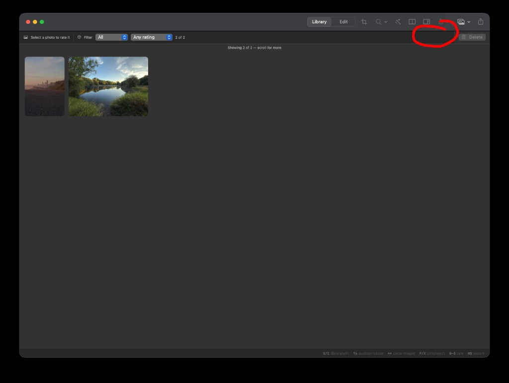

## Objective

In Library, the circled trailing end of the window toolbar does not share the surface of the rest of that horizontal bar. Make that region use the same surface as the rest of the bar.

## What the screenshot shows

Library, dark appearance, two photos. The window toolbar is one horizontal bar: traffic lights, the centered Library / Edit control, then a trailing cluster (source browser, zoom, Auto, comparison, inspector, reset, import with a count badge, export). A red circle marks that trailing cluster and the strip of bar directly under it, just left of Delete on the culling row.

The open length of the bar, including the Library / Edit control, reads as one surface. The circled region reads as a different one.

## Scope

The toolbar is `ContentView.toolbarContent`, placed in `ToolbarItemGroup(placement: .primaryAction)`, with `.toolbarBackground(.visible, for: .windowToolbar)`. `KromoraTheme` already requires one full-width native toolbar material and forbids a custom fill on that bar. KRMA-513 kept that band continuous across the inspector. This ticket is the trailing cluster on that same bar, not a new inspector seam.

Library and Edit share this toolbar, so both should show one surface. Do not restyle culling controls, Delete, or the photo grid unless the mismatch is actually the culling row: `CullingBarView` paints `KromoraTheme.secondaryChrome`, while the Delete button beside it sits on the grid's `windowBackground`. If that sibling region is the circled break, make the culling row one surface and leave the native toolbar alone.

## Acceptance criteria

- [ ] In Library, the circled trailing toolbar region uses the same surface as the rest of the horizontal bar. No second plate, material, or color break behind that cluster.
- [ ] Edit shows the same continuous bar.
- [ ] With the inspector open, the toolbar still spans the full window width as one band (KRMA-513).
- [ ] Culling controls, Delete, and the photo grid keep their current roles. Their surfaces change only if the shared culling-row surface is the actual fix.
- [ ] `swift build` succeeds and `scripts/ci-tests.sh fast` passes.

### Comment — codex @ 2026-09-24T03:19:58.683Z

Removed the macOS 26 shared glass plate from the trailing primary-action toolbar group so the native full-width toolbar material remains continuous in Library and Edit. The macOS 14+ fallback and culling row are unchanged. Checks: swift build, scripts/ci-tests.sh fast (1185 tests reached), git diff --check, dg validate. Commit: 15528d1.

## Agent log

- 2026-09-24T03:24:34.751Z: Verification report
Verdict: PASS
Acceptance criteria:
- [x] In Library, the circled trailing toolbar region uses the same surface as the rest of the horizontal bar. No second plate, material, or color break behind that cluster. (pass) — ContentView.swift hides the macOS 26 shared glass plate behind the trailing primary-action ToolbarItemGroup via .sharedBackgroundVisibility(.hidden), guarded by #available(macOS 26.0, *); the pre-26 branch is unchanged since that plate doesn't exist there.
- [x] Edit shows the same continuous bar. (pass) — Library and Edit share the same ContentView.toolbar block and toolbarContent, so the fix applies uniformly to both modes.
- [x] With the inspector open, the toolbar still spans the full window width as one band (KRMA-513). (pass) — .toolbarBackground(.visible, for: .windowToolbar) from KRMA-513 is untouched by this change; the new modifier only affects the trailing ToolbarItemGroup's own background plate.
- [x] Culling controls, Delete, and the photo grid keep their current roles. (pass) — This commit (15528d1) touches only ContentView.swift. A separate KRMA-560 commit (faab249) applied KromoraTheme.secondaryChrome to the Delete row in LibraryGridView.swift to match CullingBarView's existing secondaryChrome surface, consistent with the ticket's fallback guidance; CullingBarView itself is unchanged.
- [x] swift build succeeds and scripts/ci-tests.sh fast passes. (pass) — swift build: Build complete. scripts/ci-tests.sh fast: 1185/1185 reached, exit code 0.
Checks run:
- swift build
- scripts/ci-tests.sh fast (1185/1185)
- git diff --check
- dg validate
Findings:
- None
Fixes:
- None
Verification commits:
- None
Actor: claude
Resolved model: sonnet
Pickup session: 01MUEYRR3V96E0VCXP
Summary: Verified the macOS 26 trailing toolbar glass-plate fix: swift build and scripts/ci-tests.sh fast (1185/1185) pass, git diff --check and dg validate are clean, and the shared toolbarContent/toolbar block confirms Library and Edit both get the fix.
