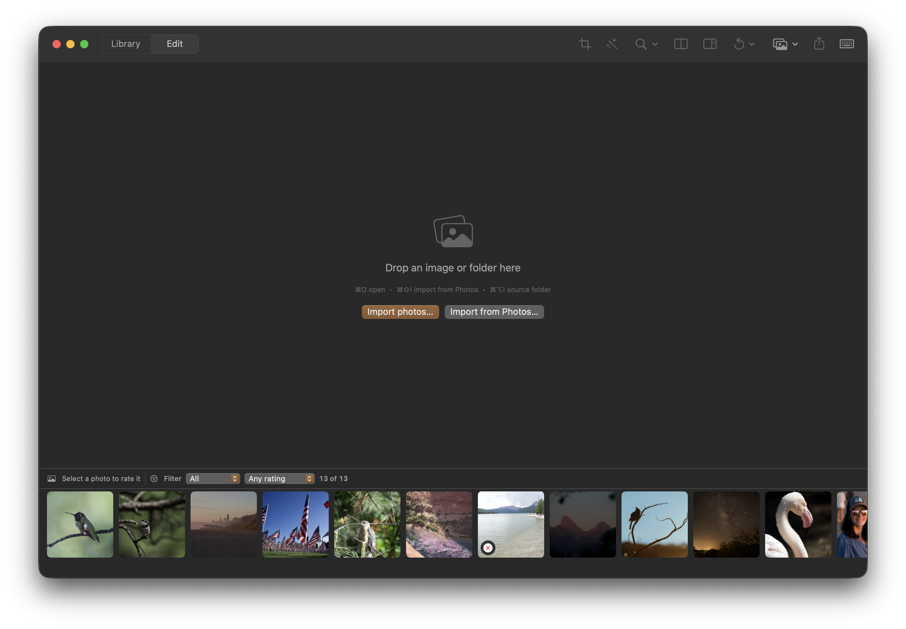

## Objective

Make the Library the default screen when Kromora opens. The current launch can land in an odd empty editor/import state while the photo strip shows existing library items.

## User report

“When opening the app, the default should be the library screen. For some reason it is in an odd state.” The attached screenshot shows the central “Drop an image or folder here” placeholder alongside a bottom strip containing 13 photos.

## Acceptance criteria

- A normal app launch opens with Library as the active screen.
- When the library already contains photos, launch presents the Library collection instead of an empty drop/import canvas.
- The initial screen is coherent when the library has no photos and still offers the existing import actions.
- Add focused regression coverage for the launch destination with both an existing library and an empty library.

## Context

- Investigate the app’s startup destination/state and how it chooses between Library and Edit/empty-import presentation.
- Screenshot attached to this issue.

## Checks

- swift build
- Focused startup or Library navigation tests covering the acceptance criteria.

