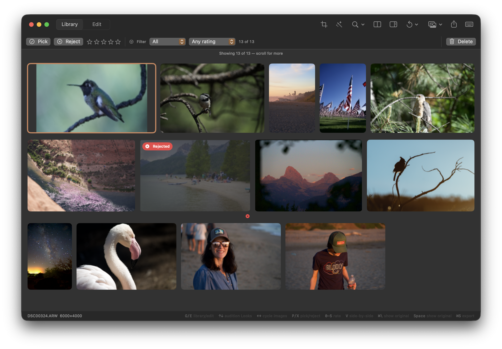

## Objective

Make Library thumbnails show the correct current crop and edited output, with enough detail to remain sharp at their displayed size.

## User report

Cropped photos are not always framed correctly in the Library, and sometimes the thumbnail does not show the edited output. When the crop displays incorrectly, the image can also look blurry. The attached screenshot shows the Library mosaic during this behavior.

## Acceptance criteria

- Library thumbnails reflect the current saved edit, including crop pixels and crop-aware cell geometry.
- The displayed crop matches the composition in the edited image; a stale source/original or incorrectly framed crop is not treated as the settled thumbnail.
- Cropped edited thumbnails remain clear at their displayed size and are not visibly softened by enlarging a low-resolution intermediate.
- Add regression coverage for crop framing and thumbnail detail in the Library, including reopening an asset with a saved crop.

## Context

- Compare the Library thumbnail pixels and cell geometry with the current edited render, including crop/aspect metadata and cache revision handling.
- Related prior work: KRMA-461 covers crop-aware Library geometry; KRMA-434 covers sharpness of cropped edited thumbnails. KRMA-671 covers edited thumbnails appearing without interaction. Check for a remaining case or regression across these paths.
- Screenshot attached to this issue.

## Checks

- swift build
- Focused Library crop and edited-thumbnail tests covering framing, current edit output, and sharpness.

