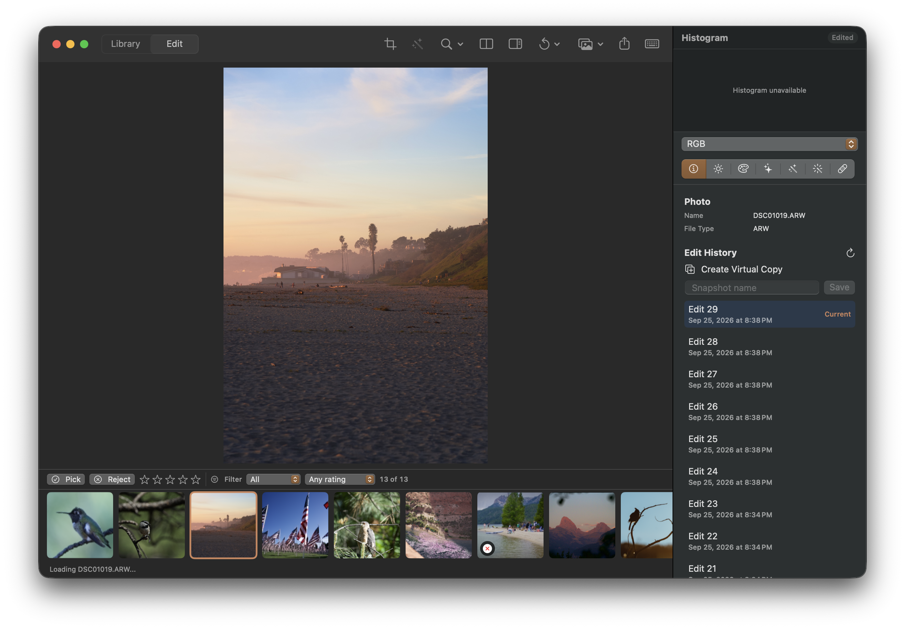

## Objective

Load and display the histogram when a photo is opened from the Library into Edit.

## User report

Double-clicking an image in the Library correctly transitions to Edit, but the Histogram panel stays unavailable. In the attached screenshot the photo is displayed and marked Edited while the Histogram section says “Histogram unavailable.”

## Acceptance criteria

- Opening a photo from the Library populates the Histogram for the image shown in Edit once its render is ready.
- The histogram reflects the displayed image and current edit revision, rather than remaining unavailable until another interaction.
- Switching to another photo or changing its edits continues to update the histogram for the displayed result.
- Add regression coverage for the Library double-click to Edit transition and initial histogram publication.

## Context

- Trace the Library-to-Edit transition through preview publication and histogram input/readiness state.
- The screenshot is attached to this issue.

## Checks

- swift build
- Focused histogram and navigation/preview tests covering the Library-to-Edit path.

