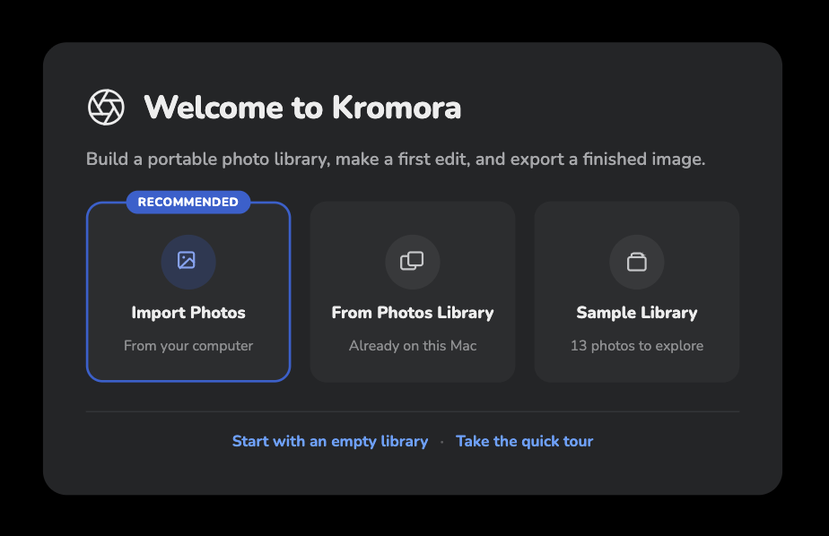

## Objective

Refine the new-user welcome screen to follow the attached visual reference, using Kromora’s bronze accent and placing the product icon to the left of the Welcome heading.

## Acceptance criteria

- The product icon sits to the left of “Welcome to Kromora” in a single heading row.
- The screen follows the reference hierarchy: a short introductory subtitle, three prominent choice cards for Import Photos, From Photos Library, and Sample Library, then secondary links for starting with an empty library and taking the quick tour.
- The recommended Import Photos card and other highlighted welcome-screen elements use the product bronze accent instead of blue.
- Existing onboarding actions and sample-library/quick-tour behavior continue to work.
- Review the finished screen against the attached reference at a typical app window size.

## Context

- This is a visual refinement of the welcome flow delivered in KRMA-619.
- Screenshot attached to this issue.

## Checks

- swift build
- Focused OnboardingTests
- Visual review of the welcome screen.

