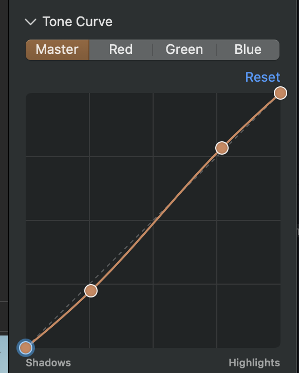

## Objective

Reduce the visual weight of the Tone Curve Reset control by removing it or moving it into the Tone Curve accordion header.

## User report

The prominent “Reset” text sits on its own row above the curve. It can be removed or replaced with a small, right-aligned icon on the same row as the Tone Curve title. The attached screenshot shows the current layout.

## Acceptance criteria

- Remove the standalone Reset text/link, or replace it with a compact reset icon aligned at the trailing edge of the Tone Curve accordion title row.
- Keep the Tone Curve title and accordion disclosure control clear and aligned.
- If reset remains available, the icon performs the existing reset action and has an accessible label describing that action.
- Review the updated inspector layout against the attached screenshot.

## Context

- Screenshot attached to this issue.

## Checks

- swift build
- Focused Tone Curve inspector tests, including reset behavior if the control remains.

