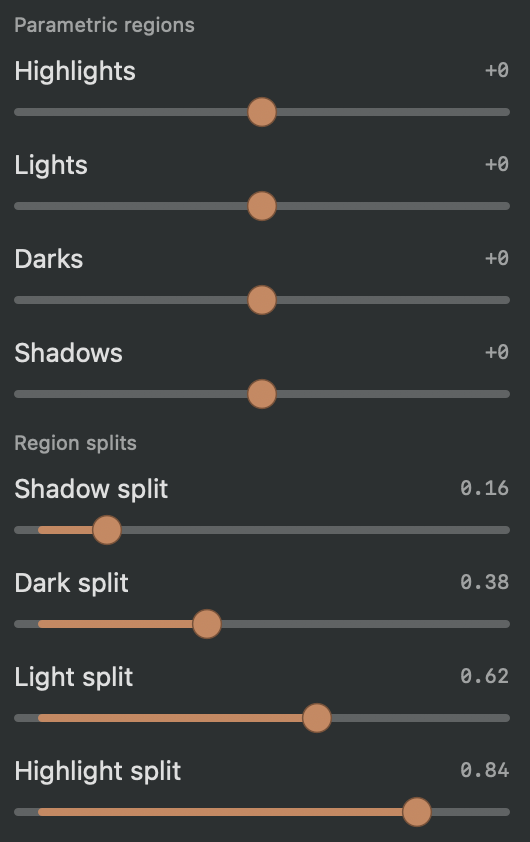

## Objective

Reduce the amount of visible Light inspector content by placing the parametric tonal-region and region-split controls under an Advanced Curve accordion.

## Acceptance criteria

- Group the Highlights, Lights, Darks, and Shadows amount controls and the Shadow, Dark, Light, and Highlight split controls under an “Advanced Curve” accordion.
- The accordion is collapsed by default; the primary tone-curve controls remain available outside it.
- Expanding the accordion exposes the existing controls and labels without changing their adjustment behavior or saved values.
- Add or update focused coverage for the default collapsed state and access to the controls when expanded.
- Review the updated inspector against the attached screenshot.

## Context

- The parametric controls were added in KRMA-595; this ticket changes their presentation, not their edit or rendering behavior.
- Screenshot attached to this issue.

## Checks

- swift build
- Focused Light inspector and tone-curve tests.

