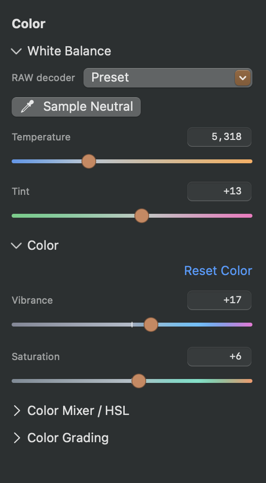

## Objective

Make the Color inspector easier to scan by reducing repeated labels, simplifying the white-balance controls, and clarifying the hierarchy between the inspector title and its subsections.

## User report

The word “Color” is overused, the “RAW decoder” label is unnecessary beside the Preset control, and the Sample Neutral action should be a compact eyedropper beside the preset. The inspector title and subsection headings also need a clearer visual hierarchy. See the attached screenshot.

## Acceptance criteria

- Keep one clear Color inspector title and make it visually distinct from subsection/accordion headings.
- Remove or rename the nested “Color” heading so it does not repeat the parent inspector title.
- Remove the “RAW decoder” label beside the Preset picker.
- Place a compact eyedropper button on the same row as the Preset picker; the icon-only button retains an accessible label or help text identifying Sample Neutral.
- Keep White Balance, Color adjustments, Color Mixer / HSL, and Color Grading controls understandable and usable.
- Review the revised hierarchy and white-balance row against the attached screenshot.

## Context

- Screenshot attached to this issue.

## Checks

- swift build
- Focused Color inspector tests
- Visual review at a typical inspector width.

