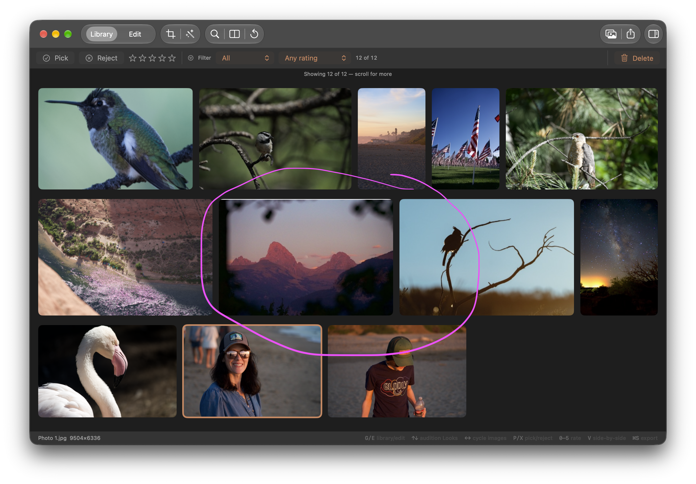

## Objective

Identify and remove the unintended white hairline rendered along a library thumbnail edge.

## Context

In the Library grid screenshot supplied on 2026-09-28, a thin white line runs across the top
edge of the wide mountain-at-dusk photo in the second mosaic row. The line is not part of the
source photo. The nearby orange outline around the active photo is the expected selection
indicator; the white line appears on a different, unselected tile.

The grid presents `NSImage` thumbnails in `LibraryGridView` with a fixed mosaic frame, rounded
clipping, and a selection overlay. Trace the displayed pixels through that path and any backing
thumbnail representation to find the source of the artifact; do not assume the selection overlay
is responsible without reproducing it.

## Acceptance criteria

- [ ] Reproduce the white hairline on macOS 26 and identify which part of thumbnail presentation
      or rendering introduces it.
- [ ] Remove the unintended edge from unselected library thumbnails, including at Retina scale.
- [ ] Preserve the active and multi-selected orange outlines, rounded clipping, and mosaic image
      sizing.
- [ ] Add regression coverage at the narrowest useful boundary, or record a repeatable visual
      verification procedure if the artifact is only reproducible in SwiftUI/AppKit presentation.

## Implementation notes

Keep the fix scoped to library thumbnail presentation. The screenshot's other image edges and the
orange active selection outline are expected.

### Comment — codex @ 2026-10-02T01:57:02.713Z

Implemented and committed as 6c5f326 (KRMA-702: remove unselected thumbnail edge stroke). The supplied screenshot reproduces a hairline that follows the rounded tile boundary. The library cell was installing a rounded stroke even when both selection flags were false, using Color.clear for that case. The cell now omits the stroke when unselected and uses strokeBorder for the active and multi-selected orange outlines. The image clipping and mosaic sizing are unchanged. Verification: swift build passed. Repeatable visual check on macOS 26 at Retina scale: open the Library with a wide landscape photo, confirm an unselected tile has no edge line, then select it and multi-select it to confirm the orange rounded outlines remain inside the thumbnail bounds. The attached screenshot was used to identify the presentation boundary; the original mountain photo was not available for a direct before/after reproduction.

## Agent log

<!-- Generated summaries only. Detailed activity lives in events.jsonl. -->

- 2026-10-02T01:59:11.652Z: Verification report
Verdict: BLOCKER
Acceptance criteria:
- [ ] Reproduce the white hairline on macOS 26 and identify which part of thumbnail presentation or rendering introduces it (fail) — Not reproduced. The implementer attributed it to the rounded unselected stroke, but that stroke used Color.clear and rendered nothing. The screenshot line is straight across the top of the tile and does not follow the rounded corners, which points to the thumbnail bitmap (edited-thumbnail raster extent, frame store, or aspect-fill).
- [ ] Remove the unintended edge from unselected library thumbnails, including at Retina scale (fail) — The change is a no-op for unselected tiles by inspection, so the artifact should persist. The original photo was unavailable, so this was not confirmed visually.
- [x] Preserve the active and multi-selected orange outlines, rounded clipping, and mosaic image sizing (pass) — strokeBorder keeps the orange outlines inside the tile bounds; clipping and frame sizing are untouched.
- [ ] Add regression coverage or record a repeatable visual verification procedure (fail) — No test added. The recorded visual procedure only checks that an unselected tile has no line, which would not distinguish old and new code if the artifact is in the bitmap.
Checks run:
- swift build: pass (Build complete)
Findings:
- blocker: Fix targets a non-rendering stroke and does not address the white top-edge line. In LibraryGridView overlay the old code stroked with .clear for unselected tiles, which draws nothing. The artifact is a straight line along the top edge, not following the corner radius, so the cause is likely in the edited thumbnail pixels. Tracked in KRMA-754.
Fixes:
- None
Verification commits:
- None
Actor: claude
Resolved model: sonnet
Pickup session: 01MUQBCAJHTQL51WW0
Summary: Commit 6c5f326 does not fix the white line: it removed a Color.clear stroke, which already drew nothing. The line is straight and inset from the rounded corners, so it is most likely in the thumbnail bitmap. Root cause is unidentified; tracked in urgent child KRMA-754.
