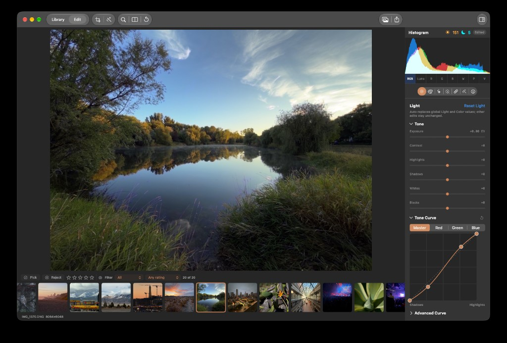

## Objective

Tidy the Tone Curve inspector so the curve map has equal left/right padding, the Master/Red/Green/Blue channel control (and the Tone Curve accordion chrome around it) keep a stable width during load and edit updates, and the vertical gap between the channel tabs and the curve map is increased.

## User report

In the Light inspector's Tone Curve section:

1. The tone curve map is narrower than the channel tab row above it, with visibly more empty space on the right than the left. Prefer matching the tighter left inset so both sides are equal (map may grow to fill, or stay capped but centered with equal gutters).
2. The Master / Red / Green / Blue segmented control changes width while an image is loading or updating — it appears to get wider mid-update — and should not. The Tone Curve accordion title row also seems to jump width at the same time.
3. Vertical padding between the bottom of the channel tabs and the top of the tone curve map should be increased; the current gap is too tight.

Screenshot of the uneven map padding (map left-aligned under the tabs with excess right gutter):

## Context

`ToneCurveEditor` in `LightInspectorView` hosts a segmented `Picker` for `ToneCurveChannel` (Master/Red/Green/Blue) above a square graph. KRMA-708 stabilized vertical stretch during load/edit by capping the graph at `maxWidth: 220` with `aspectRatio(1, .fit)` and `fixedSize(horizontal: false, vertical: true)`. That vertical fix is worth keeping, but the fixed cap plus a leading-aligned parent stack leaves an asymmetric right gutter under the full-width channel tabs — matching the screenshot.

Width jumps in the segmented control and accordion title during photo load / preview publication were partly in KRMA-708's scope (stable geometry during loading and edit updates) but the horizontal chrome still appears to reflow. Trace whether parent inspector width, scroll-content ideal size, disclosure header layout, or the graph's sizing proposals are still changing during those updates.

Related completed work: KRMA-708 (tone curve movement during loading/edit updates). Treat its vertical sizing approach as the baseline to refine, not discard.

## Acceptance criteria

- [ ] With the Tone Curve section expanded at typical inspector widths, the tone curve map has equal horizontal padding/gutters on the left and right relative to the channel tab row (prefer matching the current left inset; do not leave a large empty right gutter).
- [ ] The Master / Red / Green / Blue segmented control keeps a stable width while switching photos, while loading/updating a source, and while adjusting Light controls that trigger preview publication; it must not visibly widen or shrink mid-update.
- [ ] The Tone Curve accordion header/title row (and the disclosure chrome around the section) likewise keeps a stable horizontal layout during those same load/edit updates; the title space must not jump.
- [ ] Vertical spacing between the channel tab row and the top of the tone curve map is visibly increased versus the current tight gap, without making the section feel sparse or colliding with Advanced Curve below.
- [ ] Curve editing behavior is preserved: channel switching, point drag/add/remove, reset action, identity diagonal, Shadows/Highlights labels, and VoiceOver/accessibility labels continue to work.
- [ ] KRMA-708's vertical stability is retained: the graph must not stretch or jump vertically during load/edit updates.
- [ ] Add or update focused regression coverage for the layout constraints (e.g. equal horizontal placement / width stability / spacing), or document a repeatable visual check if the behavior depends on asynchronous SwiftUI presentation that unit tests cannot assert directly.
- [ ] Record the layout root cause, fix approach, and verification commands/results in the implementation handoff.

## Implementation notes

Start in `ToneCurveEditor` (`LightInspectorView.swift`): the graph currently uses `.frame(maxWidth: 220, alignment: .center)` inside a leading `VStack`, which can still read as left-biased under a full-width segmented picker. Prefer centering the capped map within the tab width, or aligning map width with the tabs if a fixed max is no longer needed for stability. Keep solutions inside inspector layout/sizing — do not hide the curve or drop loading feedback to fake stability.

Likely surfaces: `ToneCurveEditor`, `InspectorDisclosure`, and any parent scroll/content sizing that reflows when preview/loading state changes. `LightInspectorTests` already asserts the KRMA-708 sizing tokens; update those assertions if the layout contract changes intentionally.

### Comment — claude @ 2026-09-29T19:36:40.501Z

Implementation handoff (commit 20aec12). Root cause: ToneCurveEditor graph used frame(maxWidth: 220) inside a leading-aligned VStack, leaving a right-only gutter under the full-width tabs; the segmented Picker had no explicit width so it followed intrinsic/ideal proposals. Fix: graph now fills the tab width (aspectRatio 1 fit + frame(maxWidth: .infinity) + fixedSize vertical, keeping KRMA-708 vertical pinning; inspector column max is 360pt), Picker and editor use frame(maxWidth: .infinity), +6pt top padding on the map (gap 8->14), disclosure title lineLimit(1). Verification: swift build OK; swift test --filter LightInspectorTests 20/20 pass; git diff --check clean. Not verified live: width jump could not be reproduced non-interactively; tests are source-based. Visual check: expand Tone Curve, arrow between photos and drag Exposure; tabs/title/map should keep x and width.

## Agent log

<!-- Generated summaries only. Detailed activity lives in events.jsonl. -->

- 2026-09-29T19:37:47.601Z: Verification report
Verdict: PASS
Acceptance criteria:
- [x] Tone curve map has equal horizontal gutters relative to the channel tab row at typical inspector widths. (pass) — The GeometryReader graph uses aspectRatio(1, .fit) and an infinite-width frame, matching the full-width Picker; layout code reviewed, not visually measured in the running app.
- [x] Master / Red / Green / Blue segmented control keeps stable width during photo switches, loading, and Light preview updates. (pass) — Picker is explicitly framed to the available width. The source-based regression assertion checks this sizing constraint; live asynchronous presentation was not exercised.
- [x] Tone Curve disclosure header and chrome keep stable horizontal layout during load and edit updates. (pass) — Disclosure row and outer layout fill available width, and the title is constrained to one line. Reviewed implementation; live asynchronous presentation was not exercised.
- [x] Vertical gap between channel tabs and graph is visibly increased without crowding Advanced Curve. (pass) — Graph has 6 pt additional top padding on top of the VStack spacing. Code-level verification only; visual appearance not run interactively.
- [x] Curve editing, channel switching, reset, identity diagonal, labels, and accessibility behavior are preserved. (pass) — Reviewed localized layout-only diff; all 20 LightInspectorTests passed, including curve interaction, reset, and accessibility coverage.
- [x] KRMA-708 vertical stability is retained during loading and edit updates. (pass) — Square aspect ratio and fixed vertical sizing remain. The focused sizing regression test passed.
- [x] Add focused layout regression coverage or a repeatable visual check for asynchronous SwiftUI behavior. (pass) — Updated source-based sizing assertions and documented a repeatable photo-switch and Exposure-drag visual check; that visual check was not performed in this run.
- [x] Record layout root cause, fix approach, and verification commands/results in the implementation handoff. (pass) — Handoff comment records the leading-aligned 220 pt graph cap and unconstrained Picker as causes, the sizing changes, and command results.
Checks run:
- swift build (passed)
- swift test --filter LightInspectorTests (20 passed)
- git diff --check (passed)
- Reviewed implementation commit 20aec12 and relevant layout/test code
Findings:
- None
Fixes:
- None
Verification commits:
- None
Actor: codex
Resolved model: gpt-6-luna
Pickup session: 01MUN2UZBAHZRJ1CTW
Summary: Verified KRMA-716: layout constraints and curve behavior reviewed; build and all 20 focused tests pass. Live SwiftUI load/edit visual check not performed.
