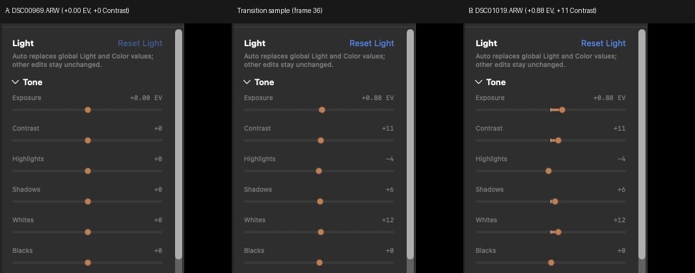

## Objective

When the user changes photo in Edit view, the inspector sliders should move once, smoothly, from the previous photo's values to the new photo's values. Today they can start, stop, and continue (KRMA-715) and the panel visibly lags the image. This ticket is the smoothness half; KRMA-755 is the timing half and should land first.

## Context

KRMA-715 reproduced the hesitation with an unedited image A and an edited image B (for example max Exposure) while switching in Edit view, affecting all sliders. Its fix (484d073) retargets the in-flight 380 ms animation with a velocity-preserving Hermite segment instead of restarting it. That removes the restart, but the input is still two separate target changes about a second apart: `beginLoad` resets the document to defaults at selection, then `adoptStoredEdits` applies B's stored values after source preparation. With the late publication of the stored document (KRMA-755) the slider has two segments with a long pause between them, which still reads as start, stop, continue. KRMA-715 also still has unresolved human blockers: its live visual verification was never completed.

## Approach

Make the target change once. Once KRMA-755 delivers B's document at (or before) first pixel, avoid the intermediate default state for a photo-to-photo switch: keep the panel on its current values until the stored document arrives (a very short window) and then animate straight to B's values, or snap, rather than animating to defaults and back out. Decide between animate-once and snap deliberately for a context change (a photo switch is not an edit), and keep direct pointer tracking, keyboard adjustment, accessibility values, and the superseding behavior KRMA-715 added. Verify in the running app with the KRMA-715 scenario, in a release build, and record the procedure and result; this also resolves the blocked live-verification step on KRMA-715.

## Acceptance criteria

- [ ] In a release build, switching from an unedited to an edited photo in Edit view moves every inspector slider in one continuous transition with no pause, restart, or backwards motion; record the procedure and result (screen recording or frame capture).
- [ ] No intermediate default-values frame on a photo-to-photo switch.
- [ ] A new document arriving during an animation retargets without a restart or a jump (keep the KRMA-715 curve coverage) and a superseded or stale value can never overwrite a newer one.
- [ ] Pointer tracking, keyboard adjustment, and accessibility values are unaffected; an animation never fights active user input.
- [ ] Deterministic regression coverage for the photo-switch transition. Focused tests, warning gate, fast and serial lanes, git diff --check, dg validate.
- [ ] Update KRMA-715 with the result so it can close.

### Comment — claude @ 2026-10-02T03:11:02.640Z

KRMA-755 landed (d556d7c4): the panel now gets B's stored values about 154 ms after selection (p50), before first pixel, instead of at source-preparation time (about 295 ms plus a serialized wait). The photo-switch slider sequence is now A to defaults at selection, then defaults to B about 150 ms later, so the two-step input this ticket describes is much closer together but still exists; the reset to defaults in beginLoad is untouched.

### Comment — codex @ 2026-10-02T04:13:28.525Z

Implemented and committed as 8b8c59e. Cold photo switches hold slider values and accessibility readouts until the incoming stored document is published, then animate to that target; in-memory photo documents transition immediately. Keyboard/accessibility slider actions cancel programmatic animation. Deterministic regressions pass. Checks: focused suites, debug and Release warnings-as-errors builds, fast lane (1,469 tests), serial lane (457 tests), git diff --check, and dg validate. Live Release visual capture remains pending because the currently open Kromora.app holds the library package lock. KRMA-715 was updated with the implementation and available A/B pair.

### Comment - HUMAN

I have close the app

### Comment — codex @ 2026-10-02T15:49:19.856Z

Completed implementation and Release verification. Follow-up commit edaa1a9 keeps the inspector controls mounted until the replacement frame is presented, closing the empty-inspector gap seen during cold RAW switches; the original slider hold/retarget implementation is 8b8c59e. Added InfoInspectorViewTests. Verified: focused test (1 passed), warning gate, fast lane (1,478 passed), serial lane (460 passed), git diff --check, dg validate, and packaged arm64 Release build. Live procedure: Edit view, DSC00969.ARW (+0.00 EV / +0 Contrast) to DSC01019.ARW (+0.88 EV / +11 Contrast). Captured frames show the sliders remain present and move monotonically without a default-values frame. Evidence attached as krma-756-release-evidence.png. DSC03843.ARW was absent from the local package, so DSC00969.ARW was used as A. KRMA-715 has the verification result.

## Agent log

- 2026-10-02T15:50:35.445Z: Verification report
Verdict: PASS
Acceptance criteria:
- [x] Release switch moves every slider in one continuous transition; procedure recorded (pass) — Release evidence frames attached (krma-756-release-evidence.png); procedure recorded in comments. I did not re-run the live capture.
- [x] No intermediate default-values frame on photo-to-photo switch (pass) — Cold switches hold slider values and accessibility readout until the stored document is published (isInspectorSourceDocumentPending, cleared on adopt and on failure).
- [x] Retargeting without restart/jump; stale values cannot overwrite newer (pass) — KRMA-715 Hermite retarget retained; pending flag is reset on every beginLoad.
- [x] Pointer, keyboard, accessibility unaffected (pass) — sliderMoved cancels programmatic animation; tracking guard unchanged.
- [x] Deterministic regression coverage and gates (pass) — Focused suites (31 tests) pass in my run; implementer reports fast, serial, warning gate.
- [x] KRMA-715 updated (pass) — Reported in implementer comments.
Checks run:
- swift test --filter InfoInspectorViewTests|NeutralOriginSliderTests|StoredEditAdoptionTests (31 passed)
- git diff --check (clean)
- dg validate (OK)
- code review of 8b8c59e and edaa1a9
Findings:
- None
Fixes:
- None
Verification commits:
- None
Actor: claude
Resolved model: sonnet
Pickup session: 01MUR52OP8BY8NVTWM
Summary: Verified: focused tests, diff check, dg validate pass; code review found no issues.
