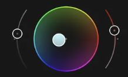
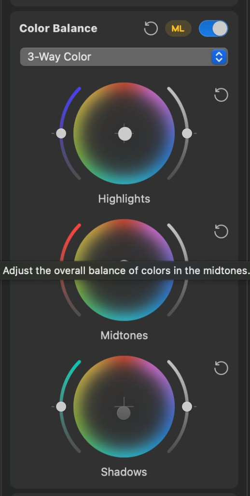

## Objective

Restyle Color Grading so each tone zone (Highlights, Midtones, Shadows) matches the Photos / Final Cut–style Color Balance control: a central hue/saturation wheel flanked by thin curved vertical arc sliders, with the zone label under the wheel and a compact per-zone reset.

## User report

The current Color Grading section uses a Resolve-inspired wheel plus separate Hue/Saturation value rows inside nested disclosures. It should look more like the attached Color Balance reference for **each** zone—compact wheel units stacked in the inspector, not a wheel with linear slider rows underneath.

## Design reference

Attached screenshots show the target visual language:

- Central circular hue wheel that desaturates toward a dark/neutral center, with a filled circular handle (hue-colored fill + light stroke).
- Two thin, outward-curved vertical arc sliders flanking the wheel (left and right), each with a small circular thumb and a faint reference/neutral marker on the arc.
- Zone label centered under the wheel (`Highlights`, `Midtones`, `Shadows`).
- Compact circular reset control near each wheel unit.
- Stacked three-way layout that reads as one Color Balance–style panel inside the Color inspector.

Close-up: wheel + flanking arcs detail. Panel: full 3-Way Color Balance stack for layout density and labeling.

## Context

Today `ColorInspectorView`’s Color Grading section nests each `ColorGradingZone` in an `InspectorDisclosure`, renders `ColorGradingWheelControl` (commented as Resolve-inspired), then lists Hue/Saturation via `valueRow`, plus Blending/Balance globals. The wheel model already owns hue/saturation polar mapping (`ColorGradingWheel` / `ColorGradingWheelMapping`); this ticket is primarily a presentation redesign of that control for each zone.

## Acceptance criteria

- [ ] Each grading zone (Highlights, Midtones, Shadows) is presented as one compact unit: central wheel, left curved arc, right curved arc, zone label below, and a per-zone reset affordance—visually matching the attached references at a typical inspector width.
- [ ] The stacked three-zone Color Grading layout no longer relies on nested per-zone disclosures + linear Hue/Saturation rows as the primary interaction surface.
- [ ] Existing hue/saturation behavior and persisted `ColorGradingAdjustments` values continue to round-trip through the same model mapping; dragging the wheel still sets hue/saturation.
- [ ] Flanking arc controls are interactive and clearly mapped (document the mapping in implementation notes / accessibility labels). Prefer mapping arcs onto existing per-zone parameters first; do not invent new grading parameters unless needed to complete the Photos-like control set, and if luminance (or similar) is added, keep it in the existing adjustments model with identity-safe defaults.
- [ ] Global Blending and Balance remain available and understandable below or beside the three-way stack.
- [ ] Accessibility: each wheel and arc exposes labels/values/hints; reset remains reachable from VoiceOver.
- [ ] Visual review against the attached references at the Color inspector’s normal dock width; stays usable on macOS 26+ with no third-party dependencies.

## Implementation notes

Primary surfaces: `Sources/KromoraKit/Views/ColorInspectorView.swift` (`gradingSection`, `ColorGradingWheelControl`, `ColorGradingWheelDisc`), `Sources/KromoraKit/Models/ColorGradingAdjustments.swift`, `Sources/KromoraKit/ViewModels/AppViewModel+Color.swift`. Preserve interactive preview begin/end hooks already wired on the wheel. Prefer extracting a reusable three-way grading unit view rather than duplicating layout three times. Keep global Blending/Balance; do not copy Photos’ ML/toggle chrome unless already product-owned.

### Comment — codex @ 2026-10-05T04:06:16.696Z

Implemented stacked Highlights, Midtones, and Shadows grading units with a dark neutral-centered hue wheel, filled hue handle, curved Saturation (left) and Hue (right) arcs bound to the existing per-zone values, per-zone reset, and labeled Blending/Balance controls. Added VoiceOver labels, values, hints, and adjustable arc actions while preserving the existing model mapping and preview interaction hooks. Verification: swift build passed; git diff --check passed. Screenshot-based visual review could not be completed because UI automation returned cgWindowNotFound/timeout for the app window. Commit: 60accb53.

## Agent log

<!-- Generated summaries only. Detailed activity lives in events.jsonl. -->

- 2026-10-05T04:07:09.242Z: Verification report
Verdict: PASS
Acceptance criteria:
- [x] Each zone is one compact unit: wheel, left/right arcs, label, reset (pass) — ColorGradingZoneUnit; visual match not screenshot-verified
- [x] No nested per-zone disclosures or linear Hue/Saturation rows (pass)
- [x] Hue/saturation round-trip through existing model mapping (pass) — Wheel still uses ColorGradingWheelMapping; arcs bind same fields
- [x] Arcs interactive and mapped, documented (pass) — Left=Saturation, right=Hue; labels, values, hints, adjustable actions
- [x] Global Blending and Balance remain (pass) — Under Tonal Range header
- [x] Accessibility labels/values/hints and reset reachable (pass)
- [ ] Visual review against references at dock width (not_applicable) — Not performed; no unlocked display available. Recommend human glance.
Checks run:
- swift build (pass)
- swift test --filter ColorGrading|ColorInspector|PackageSettings (27 tests, 0 failures)
- Code review of commit 60accb53 (arc geometry, hit-testing mapping, Swift 6 constraints)
Findings:
- None
Fixes:
- None
Verification commits:
- None
Actor: claude
Resolved model: sonnet
Pickup session: 01MUUQ9OWAE5Y5FPSY
Summary: Verified: build and grading/package tests pass; code review found no blocking issues. Visual review against references not performed (no display).
