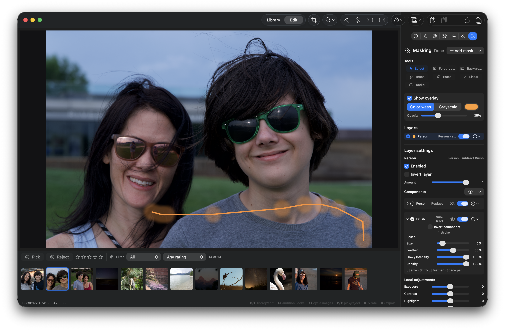

## Objective

Restore a reliable, precise live brush interaction for both Brush and Erase modes. Drawing must
keep the photo/preview visible, preserve the configured brush size, and produce a smooth stroke;
erasing must subtract coverage from the effective existing mask rather than replacing it with a
black or unrelated raster result.

## Context

The current brush interaction is visibly broken in the masking workspace:

- Starting or continuing a stroke can turn the whole canvas black, hiding the image and making it
  impossible to judge the stroke against the photo.
- The selected Size value does not remain authoritative during drawing; after a stroke begins the
  rendered brush can jump to a different, apparently random size.
- Pointer sampling/presentation appears too sparse or delayed. A continuous gesture can render as
  separated soft blobs and angular segments instead of a smooth path, reducing precision.
- Erase mode does not reliably remove the mask coverage under the cursor. It must be able to
  subtract the resolved coverage contributed by an existing linear gradient, radial gradient,
  Person/other semantic mask, or another brush component, including feathered/partial coverage.

### Reproduction

1. Open an image in the Masking workspace with Show overlay enabled.
2. Select Brush, choose a visible Size/Feather/Flow combination, and draw a continuous stroke over
   the photo.
3. Observe whether the photo is replaced by a black canvas, whether the stroke size changes, and
   whether the path contains gaps, blobs, or visibly delayed samples.
4. Repeat with Erase over each of a linear gradient, radial gradient, semantic/person mask, and
   brush mask (or a composed layer containing them).

The attached screenshot captures the reported behavior:
the photo is still visible in this sample, but the brush presentation shows large isolated soft
stamps and an imprecise/angular path while editing a Person layer with a subtractive Brush
component. It is evidence of the interaction problem, not a specification for the UI.

This is a follow-up regression against the durable brush/erase behavior delivered in LUMO-223 and
the overlay/presentation fixes in LUMO-239 and LUMO-275; verify those seams before changing them.

## Acceptance criteria

- [ ] The underlying photo and current mask overlay remain visible throughout a Brush or Erase
      gesture; beginning a stroke never paints the full canvas black or otherwise drops the base
      preview.
- [ ] The configured Size remains stable for the entire active stroke and for subsequent strokes;
      Brush and Erase use the same source-space size mapping, with no unrequested random jump.
- [ ] Native/coalesced pointer input is captured and resampled/presented densely enough that a
      continuous gesture produces a smooth, gap-free path at normal zoom levels, without visible
      stamp starvation or excessive input-to-overlay delay.
- [ ] Brush and Erase honor Feather, Flow/Intensity, Density, pressure (when available), zoom,
      pan, and source-coordinate mapping consistently in both preview tooling and committed mask
      output.
- [ ] Erase is a non-destructive subtractive operation against the effective existing mask. It
      removes full and partial coverage under the eraser while preserving the underlying photo and
      works over linear, radial, semantic/person, brush, and composed mask sources.
- [ ] Add deterministic regression coverage for canvas visibility, size stability, dense/smooth
      sampling, and subtractive erasing across analytic, semantic, and brush-derived masks.
- [ ] Existing masking, overlay, persistence, undo/redo, preview/export agreement, build, and test
      invariants remain green, including the repository's Swift 6 zero-opt-out requirements.

## Implementation notes

Start at `Sources/LumoKit/Views/MaskPointerSurface.swift`,
`Sources/LumoKit/Views/PreviewSurface.swift`, `Sources/LumoKit/Models/BrushMaskMath.swift`,
`Sources/LumoKit/Models/MaskInteractionState.swift`, `Sources/LumoKit/Models/LocalMaskRenderer.swift`,
and `Sources/LumoKit/ViewModels/AppViewModel+Masking.swift`. Trace the active-stroke Metal
presentation separately from durable vector-stroke commit and resolved-mask composition.

Keep the existing non-destructive model: pointer movement stays transient, committed strokes remain
normalized vector intent, and Erase composes as subtract rather than flattening or overwriting the
source mask. Do not add a live-path `CIContext`, GPU-to-CPU readback, full-history rerasterization,
or pointer-time persistence. Reuse the LUMO-217 performance budgets where applicable and ensure
the same definition continues to drive preview and export.

### Comment — codex @ 2026-09-08T14:06:08.386Z

Implemented and committed 08f75a1. Brush strokes now interpolate sparse native input at source-space spacing, preserve captured controls, and keep the resolved overlay/photo visible during active painting. Erase adds/reuses a subtractive brush component in the selected layer, preserving and subtracting from analytic, semantic, and brush-derived coverage. Added deterministic regression coverage; focused masking tests and the full Swift test suite were run.

## Agent log

<!-- Generated summaries only. Detailed activity lives in events.jsonl. -->

- 2026-09-08T14:13:01.454Z: Verification report
Verdict: PASS
Acceptance criteria:
- [x] Photo and mask overlay remain visible throughout a Brush/Erase gesture; no full-canvas black (pass)
- [x] Configured Size remains stable for the entire stroke and subsequent strokes; Brush/Erase share source-space size mapping (pass)
- [x] Native/coalesced pointer input is resampled/presented densely enough for a smooth, gap-free path (pass)
- [x] Brush/Erase honor Feather, Flow/Intensity, Density, pressure, zoom, pan, and coordinate mapping consistently in preview and export (pass)
- [x] Erase is a non-destructive subtractive operation against the effective mask across linear, radial, semantic, brush, and composed sources (pass)
- [x] Deterministic regression coverage added for canvas visibility, size stability, dense sampling, and subtractive erasing (pass)
- [x] Existing masking/overlay/persistence/undo/redo/preview-export invariants and Swift 6 zero-opt-out requirement remain green (pass)
Checks run:
- swift build -- passed
- swift test --filter 'LocalMaskTests|MaskingWorkspaceTests' -- 48 tests, 0 failures
- swift test (full deterministic suite) -- 957 executed, 44 skipped, 0 failures
- Read full diff of commit 08f75a1 across BrushMaskMath.swift, MaskInteractionState.swift, AppViewModel+Masking.swift, MaskOverlayPrototype.swift, MaskingWorkspace.swift
- Traced LocalMaskRenderer combine kernel (result = a * (1 - b) for subtract) to confirm erase composes against the accumulated prior coverage in component order, not a raw/unrelated raster
- git status --porcelain -- confirmed no unintended tree changes from the verification pass (pre-existing unrelated uncommitted EditDocumentStore work left untouched)
Findings:
- None
Fixes:
- None
Verification commits:
- None
Actor: claude
Resolved model: sonnet
Pickup session: 01MTSQSZOIHA1FKCWS
Summary: Verified LUMO-279: brush/erase overlay stays visible during a gesture (removed the separate black Metal snapshot layer), stroke size/controls are captured once at gesture start, sparse pointer events are interpolated at source-space spacing for a gap-free path, and erase composes as a subtract brush component appended to the effective layer (verified against the combine kernel's a*(1-b) subtract semantics) across linear/radial/semantic/brush sources. Full deterministic suite green (957 tests, 0 failures); no localized fixes needed.
